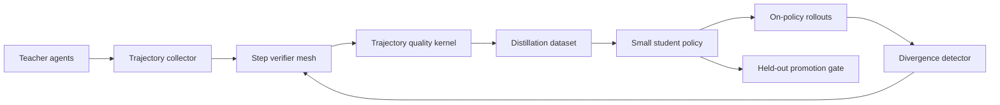
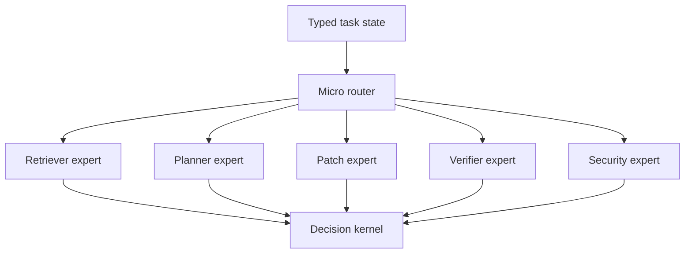
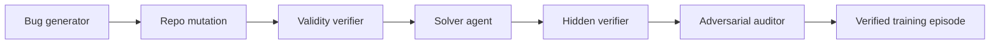
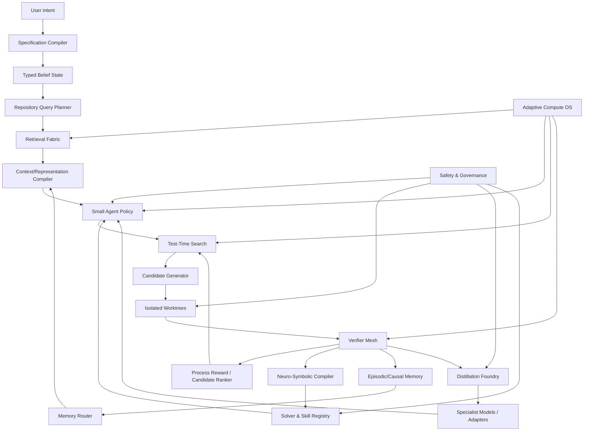

# ForgeStudio Small-Model Superintelligence Research Program 1.0.0

**Ngày nghiên cứu:** 30-07-2026  
**Đối tượng kiểm toán:** ForgeStudio 2.18.0 và Frontier Requirements 3.0.0  
**Mục tiêu:** tạo một AI coding agent local có model nền nhỏ nhưng năng lực hệ thống có thể ngang hoặc vượt agent dùng model rất lớn trên các nhiệm vụ kỹ thuật được xác định rõ.  
**Giới hạn phần cứng ưu tiên:** Windows 11, RAM 8 GB, local-first, cloud/model lớn chỉ là nguồn teacher tùy chọn trong giai đoạn tạo dữ liệu hoặc escalation hiếm.  

---

## 0. Kết luận quan trọng nhất

Một model nhỏ **không thể được bảo đảm ngang model frontier trên mọi câu hỏi mở** chỉ nhờ prompt, memory hay nhiều agent. Khoảng cách kiến thức nền, biểu diễn ngôn ngữ, khả năng khái quát và độ rộng phân phối vẫn tồn tại.

Nhưng trong **môi trường software engineering có repository, compiler, test, runtime, Git và verifier**, ForgeStudio có thể làm điều thực tế hơn và có giá trị hơn:

> Không buộc model nhỏ phải chứa toàn bộ trí tuệ trong trọng số. Hãy chuyển phần lớn trí tuệ sang cấu trúc repository, tìm kiếm, mô phỏng, solver, verifier, memory, kỹ năng, test-time learning và các module chuyên gia có thể kiểm chứng.

Mục tiêu đúng không phải:

> “Model 1B tự suy nghĩ giống model 1T trong một lần gọi.”

Mà là:

> “Hệ thống ForgeStudio dùng model 1B–3B hoàn thành đúng nhiều nhiệm vụ software engineering tương đương hoặc tốt hơn một agent dùng model rất lớn, với ít RAM, token và chi phí hơn.”

Công thức chiến lược:

```text
Năng lực agent đã kiểm chứng
= model nền
× chất lượng trạng thái quan sát được
× chất lượng tìm kiếm phương án
× chất lượng verifier
× khả năng tái sử dụng kinh nghiệm
× khả năng điều phối compute
× độ an toàn của vòng học
```

Nếu một thừa số gần bằng 0, tăng kích thước model thường chỉ làm hệ thống sai nhanh hơn và tốn hơn.

---

## 1. Phương pháp nghiên cứu nhiều vòng

Báo cáo này được tổng hợp qua bốn vòng riêng biệt.

### Vòng 1 — Kiểm toán ForgeStudio hiện tại

Đã đọc trực tiếp:

- `docs/LIMITATIONS-2.18.0.md`;
- `docs/ADVERSARIAL-WEAKNESS-MATRIX-2.18.0.md`;
- `docs/ARCHITECTURE.md`;
- `FORGESTUDIO-FRONTIER-PROGRAM-DESIGN-3.0.0.md`;
- `FORGESTUDIO-FRONTIER-ROADMAP-3.0.0.md`;
- registry 1.150 yêu cầu, gồm 360 yêu cầu frontier mới.

Kiểm toán lexical ban đầu trên source 2.18.0 cho thấy dự án đã rất lớn về runtime, evidence, policy, recovery, memory và verification. Tuy nhiên, không tìm thấy module được đặt tên trực tiếp cho các hướng như `agent distillation`, `process reward model`, `latent reasoning`, `looped model`, `world model` hoặc `symbolic compiler`. Đây không phải bằng chứng tuyệt đối rằng hành vi tương đương không tồn tại, nhưng cho thấy các hướng này chưa trở thành bounded subsystem rõ ràng trong source hiện tại.

### Vòng 2 — Nghiên cứu agent harness và software engineering

Tập trung vào:

- repository retrieval;
- trajectory distillation;
- process reward;
- verifier-guided search;
- review–revise loop;
- reward hacking;
- long-horizon agents;
- tạo môi trường huấn luyện có verifier.

### Vòng 3 — Nghiên cứu model nhỏ và kiến trúc hiệu quả

Tập trung vào:

- native low-bit model;
- sparse/ternary model;
- looped transformer;
- recurrent depth;
- latent reasoning;
- dynamic compute;
- speculative decoding;
- recursive solver cực nhỏ.

### Vòng 4 — Hợp nhất thành chương trình có thể xây

Mọi hướng được đánh giá theo năm tiêu chí:

1. Có thể tạo lợi thế thật trên coding agent không?
2. Có verifier khách quan không?
3. Có chạy được trên máy 8 GB không?
4. Có thể làm incremental mà không phá ForgeStudio không?
5. Có thể chứng minh bằng ablation và held-out benchmark không?

---

## 2. ForgeStudio 3.0.0 đã rất mạnh, nhưng vẫn chưa đủ để san bằng model

Frontier Requirements 3.0.0 đã bao phủ rất nhiều lớp nền tảng đúng:

- Decision Efficiency Loop;
- Context Engine V3;
- semantic retrieval local;
- Repository Digital Twin;
- polyglot code intelligence;
- Cognitive Decision Kernel;
- long-horizon construction;
- patch intelligence;
- independent verification;
- learned routing;
- Memory OS và skill induction;
- resource fabric;
- multi-agent blackboard;
- browser evidence;
- supply-chain security;
- benchmark thật;
- world models;
- developmental learning;
- cross-repository self-healing.

Đây là một **agent harness frontier**. Tuy nhiên, để model nhỏ thực sự ngang model rất lớn, còn thiếu hoặc cần nâng sâu ít nhất mười hai trụ cột:

1. **Agent Distillation Foundry** — chuyển trajectory đã kiểm chứng thành policy nhỏ.
2. **Verifier Mesh / Process Reward** — chấm từng bước, không chỉ kết quả cuối.
3. **Recursive Compute Model Lab** — tăng chiều sâu tính toán mà không tăng tương ứng tham số.
4. **Neuro-Symbolic Compiler** — biên dịch kinh nghiệm thành solver/chương trình không cần LLM.
5. **Specialist Micro-Model Fabric** — nhiều module nhỏ chuyên nhiệm thay vì một model làm tất cả.
6. **Test-Time Learning Engine** — học trong phiên bằng memory/adapters/fast state có rollback.
7. **Adaptive Compute OS** — cấp compute theo độ khó và expected value.
8. **Curriculum & Self-Play Factory** — tự tạo nhiệm vụ, lỗi, test và counterexample.
9. **Training Data Quality Kernel** — lọc trajectory theo bước yếu nhất, không chỉ terminal pass.
10. **Cognitive Representation DSL** — trạng thái suy luận có kiểu, không phụ thuộc văn xuôi dài.
11. **Capability Composition Engine** — ghép solver, skill, tool và model thành một policy có proof.
12. **Scientific Ablation Laboratory** — biết chính xác module nào tạo tiến bộ, tránh kiến trúc phình to nhưng không tăng năng lực.

---

# PHẦN I — LUẬN ĐIỂM KHOA HỌC

## 3. Có thể bù khoảng cách model bằng những loại “trí tuệ ngoài trọng số” nào?

### 3.1 Trí tuệ cấu trúc

Model lớn thường suy ra cấu trúc repository từ text. ForgeStudio không nên bắt model nhỏ làm lại việc đó mỗi lần. Nó phải cung cấp một representation có kiểu:

- package graph;
- symbol graph;
- call graph;
- data-flow graph;
- build graph;
- test–source graph;
- runtime trace graph;
- Git change graph;
- invariant graph;
- requirement–criterion–receipt graph.

Model nhỏ sẽ ra quyết định trên một **state đã được chuẩn hóa**, thay vì đọc hàng nghìn dòng text và tự tái dựng cấu trúc.

### 3.2 Trí tuệ tìm kiếm

Model lớn có xác suất sinh candidate đúng cao hơn. ForgeStudio có thể bù bằng:

- nhiều hypothesis nhưng có giới hạn;
- nhiều patch candidate trong worktree;
- search theo best-first, beam hoặc tournament;
- probe để phân biệt hypothesis;
- pruning bằng verifier sớm;
- backtracking về checkpoint;
- tái sử dụng partial solution.

Model nhỏ không cần đúng ngay. Nó cần **không bỏ lỡ phương án đúng và loại sai đủ nhanh**.

### 3.3 Trí tuệ kiểm chứng

Software có rất nhiều oracle rẻ hơn suy luận ngôn ngữ:

- parser;
- type checker;
- compiler;
- unit/integration test;
- mutation test;
- symbolic execution;
- SMT solver;
- schema checker;
- protocol checker;
- runtime assertion;
- performance counter;
- security scanner;
- browser DOM/a11y/network assertion.

Model rất lớn vẫn có thể bịa. Một model nhỏ được bao quanh bởi oracle tốt có thể đáng tin cậy hơn.

### 3.4 Trí tuệ tích lũy

Model lớn có kiến thức rộng nhưng thường không nhớ chính xác lịch sử riêng của repository. ForgeStudio có thể tích lũy:

- causal episodes;
- architecture decisions;
- failure signatures;
- repository-specific skills;
- test-impact patterns;
- patch survival;
- tool trust;
- platform exceptions;
- user conventions.

Trong repository đã làm lâu, lợi thế tích lũy này có thể lớn hơn lợi thế tham số.

### 3.5 Trí tuệ biên dịch

Một giải pháp đã lặp lại không nên tiếp tục được “suy luận” bằng token. Nó nên được chuyển thành:

- rule;
- query plan;
- AST transformation;
- codemod;
- constraint solver;
- test generator;
- checker;
- executable skill;
- finite-state workflow.

Đây là cách chuyển trí tuệ đắt tiền thành chương trình rẻ, ổn định và kiểm chứng được.

### 3.6 Trí tuệ thích nghi

Thay vì fine-tune toàn bộ model sau mỗi nhiệm vụ, ForgeStudio có thể thay đổi:

- retrieval policy;
- context playbook;
- tool policy;
- router;
- skill selection;
- lightweight adapter;
- latent memory expert;
- fast plastic state;
- verifier thresholds.

Base model giữ ổn định; phần plastic nhỏ học nhanh và có thể rollback.

---

## 4. Giới hạn hiện thực theo kích thước model

### Model khoảng 1 triệu tham số

Không thực tế để dùng làm LLM coding tổng quát ngang model frontier. Nhưng rất hữu ích cho:

- binary/multiclass risk classifier;
- no-progress detector;
- tool trust estimator;
- context candidate scorer;
- candidate early-pruner;
- resource-pressure predictor;
- task difficulty estimator;
- fast plastic controller;
- routing policy;
- anomaly detector.

Một model 1M có thể tạo tác động lớn nếu nó quyết định đúng hàng nghìn lần nhỏ trong mỗi mission.

### Model 10M–100M

Phù hợp với:

- code/file reranker;
- error taxonomy classifier;
- test selector;
- change-risk estimator;
- verifier reward head;
- specialized parser-to-action policy;
- recursive solver trên miền hẹp;
- adapter/router cho skill.

### Model 0,5B–1,5B

Có thể làm:

- controller có tool schema gọn;
- task decomposition đơn giản;
- retrieval-guided editing nhỏ;
- log diagnosis;
- reviewer sơ bộ;
- execution of compiled plans;
- local fallback trong Lite profile.

### Model 1,5B–3B

Đây là vùng thực tế nhất cho executor local trên 8 GB nếu quantization và context được kiểm soát:

- multi-step coding task vừa;
- plan–act loop có state capsule;
- patch generation sau khi localization tốt;
- test-driven repair;
- tool use đã distill;
- candidate generation có verifier.

### Model 7B–14B

Có thể mạnh hơn nhưng trên máy 8 GB cần:

- 4-bit hoặc thấp hơn;
- context nhỏ;
- KV-cache chặt;
- chỉ load một model chính;
- offload/streaming cẩn thận;
- tránh chạy đồng thời browser, LSP, embedding và model nặng.

**Kết luận:** ForgeStudio nên được thiết kế để 1M–300M module làm phần lớn quyết định rẻ, 1B–3B model làm reasoning/execution, và 7B+/frontier chỉ được escalation ở nút thắt thật sự khó.

---

# PHẦN II — 12 CHƯƠNG TRÌNH NGHIÊN CỨU BỔ SUNG

## 5. Chương trình A — Agent Distillation Foundry

### 5.1 Vì sao đây là khoảng trống lớn nhất

Agent Distillation không chỉ dạy model trả lời. Nó dạy:

- quan sát trạng thái nào;
- gọi tool nào;
- thứ tự tool;
- cách đọc kết quả;
- khi nào nghi ngờ;
- khi nào chạy test;
- khi nào rollback;
- khi nào yêu cầu thêm bằng chứng;
- khi nào dừng.

Nghiên cứu Agent Distillation cho thấy có thể chuyển toàn bộ hành vi retrieval và code-tool từ agent lớn sang small model [S01]. SOD chỉ ra một lỗi quan trọng: một tool call sai của student có thể làm toàn trajectory lệch và khiến supervision của teacher trở nên gây hại; supervision phải được điều chỉnh theo divergence từng bước [S02].

### 5.2 Kiến trúc đề xuất



### 5.3 Dữ liệu phải lưu

Không lưu hidden chain-of-thought. Lưu state/action evidence công khai:

```yaml
episode_id: ...
state:
  task_type: bug_fix
  active_hypotheses: [...]
  evidence_ids: [...]
  repo_graph_slice: ...
  test_state: ...
action:
  type: run_test | search | read | patch | rollback | stop
  parameters: ...
expected_effect: ...
actual_effect: ...
verifier:
  valid: true
  progress_delta: ...
  criterion_delta: ...
failure_category: null
cost:
  tokens: ...
  rss_mb_seconds: ...
```

### 5.4 Năm loại distillation cần tách riêng

1. **Localization distillation** — issue → file/symbol/test.
2. **Tool-policy distillation** — state → tool/action.
3. **Planning distillation** — spec → executable plan.
4. **Recovery distillation** — failure state → discriminating probe/backtrack.
5. **Verification distillation** — diff/evidence → test/review strategy.

Không nên trộn tất cả thành một dataset từ đầu. Model nhỏ dễ bị nhiễu hành vi.

### 5.5 Dataset curriculum

- Level 0: một tool, một step, oracle hoàn toàn.
- Level 1: 2–4 step, không có ambiguity.
- Level 2: retrieval + edit + targeted test.
- Level 3: hai hypothesis, cần probe.
- Level 4: test thất bại, cần recovery.
- Level 5: long horizon và hidden regression.
- Level 6: adversarial repo, prompt injection, reward hacking.

### 5.6 Promotion gate

Student chỉ được dùng production khi:

- thắng rule baseline trên held-out repo;
- không tăng unsafe action;
- không tăng visible/hidden test gap;
- giảm token hoặc latency thật;
- kết quả ổn định qua nhiều seed;
- có rollback về policy trước.

---

## 6. Chương trình B — Verifier Mesh và Verifiable Process Rewards

### 6.1 Không dùng một reviewer LLM duy nhất

Một reviewer LLM thường chia sẻ cùng điểm mù với executor. ForgeStudio cần **Verifier Mesh** gồm nhiều loại oracle độc lập:

- syntax/type/build verifier;
- test verifier;
- mutation verifier;
- invariant verifier;
- symbolic/constraint verifier;
- semantic diff verifier;
- security verifier;
- runtime effect verifier;
- independent model reviewer;
- historical patch survival verifier.

Verifiable Process Rewards cho thấy oracle có thể biến feedback cuối sparse thành reward từng bước và cải thiện credit assignment dài hạn [S03]. SWE-TRACE cũng kết hợp rubric process reward với test-time scaling và trajectory rút gọn [S04].

### 6.2 Process reward không phải “LLM chấm điểm 1–10”

Reward mỗi step nên được hợp thành từ bằng chứng:

```text
R_step =
  + verified_information_gain
  + criterion_progress
  + test_localization_gain
  + uncertainty_reduction
  - irreversible_risk
  - redundant_context
  - repeated_failed_strategy
  - regression_delta
  - resource_waste
```

### 6.3 Oracle reliability ledger

Mỗi verifier cũng có thể sai. Cần ghi:

- false positive rate;
- false negative rate;
- domain validity;
- freshness;
- independence với executor;
- exploitability;
- historical agreement với hidden tests.

### 6.4 Anti-reward-hacking

SpecBench cho thấy visible tests có thể bão hòa nhưng hidden compositional tests vẫn thất bại; khoảng cách tăng mạnh theo độ dài task [S05]. Vì vậy:

- executor không được đọc hidden suite;
- verifier code phải read-only;
- test deletion/weakening là hard fail;
- mutation phải phát hiện assertion yếu;
- holdout phải ghép feature, không chỉ lặp unit case;
- benchmark phải có adversarial audit;
- success cần semantic criterion, không chỉ test pass.

### 6.5 Verifier-guided search

Mỗi candidate patch có vector:

```text
[parse, type, targeted_test, mutation, invariant,
 security, performance, compatibility, reviewer]
```

Search ưu tiên candidate cải thiện vector Pareto, không cộng tất cả thành một số quá sớm.

---

## 7. Chương trình C — Recursive Compute Model Lab

### 7.1 Ý tưởng chính

Model lớn mạnh một phần vì có nhiều chiều sâu và capacity. Một hướng khác là **tái sử dụng cùng block nhiều lần**, tăng effective compute nhưng giữ số tham số thấp.

Các dòng cần nghiên cứu:

- looped transformers;
- recurrent depth;
- adaptive halting;
- latent iterative refinement;
- hierarchical reasoning module;
- state-space/attention hybrid;
- memory-efficient shared KV across loops.

MELT đề xuất looped transformer với KV dùng chung để memory không tăng tuyến tính theo số vòng [S06]. LT2 kết hợp looping với linear/sparse attention và báo cáo model 1,4B có thể cạnh tranh với model 4B trong thiết lập của họ [S07]. Tuy nhiên, nghiên cứu về Autoregressive TRM không tìm thấy lợi thế ổn định từ toàn bộ kiến trúc TRM trên các tác vụ autoregressive nhỏ [S08]. Điều này rất quan trọng: phải thử nghiệm có kiểm soát, không được tin vào một kết quả ARC rồi suy rộng sang coding.

### 7.2 Forge Recursive Reasoner đề xuất

Không thay model chính ngay. Xây sidecar thử nghiệm:

```text
Input state capsule
→ encoder
→ recurrent reasoning block lặp K lần
→ action distribution / hypothesis score / verifier score
```

Nó không cần sinh văn bản dài. Nó có thể dự đoán:

- hypothesis nào nên giữ;
- action tiếp theo;
- candidate nào đáng test;
- nên dừng hay lặp tiếp;
- mức compute cần cấp.

### 7.3 Adaptive halting

K không cố định. Dừng khi:

- state embedding hội tụ;
- action margin đủ lớn;
- uncertainty không giảm;
- verifier dự đoán không tăng;
- cost vượt expected value.

### 7.4 Các thí nghiệm bắt buộc

- same parameter, same FLOP, looped vs non-looped;
- same memory cap;
- action accuracy, không chỉ perplexity;
- long-horizon compounding error;
- quantization sensitivity;
- convergence/collapse khi tăng loop;
- OOD repository transfer.

### 7.5 Vai trò của mạng 7M–27M

Tiny Recursive Models đạt kết quả đáng chú ý trên ARC/puzzle [S09], nhưng miền này có state/action rất gọn. ForgeStudio nên dùng mạng cực nhỏ cho:

- dependency puzzle;
- scheduling;
- test selection;
- graph reachability;
- constraint propagation;
- patch candidate ranking;
- resource allocation.

Không dùng chúng như LLM tổng quát.

---

## 8. Chương trình D — Neuro-Symbolic Compiler

### 8.1 Tại sao đây có thể là lợi thế quyết định

Một model lớn dùng token để lặp lại các thao tác logic. ForgeStudio có thể dùng model để **viết hoặc chọn solver**, sau đó solver làm hàng nghìn lần không cần model.

ReaComp cho thấy reasoning trace có thể được biên dịch thành symbolic synthesizer; trong benchmark của nghiên cứu, solver ensemble vượt LLM test-time scaling trên tập khó và giảm mạnh token [S10].

### 8.2 Những thứ ForgeStudio nên biên dịch

- requirement → constraint set;
- API contract → type/property checks;
- bug pattern → static query;
- migration plan → state machine;
- refactor → AST rewrite;
- compatibility → SMT constraints;
- test oracle → property-based generator;
- permission policy → finite automaton;
- dependency update → version constraints;
- workflow → executable skill.

### 8.3 Solver registry

Mỗi solver có:

```yaml
solver_id: ...
domain: api_compatibility
input_schema: ...
output_schema: ...
preconditions: ...
soundness_scope: ...
known_incompleteness: ...
source_episodes: [...]
verifiers: [...]
benchmark: ...
version: ...
rollback: ...
```

### 8.4 Khi nào compiler được tạo solver mới?

- pattern xuất hiện lặp lại;
- model token cost cao;
- input/output có schema ổn định;
- có oracle đủ mạnh;
- solver có thể transfer sang repo khác;
- lợi ích amortized vượt chi phí sinh và kiểm chứng solver.

### 8.5 Công cụ khả thi

- Tree-sitter/LSP;
- AST query/rewrite;
- Z3/SMT;
- Datalog;
- graph algorithms;
- symbolic execution;
- abstract interpretation;
- property-based testing;
- model checking nhỏ;
- constraint programming.

Model chỉ phụ trách phần semantic khó; solver phụ trách phần combinatorial và exact.

---

## 9. Chương trình E — Specialist Micro-Model Fabric

### 9.1 Không dùng một model cho tất cả

Một model nhỏ bị “capacity collision” khi phải vừa hiểu issue, vừa retrieve, vừa code, vừa review, vừa bảo mật. Cần chia thành các specialist nhỏ:

| Specialist | Kích thước mục tiêu | Nhiệm vụ |
|---|---:|---|
| Task classifier | 1–10M | loại task, risk, ngôn ngữ |
| Context scorer | 10–100M | relevance/utility/counter-evidence |
| Code reranker | 50–300M | issue→file/symbol/test |
| Tool policy | 50M–1B | chọn action/tool |
| Error router | 1–50M | phân loại failure subsystem |
| Test selector | 10–100M | chọn test tối thiểu có giá trị |
| Patch ranker | 50–300M | xếp hạng candidate |
| Process reward | 50M–1B | chấm step/trajectory |
| Risk/security classifier | 10–300M | dangerous sink, prompt injection |
| Memory router | 10–100M | retrieve/suppress/update |
| Compute allocator | 1–50M | số candidate, loop, context |
| Main executor | 1B–3B | synthesis và tool interaction |

### 9.2 Mixture-of-cognitive-experts ở cấp hệ thống

Không nhất thiết phải train một MoE khổng lồ. ForgeStudio có thể tạo MoE ở cấp runtime:



### 9.3 Distill multi-agent thành một policy nhỏ

AgentArk nghiên cứu việc distill động lực multi-agent vào một agent duy nhất [S11]. ForgeStudio nên:

1. chạy nhiều role ở training/offline;
2. lưu disagreement và correction có ích;
3. distill policy tổng hợp vào student;
4. chỉ bật multi-agent thật khi uncertainty hoặc risk cao.

Như vậy multi-agent là **teacher và escalation mechanism**, không phải chi phí mặc định.

### 9.4 Tránh homogeneous swarm

Các nghiên cứu debate cho thấy diversity nội tại quan trọng hơn chỉ tăng số agent; majority pressure có thể khóa consensus sai [S12]. Cần diversity thật từ:

- model khác;
- prompt/harness khác;
- evidence subset khác;
- objective khác;
- tool khác;
- blind reviewer;
- symbolic verifier.

---

## 10. Chương trình F — Test-Time Learning và Fast Plasticity

### 10.1 Ba tầng học

#### Tầng 1 — Non-parametric

- cập nhật episodic memory;
- cập nhật utility Q-value của memory;
- context playbook;
- skill weights;
- routing statistics.

MemRL tách frozen reasoner khỏi evolving memory và học retrieval utility thay vì sửa trọng số [S13]. Đây là tuyến an toàn nhất cho ForgeStudio local.

#### Tầng 2 — Lightweight parametric

- LoRA/adapter nhỏ;
- latent memory experts;
- prefix/prompt adapters;
- reward head;
- router head;
- fast plastic region.

MoLEM giữ base model frozen và dùng mixture of latent memory experts để học tuần tự mà giảm catastrophic forgetting [S14].

#### Tầng 3 — Model update chậm

- distillation định kỳ;
- SFT trên verified trajectories;
- RL với verifiable rewards;
- canary và rollback.

Không update base model trực tiếp trong production mission.

### 10.2 Kiến trúc fast–slow phù hợp ý tưởng của dự án

```text
Stable Core: frozen hoặc update cực chậm
Plastic Adapter: thay đổi nhanh nhưng bounded
Episodic Memory: học ngay, có validity/utility
Consolidator: chỉ chuyển kiến thức đã lặp lại và verify
```

Gate plastic có thể giới hạn mức thay đổi, nhưng “60%” không nên được áp dụng như tỷ lệ trọng số tùy ý. Nó nên là một budget có thể đo:

- số adapter slot được đổi;
- norm delta;
- KL divergence policy;
- regression trên replay set;
- retention score.

### 10.3 Meta-learn adaptation policy

Meta-TTL cho rằng chính policy học trong test-time cũng nên được tối ưu thay vì viết tay [S15]. ForgeStudio có thể học:

- sau loại lỗi nào thì ghi memory;
- khi nào tạo skill;
- khi nào sửa adapter;
- khi nào rollback;
- bao nhiêu episode cần trước consolidation.

### 10.4 Memory cũng có catastrophic forgetting

Đẩy mọi thứ ra external memory không tự giải quyết vấn đề. Memory cũ và mới cạnh tranh retrieval; noisy memory có thể làm agent tệ hơn. Cần:

- validity interval;
- signed positive/negative memories;
- exception store;
- utility learned from verified outcome;
- memory ablation;
- diversity/coverage constraints;
- retrieval abstention;
- archive và decay;
- replay theo surprise và forgetting risk.

---

## 11. Chương trình G — Adaptive Compute OS

### 11.1 Độ khó không đồng đều

Không nên cấp cùng context, model, số candidate và verifier cho mọi task.

ForgeStudio phải dự đoán:

- task difficulty;
- uncertainty;
- impact/risk;
- expected verifier strength;
- probability that more compute changes outcome.

### 11.2 Các chiều compute có thể điều khiển

- model tier;
- quantization/profile;
- context budget;
- retrieval depth;
- reasoning loop count;
- candidate count;
- test depth;
- reviewer count;
- symbolic solver use;
- memory lookup depth;
- retry/backtrack budget.

### 11.3 Value of Computation

```text
VoC(action) =
P(action changes decision) × expected verified gain
− token cost
− RAM-time cost
− latency cost
− risk cost
```

Dừng khi mọi action còn lại có VoC ≤ 0 hoặc mission budget hết.

### 11.4 Cascade nhỏ–lớn

Tandem nghiên cứu LLM lớn cung cấp insight chiến lược ngắn cho SLM thực thi [S16]. RLM-Cascade cho thấy response-level routing/cascade có thể giảm chi phí đáng kể trong workload coding được nghiên cứu [S17]. ForgeStudio local có thể dùng:

1. 1M–50M difficulty/router;
2. 1B local controller;
3. 3B local executor;
4. 7B hoặc frontier escalation chỉ khi verifier báo bế tắc;
5. distill insight/trajectory về local policy sau khi verify.

### 11.5 Speculative execution cho agent

Không chỉ speculative decoding token. Trong lúc chờ tool:

- dự đoán 2–3 kết quả có khả năng;
- chuẩn bị plan branch;
- prefetch files/tests;
- không thực hiện irreversible action;
- discard branch khi observation thật đến.

Cần đo lợi ích vì speculation sai có thể tốn RAM và gây nhiễu.

### 11.6 Speculative decoding

Nghiên cứu trên software engineering cho thấy speculative decoding có tiềm năng tăng tốc, đặc biệt với model nhỏ [S18]. Tuy nhiên, nó chỉ giảm latency, không tăng correctness. Nó phải là tối ưu sau correctness.

---

## 12. Chương trình H — Context and Representation Compiler

### 12.1 Text dài không phải representation tối ưu cho model nhỏ

Model nhỏ chịu “cognitive tax” lớn khi phải đọc:

- log dài;
- repeated tool schema;
- diff không cấu trúc;
- chat transcript;
- full file;
- prose plan.

Nghiên cứu test-time scaling tiếng Việt trên Qwen3-1.7B báo cáo framework phức tạp có thể làm giảm hiệu năng so với CoT + self-consistency đơn giản trong thiết lập đó [S19]. Bài học: mỗi schema và protocol đều tiêu tốn capacity.

### 12.2 Cognitive State DSL

Đề xuất một DSL gọn, typed, versioned:

```yaml
state:
  goal: G12
  criteria_open: [C3, C5]
  hypothesis:
    - id: H1
      p: 0.62
      predicts: [T_fail_x, trace_y]
      contradicts: [E17]
  repo_focus: [S42, S91]
  last_effect:
    expected: targeted_test_pass
    actual: new_type_error
  allowed_actions: [read, search, test, patch_small, rollback]
  budget:
    tokens: 1800
    rss_mb_seconds: 24000
```

### 12.3 Representation compilation pipeline

```text
Raw artifacts
→ deterministic parser
→ typed facts
→ graph slice
→ salience/utility scoring
→ model-specific serialization
```

Mỗi model có serializer riêng. Không dùng một prompt format cho mọi model.

### 12.4 Evolving context playbooks

ACE xem context như playbook được cập nhật có cấu trúc và báo cáo cải thiện trên agent benchmarks với model nhỏ [S20]. Meta Context Engineering tiếp tục tự tiến hóa skill và context artifact [S21]. ForgeStudio nên có:

- context profile theo model/task;
- section-level ablation;
- incremental update, không rewrite toàn bộ;
- lineage và rollback;
- held-out validation;
- token-yield measurement.

### 12.5 Retrieval không có một phương pháp thắng mọi task

Agent Retrieval Bench cho thấy lexical, embedding và RepoMap thắng ở các loại task khác nhau; logged agent trajectories bỏ lỡ toàn bộ gold files ở một tỷ lệ đáng kể [S22]. ContextBench cũng cho thấy gap lớn giữa context đã khám phá và context thực sự được sử dụng [S23]. Do đó Query Planner phải chọn retrieval family theo action cần làm:

- code2test;
- trace2code;
- edit2ripple;
- comment2context;
- issue2edit;
- no-gold abstention.

---

## 13. Chương trình I — Data Flywheel và Curriculum/Self-Play Factory

### 13.1 Chất lượng trajectory quyết định student

Một terminal patch pass không cứu được trajectory chứa:

- hallucinated reasoning;
- đọc file thừa;
- tool call vô nghĩa;
- loop không tiến triển;
- sửa nhầm rồi may mắn quay lại;
- bypass verifier.

Nghiên cứu process-supervision cho SWE nhấn mạnh giá trị trajectory bị giới hạn bởi bước yếu nhất [S24]. SWE-TRACE tạo corpus thiên về shortest-path trajectory đã có step-wise oracle [S04].

### 13.2 Forge Trajectory Quality Kernel

Mỗi trajectory cần các chỉ số:

- correctness;
- criterion coverage;
- localization precision;
- unnecessary exploration;
- repeated action rate;
- step verifier pass;
- first-patch success;
- recovery quality;
- token yield;
- patch survival;
- exploit suspicion;
- transfer value.

### 13.3 Tạo môi trường từ repository thật

SWE-Universe báo cáo pipeline tạo hàng trăm nghìn môi trường SWE có verifier từ PR thật [S25]. ForgeStudio không cần quy mô đó ngay; có thể tạo local corpus từ:

- Git history của open-source repo;
- reverted commits;
- bug-fix PR;
- mutation-generated bugs;
- dependency upgrades;
- API migrations;
- performance regressions;
- security patches.

### 13.4 Self-play software engineering

Một agent “bug maker” tạo bug có constraints; agent “solver” sửa; verifier kiểm tra; adversary tìm exploit. Hướng self-play SWE đang được nghiên cứu để giảm phụ thuộc issue/test do người viết [S26].

Cấu trúc an toàn:



Bug generator không được sửa verifier. Solver không đọc mutation seed hoặc hidden answer.

### 13.5 Autonomous curriculum

Task generator điều chỉnh độ khó theo capability frontier:

- nếu success > 85%, tăng compositionality/risk;
- nếu success < 30%, chia nhỏ hoặc cung cấp scaffold;
- giữ 20–30% replay cũ;
- giữ held-out repo không được generator tối ưu trực tiếp;
- theo dõi forward/backward transfer.

### 13.6 Open-SWE trajectories

Open-SWE-Traces cho thấy dữ liệu trajectory SWE đa ngôn ngữ có thể distill năng lực agent mạnh vào model mở hiệu quả [S27]. ForgeStudio nên hỗ trợ ingest dataset công khai nhưng phải chuẩn hóa về schema state/action/effect của chính mình.

---

## 14. Chương trình J — Causal World Models có phạm vi hẹp

### 14.1 Không xây “world model tổng quát” trước

World model đầu tiên nên là các predictor có oracle:

- patch impact predictor;
- test failure predictor;
- API compatibility predictor;
- migration state predictor;
- resource pressure predictor;
- browser transition predictor;
- security blast-radius predictor.

### 14.2 Mô hình ba lớp

1. **Deterministic model:** graph/rule/compiler.
2. **Learned predictor:** xác suất effect/risk.
3. **Real probe:** chạy thật trong sandbox.

Không cho learned predictor thay real probe khi action irreversible.

### 14.3 Counterfactual credit

Để học module nào có ích:

- bỏ evidence E thì outcome thay đổi không?
- bỏ agent A thì candidate thắng còn xuất hiện không?
- bỏ test T thì patch sai có lọt không?
- dùng retrieval baseline thay learned retriever thì sao?
- dùng same model nhưng harness cũ thì sao?

Đây là nền tảng cho causal credit và tránh reward gán nhầm cho agent cuối.

### 14.4 Simulation value gate

Chỉ giữ simulator khi:

```text
Saved real probes × probe cost
> simulator training + inference + error cost
```

Và calibration phải tốt trên held-out task.

---

## 15. Chương trình K — Bit, Sparsity và Inference Architecture

### 15.1 Native low-bit thay vì chỉ post-quantization

BitNet b1.58 2B4T chứng minh model ternary native 2B có footprint và latency tốt hơn model full precision cùng cỡ, với chất lượng tương đương các model cùng quy mô trong báo cáo [S28]. Sparse-BitNet nghiên cứu kết hợp 1.58-bit với structured sparsity và báo cáo khả năng chịu sparsity tốt hơn dense full-precision baseline [S29].

ForgeStudio nên xem đây là tuyến **nghiên cứu model tương lai**, không phải dependency bắt buộc 3.0.0.

### 15.2 Các hướng model-side ưu tiên

1. Native 1.58/2-bit pretraining hoặc continued pretraining.
2. Structured N:M sparsity.
3. Width-preserving pruning cho reasoning.
4. Looped/recurrent depth.
5. Linear/sparse attention hybrid.
6. Grouped-query/multi-query attention.
7. KV-cache quantization/compression.
8. Model-specific speculative decoding.
9. Task adapters và expert modules.
10. Vocabulary/tokenizer tối ưu code và tool schema.

### 15.3 Điều không nên làm

- aggressive depth pruning cho reasoning dài;
- quantize looped model mà không kiểm tra error accumulation;
- context 64K trên máy 8 GB chỉ vì model hỗ trợ;
- load nhiều generative model cùng lúc;
- train foundation model từ đầu khi chưa có data flywheel và benchmark;
- tin vào perplexity mà không đo action success.

### 15.4 Profile 8 GB đề xuất

```yaml
lite_profile:
  main_model: 1.5B-3B, 4-bit or native low-bit
  context_window_active: 2K-8K
  embeddings: INT8, lazy-loaded
  reranker: small, unload-on-pressure
  specialists: 1-2 resident, others mmap/lazy
  browser: mutually exclusive with heavy indexing
  lsp: one active language server when possible
  candidate_parallelism: mostly sequential, max 2 light branches
  raw_logs: disk-backed
  kv_cache: bounded and pressure-evictable
```

---

## 16. Chương trình L — Scientific Harness Evolution

### 16.1 ForgeStudio phải tự cải tiến harness như một thí nghiệm khoa học

Agentic Harness Engineering đề xuất ba lớp observability: component, experience và decision; mỗi thay đổi harness phải có prediction rồi đối chiếu outcome [S30]. Đây rất phù hợp với Decision Receipt của ForgeStudio.

### 16.2 Mỗi thay đổi harness là một candidate artifact

```yaml
experiment:
  hypothesis: "counter-evidence budget reduces wrong early commitment"
  changed_components: [...]
  predicted_effect:
    hidden_success: +0.04
    tokens: +0.08
    unsafe_actions: no_change
  task_cohorts: [...]
  baseline_sha: ...
  candidate_sha: ...
  results: ...
  decision: reject | shadow | canary | promote
```

### 16.3 Không tối ưu một leaderboard

Cần multi-objective frontier:

- verified success;
- hidden success;
- first-patch success;
- retained patch;
- token yield;
- RAM-time;
- wall time;
- human intervention;
- exploit rate;
- recovery rate;
- transfer;
- variance giữa run.

### 16.4 Saturation detector

Khi một module chỉ tăng score trên task đã tune mà không tăng held-out/transfer, đánh dấu saturation hoặc overfit. Không tiếp tục thêm complexity.

---

# PHẦN III — KIẾN TRÚC HỢP NHẤT

## 17. Forge Cognitive Amplification Stack



### 17.1 Specification Compiler

Biến yêu cầu thành:

- goal;
- criteria;
- non-goals;
- invariants;
- risk;
- proof obligations;
- ambiguity set;
- allowed actions.

### 17.2 Typed Belief State

Là “working memory” chính, không phải transcript. Mọi component đọc/ghi bằng schema và provenance.

### 17.3 Small Agent Policy

Model 1B–3B không nhận toàn repo. Nó nhận state gọn và chọn action có schema.

### 17.4 Search và candidates

Model tạo hypothesis/patch candidate; hệ thống search/prune bằng verifier.

### 17.5 Verifier Mesh

Là nguồn truth chính. LLM reviewer chỉ là một node, không phải thẩm phán cuối.

### 17.6 Solver & Skill Registry

Kinh nghiệm lặp lại được biên dịch thành chương trình, giảm token về lâu dài.

### 17.7 Distillation Foundry

Biến verified episodes thành model/policy nhỏ hơn và tốt hơn.

### 17.8 Adaptive Compute OS

Giữ hệ thống sống trên 8 GB và chỉ tiêu compute tại nơi có expected value.

---

## 18. Vòng lặp suy luận đề xuất

```text
1. Compile intent thành criteria/invariants.
2. Tạo 2–3 context hypotheses.
3. Query repository theo expected information gain.
4. Compile evidence thành typed state capsule.
5. Small policy chọn probe/action.
6. Verifier kiểm tra actual effect.
7. Cập nhật posterior và process reward.
8. Nếu uncertainty cao: tạo candidate khác hoặc escalation.
9. Nếu pattern đã biết: gọi solver/skill thay vì LLM.
10. Nếu patch: chạy verification pyramid và blind review.
11. Nếu pass: bind episode, cập nhật memory utility.
12. Offline: distill, replay, shadow, canary, promote/rollback.
```

---

# PHẦN IV — 48 THÍ NGHIỆM CỤ THỂ

## 19. Nhóm P0 — Phải làm trước để biết hướng nào có thật sự hiệu quả

| ID | Thí nghiệm | Baseline | Candidate | Chỉ số quyết định |
|---|---|---|---|---|
| E01 | Retrieval family routing | BM25 cố định | exact/BM25/graph/embedding router | gold file Recall@K, tokens |
| E02 | Context utility selector | lấy tuần tự | marginal utility + MMR | hidden success/token |
| E03 | Counter-evidence budget | không dành budget | 10–20% budget | early-commit error |
| E04 | Typed state capsule | transcript | DSL state | action accuracy/token |
| E05 | Step verifier | terminal test | process verifier | recovery, wasted steps |
| E06 | Candidate tournament | một patch | 3 candidates + rank | hidden pass/cost |
| E07 | Blind reviewer | self-review | independent context | false completion |
| E08 | Memory utility | semantic only | semantic + learned utility | transfer, negative transfer |
| E09 | Tool-policy distillation | prompted 1B | distilled 1B | tool success, cascades |
| E10 | Step-wise distillation | offline SFT | on-policy divergence-aware | long-horizon success |
| E11 | Specialist test selector | full suite/rules | small learned selector | detection/time |
| E12 | Reward hacking gate | visible tests | compositional holdout | visible-hidden gap |

## 20. Nhóm P1 — Khuếch đại model nhỏ

| ID | Thí nghiệm | Câu hỏi |
|---|---|---|
| E13 | Looped action policy | cùng tham số, recurrence có tăng action accuracy? |
| E14 | Adaptive halting | dừng theo convergence có giữ chất lượng và giảm compute? |
| E15 | Latent vs textual planning | latent/typed state có giảm token mà không mất transfer? |
| E16 | Recursive graph solver | mạng nhỏ có giải dependency/test selection tốt hơn transformer? |
| E17 | Neuro-symbolic compilation | bao nhiêu task lặp lại chuyển được thành solver? |
| E18 | AST skill compilation | codemod compiled có ổn định hơn generation? |
| E19 | Multi-agent teacher distillation | student đơn có giữ gain của debate? |
| E20 | Heterogeneous candidates | model/prompt/evidence diversity có tăng oracle coverage? |
| E21 | Difficulty router | model tier động có giữ quality và giảm cost? |
| E22 | Response cascade | local draft + strong verifier/escalation có hiệu quả? |
| E23 | Test-time memory learning | Q-value retrieval có cải thiện theo episode? |
| E24 | Plastic adapter | adapter bounded có học repo mà không quên? |
| E25 | Latent memory experts | expert modules có giữ competence cũ? |
| E26 | Context playbook evolution | ACE-like update có tăng token yield? |
| E27 | Causal episode vs summary | dạng nào transfer tốt hơn? |
| E28 | Failure-negative skills | signed failure cues có giảm loop lặp? |

## 21. Nhóm P2 — Model architecture và self-improvement dài hạn

| ID | Thí nghiệm | Câu hỏi |
|---|---|---|
| E29 | Native ternary student | memory/latency/quality trên máy thật |
| E30 | Sparse ternary student | sparsity có tích lũy lỗi reasoning không? |
| E31 | KV compression | context dài có giữ evidence critical không? |
| E32 | Speculative decoding | speedup thực trên edit/repair |
| E33 | Speculative tool branches | giảm wall time hay tăng waste? |
| E34 | Recurrent depth quantization | loop model có nhạy quantization? |
| E35 | Self-play bug generation | bug validity và solver transfer |
| E36 | Curriculum generator | capability frontier có tiến dần hay overfit? |
| E37 | World-model impact predictor | có giảm probe thật mà vẫn calibrated? |
| E38 | Learned adaptation policy | meta-TTL có transfer repo mới? |
| E39 | Harness evolution | candidate harness có thắng held-out? |
| E40 | Solver induction transfer | solver từ repo A có dùng được repo B? |
| E41 | Patch survival reward | 7–30 ngày có dự đoán quality tốt hơn test pass? |
| E42 | Cross-model state translation | switch model giữa session có mất state? |
| E43 | Capability composition | ghép 3 skill có giữ invariant? |
| E44 | Adversarial benchmark auditor | tìm được verifier exploit trước agent không? |
| E45 | Fast/slow consolidation | khi nào chuyển memory vào adapter? |
| E46 | Forward/backward transfer | học task mới có làm hỏng task cũ? |
| E47 | Compute saturation | compute thêm ở đâu không còn gain? |
| E48 | Full same-model duel | Forge harness vs baseline harness |

---

# PHẦN V — CÁC NHÓM YÊU CẦU MỚI NÊN THÊM SAU REGISTRY 3.0.0

## 22. Đề xuất section 49 — Agent Distillation Foundry

1. Thu teacher trajectory với state/action/effect schema công khai.
2. Xác minh từng step bằng oracle phù hợp.
3. Loại trajectory có hallucination, loop hoặc tool call không tạo effect.
4. Tách dataset localization/tool/planning/recovery/verification.
5. Hỗ trợ offline và on-policy distillation.
6. Đo student–teacher divergence từng step.
7. Giảm teacher supervision tại vùng divergence cao.
8. Dùng self-consistent action generation ở test time.
9. Hỗ trợ multiple teacher và teacher trust theo domain.
10. Không distill unsafe/reward-hacking episode dù terminal pass.
11. Held-out repo promotion gate.
12. Version, SHA, rollback mọi student policy.

## 23. Đề xuất section 50 — Verifier Mesh và Process Reward

1. Verifier registry có soundness scope.
2. Dense turn-level verifiable reward.
3. Oracle reliability ledger.
4. Candidate vector score thay vì một scalar sớm.
5. Compositional hidden tests.
6. Mutation-strength receipt.
7. Verifier exploit red-team.
8. Read-only verifier boundary.
9. Cross-verifier disagreement handling.
10. Reward attribution theo expected-vs-actual effect.
11. Process reward model chỉ học từ verified labels.
12. Calibration và abstention.

## 24. Đề xuất section 51 — Recursive and Dynamic Compute Models

1. Sidecar looped policy interface.
2. Fixed-memory recurrent state.
3. Adaptive halting.
4. Loop convergence/collapse detector.
5. Same-FLOP and same-parameter ablation.
6. Quantization stability gate.
7. Recursive graph solver pack.
8. Latent reasoning representation.
9. Dynamic-depth controller.
10. Fallback sang non-looped policy.
11. OOD transfer benchmark.
12. Không claim general intelligence từ puzzle benchmark.

## 25. Đề xuất section 52 — Neuro-Symbolic Compiler

1. Solver induction từ verified episodes.
2. Typed DSL và constraint schema.
3. AST/codemod compiler.
4. SMT/Datalog adapter.
5. Property-based test generator.
6. Soundness/incompleteness metadata.
7. Solver transfer gate.
8. Solver composition checker.
9. Solver sandbox.
10. Version/provenance/rollback.
11. Amortized value measurement.
12. Model fallback khi solver abstains.

## 26. Đề xuất section 53 — Specialist Model Fabric

1. Specialist registry và capability probe.
2. Micro-router.
3. Task/domain-conditioned trust.
4. One-model-at-a-time memory policy.
5. Lazy load/mmap/unload.
6. Distill multi-agent into single policy.
7. Specialist disagreement handling.
8. Model-specific serializer.
9. Shared embedding/state schema.
10. Per-specialist benchmark.
11. Resource and latency receipt.
12. Rollback từng specialist độc lập.

## 27. Đề xuất section 54 — Test-Time Learning and Plasticity

1. Non-parametric memory RL.
2. Bounded adapter update.
3. Plasticity budget theo KL/norm/regression.
4. Fast/slow consolidation.
5. Meta-learned adaptation policy.
6. Replay theo surprise/forgetting.
7. Forward/backward transfer gate.
8. Negative-transfer rollback.
9. Latent memory expert routing.
10. Shadow learning, không auto-promote.
11. User-visible memory/adapter lineage.
12. Frozen stable core by default.

## 28. Đề xuất section 55 — Curriculum, Self-Play and Data Quality

1. Real-repo environment builder.
2. Mutation validity verifier.
3. Bug-maker/solver/adversary separation.
4. Capability-conditioned task generator.
5. Shortest-path trajectory reducer.
6. Weakest-step quality score.
7. Anti-contamination and repo split.
8. Difficulty progression/retention mix.
9. Safety curriculum.
10. Reward-hacking curriculum.
11. Dataset license/provenance.
12. Reproducible data snapshot.

## 29. Đề xuất section 56 — Adaptive Compute OS

1. Difficulty and value-of-compute estimator.
2. Dynamic context/candidate/reviewer budget.
3. Model cascade.
4. Escalation threshold.
5. Compute saturation detector.
6. Speculative branch manager.
7. KV-cache budget governor.
8. Mutual exclusion cho heavy local resources.
9. Per-action RSS-time attribution.
10. Quality–cost Pareto router.
11. Emergency Lite degradation.
12. Same-quality cost benchmark.

---

# PHẦN VI — LỘ TRÌNH XÂY DỰNG

## 30. Giai đoạn 0 — Đừng huấn luyện model trước khi có instrumentation

Điều kiện vào training:

- state/action/effect schema ổn định;
- step verifier hoạt động;
- task split và held-out repo;
- reward hacking protection;
- trajectory quality metrics;
- baseline harness;
- reproducible environment;
- resource accounting.

Nếu không, dataset sẽ distill chính lỗi của harness hiện tại.

## 31. Giai đoạn 1 — Bù model bằng hệ thống deterministic

Ưu tiên:

1. Typed state capsule.
2. Hybrid retrieval router.
3. Test-impact selector.
4. Verifier mesh.
5. Candidate tournament.
6. Blind review.
7. Hidden compositional tests.
8. Causal episode memory.

Mục tiêu: cùng model nhỏ, tăng mạnh verified success trước khi fine-tune.

## 32. Giai đoạn 2 — Distill hành vi

1. Thu verified teacher trajectories.
2. Lọc shortest-path và failed-but-informative steps.
3. Train localization/tool-policy specialists.
4. Train main executor SFT.
5. On-policy step-wise distillation.
6. Process reward model.
7. Shadow and held-out promotion.

Mục tiêu: student 1B–3B đạt phần lớn năng lực của teacher harness trong miền coding đã định nghĩa.

## 33. Giai đoạn 3 — Compile reasoning

1. Tìm workflow lặp lại.
2. Biên dịch thành AST skill/solver.
3. Benchmark transfer.
4. Thay inference token bằng compiled action.
5. Giữ model cho ambiguity và synthesis.

Mục tiêu: khả năng tăng theo thời gian nhưng token cho task quen giảm.

## 34. Giai đoạn 4 — Recursive/dynamic model experiments

Chỉ sau khi đã có benchmark và data:

1. looped action policy sidecar;
2. adaptive halting;
3. latent state;
4. native low-bit student;
5. sparse/linear attention;
6. quantization and recurrent stability.

Không thay production executor cho đến khi thắng same-FLOP held-out benchmark.

## 35. Giai đoạn 5 — Self-play và continual learning

1. mutation bug factory;
2. solver/adversary loop;
3. curriculum generator;
4. memory RL;
5. adapter plasticity;
6. fast/slow consolidation;
7. cross-repo transfer.

Mọi learning path phải có constitution, shadow, canary và rollback.

---

# PHẦN VII — BENCHMARK ĐỂ CHỨNG MINH “MODEL NHỎ NGANG MODEL LỚN”

## 36. Không so model thuần; so hai stack có kiểm soát

### Stack A — Baseline lớn

- frontier/large model;
- standard coding harness;
- cùng tool và permission;
- cùng repo snapshot;
- cùng wall-clock cap.

### Stack B — Forge small

- model 1B–3B;
- Forge Cognitive Amplification Stack;
- cùng tool/permission;
- có solver, memory và verifier nhưng phải tính toàn bộ cost.

### Hai kiểu so sánh

1. **Same-model harness ablation:** chứng minh Forge harness tạo gain.
2. **Small-vs-large system duel:** chứng minh tổng hệ thống nhỏ cạnh tranh stack lớn.

## 37. Metric bắt buộc

### Correctness

- hidden task success;
- criterion-weighted success;
- compositional hidden tests;
- mutation score;
- compatibility;
- security/performance regression.

### Efficiency

- total tokens;
- model FLOPs ước tính;
- peak RSS;
- RSS MB-seconds;
- wall time;
- tool calls;
- candidate count;
- energy nếu đo được.

### Autonomy

- correction cycles;
- human interventions;
- first-patch passed;
- rollback success;
- crash recovery;
- no-progress escapes.

### Learning

- forward transfer;
- backward transfer;
- forgetting;
- skill/solver reuse;
- patch survival;
- improvement per verified episode.

### Safety

- reward hacking rate;
- prompt injection success;
- verifier tampering;
- secret exposure;
- irreversible action violations.

## 38. Điều kiện tuyên bố ngang hàng

Không dùng một con số duy nhất. Tuyên bố chỉ hợp lệ nếu:

- Forge-small không thua có ý nghĩa thống kê về hidden correctness trên task cohort định nghĩa;
- không tệ hơn về safety;
- tốt hơn rõ ràng về RAM/token/cost;
- kết quả lặp lại qua nhiều seed;
- held-out repositories không dùng để tune;
- mọi tool, model, compute và retry đều được tính;
- công bố failure và non-claim.

## 39. Điều kiện tuyên bố vượt mạnh

Ví dụ mục tiêu nghiên cứu, không phải claim hiện tại:

```text
Hidden verified success: ≥ large baseline
Peak RAM: ≤ 40% baseline
Token cost: ≤ 35% baseline
Human intervention: ≤ baseline
Reward-hacking gap: < 3 percentage points
Crash recovery success: > 95%
Retained patch after 30 days: ≥ baseline
```

---

# PHẦN VIII — NHỮNG SAI LẦM CÓ THỂ PHÁ HỎNG TOÀN BỘ CHƯƠNG TRÌNH

## 40. Tưởng nhiều module đồng nghĩa nhiều trí tuệ

Mỗi module mới phải thắng ablation. Module không tạo gain hoặc không dùng production path phải bị loại hoặc quarantine.

## 41. Train từ terminal success

Terminal pass có thể chứa shortcut, test memorization, verifier hacking và trajectory xấu. Phải kiểm tra từng bước và hidden composition.

## 42. Distill chain-of-thought dài

Không cần lưu/sao chép hidden reasoning. Distill state→action→effect đã kiểm chứng. Text reasoning dài còn làm model nhỏ tốn capacity.

## 43. Dùng multi-agent đồng nhất

Nhiều bản sao cùng model thường tạo nhiều chi phí hơn diversity. Chỉ dùng khi có evidence hoặc objective khác nhau.

## 44. Memory không có invalidation

Memory sai được retrieve nhiều lần sẽ biến một lỗi thành “kiến thức”. Mọi memory cần provenance, validity, contradiction và delete.

## 45. Fine-tune liên tục vào base model

Dễ catastrophic forgetting và khó rollback. Ưu tiên memory, router, adapter, specialist; core update chậm.

## 46. Tối ưu benchmark bị lộ

Phải có held-out repo, hidden tests, benchmark auditor và contamination control.

## 47. Bỏ qua chi phí hệ thống

Một model 1B chạy 100 rollout có thể đắt hơn model 30B chạy một lần. Tính tổng FLOPs, RAM-time, tool-time và wall time.

## 48. Dùng puzzle để claim coding intelligence

ARC/Sudoku cho thấy recursive compute có tiềm năng, không chứng minh repository engineering. Luôn có transfer benchmark.

## 49. Tăng context thay vì tăng precision

Context dài gây KV-cache lớn và làm nhiễu model nhỏ. Ưu tiên evidence precision, state compression và retrieval escalation.

## 50. Cho self-improvement chạm verifier/policy

Agent học không được phép tự sửa reward, hidden test, policy hoặc audit root. Mọi thay đổi cần external promotion gate.

---

# PHẦN IX — KẾ HOẠCH ƯU TIÊN THỰC TẾ

## 51. Sáu subsystem có ROI cao nhất

### 1. `TrajectoryLab`

Thu, chuẩn hóa, verify, lọc và replay trajectory.

### 2. `VerifierMesh`

Kết hợp compiler/test/mutation/symbolic/reviewer/hidden gates.

### 3. `SmallPolicyLab`

Train tool policy, context scorer, patch ranker và process reward nhỏ.

### 4. `SolverCompiler`

Biến workflow lặp lại thành AST transform, rule, Datalog/SMT hoặc skill.

### 5. `AdaptiveComputeGovernor`

Quyết định model/context/candidate/verifier theo value of computation.

### 6. `ScientificAblationRunner`

Chạy baseline/candidate trên cohort và xuất raw receipts.

## 52. Thứ tự phát hành đề xuất sau 3.0.0

### 3.1.0 — Verified Trajectory Foundation

- state/action/effect schema;
- process verifier;
- trajectory quality;
- held-out split;
- anti-reward-hacking.

### 3.2.0 — Small Policy Distillation

- tool policy;
- localization policy;
- process reward;
- on-policy correction;
- shadow deployment.

### 3.3.0 — Solver and Skill Compilation

- AST skills;
- symbolic solver registry;
- transfer gate;
- amortized token metric.

### 3.4.0 — Adaptive Compute and Model Cascade

- difficulty router;
- model tier;
- candidate budget;
- dynamic verification;
- 8 GB viability.

### 3.5.0 — Test-Time Learning

- memory RL;
- adapters;
- fast/slow consolidation;
- forgetting/transfer gates.

### 4.0.0 Research — Recursive Native Small Model

- looped/recurrent depth;
- latent state;
- native low-bit;
- sparse/linear attention;
- distilled agent policy;
- full small-vs-large certification.

---

# PHẦN X — QUYẾT ĐỊNH CHIẾN LƯỢC

## 53. Hướng có xác suất thành công cao nhất

**Không phải tự train ngay một foundation model 1M hoặc 1B từ đầu.**

Hướng có xác suất cao hơn:

1. dùng model mở 1B–3B tốt làm nền;
2. xây state/retrieval/verifier/search thật mạnh;
3. thu verified trajectories từ model lớn và từ ForgeStudio;
4. distill tool policy và hành vi;
5. tách specialist models;
6. biên dịch pattern lặp thành solver;
7. học ở memory/adapters trước;
8. sau khi đã có data và benchmark mới nghiên cứu model looped/native low-bit riêng.

## 54. Nơi ForgeStudio có thể vượt model lớn sớm nhất

- repository đã tích lũy causal memory;
- migration có contract rõ;
- bug có compiler/test/runtime oracle;
- refactor lặp lại có AST solver;
- long-horizon task cần checkpoint/recovery;
- môi trường tài nguyên thấp;
- security-sensitive task cần proof;
- repeated workflows có thể compile thành skill.

## 55. Nơi model lớn vẫn có lợi thế dài

- yêu cầu cực mơ hồ và mở;
- công nghệ mới không có trong retrieval;
- kiến thức thế giới rộng;
- design sáng tạo chưa có oracle;
- cross-domain synthesis;
- natural language nuance;
- task chỉ có feedback chủ quan.

ForgeStudio nên dùng escalation thay vì giả vờ model nhỏ đã ngang ở các miền này.

## 56. Tiêu chí cuối cùng cho “AI nhỏ cực kỳ mạnh”

Một AI nhỏ mạnh không phải AI nói dài hoặc tự tin. Nó phải:

- thấy đúng state;
- hỏi đúng probe;
- tìm đúng evidence;
- dùng đúng solver;
- tạo đủ candidate;
- loại sai sớm;
- học từ outcome thật;
- không quên kỹ năng cũ;
- biết giới hạn;
- không hack reward;
- hoàn thành với proof;
- tiêu ít tài nguyên.

---

# 57. Danh sách hành động ngay lập tức

1. Thêm proposal sections 49–56 vào registry tương lai, nhưng không chen vào 3.0.0 nếu làm loãng release hiện tại.
2. Xây `TrajectoryLab` trước mọi kế hoạch fine-tune.
3. Chuẩn hóa `TypedAgentState` và `ObservedActionEffect`.
4. Xây `VerifierMesh` và process reward deterministic đầu tiên.
5. Tạo benchmark visible/hidden compositional cho ForgeStudio.
6. Chạy same-model ablation: baseline loop so với Forge harness.
7. Thu 1.000–10.000 verified micro-trajectories trước, không cần hàng triệu ngay.
8. Train ba model nhỏ đầu tiên: context scorer, tool router, patch ranker.
9. Xây một solver compiler nhỏ cho AST codemod hoặc test selection.
10. Chỉ sau khi các bước trên có gain mới thử looped/recurrent model.
11. Đo mọi tiến bộ bằng hidden correctness, token yield và RSS MB-seconds.
12. Không tuyên bố ngang model lớn trước small-vs-large certification.

---

# 58. Kết luận cuối

Để ForgeStudio dùng AI nhỏ nhưng ngang các agent dựa trên model vô cùng lớn, cần thay đổi cách nhìn:

> Model không phải toàn bộ trí tuệ. Model là bộ điều khiển xác suất nằm trong một máy nhận thức có cấu trúc, memory, search, verifier, solver và learning loop.

Kế hoạch 3.0.0 đã xây phần lớn “cơ thể” của máy đó. Phần nghiên cứu bổ sung quan trọng nhất là biến nó thành một hệ thống **tự tích lũy năng lực đã kiểm chứng**:

```text
teacher/experience
→ verified trajectory
→ process reward
→ distilled small policy
→ compiled solver/skill
→ test-time adaptation
→ held-out proof
→ governed promotion
```

Con đường mạnh nhất không phải một phép màu khiến 1B tham số chứa kiến thức của 1T tham số. Con đường mạnh nhất là khiến model nhỏ **không phải tự làm những việc mà repository graph, solver, memory, search và verifier làm tốt hơn**.

Nếu thực hiện đúng, ForgeStudio có thể đạt ba cấp độ:

1. **Ngang model lớn trên task coding có cấu trúc và oracle mạnh.**
2. **Vượt model lớn trên repository đã tích lũy kinh nghiệm, recovery và proof.**
3. **Tiếp tục mạnh lên theo thời gian bằng distillation và compilation mà không tăng đáng kể RAM inference.**

Đây là mục tiêu khả thi hơn, khoa học hơn và có khả năng tạo khác biệt sản phẩm lớn hơn việc chỉ cố tăng số tham số.

---


# PHẦN XI — VÒNG PHẢN BIỆN BỔ SUNG

## 59. Hierarchical Control: planner và executor phải học ở hai thang thời gian

Kế hoạch dài không nên chỉ là một danh sách step do LLM sinh ra. Cần tách:

- **policy cấp mission:** chọn milestone/subgoal và proof obligation;
- **policy cấp execution:** thực hiện nhiều action để hoàn tất subgoal;
- **policy cấp recovery:** phá vòng lặp hoặc quay lại checkpoint;
- **policy cấp resource:** cấp context/model/test theo subgoal.

HiPER nghiên cứu hierarchical plan–execute RL và explicit credit assignment ở cả cấp planner lẫn executor [S37]. ForgeStudio có thể áp dụng mà không cần RL ngay từ đầu bằng cách ghi reward riêng:

```text
R_milestone = criterion_delta + invariant_preservation - residual_risk
R_action = information_gain + verified_effect - action_cost
R_recovery = progress_restored - repeated_failure - rollback_loss
```

### 59.1 Temporal abstraction / executable option

Mỗi skill nên là một “option” có:

- initiation set;
- termination condition;
- internal policy;
- expected effect;
- verifier;
- rollback;
- resource envelope.

Nhờ vậy model nhỏ chỉ chọn `migrate_schema_safely` thay vì tự phát lại 40 tool call mỗi lần.

### 59.2 Credit assignment theo cấp

Không gán toàn bộ thành công cho patch cuối. Phải xác định:

- planner chọn đúng subgoal không;
- retrieval có đưa đúng evidence không;
- tool action có tạo effect không;
- verifier nào ngăn lỗi;
- recovery nào cứu trajectory;
- skill nào thực sự tạo gain.

Đây là dữ liệu cần thiết để distill đúng subsystem.

---

## 60. Uncertainty không chỉ để hiển thị; nó phải điều khiển hành động

Các nghiên cứu reliability cho thấy confidence của agent có thể mất khả năng phân biệt đúng/sai trong setting agentic phức tạp [S38]. Vì vậy không dùng một con số `confidence=0.83` do model tự khai.

### 60.1 Tách uncertainty thành nhiều nguồn

```yaml
uncertainty:
  requirement_ambiguity: ...
  retrieval_coverage: ...
  hypothesis_disagreement: ...
  tool_effect_uncertainty: ...
  patch_correctness: ...
  verifier_reliability: ...
  out_of_distribution: ...
```

### 60.2 Đo bằng tín hiệu ngoài model

- ensemble disagreement;
- semantic entropy của candidates;
- gold-context recall estimate;
- test/mutation coverage;
- contradiction count;
- distance tới memory/skill distribution;
- historical calibration theo cohort;
- failure rate của tool/provider;
- hidden/visible gap lịch sử.

### 60.3 Calibrate–then–act

Tách hai bước:

1. ước lượng uncertainty/risk;
2. chọn hành động theo cost và reversibility.

Nếu uncertainty cao nhưng probe rẻ, agent phải probe. Nếu uncertainty cao và action irreversible, phải abstain/escalate. Nếu uncertainty cao nhưng task low-impact, có thể thử trong sandbox.

### 60.4 Selective autonomy

ForgeStudio nên có coverage–risk curve:

- top 30% task tự động hoàn toàn;
- 30–70% cần independent review;
- tail khó cần frontier escalation hoặc người dùng;
- threshold học theo domain nhưng bị hard safety constraints khóa.

Mục tiêu là **đúng trên phần tự động hóa**, không phải cố tự động hóa 100%.

---

## 61. Memory có thể trở thành một model riêng

Ngoài text/vector store, có thể nghiên cứu ba representation:

1. **Experience graph:** node là skill/failure/decision, edge là quan hệ causal/transfer.
2. **Latent memory expert:** module nhỏ sinh latent condition cho frozen executor.
3. **Memory model:** model riêng mã hóa kiến thức mới, base model không đổi.

LightMem cho thấy memory operation có thể được module hóa bằng small language models với online budget cố định và offline consolidation [S39]. Nghiên cứu memory-augmented routing cũng cho thấy trong miền truy vấn lặp lại, truy cập tri thức phù hợp có thể quan trọng hơn tăng model size, nhưng kết quả này chỉ áp dụng cho workload được nghiên cứu [S40].

### 61.1 Repository Knowledge Pack

Mỗi repository có thể tạo một pack local:

```text
repo.pack/
  graph.snapshot
  causal-memory.db
  skill-registry/
  solver-registry/
  adapters/
  calibration.json
  failure-signatures.bin
  benchmark-replay/
```

Pack này là “trí tuệ chuyên biệt” của ForgeStudio, có thể mạnh lên mà không phình base model.

### 61.2 Executor phải thay thế được

Memory/experience không nên khóa vào một model. State schema, skill và solver phải model-agnostic để có thể đổi model mà không mất toàn bộ kinh nghiệm.

---

## 62. Just-in-Time policy optimization không cần gradient

Ngoài adapter update, ForgeStudio nên nghiên cứu policy optimization training-free:

- đánh giá action gần đây;
- cập nhật action prior;
- tăng/giảm utility của memory/skill;
- thay exploration rate;
- blacklist strategy thất bại trong recovery lease;
- giữ policy delta trong session state;
- reset hoặc consolidate sau mission.

JitRL là một ví dụ nghiên cứu continual adaptation không cần gradient update [S41]. Với máy 8 GB, đây có thể là tuyến nhanh hơn online fine-tuning.

### 62.1 Policy delta phải bounded

```yaml
session_policy_delta:
  preferred_tools: ...
  suppressed_actions: ...
  skill_q_updates: ...
  retrieval_bias: ...
  expiry: mission_end
  promotion: forbidden_without_replay_gate
```

---

## 63. Correct patch preservation: tìm thấy đáp án đúng chưa phải hoàn thành

Generate–test–revise lặp vô hạn có thể làm agent phá hỏng candidate đã đúng. Nghiên cứu mới về state-bound evidence báo cáo correctness hiện tại có thể giảm khi ép agent revision thêm dù “ever-correct” tăng [S42].

ForgeStudio cần:

- immutable candidate snapshot sau mỗi verifier milestone;
- best-known candidate ledger;
- evidence gắn đúng source hash/candidate hash;
- không revise candidate thắng nếu không có failing evidence mới;
- compare candidate mới với best-known, không chỉ trạng thái gần nhất;
- submit gate chọn candidate mạnh nhất trong lịch sử, không mặc định patch cuối;
- restore chính xác test/evidence state khi checkout candidate cũ.

Đây là một lợi thế lớn cho model nhỏ: nó có thể tạo đáp án đúng hiếm hơn, nhưng ForgeStudio không được đánh mất đáp án đó sau khi đã tìm thấy.

---

## 64. Hardware–algorithm co-design cho máy 8 GB

Một agent local mạnh phải lập lịch theo memory topology thật, không chỉ token budget.

### 64.1 Phân vùng tài nguyên

- **Resident:** router, risk classifier, minimal state DB.
- **Warm:** main model hoặc LSP, nhưng không nhất thiết đồng thời.
- **Cold/lazy:** embeddings, reranker, browser, mutation runner.
- **Disk-backed:** raw trace, vector chunks, candidate artifacts.
- **External optional:** frontier teacher/escalation.

### 64.2 Phase scheduling

```text
INDEX PHASE: embedding/reranker active, main model unloaded nếu cần
REASON PHASE: main model active, index workers idle/unloaded
VERIFY PHASE: compiler/test active, model KV có thể evict
BROWSER PHASE: browser active, heavy indexing forbidden
CONSOLIDATE PHASE: offline/idle, adapters/memory maintenance
```

### 64.3 Quantization-aware routing

Nếu quantized model giảm mạnh ở tool schema hoặc long reasoning:

- giao tool selection cho specialist chính xác hơn;
- giảm generation tự do;
- tăng deterministic grammar/JSON constraints;
- dùng verifier sớm;
- escalation cho task vượt calibration frontier.

### 64.4 Mục tiêu hiệu quả đúng

Không tối ưu tokens/second đơn lẻ. Tối ưu:

```text
Verified criteria completed
-----------------------------------------------
energy × RAM-time × wall-time × human correction
```

---


# Tài liệu nghiên cứu chính

> Các kết quả dưới đây là bằng chứng định hướng, không phải bảo đảm chúng sẽ tái hiện nguyên vẹn trong ForgeStudio. Mỗi hướng phải được kiểm tra lại bằng benchmark của dự án.

- **[S01]** Kang et al., *Distilling LLM Agent into Small Models with Retrieval and Code Tools* (2025): https://arxiv.org/abs/2505.17612
- **[S02]** Zhong et al., *SOD: Step-wise On-policy Distillation for Small Language Model Agents* (2026): https://arxiv.org/abs/2605.07725
- **[S03]** Yuan et al., *Verifiable Process Rewards for Agentic Reasoning* (2026): https://arxiv.org/abs/2605.10325
- **[S04]** Han et al., *SWE-TRACE: Optimizing Long-Horizon SWE Agents through Rubric Process Reward Models and Heuristic Test-Time Scaling* (2026): https://arxiv.org/abs/2604.14820
- **[S05]** Zhao et al., *SpecBench: Measuring Reward Hacking in Long-Horizon Coding Agents* (2026): https://arxiv.org/abs/2605.21384
- **[S06]** *Memory-Efficient Looped Transformer: Decoupling Reasoning Depth from Memory Consumption* (2026): https://arxiv.org/abs/2605.07721
- **[S07]** Deng et al., *LT2: Linear-Time Looped Transformers* (2026): https://arxiv.org/abs/2605.20670
- **[S08]** Rauba et al., *Tiny Autoregressive Recursive Models* (2026): https://arxiv.org/abs/2603.08082
- **[S09]** Jolicoeur-Martineau, *Less is More: Recursive Reasoning with Tiny Networks* (2025): https://arxiv.org/abs/2510.04871
- **[S10]** Naik et al., *ReaComp: Compiling LLM Reasoning into Symbolic Solvers for Efficient Program Synthesis* (2026): https://arxiv.org/abs/2605.05485
- **[S11]** *AgentArk: Distilling Multi-Agent Intelligence into a Single LLM Agent* (2026): https://arxiv.org/abs/2602.03955
- **[S12]** Wu et al., *Can LLM Agents Really Debate?* (2025/2026): https://arxiv.org/abs/2511.07784
- **[S13]** Zhang et al., *MemRL: Self-Evolving Agents via Runtime Reinforcement Learning on Episodic Memory* (2026): https://arxiv.org/abs/2601.03192
- **[S14]** Yu et al., *Dynamic Mixture of Latent Memories for Self-Evolving Agents* (2026): https://arxiv.org/abs/2605.21951
- **[S15]** Lou et al., *Learning to Learn-at-Test-Time: Language Agents with Learnable Adaptation Policies* (2026): https://arxiv.org/abs/2604.00830
- **[S16]** *Tandem: Riding Together with Large and Small Language Models for Reasoning* (2026): https://arxiv.org/abs/2604.23623
- **[S17]** Wu et al., *RLM-Cascade: Response-Level Speculative Decoding for Cost-Efficient LLM API Serving* (2026): https://arxiv.org/abs/2606.22840
- **[S18]** *An Empirical Study of Speculative Decoding on Software Engineering Tasks* (2026): https://arxiv.org/abs/2604.26469
- **[S19]** Bui et al., *Bridging the Reasoning Gap in Vietnamese with Small Language Models via Test-Time Scaling* (2026): https://arxiv.org/abs/2604.17794
- **[S20]** Zhang et al., *Agentic Context Engineering: Evolving Contexts for Self-Improving Language Models* (2025): https://arxiv.org/abs/2510.04618
- **[S21]** Ye et al., *Meta Context Engineering via Agentic Skill Evolution* (2026): https://arxiv.org/abs/2601.21557
- **[S22]** Qin & Xie, *Agent Retrieval Bench: Evaluating Repository Context Retrieval for Coding Agents* (2026): https://arxiv.org/abs/2607.24882
- **[S23]** Li et al., *ContextBench: A Benchmark for Context Retrieval in Coding Agents* (2026): https://arxiv.org/abs/2602.05892
- **[S24]** *From Patches to Trajectories: Privileged Process Supervision for Software Engineering Agents* (2026): https://arxiv.org/abs/2605.21996
- **[S25]** Chen et al., *SWE-Universe: Scale Real-World Verifiable Environments to Millions* (2026): https://arxiv.org/abs/2602.02361
- **[S26]** *Toward Training Superintelligent Software Agents through Self-Play Reinforcement Learning* (2025/2026): https://arxiv.org/abs/2512.18552
- **[S27]** *Open-SWE-Traces: Advancing Dual-Mode Multilingual Distillation for Software Engineering Agents* (2026): https://arxiv.org/abs/2606.16038
- **[S28]** Ma et al., *BitNet b1.58 2B4T Technical Report* (2025): https://arxiv.org/abs/2504.12285
- **[S29]** Zhang et al., *Sparse-BitNet: 1.58-bit LLMs are Naturally Friendly to Semi-Structured Sparsity* (2026): https://arxiv.org/abs/2603.05168
- **[S30]** Lin et al., *Agentic Harness Engineering: Observability-Driven Automatic Evolution of Coding-Agent Harnesses* (2026): https://arxiv.org/abs/2604.25850
- **[S31]** *CORE-Bench: A Comprehensive Benchmark for Code Retrieval in the Era of Agentic Coding* (2026): https://arxiv.org/abs/2606.11864
- **[S32]** *SWE-Review: Closing the Loop on Issue Resolution with Agentic Code Review* (2026): https://arxiv.org/abs/2607.06065
- **[S33]** Dorovatas et al., *Modular Memory is the Key to Continual Learning Agents* (2026): https://arxiv.org/abs/2603.01761
- **[S34]** *CODESKILL: Learning Self-Evolving Skills for Coding Agents* (2026): https://arxiv.org/abs/2605.25430
- **[S35]** *Agent Learning via Early Experience* (2025/2026): https://arxiv.org/abs/2510.08558
- **[S36]** *Reward Hacking Benchmark: Measuring Exploits in LLM Agents with Tool Use* (2026): https://arxiv.org/abs/2605.02964
- **[S37]** Peng et al., *HiPER: Hierarchical Reinforcement Learning with Explicit Credit Assignment for Large Language Model Agents* (2026): https://arxiv.org/abs/2602.16165
- **[S38]** Rabanser et al., *Towards a Science of AI Agent Reliability* (2026): https://arxiv.org/abs/2602.16666
- **[S39]** Zhang et al., *Lightweight LLM Agent Memory with Small Language Models* (2026): https://arxiv.org/abs/2604.07798
- **[S40]** Liu et al., *Knowledge Access Beats Model Size: Memory Augmented Routing for Persistent AI Agents* (2026): https://arxiv.org/abs/2603.23013
- **[S41]** *Continual Learning in LLM Agents Without Gradient Updates* (2026): https://arxiv.org/abs/2601.18510
- **[S42]** *Looping Is Not Reliability: State-Bound Evidence and Correct Patch Preservation in Coding Agents* (2026): https://arxiv.org/abs/2607.24604

