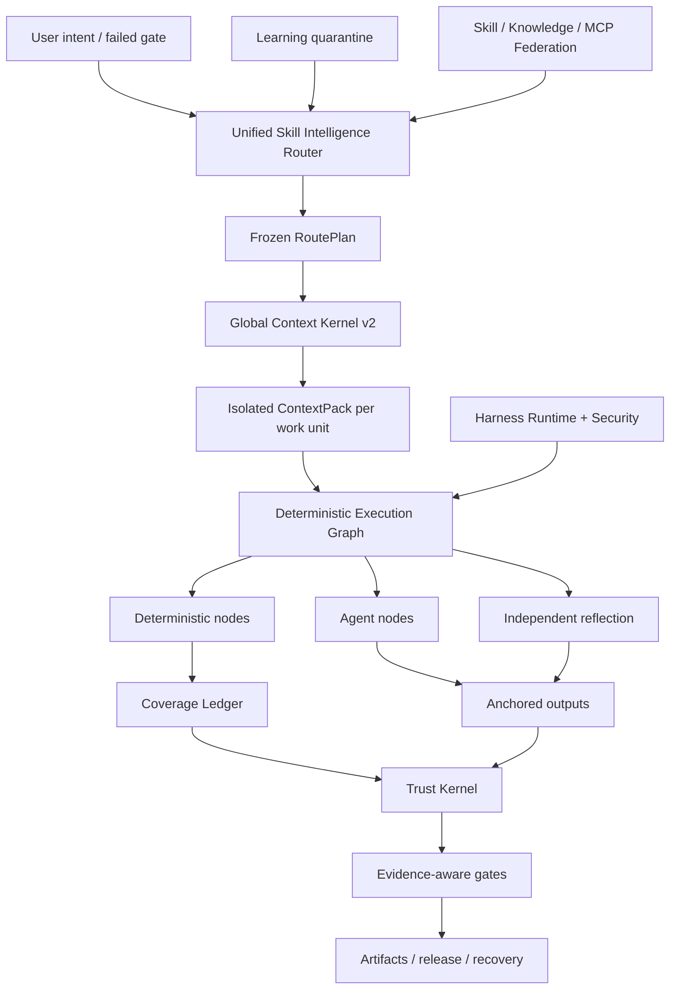

<p align="center">
  
</p>

<p align="center">
  <a href="LICENSE"></a>
  <a href="CHANGELOG.md"></a>
  
  
  
</p>

<p align="center"></p>
<h1 align="center">ForgeOS</h1>
<p align="center">ForgeOS يقرر <strong> ما هي المهارة التي يمكن تشغيلها</strong>، <strong> ما هو السياق الذي يمكن إدخاله</strong>، <strong>ما هي الخطوات التي يجب أن تكون حتمية</strong> و<strong>أي دليل قوي بما يكفي لقبول الإكمال</strong>.</p>

---

## سبب وجود ForgeOS

لا يصبح الوكيل موثوقًا به لأنه يحتوي على المزيد من المطالبات، أو المزيد من الأدوات، أو نافذة سياق أطول.

وتصبح موثوقة عندما يتمكن النظام من الإجابة على ستة أسئلة:

1. **ما هي النتيجة الدقيقة المطلوبة؟**
2. **ما هي التقنية المناسبة، وما هي التقنيات المشابهة الخاطئة هنا؟**
3. **ما هو أصغر سياق مطلوب لوحدة العمل هذه؟**
4. **ما هي الخطوات التي يجب أن تكون حتمية وليست مفوضة لنموذج ما؟**
5. **ما هو الدليل المستقل الذي يثبت النتيجة؟**
6. **هل يمكن لسير العمل نفسه استعادة نفسه واستئنافه ومراجعته بعد الفشل؟**

ForgeOS v0.6 يحول هذه الأسئلة إلى وقت تشغيل:

```text
نية مؤكدة
  → النتيجة + استرجاع التقنية
  → السياسة الصارمة والمرشحات المضادة للزناد
  → الحد الأدنى RoutePlan DAG
  → حزمة سياق معزولة لكل وحدة عمل
  → الرسم البياني لتنفيذ الحتمية / الوكيل / الانعكاس
  → المخرجات الراسية + دفتر الأستاذ للتغطية
  → الإيصالات الموثوقة + بوابات الأدلة
  → الإصدار والتراجع والاسترداد وتعلم الحجر الصحي
```

إنها ليست مجموعة سريعة. إنه مستوى التحكم حول المهارات، والقواعد، والخطافات، والوكلاء، والأدوات، والسياق، والأدلة، والتعلم.

---

## ما هو الحقيقي في الإصدار 0.6.1

| السطح | التحقق من التنفيذ |
|---|---:|
| سقالات النتيجة القديمة المكتوبة | **1,024** |
| تقنيات عقد المهارات العميقة الإصدار الثاني | **128** |
| تقنيات التنسيق/الثقة/السياق L0 | **32** |
| تقنيات الهندسة عبر المجالات L1 | **96** |
| ارتباطات المقيم المستقل | **128** |
| مقدمي الخدمات الإجرائية المستقرة | **33** |
| مقدمي الإجراءات المرشحة | **242** |
| المهارة المضمنة + تعيينات المعرفة | **1,299** |
| حالات مطابقة الاستخبارات لمراجعة التعليمات البرمجية | **12** |
| حالات الخصومة على سطح الوكيل | **20/20** |
| تجسيد مزود مستقر | **33/33** |
| دقة جهاز التوجيه@1 / @3 | **93.75% / 100%** |
| استدعاء جهاز التوجيه@6 | **100%** |
| تفعيل الطريق غير الآمن | **0%** |

> [!هام]
> العقد القديمة البالغ عددها 1,024 هي **سقالات للنتائج**، وليست 1,024 من المهارات الإجرائية على مستوى الإنتاج. يحتوي الإصدار 0.6 على 128 عقدًا تقنيًا عميقًا. يظل ثلاثة وثلاثون موفرًا إجرائيًا في قناة التوجيه المستقرة المعلنة من أجل التوافق، لكن تدقيق الشهادات النهائي وجد 0/128 ثابتًا مؤهلاً للأدلة و0 معتمدًا بموجب تعريف المراجعة 2 للإنجاز. تتطلب الأدلة المتبقية الرفض، والنماذج المتعددة المقترنة، والضغط، والمراجعة المستقلة، وإيصالات الإنتاج.

**مخزون النواة:** 32 تقنية L0 + 96 تقنية L1 = 128 تقنية نواة عميقة.

**حالات توجيه الكتالوج:** 33 مزوّدًا إجرائيًا للقنوات الثابتة المعلن عنها و242 مرشحًا. **دليل الشهادة الرسمية:** 0 مؤهل ثابت، 0 معتمد. راجع [التدقيق النهائي للشهادة](docs/FINAL-CERTIFICATION-AUDIT.md).

يؤدي تدقيق الإصدار إلى إبقاء هذه الادعاءات كاذبة عن عمد:

```text
1024 مهارات إجرائية على مستوى الإنتاج كاذبة
دورة حياة PostgreSQL الكاملة HA خاطئة
صندوق حماية microVM العالمي كاذب
معيار المراجعة 200-PR الذي يحمل علامة الخبراء خطأ
10000 تقييم مقترن يعمل بشكل خاطئ
```

لا يدعي ForgeOS v0.6 اكتمال الإنتاج العالمي أو 1,024 مهارات إجرائية على مستوى الإنتاج.

راجع [حدود المطالبات الإصدار 0.6](docs/CLAIMS-BOUNDARY-V0.6.md).

---

## مسار خمس دقائق

استخدم هذا المسار عندما تريد القيمة دون تعلم Trust Kernel أولاً.

### 1. التثبيت

```bash
npm install
npm test
node src/cli/forge.mjs init
```

الحزمة المثبتة:

```bash
npx forgeos init
forge doctor
```

يقوم `forge init` بإنشاء ملف تعريف SQLite-WAL محلي آمن. تتم كتابة مفتاح API الخاص به في ملف `0600` ولا تتم طباعته أبدًا.

### 2. ابحث عن التقنية الصحيحة

```bash
forge skills search "react rerender"
forge skills inspect reducing-react-render-thrashing
forge route --query "compile the minimum context for a large monorepo"
```

### 3. فحص الإصدار 0.6

```bash
forge v06 status
forge profile plan coding --target codex
forge security scan --file agent-surface.json
```

### 4. ابدأ مستوى التحكم المحلي

```bash
npm start
# Dashboard: http://127.0.0.1:8787/dashboard
# MCP:       http://127.0.0.1:8787/mcp
# A2A:       http://127.0.0.1:8787/a2a
```

---

## مسار المشغل العميق

استخدم هذا المسار عند تضمين ForgeOS في Codex، أو Claude Code، أو ChatGPT، أو وكيل مفتوح المصدر، أو CI، أو نظام أساسي داخلي.

### راوتر ذكاء المهارة

يقوم جهاز التوجيه بإجراء عملية استرجاع على مرحلتين بدلاً من مطابقة اسم المهارة:

```text
بوابة القصد / الفاشلة
  → استرجاع النتائج
  → استرجاع الزناد المباشر للتقنية
  → استبعاد مكافحة الزناد
  → الثقة، المستأجر، النضج، الأداة، الترخيص، مرشحات النضارة
  → إعادة ترتيب المنفعة المقاسة
  → الحد الأدنى من تقنية DAG
  → قرار المزود
  → خطة الطريق المجمدة
```

كل تقنية مختارة ومرفوضة لها سبب. دائمًا ما تتفوق الحواجز الصلبة على النتيجة.

### نواة السياق العالمي v2

ميزانيات ForgeOS الطلب الكامل:

```text
النظام · المهمة · أقسام المهارات المختارة · رموز الكود · المصنوعات اليدوية
· الذاكرة · إخراج الأداة · المراجع · مخططات الأدوات الكسولة
· احتياطي الإخراج. · احتياطي الأمان
```

وهو يوفر:

- واجهة محاسبة رمزية واحدة مشتركة بين المحلل والمجسد؛
- تحميل المهارات على مستوى القسم؛
- سياق معزول لكل وحدة عمل؛
- تجسيد مخطط الأداة البطيء؛
- معرفات رموز ABI الدلالية ورفض التجزئة التي لا معنى لها؛
- إسقاط دلتا قطعة أثرية؛
- حقن غريزة ممتدة ومنتهية الصلاحية ؛
- السجلات الأولية التي تتناول المحتوى مع نطاقات الفشل المقطرة؛
- بيان الإغفال لكل مصدر غير مدرج.

### نسيج المهارات الحتمية

يتم تجميع تقنية الإصدار 0.6 في رسم بياني قابل للتنفيذ:

```text
العقد الحتمية
  اختيار النطاق · التجميع · قرار القواعد · الإرساء · الأدلة

عقد الوكيل
  التحقيق · الفرضية · حكم المجال

عقد الانعكاس
  التناقض · مرشح إيجابي كاذب · قابلية التنفيذ

عقد التحكم
  الانضمام الموازي · بوابة التغطية · إعادة المحاولة · التراجع
```

يستخدم دفتر الأستاذ لتغطية SQLite عقود الإيجار ونبضات القلب والسياج والإيصالات الموثوقة. لا يمكن للعامل المستصلح وضع علامة على وحدة العمل مكتملة.

### الشريحة العمودية لذكاء مراجعة الكود

تثبت الشريحة الرأسية الكاملة الأولى الهندسة المعمارية من البداية إلى النهاية:

```text
النطاق الكامل
→ وحدات العمل الواعية بالعلاقات
→ اختيار القاعدة السياقية
→ تحليل العامل المعزول
→ مراسي الخط/التجزئة
→ النقل بعد التعديلات
→ التفكير المستقل
→ إيصال التغطية
```

تعد المجموعة المجمعة المكونة من 12 حالة بمثابة معيار التوافق الحتمي. لم يتم الإعلان عنه كمعيار 200-PR الذي يحمل علامة الخبراء.

### التعلم المستمر — دون التسمم الذاتي التلقائي

تصبح الأنماط المرصودة غرائز محددة، وليست مهارات مستقرة:

```text
إيصالات التشغيل الموثوقة
  → غريزة ملحوظة
  → عزل المستأجر/المشروع/الحزام + TTL
  → مجموعة الغريزة المتوافقة
  → اقتراح تطور المرشح
  → التقييم المستقل
  → ترقية الإنسان أو التراجع
```

لا يمكن للمنتج تعزيز سلوكه المكتسب.

### تسخير وقت التشغيل v2

يميز ForgeOS بين أربعة أسطح:

| السطح | استخدمه لـ |
|---|---|
| **القاعدة** | ثابت قصير يجب أن ينطبق دائمًا |
| ** هوك ** | الفعل الحتمي المرتبط بحدث |
| **المهارة** | إجراء شرطي يتطلب الحكم |
| ** دور الوكيل ** | سياق أو أدوات أو نموذج أو سلطة منفصلة |

تتضمن الأحداث المحايدة `before.tool.execute`، و`after.file.write`، و`verification.checkpoint`، و`session.compact`، و`session.ended`. يجب أن تقوم محولات المضيف بوضع علامة على الميزات غير المدعومة بدلاً من المطالبة بالتماثل الزائف.

الملفات الشخصية:

```text
الحد الأدنى · الترميز · الإبداع · البحث · التنظيم
المحلية الصغيرة · المشاريع
```

### وكيل سطح الأمن

يقوم محرك الأمان بفحص نظام الوكيل نفسه:

- التعليمات وانتهاكات الحدود السريعة؛
- الخطافات والبرامج النصية لدورة حياة الحزمة؛
- أوصاف MCP والأذونات وإمكانية الوصول إلى الأداة؛
- قوائم الأوامر المسموح بها؛
- مراجع سرية/بيئية؛
- مسارات إذن سرية للخروج؛
- قدرة البدل واسعة النطاق من الأنابيب إلى الغلاف؛
- يختلف إذن الملف الشخصي قبل التثبيت.

تمر مجموعة الخصومة حاليًا **20/20** حالة.

### التنفيذ المحلي بوساطة

يوفر العداء المحلي حدود أمان حقيقية للأوامر العادية:

- لا يوجد استيفاء للقذيفة؛
- القوائم المسموح بها للأوامر والبيئة؛
- مساحة العمل واحتواء الارتباط الرمزي؛
- المهلة وإنهاء مجموعة العمليات؛
- يحدها stdout/stderr؛
- إيصال التنفيذ المعنون بالمحتوى.

إنه ** ليس ** صندوق حماية microVM عالميًا ينكر الشبكة. لا يزال تنفيذ الجهات الخارجية عالي الخطورة يتطلب حاوية خارجية أو طبقة عزل microVM.

---


# كيف يعمل فورج أو إس

يجمع ForgeOS بين منتجين في وقت تشغيل واحد:

1. **طبقة ذكاء المهارة** التي تسترد التقنيات، وترفض المباريات القريبة غير الآمنة، وتجمع فقط أقسام المهارات المطلوبة، وتبني خطة تنفيذ مجمدة.
2. **طائرة تحكم تعمل بالذكاء الاصطناعي** تدير المشاريع والعناصر والأدلة والموافقات والإيجارات والاسترداد والاتحاد وبوابات الإصدار.

```text
نية مؤكدة أو بوابة فاشلة
  → النتائج واسترجاع التقنية المباشرة
  → مرشحات مكافحة الزناد والمستأجر والثقة والأداة والترخيص والنضارة
  → الحد الأدنى من RoutePlan DAG المجمدة
  → حزمة سياق معزولة لكل وحدة عمل
  → الرسم البياني لتنفيذ الحتمية / الوكيل / الانعكاس
  → المخرجات الراسية ودفتر الأستاذ التغطية المسيجة
  → إيصالات موثوقة وبوابات مدركة للضمان
  → الإصدار أو الاسترداد أو التراجع أو تعلم العزل
```

## عشرة أنظمة متعاونة

| النظام | ما يتحكم فيه |
|---|---|
| **جهاز توجيه ذكاء المهارة** | استرجاع النتائج، وتسجيل التقنية، ومكافحة المحفزات، والسياسة الصارمة، واختيار المزود، وخطط الطريق القابلة للتفسير |
| ** نواة السياق العالمي v2 ** | إجمالي ميزانية رمزية واحدة عبر السياسة والمهام وأقسام المهارات والرموز والمصنوعات والذاكرة ومخرجات الأداة والمراجع واحتياطي المخرجات |
| **نسيج المهارات الحتمية** | الرسوم البيانية الهجينة التي تحتوي على العقد الحتمية، وعقد الوكيل، وعقد الانعكاس، والموافقات، والمثبتات، وشروط التوقف |
| **دفتر حسابات التغطية** | ملكية وحدة العمل، وعقود الإيجار، ورموز السياج، وتغطية الإكمال، ورفض العمال الذين لا معنى لهم، وقابلية الاستئناف |
| **نواة الثقة** | نضارة الأدلة، ونسب القطع الأثرية، وسلطة الموافقة، ومستويات الضمان، وقرارات الإصدار |
| **Agent Surface Security** | أنماط الحقن الفوري، والنصوص البرمجية الخطيرة للحزم، ومسارات الخروج السرية، والأذونات، وصدق قدرة المحول |
| **التنفيذ المحلي بوساطة** | إنشاء أوامر خالية من الصدفة، والقوائم المسموح بها، والمهلة، وحدود الإخراج، والإيصالات المنظمة |
| **التعلم المستمر** | الغرائز المحددة، وانتهاء الصلاحية، والثقة، والحجر الصحي، ومقترحات المرشحين، والترقية الخاضعة للرقابة |
| **اتحاد المهارات** | المصادر الموقعة، ومستويات الثقة، والعزل، ومعالجة التعارض، والإلغاء، والكتالوجات المتزامنة |
| **تسخير وقت التشغيل v2** | القواعد والخطافات والمهارات وأدوار الوكيل واختلافات الأذونات والملفات الشخصية لأدوات الذكاء الاصطناعي المختلفة |

---

# مقارنة النظام البيئي

> [!هام]
> تصف هذه المقارنة **التركيز الأصلي من الدرجة الأولى لكل مستودع أساسي**. `◐` يعني الدعم الجزئي أو الدعم القائم على الامتداد أو الدعم من خلال منتج مجاور. `—` يعني أنه ليس محور التركيز الأساسي للمشروع، وليس أنه من المستحيل البناء.

نجوم GitHub أدناه هي أرقام تقريبية تم التحقق منها في **26 يوليو 2026**. فهي تشير إلى رؤية المجتمع، وليس الجودة الهندسية في حد ذاتها.

## خريطة النظام البيئي

| مشروع | تقريبا. نجوم جيثب | الدور الأساسي |
|---|---:|---|
| [القوى الخارقة](https://github.com/obra/superpowers) | **255 ألف** | إطار مهارات الوكيل ومنهجية تطوير البرمجيات |
| [مهارات الوكيل الأنثروبي](https://github.com/anthropics/skills) | **151 ألف** | معايير المهارات ومكتبة المهارات العامة لكلود |
| [لانجشين](https://github.com/langchain-ai/langchain) | **139 ألف** | منصة هندسية للوكيل ونظام بيئي متكامل كبير |
| [الأيدي المفتوحة](https://github.com/All-Hands-AI/OpenHands) | **75 ألف+** | تطبيق وكيل تطوير البرمجيات الشامل |
| [CrewAI](https://github.com/crewAIInc/crewAI) | **56 ألف+** | أطقم متعددة الوكلاء والتدفقات التي تعتمد على الأحداث |
| [التوليد التلقائي](https://github.com/microsoft/autogen) | **50 ألف+** | المراسلة متعددة الوكلاء ووقت تشغيل البحث |
| [لانغغراف](https://github.com/langchain-ai/langgraph) | **37 الف+** | رسوم بيانية قوية وطويلة الأمد |
| [النواة الدلالية](https://github.com/microsoft/semantic-kernel) | **28 ألف+** | متعدد اللغات تزامن المؤسسة SDK |
| [مهارات الوكيل الرائعة](https://github.com/VoltAgent/awesome-agent-skills) | **28 ألف+** | كتالوج مجتمعي يضم أكثر من ألف مهارات |
| [SDK لوكلاء OpenAI](https://github.com/openai/openai-agents-python) | **27 الف+** | الوكلاء وعمليات التسليم والدرابزين والجلسات والتتبع |
| [سمولاجينتس](https://github.com/huggingface/smolagents) | **27 الف+** | الحد الأدنى من مكتبة الوكيل مع التركيز على وكيل التعليمات البرمجية |
| [ليتا](https://github.com/letta-ai/letta) | **23 ألف+** | الفاعلون الفاعلون والذاكرة الدائمة |
| [جوجل ADK](https://github.com/google/adk-python) | **حوالي 20 ألف** | بناء وكيل الكود الأول وتقييمه ونشره |
| [PydanticAI](https://github.com/pydantic/pydantic-ai) | ** حوالي 19 ألف ** | إطار عمل وكيل بايثون الآمن من النوع |

## مصفوفة القدرات الأساسية

| النظام | المهارات المعبأة | التوجيه + مكافحة الزناد | سياق محكوم | الرسم البياني الحتمي/العامل المختلط | الأدلة + إيصالات الأمانة | أمان سطح الوكيل | القوة الأصلية |
|---|:---:|:---:|:---:|:---:|:---:|:---:|---|
| **فورج أو إس** | ✅ | ✅ | ✅ | ✅ | ✅ | ✅ | مهارة الذكاء والتنفيذ الجدير بالثقة |
| المهارات الإنسانية | ✅ | ◐ | ◐ | — | — | ◐ | معيار مهارة بسيط ومحمول |
| القوى الخارقة | ✅ | ✅ | ◐ | ◐ | ◐ | — | منهجية SDLC واضحة للغاية لوكلاء الترميز |
| مهارات الوكيل الرائعة | ✅ | — | — | — | — | ◐ | اكتشاف المهارات عبر العديد من المصادر |
| لانجشين | ◐ | ◐ | ◐ | ◐ | ◐ | ◐ | نظام بيئي متكامل كبير جدًا |
| لانغغراف | ◐ | ◐ | ◐ | ✅ | ◐ | ◐ | التنفيذ الدائم والرسوم البيانية ذات الحالة |
| وكلاء OpenAI SDK | ◐ | ◐ | ◐ | ◐ | ◐ | ◐ | إطار خفيف الوزن وعمليات التسليم والتتبع |
| كرو آي | ◐ | ◐ | ◐ | ✅ | ◐ | ◐ | الوكلاء المستندون إلى الأدوار مدمجون مع التدفقات |
| أوتوجن | ◐ | ◐ | ◐ | ✅ | ◐ | ◐ | وقت تشغيل متعدد الوكلاء يحركه الحدث |
| النواة الدلالية / MAF | ◐ | ◐ | ◐ | ✅ | ◐ | ◐ | تنسيق المؤسسة عبر أوقات التشغيل |
| جوجل أدك | ◐ | ◐ | ◐ | ✅ | ◐ | ◐ | البناء والتقييم والنشر في نظام Google البيئي |
| بيدانتيك آي | ◐ | ◐ | ◐ | ◐ | ◐ | ◐ | سلامة الكتابة، والتحقق من الصحة، وبيئة عمل بايثون |
| سمولاجينتس | ◐ | ◐ | ◐ | ◐ | — | ◐ | الحد الأدنى، تنفيذ وكيل قابل للقراءة |
| ليتا | ◐ | ◐ | ✅ | ◐ | ◐ | ◐ | الذاكرة الدائمة والعوامل ذات الحالة |
| الأيدي المفتوحة | ◐ | ◐ | ◐ | ◐ | ◐ | ✅ | تجربة وكيل الترميز الشامل |

## يختار ForgeOS ساحة معركة مختلفة

يجيب مستودع المهارات على السؤال التالي: **"ما هي الإجراءات التي يمكن للوكيل تعلمها؟"**

يسأل ForgeOS أيضًا: **"ما هي التقنية المسموح بها الآن، وما هي المطابقة القريبة التي يجب رفضها، وما هي الأقسام التي قد تدخل في السياق، وما هي الأدوات المطلوبة، وما هي الأدلة التي يجب تقديمها، وما هي البوابة التي قد تعلن اكتمال العمل؟"**

يساعد إطار عمل الوكيل في إنشاء الوكلاء والأدوات وعمليات التسليم وسير العمل. يركز ForgeOS على الطبقة المحيطة بوقت التشغيل: استرجاع القدرات، ومكافحة المشغلات، وميزانيات السياق العالمي، والرسوم البيانية الحتمية/الوكيل/الانعكاس، والأدلة الحالية، وسلطة الموافقة، ونسب القطع الأثرية، والاسترداد، وعزل التعلم.

يركز نظام الذاكرة على ما يتذكره العميل. يتحكم ForgeOS أيضًا في سياسة المستأجر والمشروع والمستخدم ومجال الثقة وانتهاء الصلاحية والثقة والترويج التي تنتمي إليها الذاكرة.

يوفر وكيل الترميز الشامل تجربة المستخدم. يمكن لـ ForgeOS تشغيل **تحت أو بجانب** هذا الوكيل كطبقة اختيار المهارات، وإدارة السياق، والأدلة، والثقة، ودورة حياة المشروع.

## إلى أين تقود النظم البيئية الناضجة

لديهم حاليًا مجتمعات أكبر، والمزيد من البرامج التعليمية وعمليات التكامل، وتجارب سحابية مُدارة أكثر مصقولة، وتجهيز أقوى بدون تعليمات برمجية، وعمليات نشر إنتاج موثقة بشكل عام. يركز ForgeOS عمدًا على مشكلة أقل توحيدًا: **التحكم في اختيار المهارات والسياق والأدلة والسلطة وحالة الإنجاز لعملاء الذكاء الاصطناعي**.

---

#ثلاثة مسارات للدخول

## للمستخدمين اليومي

لا تحتاج إلى فهم كل نظام فرعي. ابدأ بأربعة اختبارات يمكن ملاحظتها:

```bash
node src/cli/forge.mjs doctor
node src/cli/forge.mjs skills search --query "review authentication changes"
node src/cli/forge.mjs route --query "review authentication changes without missing tests"
node src/cli/forge.mjs scan agent-surface --path .
```

يمكنك فحص التقنية التي تم اختيارها، وسبب رفض البدائل، وحجم السياق الذي تم تجميعه، والأذونات المطلوبة، والأدلة التي لا تزال مفقودة.

## للمطورين

يعرض ForgeOS نفس وقت التشغيل من خلال:

- CLI للتشغيل المحلي وCI؛
- واجهات برمجة تطبيقات HTTP ولوحة تحكم الاستوديو؛
- ** 60 أداة MCP صارمة للمخططات **؛
- مهمة A2A وأسطح بطاقة الوكيل؛
- استيراد الخدمة المباشرة من شجرة مصدر Node.js؛
- **15 محولًا** للأنظمة البيئية للوكيل وIDE؛
- سبعة ملفات تعريف للأحزمة: `minimal`، `coding`، `creative`، `research`، `regulated`، `local-small`، و`enterprise`.

يمكن للمطورين إنشاء مشاريع، وتسجيل العناصر، وربط الأدلة، وطلب الموافقات، وتجميع RoutePlans وContextPacks، وتنفيذ الرسوم البيانية، واستعادة المراجعات، ومزامنة المهارات الموحدة، أو إضافة Skill Contract v2.

## للخبراء والباحثين

تم تصميم ForgeOS ليتم تحديه بدلاً من قبوله من صفحة التسويق. يمكن للخبراء اختبار بشكل مستقل:

- دقة جهاز التوجيه، واستدعاءه، وسلوك مكافحة الزناد، والتنشيط غير الآمن؛
- تجاوز إجمالي السياق وتقليل ABI الدلالي؛
- التغطية الحتمية، والمراسي، والتفكير، والإيجارات، والمبارزة؛
- نضارة الأدلة، ونسب القطع الأثرية، وبوابات الوعي بالضمان؛
- الحقن السريع، والبرامج النصية للحزمة، ومسارات الخروج السرية، وصدق المحول؛
- صراع الاتحاد، والحجر الصحي، والإلغاء، والثقة بالمصدر؛
- التحقق من الأرشيف بدون `.git`.

```bash
npm run validate
npm run v06:audit
npm run router:benchmark
npm run context:benchmark
npm run federation:eval
npm run federation:audit
npm run smoke
npm run adapter:tck
npm run release:verify
```

---

#خريطة المستودع

```text
تنفيذ src/وقت التشغيل
  واجهة سطر الأوامر cli/forge
  جوهر / مشروع، قطعة أثرية، أدلة، موافقة، استرداد
  مهارة الذكاء / العقود، التوجيه، التقييم، التجسيد
  السياق/ نواة السياق العالمي وتجميع وحدة العمل
  مترجم التنفيذ/الرسم البياني، العقد الحتمية، التغطية
  الثقة/ الدليل، التأكيد، السلطة، بوابات الإفراج
  الأمن / المسح السطحي للوكيل ووسيط الأوامر
  الاتحاد / المصادر البعيدة، الثقة، الحجر الصحي، المزامنة
  التعلم/ الغرائز، المرشحين، انتهاء الصلاحية، الترقية
  خادم mcp/ MCP و58 أداة عامة
  بطاقات a2a/ A2A والمهام والرسائل والإيصالات
  واجهات برمجة تطبيقات الخادم/ HTTP، والمصادقة، ولوحة القيادة
  التخزين/استمرارية SQLite-WAL والترحيلات
محولات / 15 وكيل ومحولات IDE
المهارات-الإصدار 2/ 128 تقنيات عقد المهارات العميقة الإصدار 2
القدرات - الإصدار 2 / النتائج، التقنيات، مقدمو الخدمة، العلاقات، الرسم البياني
المخططات/عقود JSON Schema 2020-12 العامة
حزم / حزم القدرة الرأسية والمعايير
التقييمات / حالات التقييم، ونماذج التقييم، والمجاميع
الاختبارات/ 125 ملف اختبار وثوابت الإصدار
الأدلة / التدقيق الناتج، والمعيار، وSBOM، وأدلة لوحة المعلومات
المستندات / الهندسة المعمارية والبروتوكولات والأمن والاختبار والإنتاج
البرامج النصية / أدوات الإنشاء والتحقق من الصحة والتدقيق والمعيار والإصدار
```

# حالات الاستخدام المناسبة

- جعل وكلاء الترميز أكثر انضباطًا وقابلية للتدقيق.
- بناء طائرة تحكم لعدة نماذج ووكلاء وأدوات.
- تشغيل منصة مهارات داخلية مع ضوابط التوجيه والنضج.
- مراجعة تكوينات الوكيل والأذونات والمطالبات وأسطح سلسلة التوريد.
- ضمانات عالية أو سير عمل منظم يتطلب أدلة وبوابات موافقة.
- تقليل هدر السياق في المستودعات الكبيرة من خلال عزل وحدة العمل وSemantic ABI.

لا يعد ForgeOS بديلاً لأتمتة سير عمل الأعمال بأسلوب n8n. يربط n8n بين التطبيقات وأحداث الأعمال؛ يتحكم ForgeOS في اختيار تقنية الذكاء الاصطناعي والسياق والتنفيذ والأدلة والسلطة. يمكن استخدامها معا.

---

## بنيان



---

## تكامل MCP والوكيل

يتحدث ForgeOS لغة MCP `2025-11-25`، وA2A `1.0`، والحزم المتوافقة مع مهارات الوكيل، وHTTP، وCLI.

تتضمن الأدوات العامة الإصدار 0.6 ما يلي:

```text
forge_v06_status
forge_execution_graph_compile
forge_review_scope_compile
forge_context_work_units_compile
forge_harness_profile_plan
forge_agent_surface_scan
```

إنهم ينضمون إلى المشروع الحالي والقطعة الأثرية والأدلة الموثوقة والاسترداد والاتحاد وذكاء المهارات وأدوات وسيط MCP. تشترك Stdio وHTTP MCP وCLI وStudio في نفس الخدمات ومخططات JSON.

تتضمن حزم المحولات المدعومة ChatGPT، وCodex، وClaude Code، وCursor، وOpenCode، وGemini CLI، وCopilot CLI، وCline، وRoo Code، وWindsurf، وContinue، وNolaneNative، وOpenClaw، وPi، وMCP/A2A العامة. تميز الأدلة بين المحولات **التي تم اختبارها بواسطة البروتوكول** وأدلة **الوثائق فقط**.

---

## تَحَقّق

```bash
npm run validate
npm run skills:v2:audit
npm run v06:audit
npm run router:benchmark
npm run context:benchmark
npm run federation:eval
npm run federation:audit
npm run smoke
npm run adapter:tck
npm run release:verify
```

تتحقق بوابة التحرير من السلوك والعقود، وليس فقط تغطية الخط:

- ثوابت الحالة، والسياج، والمقاومة للتلف، ودورة الحياة؛
- دورة حياة MCP/A2A الكاملة ومخططات الإخراج؛
- عمق المهارة، والنموذج المعياري، وتجزئة القسم، والتجسيد؛
- دقة جهاز التوجيه، واستدعاءه، وحتميته، والتنشيط غير الآمن؛
- تجاوز السياق العالمي ومحاسبة الإغفال؛
- التنفيذ الحتمي ودفتر الأستاذ التغطية؛
- مراجعة المراسي والتفكير.
- التقييم المستقل والحجر الصحي للتعلم المستمر؛
- حالات الخصومة على سطح الوكيل؛
- تثبيت الأرشيف والتحقق الذاتي بدون `.git`.

---

## حدود الإنتاج

**المتكامل اليوم**

- الواجهة الخلفية لدورة حياة SQLite WAL أحادية العقدة؛
- المراجعة/CAS، الإيجارات، المبارزة، اللقطات، الاستعادة، ACL، مفتاح OIDC/API؛
- الإيصالات الموثوقة، وتجزئات المغلفات الأثرية، والبوابات المدركة للضمان؛
- المهارة / المعرفة / اتحاد MCP على نطاق المستأجر ؛
- استنزاف رشيق، والاستعداد، والمقاييس، ومصدر الإصدار الموقع؛
- ملفات تعريف النشر غير الجذرية/للقراءة فقط.

**ليس هناك مطالبة بالإصدار 0.6 بعد**

- الواجهة الخلفية لـ PostgreSQL لدورة حياة كاملة واختبار تجاوز الفشل متعدد العقد؛
- صندوق حماية microVM عالمي تابع لجهة خارجية؛
- إدارة SCIM/المنظمة المفوضة؛
- خدمة الشفافية المدارة والبنية التحتية للمفاتيح العمومية؛
- تدفق/دفع وتوزيع A2A للسيرة الذاتية؛
- 1024 مهارات إجرائية على مستوى الإنتاج؛
- 10000 جولة تقييم مقترنة؛
- معيار مراجعة التعليمات البرمجية عبر اللغات الذي يحكمه الخبراء.

اقرأ [الإنتاج](docs/PRODUCTION.md)، و[نموذج الأمان](docs/SECURITY-MODEL.md)، و[Self-Audit v0.6](docs/SELF-AUDIT-V0.6.md).

---

## خريطة توثيقية

| ابدأ هنا | الغوص العميق |
|---|---|
| [بداية سريعة](docs/QUICKSTART.md) | [الهندسة المعمارية](docs/ARCHITECTURE.md) |
| [ذكاء المهارة](docs/SKILL-INTELLIGENCE.md) | [النسيج الحتمي v0.6](docs/DETERMINISTIC-SKILL-FABRIC-V06.md) |
| [CLI والملفات الشخصية](docs/HARNESS-RUNTIME-V2.md) | [نواة السياق العالمية](docs/GLOBAL-CONTEXT-KERNEL.md) |
| [الأمان](docs/AGENT-SURFACE-SECURITY.md) | [التعلم المستمر](docs/CONTINUOUS-LEARNING-V06.md) |
| [اختبار](docs/TESTING.md) | [حدود المطالبات](docs/CLAIMS-BOUNDARY-V0.6.md) |
| [المساهمة](CONTRIBUTING.md) | [التدقيق الذاتي](docs/SELF-AUDIT-V0.6.md) |

---

## اللغات

[Universal Lanes](docs/UNIVERSAL-LANES.md) · [Remote MicroVM Sandbox](docs/REMOTE-MICROVM-SANDBOX.md) · [Tiếng Việt](README-vn.md) · [简体中文](README-cn.md) · [繁體中文](README-tw.md) · [日本語](README-ja.md) · [한국어](README-ko.md) · [Español](README-es.md) · [Français](README-fr.md) · [Deutsch](README-de.md) · [Português](README-pt-br.md) · [Русский](README-ru.md) · [العربية](README-ar.md) · [हिन्दी](README-hi.md) · [Bahasa Indonesia](README-id.md) · [ไทย](README-th.md) · [Türkçe](README-tr.md) · [Italiano](README-it.md) · [Polski](README-pl.md) · [Українська](README-uk.md) · [Nederlands](README-nl.md) · [فارسی](README-fa.md) · [עברית](README-he.md) · [Svenska](README-sv.md)

---

## المساهمة

لا يتم قبول مهارة جديدة لأن نثرها يبدو خبيرًا. يحتاج إلى:

1. خط أساس أحمر يفشل بدون هذه التقنية؛
2. المشغلات الدقيقة والمشغلات المضادة؛
3. إجراء خاص بالمجال ونموذج الفشل؛
4. المدخلات والمخرجات والأدوات والأدلة المكتوبة.
5. تجزئات الأقسام وميزانيات الرموز المميزة؛
6. ارتباطات المقيم المستقل؛
7. الأدلة المعيارية وقرار الاستحقاق.

راجع [CONTRIBUTING.md](CONTRIBUTING.md)، و[GOVERNANCE.md](GOVERNANCE.md)، و[SECURITY.md](SECURITY.md).

## رخصة

معهد ماساتشوستس للتكنولوجيا - راجع [الترخيص](LICENSE).


## عمليات تدقيق الإصدار النهائي

- [تقرير التصلب النهائي](docs/FINAL-HARDENING-REPORT.md)
- [تدقيق شهادة المهارة النهائية](docs/FINAL-CERTIFICATION-AUDIT.md)
