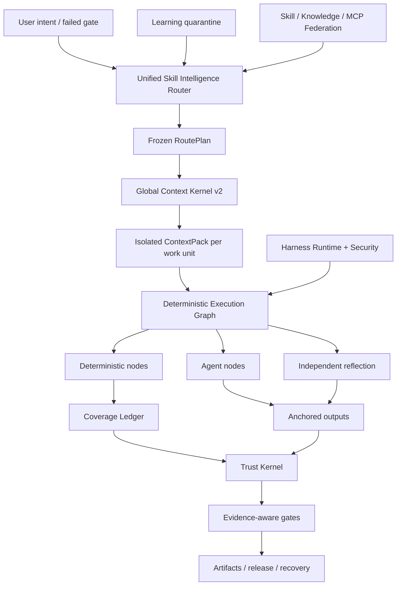

<p align="center">
  
</p>

<p align="center">
  <a href="LICENSE"></a>
  <a href="CHANGELOG.md"></a>
  
  
  
</p>

<p align="center"></p>
<h1 align="center">ForgeOS </h1>
<p align="center"><strong>人工智能代理的技能智能操作系统和信任控制平面。</strong></p>
<p align="center">ForgeOS 决定 <strong> 可以运行哪些技能 </strong>、<strong> 可以进入哪些上下文 </strong>、<strong> 必须执行哪些步骤确定性 </strong> 和 <strong> 证据足够强大以接受完成 </strong>.</p>

---

## 为什么 ForgeOS 存在

代理不会因为有更多的提示、更多的工具或更长的上下文窗口而变得可靠。

当系统能够回答六个问题时，它就变得可靠：

1. **需要什么具体结果？**
2. **哪种技术是合适的，哪些类似的技术是错误的？**
3. **此工作单元所需的最小上下文是什么？**
4. **哪些步骤必须是确定性的而不是委托给模型？**
5. **什么独立证据证明了输出？**
6. **同一工作流程在出现故障后能否自行恢复、恢复和审核？**

ForgeOS v0.6 将这些问题转化为运行时：

```text
确认意图
  → 结果+技术检索
  → 硬策略和反触发过滤器
  → 最小 RoutePlan DAG
  → 每个工作单元隔离 ContextPack
  → 确定性/代理/反射执行图
  → 锚定输出+覆盖分类账
  → 可信收据+证据门
  → 发布、回滚、恢复和学习隔离
```

它不是一个即时集合。它是围绕技能、规则、钩子、代理、工具、背景、证据和学习的控制平面。

---

## v0.6.1 中的真实内容是什么

|表面|验证实施 |
|---|---:|
|传统类型的结果支架 | **1,024** |
|深度技能合同 v2 技术 | **128** |
| L0 编排/信任/上下文技术 | **32** |
| L1跨域工程技术| **96** |
|独立评估者绑定 | **128** |
|稳定的程序提供商| **33** |
|候选程序提供者| **242** |
|内置技能+知识图谱| **1,299** |
|代码审查情报一致性案例| **12** |
|代理表面对抗案例 | **20/20** |
|稳定的提供商物化| **33/33** |
|路由器精度@1 / @3 | **93.75% / 100%** |
|路由器召回@6 | **100%** |
|不安全路由激活| **0%** |

> [!重要]
> 1,024 个遗留节点是**结果支架**，而不是 1,024 个生产级程序技能。 v0.6包含128个深度技术合约。出于兼容性考虑，33 个程序提供商仍保留在已声明的稳定路由通道中，但最终认证审核发现 0/128 个证据合格的稳定提供商，以及 0 个根据修订版 2 完成定义进行认证的提供商。剩下的证据需要坚持、配对多模型、压力、独立审查和生产收据。

**内核清单：** 32 个 L0 技术 + 96 个 L1 技术 = 128 个深度内核技术。

**目录路由状态：** 33 个已声明的稳定渠道程序提供商和 242 个候选提供商。 **正式认证证据：** 0 个稳定合格，0 个已认证。请参阅[最终认证审核](docs/FINAL-CERTIFICATION-AUDIT.md)。

发布审核故意使这些声明不真实：

```text
1,024 生产级程序技能错误
完整 PostgreSQL 生命周期 HA false
通用 microVM 沙箱 false
专家标记的 200-PR 审查基准错误
10,000 次配对评估结果为假
```

ForgeOS v0.6 并未声称具有通用生产完整性或 1,024 个生产级程序技能。

请参阅[声明边界 v0.6](docs/CLAIMS-BOUNDARY-V0.6.md)。

---

## 五分钟路径

当您想要价值而不首先学习信任内核时，请使用此路径。

### 1.安装

```bash
npm install
npm test
node src/cli/forge.mjs init
```

安装的包：

```bash
npx forgeos init
forge doctor
```

`forge init` 创建安全的本地 SQLite-WAL 配置文件。其 API 密钥写入 `0600` 文件并且永远不会打印。

### 2.找到正确的技术

```bash
forge skills search "react rerender"
forge skills inspect reducing-react-render-thrashing
forge route --query "compile the minimum context for a large monorepo"
```

### 3. 检查 v0.6

```bash
forge v06 status
forge profile plan coding --target codex
forge security scan --file agent-surface.json
```

### 4.启动本地控制平面

```bash
npm start
# Dashboard: http://127.0.0.1:8787/dashboard
# MCP:       http://127.0.0.1:8787/mcp
# A2A:       http://127.0.0.1:8787/a2a
```

---

## 深度算子路径

将 ForgeOS 嵌入 Codex、Claude Code、ChatGPT、开源代理、CI 或内部平台时，请使用此路径。

###技能智能路由器

路由器执行两阶段检索而不是匹配技能名称：

```text
意图/失败的门
  → 结果检索
  → 直接技术触发检索
  → 反触发排除
  → 信任、租户、成熟度、工具、许可证、新鲜度过滤器
  → 测量效用重新排序
  → 最小技术 DAG
  → 提供商解析
  → 冻结路线计划
```

每一种被选择和被拒绝的技术都有一个原因。硬阻挡者总是能击败得分。

### 全局上下文内核 v2

ForgeOS 为完整的请求制定预算：

```text
系统·任务·选定的技能部分·代码符号·工件
· 内存 · 工具输出 · 参考资料 · 惰性工具模式
· 输出储备 · 安全储备
```

它提供：

- 解析器和物化器共享一个代币记账接口；
- 章节级技能加载；
- 每个工作单元的独立上下文；
- 惰性工具模式物化；
- 语义 ABI 符号 ID 和过时哈希拒绝；
- 伪影增量投影；
- 有范围的、过期的本能注射；
- 内容寻址的原始日志，包含经过提炼的故障范围；
- 未包含的每个来源的遗漏清单。

### 确定性技能结构

v0.6 技术被编译成可执行图：

```text
确定性节点
  范围选择·捆绑·规则解析·锚定·证据

代理节点
  调查·假设·领域判断

反射节点
  矛盾 · 误报过滤 · 可操作性

控制节点
  并行连接·覆盖门·重试·回滚
```

SQLite 覆盖分类账使用租约、心跳、隔离和可信收据。回收的工作人员无法将工作单元标记为完成。

### 代码审查智能垂直切片

第一个完整的垂直切片端到端地证明了该架构：

```text
完整范围
→ 关系意识工作单位
→ 上下文规则选择
→ 孤立代理分析
→ 行/散列锚点
→ 编辑后搬迁
→ 独立反思
→ 承保收据
```

捆绑的 12 个案例语料库是一个确定性的一致性基准。它**不**被宣传为专家标记的 200-PR 基准。

### 持续学习——不会自动自我中毒

观察到的模式变成了有范围的本能，而不是稳定的技能：

```text
可信运行收据
  → 观察本能
  → 租户/项目/线束隔离 + TTL
  → 兼容本能簇
  → 候选进化提案
  → 独立评估
  → 人为提升或回滚
```

生产者无法促进自己习得的行为。

### Harness Runtime v2

ForgeOS 区分四个表面：

|表面|用它来 |
|---|---|
| **规则** |必须始终适用的短不变量 |
| **挂钩** |与事件绑定的确定性操作 |
| **技能** |需要判断的条件程序|
| **代理角色** |单独的上下文、工具、模型或权威 |

中性事件包括 `before.tool.execute`、`after.file.write`、`verification.checkpoint`、`session.compact` 和 `session.ended`。主机适配器必须标记不支持的功能，而不是声明错误的奇偶校验。

简介：

```text
极简 · 编码 · 创意 · 研究 · 监管
地方小型·企业
```

### 特工表面安全

安全引擎扫描代理系统本身：

- 指令和提示边界违规；
- 挂钩和包生命周期脚本；
- MCP 描述、权限和工具可达性；
- 命令白名单；
- 秘密/环境参考；
- 秘密到出口的权限路径；
- 管道到外壳和广泛的通配符功能；
- 安装前的配置文件权限差异。

其对抗性语料库目前通过了 **20/20** 案例。

### 代理本地执行

本地运行器为正常命令提供了真正的安全边界：

- 无外壳插值；
- 命令和环境白名单；
- 工作区和符号链接遏制；
- 超时和进程组终止；
- 有界的标准输出/标准错误；
- 内容寻址的执行收据。

它**不是**通用的网络拒绝 microVM 沙箱。高风险的第三方执行仍然需要外部容器或microVM隔离层。

---


# ForgeOS 的工作原理

ForgeOS 在一个运行时中结合了两种产品：

1. **技能智能层**，用于检索技术、拒绝不安全的近似匹配、仅编译所需的技能部分并构建冻结的执行计划。
2. **人工智能控制平面**，用于管理项目、工件、证据、批准、租赁、恢复、联合和发布门。

```text
已确认意图或失败的门
  → 结果和直接技术检索
  → 反触发、租户、信任、工具、许可证和新鲜度过滤器
  → 最小冻结 RoutePlan DAG
  → 每个工作单元隔离 ContextPack
  → 确定性/代理/反射执行图
  → 锚定输出和围栏覆盖分类账
  → 可信收据和保证感知门
  → 发布、恢复、回滚或学习隔离
```

## 十大合作系统

|系统|它控制什么 |
|---|---|
| **技能智能路由器** |结果检索、技术评分、反触发、硬策略、提供商选择和可解释的路线计划 |
| **全局上下文内核 v2** |涵盖政策、任务、技能部分、符号、工件、内存、工具输出、参考和输出储备的一份总代币预算 |
| **确定性技能结构** |包含确定性节点、代理节点、反射节点、批准、锚点和停止条件的混合图 |
| **覆盖分类账** |工作单元所有权、租赁、隔离令牌、完成范围、陈旧工作人员拒绝和可恢复性 |
| **信任内核** |证据新鲜度、工件谱系、批准权限、保证级别和发布决策 |
| **地面安全特工** |提示注入模式、危险的包脚本、秘密到出口路径、权限和适配器能力诚实 |
| **代理本地执行** |无 shell 命令生成、许可名单、超时、输出限制和结构化收据 |
| **持续学习** |范围本能、到期、信心、隔离、候选人提案和受控晋升 |
| **技能联盟** |签名源、信任层、隔离、冲突处理、撤销和同步目录 |
| **利用运行时 v2** |不同人工智能工具的规则、挂钩、技能、代理角色、权限差异和配置文件 |

---

# 生态系统比较

> [!重要]
> 此比较描述了**每个核心存储库的本机、一流焦点**。 `◐` 表示部分支持、基于扩展的支持或通过相邻产品的支持。 `—` 意味着它不是该项目的主要焦点，并不是说它不可能构建。

下面的 GitHub 星数是在 **2026 年 7 月 26 日**检查的大概数字。它们表明了社区的可见性，而不是其本身的工程质量。

## 生态系统地图

|项目|大约。 GitHub 星星 |主要角色 |
|---|---:|---|
| [超能力](https://github.com/obra/superpowers) | **255k** |代理技能框架和软件开发方法|
| [人择代理技能](https://github.com/anthropics/skills) | **151k** |克劳德的技能标准和公共技能库|
| [LangChain](https://github.com/langchain-ai/langchain) | **139k** |代理工程平台及大集成生态系统|
| [OpenHands](https://github.com/All-Hands-AI/OpenHands) | **75k+** |端到端软件开发代理应用程序|
| [CrewAI](https://github.com/crewAIInc/crewAI) | **56k+** |多代理人员和事件驱动的流程 |
| [AutoGen](https://github.com/microsoft/autogen) | **5万+** |多代理消息传递和研究运行时 |
| [LangGraph](https://github.com/langchain-ai/langgraph) | **37k+** |有状态、长期运行的代理图 |
| [语义内核](https://github.com/microsoft/semantic-kernel) | **28k+** |多语言企业编排SDK |
| [超棒特工技能](https://github.com/VoltAgent/awesome-agent-skills) | **28k+** |千余种技能的社区目录|
| [OpenAI Agents SDK](https://github.com/openai/openai-agents-python) | **27k+** |代理、切换、护栏、会话和跟踪 |
| [smolagents](https://github.com/huggingface/smolagents) | **27k+** |强调代码代理的最小代理库 |
| [莱塔](https://github.com/letta-ai/letta) | **23k+** |有状态代理和持久内存|
| [Google ADK](https://github.com/google/adk-python) | **约20k** |代码优先代理构建、评估和部署 |
| [PydanticAI](https://github.com/pydantic/pydantic-ai) | **约19k** |类型安全的Python代理框架|

## 核心能力矩阵

|系统|打包技能|路由+反触发|受控环境 |确定性/代理混合图 |证据+信托收据|代理面安全|原生实力|
|---|:---:|:---:|:---:|:---:|:---:|:---:|---|
| **ForgeOS** | ✅ | ✅ | ✅ | ✅ | ✅ | ✅ |技能情报和值得信赖的执行力 |
|人类技能 | ✅ | ◐ | ◐ | — | — | ◐ |简单、便携的技能标准|
|超能力| ✅ | ✅ | ◐ | ◐ | ◐ | — |编码代理的高度明确的 SDLC 方法 |
|令人敬畏的代理技能| ✅ | — | — | — | — | ◐ |跨多种来源的技能发现 |
|浪链 | ◐ | ◐ | ◐ | ◐ | ◐ | ◐ |超庞大的集成生态系统|
|郎图| ◐ | ◐ | ◐ | ✅ | ◐ | ◐ |持久执行和有状态图 |
| OpenAI 代理 SDK | ◐ | ◐ | ◐ | ◐ | ◐ | ◐ |轻量级框架、切换和跟踪 |
|船员人工智能 | ◐ | ◐ | ◐ | ✅ | ◐ | ◐ |基于角色的代理与 Flows 相结合 |
| AutoGen | ◐ | ◐ | ◐ | ✅ | ◐ | ◐ |事件驱动的多代理运行时 |
|语义内核/MAF | ◐ | ◐ | ◐ | ✅ | ◐ | ◐ |跨运行时的企业编排|
|谷歌 ADK | ◐ | ◐ | ◐ | ✅ | ◐ | ◐ |在 Google 生态系统中构建、评估和部署 |
| PydanticAI | ◐ | ◐ | ◐ | ◐ | ◐ | ◐ |类型安全、验证和 Python 人体工程学 |
|烟熏剂| ◐ | ◐ | ◐ | ◐ | — | ◐ |最小的、可读的代理实现 |
|莱塔| ◐ | ◐ | ✅ | ◐ | ◐ | ◐ |持久内存和有状态代理|
|张开双手 | ◐ | ◐ | ◐ | ◐ | ◐ | ✅ |端到端编码代理体验 |

## ForgeOS 选择不同的战场

技能库回答：**“代理可以学习哪些程序？”**

ForgeOS 还询问：**“现在允许使用哪种技术，必须拒绝哪些近似匹配，哪些部分可以进入上下文，需要哪些工具，必须提供哪些证据，以及什么门可以宣布工作完成？”**

代理框架有助于创建代理、工具、切换和工作流程。 ForgeOS 专注于运行时周围的层：能力检索、反触发、全局上下文预算、确定性/代理/反射图、当前证据、批准权限、工件沿袭、恢复和学习隔离。

记忆系统专注于智能体记住的内容。 ForgeOS 还控制内存所属的租户、项目、用户、信任域、到期时间、置信度和升级策略。

端到端编码代理提供用户体验。 ForgeOS 可以在该代理的**下方或旁边**运行，作为技能选择、上下文治理、证据、信任和项目生命周期层。

## 成熟的生态系统仍处于领先地位

他们目前拥有更大的社区、更多的教程和集成、更完善的托管云体验、更强大的无代码入门以及更公开记录的生产部署。 ForgeOS 故意专注于一个不太标准化的问题：**控制 AI 代理的技能选择、上下文、证据、权威和完成状态**。

---

# 三个入口路径

## 对于日常用户

您不需要了解每个子系统。从四个可观察的测试开始：

```bash
node src/cli/forge.mjs doctor
node src/cli/forge.mjs skills search --query "review authentication changes"
node src/cli/forge.mjs route --query "review authentication changes without missing tests"
node src/cli/forge.mjs scan agent-surface --path .
```

您可以检查选择了哪种技术、为什么拒绝替代方案、编译了多少上下文、请求了哪些权限以及仍然缺少哪些证据。

## 对于开发者

ForgeOS 通过以下方式公开相同的运行时：

- 用于本地操作和 CI 的 CLI；
- HTTP API 和 Studio 仪表板；
- **60 个模式严格的 MCP 工具**；
- A2A 任务和代理卡界面；
- 从 Node.js 源树直接导入服务；
- **15 个适配器**，用于代理和 IDE 生态系统；
- 七个线束配置文件：`minimal`、`coding`、`creative`、`research`、`regulated`、`local-small` 和 `enterprise`。

开发人员可以创建项目、注册工件、绑定证据、请求批准、编译 RoutePlan 和 ContextPack、执行图表、恢复修订、同步联合技能或添加新的技能合同 v2。

## 对于专家和研究人员

ForgeOS 的设计宗旨是接受挑战，而不是从营销页面接受。专家可以独立测试：

- 路由器精度、召回率、反触发行为和不安全激活；
- 总上下文溢出和语义 ABI 减少；
- 确定性覆盖、锚定、反射、租赁和隔离；
- 证据新鲜度、工件谱系和保证感知门；
- 提示注入、打包脚本、秘密到出口路径和适配器诚实；
- 联盟冲突、隔离、撤销和来源信任；
- 没有 `.git` 的存档验证。

```bash
npm run validate
npm run v06:audit
npm run router:benchmark
npm run context:benchmark
npm run federation:eval
npm run federation:audit
npm run smoke
npm run adapter:tck
npm run release:verify
```

---

# 存储库映射

```text
src/运行时实现
  cli/ forge 命令行界面
  核心/项目、工件、证据、批准、恢复
  技能情报/合同、路线、评估、物化
  context/ 全局上下文 内核和工作单元编译
  执行/图形编译器、确定性节点、覆盖率
  信任/证据、保证、权威、释放门
  安全/代理表面扫描和命令代理
  联合/远程源、信任、隔离、同步
  学习/直觉、候选人、到期、晋升
  mcp/MCP服务器和58个公共工具
  a2a/ A2A 卡片、任务、消息和收据
  服务器/ HTTP API、身份验证、仪表板
  存储/ SQLite-WAL 持久化和迁移
适配器/ 15 个代理和 IDE 适配器
Skills-v2/ 128 种深度技能合约 v2 技术
能力-v2/结果、技术、提供者、关系、图表
schemas/公共 JSON Schema 2020-12 合约
包/垂直功能包和基准
评估/评估案例、量规和语料库
测试/ 125 个测试文件和发布不变量
证据/生成的审计、基准、SBOM 和仪表板证据
文档/架构、协议、安全、测试、生产
脚本/生成、验证、审计、基准测试和发布工具
```

# 合适的用例

- 使编码代理更加规范和可审计。
- 为多个模型、代理和工具构建控制平面。
- 运营具有路由和成熟度控制的内部技能平台。
- 检查代理配置、权限、提示和供应链界面。
- 需要证据和批准门的高保证或受监管的工作流程。
- 通过工作单元隔离和语义 ABI 减少大型存储库中的上下文浪费。

ForgeOS 并不是 n8n 式业务工作流程自动化的替代品。 n8n 连接应用程序和业务事件； ForgeOS 控制 AI 技术的选择、上下文、执行、证据和权限。它们可以一起使用。

---

＃＃ 建筑学



---

## MCP 和代理集成

ForgeOS 支持 MCP `2025-11-25`、A2A `1.0`、代理技能兼容包、HTTP 和 CLI。

v0.6 公共工具包括：

```text
forge_v06_status
forge_execution_graph_compile
forge_review_scope_compile
forge_context_work_units_compile
forge_harness_profile_plan
forge_agent_surface_scan
```

它们加入了现有的项目、工件、可信证据、恢复、联合、技能智能和 MCP 代理工具。 Stdio、HTTP MCP、CLI 和 Studio 共享相同的服务和 JSON 架构。

支持的适配器包包括 ChatGPT、Codex、Claude Code、Cursor、OpenCode、Gemini CLI、Copilot CLI、Cline、Roo Code、Windsurf、Continue、NolaneNative、OpenClaw、Pi 和通用 MCP/A2A。证据将**经过协议测试的**适配器与**仅文档**指南区分开来。

---

＃＃ 确认

```bash
npm run validate
npm run skills:v2:audit
npm run v06:audit
npm run router:benchmark
npm run context:benchmark
npm run federation:eval
npm run federation:audit
npm run smoke
npm run adapter:tck
npm run release:verify
```

发布门检查行为和契约，而不仅仅是线路覆盖范围：

- 状态、隔离、防过时和生命周期不变量；
- 完整的 MCP/A2A 生命周期和输出模式；
- 技能深度、样板、部分哈希和具体化；
- 路由器精度、召回率、确定性和不安全激活；
- 全局上下文溢出和遗漏核算；
- 确定性执行和覆盖分类账；
- 回顾锚点和反思；
- 独立评估和持续学习隔离；
- 代理表面对抗案例；
- 存档安装和自我验证，无需 `.git`。

---

## 生产边界

**今天整合**

- SQLite WAL单节点生命周期后端；
- 修订/CAS、租约、防护、快照、恢复、ACL、OIDC/API 密钥；
- 可信收据、工件信封哈希、保证感知门；
- 租户范围的技能/知识/MCP 联盟；
- 优雅的流失、准备情况、指标、签名的发布来源；
- 非根/只读部署配置文件。

**尚未 v0.6 声明**

- 全生命周期 PostgreSQL 嵌入式后端和经过测试的多节点故障转移；
- 通用第三方microVM沙箱；
- SCIM/委托组织管理；
- 托管透明度服务和 PKI；
- A2A流媒体/推送和分布式简历；
- 1,024 种生产级程序技能；
- 10,000 次配对评估运行；
- 专家裁定的跨语言代码审查基准。

阅读[生产](docs/PRODUCTION.md)、[安全模型](docs/SECURITY-MODEL.md)和[Self-Audit v0.6](docs/SELF-AUDIT-V0.6.md)。

---

## 文档地图

|从这里开始 |深潜|
|---|---|
| [快速入门](docs/QUICKSTART.md) | [架构](docs/ARCHITECTURE.md) |
| [技能情报](docs/SKILL-INTELLIGENCE.md) | [确定性结构 v0.6](docs/DETERMINISTIC-SKILL-FABRIC-V06.md) |
| [CLI 和配置文件](docs/HARNESS-RUNTIME-V2.md) | [全局上下文内核](docs/GLOBAL-CONTEXT-KERNEL.md) |
| [安全](docs/AGENT-SURFACE-SECURITY.md) | 【持续学习】(docs/CONTINUOUS-LEARNING-V06.md) |
| [测试](docs/TESTING.md) | [索赔边界](docs/CLAIMS-BOUNDARY-V0.6.md) |
| [贡献](CONTRIBUTING.md) | [自我审核](docs/SELF-AUDIT-V0.6.md) |

---

## 语言

[Universal Lanes](docs/UNIVERSAL-LANES.md) · [Remote MicroVM Sandbox](docs/REMOTE-MICROVM-SANDBOX.md) · [Tiếng Việt](README-vn.md) · [简体中文](README-cn.md) · [繁體中文](README-tw.md) · [日本語](README-ja.md) · [한국어](README-ko.md) · [Español](README-es.md) · [Français](README-fr.md) · [Deutsch](README-de.md) · [Português](README-pt-br.md) · [Русский](README-ru.md) · [العربية](README-ar.md) · [हिन्दी](README-hi.md) · [Bahasa Indonesia](README-id.md) · [ไทย](README-th.md) · [Türkçe](README-tr.md) · [Italiano](README-it.md) · [Polski](README-pl.md) · [Українська](README-uk.md) · [Nederlands](README-nl.md) · [فارسی](README-fa.md) · [עברית](README-he.md) · [Svenska](README-sv.md)

---

## 贡献

一项新技能不被接受，因为它的散文听起来很专业。它需要：

1. 没有该技术就失败的 RED 基线；
2.精确的触发和反触发；
3. 特定领域的程序和故障模型；
4. 输入、输出、工具和证据；
5. 部分哈希值和代币预算；
6. 独立评估者绑定；
7. 基准证据和成熟度决策。

请参阅 [CONTRIBUTING.md](CONTRIBUTING.md)、[GOVERNANCE.md](GOVERNANCE.md) 和 [SECURITY.md](SECURITY.md)。

＃＃ 执照

麻省理工学院 — 请参阅[许可证](LICENSE)。


## 最终发布审核

- [最终强化报告](docs/FINAL-HARDENING-REPORT.md)
- [最终技能认证审核](docs/FINAL-CERTIFICATION-AUDIT.md)
