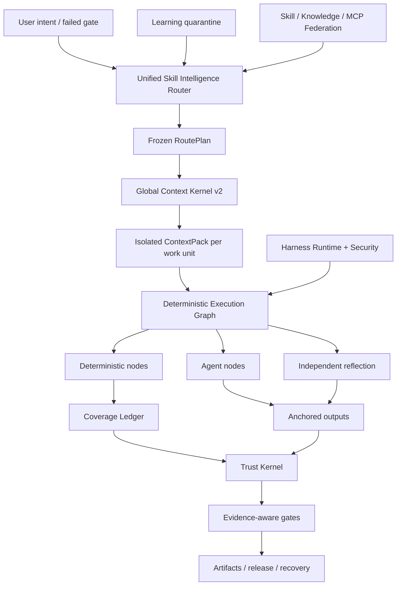

<p align="center">
  
</p>

<p align="center">
  <a href="LICENSE"></a>
  <a href="CHANGELOG.md"></a>
  
  
  
</p>

<p align="center"></p>
<h1 align="center">ForgeOS</h1>
<p align="center">ForgeOS entscheidet <strong>welcher Skill ausgeführt werden darf</strong>, <strong>welcher Kontext eingegeben werden darf</strong>, <strong>welche Schritte sein müssen deterministisch</strong> und <strong>welche Beweise stark genug sind, um die Vervollständigung zu akzeptieren</strong>.</p>

---

## Warum ForgeOS existiert

Ein Agent wird nicht zuverlässig, weil er über mehr Eingabeaufforderungen, mehr Tools oder ein längeres Kontextfenster verfügt.

Verlässlich wird es, wenn das System sechs Fragen beantworten kann:

1. **Welches genaue Ergebnis ist erforderlich?**
2. **Welche Technik ist angemessen – und welche ähnlichen Techniken sind hier falsch?**
3. **Was ist der kleinste Kontext, der für diese Arbeitseinheit benötigt wird?**
4. **Welche Schritte müssen deterministisch sein und nicht an ein Modell delegiert werden?**
5. **Welche unabhängigen Beweise belegen die Ausgabe?**
6. **Kann derselbe Workflow nach einem Fehler wiederhergestellt, fortgesetzt und überprüft werden?**

ForgeOS v0.6 verwandelt diese Fragen in eine Laufzeit:

```text
bestätigte Absicht
  → Ergebnis + Technikabruf
  → harte Richtlinien und Anti-Trigger-Filter
  → Mindest-RoutePlan-DAG
  → isoliertes ContextPack pro Arbeitseinheit
  → deterministisches / Agenten- / Reflexionsausführungsdiagramm
  → verankerte Ausgänge + Deckungsbuch
  → vertrauenswürdige Belege + Beweismittel
  → Freigabe, Rollback, Wiederherstellung und Lernquarantäne
```

Es handelt sich nicht um eine sofortige Sammlung. Es ist die Kontrollebene rund um Fähigkeiten, Regeln, Haken, Agenten, Werkzeuge, Kontext, Beweise und Lernen.

---

## Was ist in v0.6.1 real?

| Oberfläche | Verifizierte Implementierung |
|---|---:|
| Legacy-typisierte Ergebnisgerüste | **1.024** |
| Deep Skill Contract v2-Techniken | **128** |
| L0-Orchestrierungs-/Vertrauens-/Kontexttechniken | **32** |
| L1-domänenübergreifende Engineering-Techniken | **96** |
| Bindungen für unabhängige Gutachter | **128** |
| Stabile Verfahrensanbieter | **33** |
| Kandidaten für Verfahrensanbieter | **242** |
| Integrierte Fähigkeits- und Wissenszuordnungen | **1.299** |
| Code Review Intelligence-Konformitätsfälle | **12** |
| Konfliktfälle auf der Agentenoberfläche | **20/20** |
| Stabile Anbietermaterialisierung | **33/33** |
| Router-Präzision@1 / @3 | **93,75 % / 100 %** |
| Router-Rückruf@6 | **100%** |
| Aktivierung unsicherer Route | **0%** |

> [!IMPORTANT]
> Bei den 1.024 Legacy-Knoten handelt es sich um **Ergebnisgerüste**, nicht um 1.024 prozedurale Fähigkeiten auf Produktionsniveau. v0.6 enthält 128 Deep-Technology-Verträge. Aus Kompatibilitätsgründen bleiben 33 prozedurale Anbieter im deklarierten stabilen Routing-Kanal, aber das abschließende Zertifizierungsaudit stellt fest, dass 0/128 nachweislich stabil und 0 gemäß der Revision 2-Definition of Done zertifiziert sind. Für die verbleibenden Beweise sind Holdout-, gepaarte Multimodell-, Druck-, unabhängige Überprüfungs- und Produktionsbelege erforderlich.

**Kernel-Inventar:** 32 L0-Techniken + 96 L1-Techniken = 128 Deep-Kernel-Techniken.

**Katalog-Routing-Status:** 33 deklarierte Stable-Channel-Verfahrensanbieter und 242 Kandidaten. **Formeller Zertifizierungsnachweis:** 0 Stallqualifizierte, 0 zertifiziert. Siehe [Abschließendes Zertifizierungsaudit](docs/FINAL-CERTIFICATION-AUDIT.md).

Das Release-Audit hält diese Behauptungen absichtlich für falsch:

```text
1.024 verfahrenstechnische Fähigkeiten auf Produktionsniveau falsch
Vollständiger PostgreSQL-Lebenszyklus HA falsch
Universelle MicroVM-Sandbox falsch
Von Experten gelabelter 200-PR-Rezensions-Benchmark falsch
10.000 gepaarte Auswertungen sind falsch
```

ForgeOS v0.6 erhebt keinen Anspruch auf universelle Produktionsvollständigkeit oder 1.024 prozedurale Fähigkeiten auf Produktionsniveau.

Siehe [Claims Boundary v0.6](docs/CLAIMS-BOUNDARY-V0.6.md).

---

## Fünf-Minuten-Pfad

Verwenden Sie diesen Pfad, wenn Sie einen Nutzen erzielen möchten, ohne sich vorher mit dem Trust Kernel vertraut zu machen.

### 1. Installieren

```bash
npm install
npm test
node src/cli/forge.mjs init
```

Installiertes Paket:

```bash
npx forgeos init
forge doctor
```

`forge init` erstellt ein sicheres lokales SQLite-WAL-Profil. Sein API-Schlüssel wird in eine `0600`-Datei geschrieben und nie gedruckt.

### 2. Finden Sie die richtige Technik

```bash
forge skills search "react rerender"
forge skills inspect reducing-react-render-thrashing
forge route --query "compile the minimum context for a large monorepo"
```

### 3. Überprüfen Sie v0.6

```bash
forge v06 status
forge profile plan coding --target codex
forge security scan --file agent-surface.json
```

### 4. Starten Sie die lokale Steuerungsebene

```bash
npm start
# Dashboard: http://127.0.0.1:8787/dashboard
# MCP:       http://127.0.0.1:8787/mcp
# A2A:       http://127.0.0.1:8787/a2a
```

---

## Tiefer Operatorpfad

Verwenden Sie diesen Pfad, wenn Sie ForgeOS in Codex, Claude Code, ChatGPT, einen Open-Source-Agenten, CI oder eine interne Plattform einbetten.

### Skill Intelligence Router

Der Router führt einen zweistufigen Abruf durch, anstatt einen Skill-Namen abzugleichen:

```text
Absicht / fehlgeschlagenes Tor
  → Ergebnisabruf
  → Direkter Technik-Trigger-Abruf
  → Anti-Trigger-Ausschluss
  → Vertrauen, Mieter, Reifegrad, Tool, Lizenz, Aktualitätsfilter
  → Neubewertung des gemessenen Nutzens
  → Minimaltechnik DAG
  → Anbieterauflösung
  → eingefrorener Routenplan
```

Jede ausgewählte und abgelehnte Technik hat einen Grund. Harte Blocker schlagen immer den Punktestand.

### Globaler Kontextkernel v2

ForgeOS budgetiert die vollständige Anfrage:

```text
System · Aufgabe · ausgewählte Fertigkeitsabschnitte · Codesymbole · Artefakte
· Speicher · Tool-Ausgabe · Referenzen · Lazy-Tool-Schemata
· Leistungsreserve · Sicherheitsreserve
```

Es bietet:

- eine von Resolver und Materializer gemeinsam genutzte Token-Accounting-Schnittstelle;
- Laden von Fertigkeiten auf Abschnittsebene;
- isolierter Kontext pro Arbeitseinheit;
- Lazy Tool-Schema-Materialisierung;
- Semantische ABI-Symbol-IDs und Ablehnung veralteter Hashes;
- Artefakt-Delta-Projektion;
- begrenzte, auslaufende Instinktinjektion;
– inhaltsadressierte Rohprotokolle mit destillierten Fehlerbereichen;
- ein Auslassungsmanifest für jede nicht enthaltene Quelle.

### Deterministische Fähigkeitsstruktur

Eine v0.6-Technik wird in ein ausführbares Diagramm kompiliert:

```text
Deterministische Knoten
  Umfangsauswahl · Bündelung · Regelauflösung · Verankerung · Beweise

Agentenknoten
  Untersuchung · Hypothese · Domänenurteil

Reflexionsknoten
  Widerspruch · Falsch-Positiv-Filter · Umsetzbarkeit

Kontrollknoten
  Paralleler Join · Coverage Gate · Wiederholungsversuch · Rollback
```

Das SQLite-Coverage-Ledger verwendet Leases, Heartbeat, Fencing und vertrauenswürdige Belege. Ein zurückgeforderter Arbeiter kann eine Arbeitseinheit nicht als abgeschlossen markieren.

### Vertikaler Code Review Intelligence-Slice

Der erste vollständige vertikale Schnitt beweist die Architektur durchgängig:

```text
kompletter Umfang
→ beziehungsbewusste Arbeitseinheiten
→ kontextbezogene Regelauswahl
→ Analyse isolierter Agenten
→ Linien-/Hash-Anker
→ Umzug nach Bearbeitungen
→ unabhängige Reflexion
→ Deckungsbeleg
```

Das gebündelte 12-Fälle-Korpus ist ein deterministischer Konformitäts-Benchmark. Es wird **nicht** als von Experten gekennzeichneter 200-PR-Benchmark beworben.

### Kontinuierliches Lernen – ohne automatische Selbstvergiftung

Beobachtete Muster werden zu abgegrenzten Instinkten, nicht zu stabilen Fähigkeiten:

```text
vertrauenswürdige Laufbelege
  → beobachteter Instinkt
  → Mieter-/Projekt-/Kabelbaumisolierung + TTL
  → kompatibler Instinktcluster
  → Vorschlag zur Kandidatenentwicklung
  → unabhängige Bewertung
  → menschliche Beförderung oder Rollback
```

Der Produzent kann sein eigenes erlerntes Verhalten nicht fördern.

### Nutzen Sie Runtime v2

ForgeOS unterscheidet vier Oberflächen:

| Oberfläche | Verwenden Sie es für |
|---|---|
| **Regel** | Kurze Invariante, die immer gelten muss |
| **Haken** | Deterministische Aktion, die an ein Ereignis gebunden ist |
| **Fähigkeit** | Bedingtes Verfahren, das ein Urteil erfordert |
| **Agentenrolle** | Separater Kontext, Tools, Modell oder Autorität |

Zu den neutralen Ereignissen gehören `before.tool.execute`, `after.file.write`, `verification.checkpoint`, `session.compact` und `session.ended`. Hostadapter müssen nicht unterstützte Funktionen markieren, anstatt eine falsche Parität zu beanspruchen.

Profile:

```text
minimal · Codierung · kreativ · Forschung · reguliert
lokal-kleines · Unternehmen
```

### Agentenoberflächensicherheit

Die Sicherheits-Engine scannt das Agentensystem selbst:

- Weisungs- und Aufforderungsgrenzenverstöße;
- Hooks und Paketlebenszyklus-Skripte;
- MCP-Beschreibungen, Berechtigungen und Tool-Erreichbarkeit;
- Befehlszulassungslisten;
- Geheim-/Umwelthinweise;
- Berechtigungspfade vom Geheimnis zum Ausgang;
- Pipe-to-Shell- und breite Wildcard-Fähigkeit;
- Profilberechtigungsunterschiede vor der Installation.

Sein kontradiktorisches Korpus besteht derzeit **20/20** Fälle.

### Vermittelte lokale Ausführung

Der lokale Läufer bietet eine echte Sicherheitsgrenze für normale Befehle:

- keine Shell-Interpolation;
- Befehls- und Umgebungszulassungslisten;
- Workspace- und Symlink-Eindämmung;
- Zeitüberschreitung und Beendigung der Prozessgruppe;
- begrenztes stdout/stderr;
- inhaltsadressierter Ausführungsbeleg.

Es handelt sich **nicht** um eine universelle MicroVM-Sandbox, die das Netzwerk verweigert. Für die Ausführung durch Dritte mit hohem Risiko ist weiterhin ein externer Container oder eine MicroVM-Isolationsschicht erforderlich.

---


# Wie ForgeOS funktioniert

ForgeOS vereint zwei Produkte in einer Laufzeit:

1. **Eine Skill-Intelligence-Schicht**, die Techniken abruft, unsichere Beinahe-Matches ablehnt, nur die erforderlichen Skill-Abschnitte zusammenstellt und einen eingefrorenen Ausführungsplan erstellt.
2. **Eine KI-Steuerungsebene**, die Projekte, Artefakte, Beweise, Genehmigungen, Mietverträge, Wiederherstellung, Föderation und Release-Gates verwaltet.

```text
bestätigte Absicht oder fehlgeschlagenes Tor
  → Ergebnis und Abruf durch direkte Technik
  → Anti-Trigger-, Mandanten-, Vertrauens-, Tool-, Lizenz- und Aktualitätsfilter
  → minimal eingefrorener RoutePlan DAG
  → isoliertes ContextPack pro Arbeitseinheit
  → deterministisches / Agenten- / Reflexionsausführungsdiagramm
  → verankerte Ausgänge und eingezäuntes Coverage Ledger
  → Vertrauenswürdige Belege und sicherheitsbewusste Tore
  → Freigabe, Wiederherstellung, Rollback oder Lernquarantäne
```

## Zehn kooperierende Systeme

| System | Was es steuert |
|---|---|
| **Skill Intelligence Router** | Ergebnisabfrage, Technikbewertung, Anti-Trigger, harte Richtlinien, Anbieterauswahl und erklärbare Routenpläne |
| **Globaler Kontextkernel v2** | Ein Gesamt-Token-Budget für Richtlinien, Aufgaben, Fertigkeitsabschnitte, Symbole, Artefakte, Speicher, Werkzeugausgabe, Referenzen und Ausgabereserve |
| **Deterministische Fähigkeitsstruktur** | Hybriddiagramme mit deterministischen Knoten, Agentenknoten, Reflexionsknoten, Genehmigungen, Ankern und Stoppbedingungen |
| **Deckungsbuch** | Eigentum an Arbeitseinheiten, Pachtverträge, Zaunmarken, Fertigstellungsschutz, Ablehnung veralteter Arbeiter und Wiederaufnahmefähigkeit |
| **Vertrauenskern** | Beweisaktualität, Artefaktherkunft, Genehmigungsbehörde, Sicherheitsstufen und Freigabeentscheidungen |
| **Agent Surface Security** | Prompt-Injection-Muster, gefährliche Paketskripte, Secret-to-Egress-Pfade, Berechtigungen und Ehrlichkeit der Adapterfähigkeit |
| **Vermittlung lokaler Ausführung** | Shell-freies Befehls-Spawnen, Zulassungslisten, Zeitüberschreitungen, Ausgabelimits und strukturierte Belege |
| **Kontinuierliches Lernen** | Eingeschränkte Instinkte, Ablauf, Vertrauen, Quarantäne, Kandidatenvorschläge und kontrollierte Beförderung |
| **Fähigkeitsföderation** | Signierte Quellen, Vertrauensstufen, Quarantäne, Konfliktbehandlung, Widerruf und synchronisierte Kataloge |
| **Harness Runtime v2** | Regeln, Hooks, Fähigkeiten, Agentenrollen, Berechtigungsunterschiede und Profile für verschiedene KI-Harze |

---

# Ökosystemvergleich

> [!IMPORTANT]
> Dieser Vergleich beschreibt den **nativen, erstklassigen Fokus jedes Kern-Repositorys**. `◐` bedeutet teilweisen Support, erweiterungsbasierten Support oder Support durch ein angrenzendes Produkt. `—` bedeutet, dass es nicht der Hauptschwerpunkt des Projekts ist und nicht, dass es unmöglich ist, es zu erstellen.

Die unten aufgeführten GitHub-Sterne sind ungefähre Zahlen, die am **26. Juli 2026** überprüft wurden. Sie deuten auf die Sichtbarkeit in der Gemeinschaft hin, nicht auf technische Qualität allein.

## Ökosystemkarte

| Projekt | Ca. GitHub-Sterne | Hauptrolle |
|---|---:|---|
| [Superkräfte](https://github.com/obra/superpowers) | **255k** | Framework für Agentenfähigkeiten und Softwareentwicklungsmethodik |
| [Anthropische Agentenfähigkeiten](https://github.com/anthropics/skills) | **151k** | Fertigkeitsstandard und öffentliche Fertigkeitsbibliothek für Claude |
| [LangChain](https://github.com/langchain-ai/langchain) | **139k** | Agent-Engineering-Plattform und großes Integrationsökosystem |
| [OpenHands](https://github.com/All-Hands-AI/OpenHands) | **75k+** | End-to-End-Software-Entwicklungsagentenanwendung |
| [CrewAI](https://github.com/crewAIInc/crewAI) | **56k+** | Multi-Agenten-Crews und ereignisgesteuerte Abläufe |
| [AutoGen](https://github.com/microsoft/autogen) | **50k+** | Multi-Agent-Messaging- und Forschungslaufzeit |
| [LangGraph](https://github.com/langchain-ai/langgraph) | **37k+** | Zustandsbehaftete Agentendiagramme mit langer Laufzeit |
| [Semantischer Kernel](https://github.com/microsoft/semantic-kernel) | **28k+** | Mehrsprachiges Enterprise-Orchestrierungs-SDK |
| [Fantastische Agentenfähigkeiten](https://github.com/VoltAgent/awesome-agent-skills) | **28k+** | Community-Katalog mit mehr als tausend Fähigkeiten |
| [OpenAI Agents SDK](https://github.com/openai/openai-agents-python) | **27k+** | Agenten, Übergaben, Leitplanken, Sitzungen und Ablaufverfolgung |
| [Smolagents](https://github.com/huggingface/smolagents) | **27k+** | Minimale Agentenbibliothek mit Schwerpunkt auf Code-Agenten |
| [Letta](https://github.com/letta-ai/letta) | **23k+** | Zustandsbehaftete Agenten und persistenter Speicher |
| [Google ADK](https://github.com/google/adk-python) | **ca. 20.000** | Erstellung, Evaluierung und Bereitstellung von Code-First-Agenten |
| [PydanticAI](https://github.com/pydantic/pydantic-ai) | **ca. 19.000** | Typsicheres Python-Agent-Framework |

## Kernfähigkeitsmatrix

| System | Gebündelte Fähigkeiten | Routing + Anti-Trigger | Geregelter Kontext | Deterministischer/Agenten-Hybridgraph | Beweise + Vertrauensbescheinigungen | Sicherheit der Agentenoberfläche | Native Stärke |
|---|:---:|:---:|:---:|:---:|:---:|:---:|---|
| **ForgeOS** | ✅ | ✅ | ✅ | ✅ | ✅ | ✅ | Kompetenzintelligenz und vertrauenswürdige Ausführung |
| Anthropische Fähigkeiten | ✅ | ◐ | ◐ | — | — | ◐ | Einfacher, tragbarer Fertigkeitsstandard |
| Superkräfte | ✅ | ✅ | ◐ | ◐ | ◐ | — | Hochexplizite SDLC-Methodik für Codierungsagenten |
| Tolle Agentenfähigkeiten | ✅ | — | — | — | — | ◐ | Fähigkeitsentdeckung aus vielen Quellen |
| LangChain | ◐ | ◐ | ◐ | ◐ | ◐ | ◐ | Sehr großes Integrationsökosystem |
| LangGraph | ◐ | ◐ | ◐ | ✅ | ◐ | ◐ | Dauerhafte Ausführung und zustandsbehaftete Diagramme |
| OpenAI Agents SDK | ◐ | ◐ | ◐ | ◐ | ◐ | ◐ | Leichtes Framework, Übergaben und Ablaufverfolgung |
| CrewAI | ◐ | ◐ | ◐ | ✅ | ◐ | ◐ | Rollenbasierte Agenten kombiniert mit Flows |
| AutoGen | ◐ | ◐ | ◐ | ✅ | ◐ | ◐ | Ereignisgesteuerte Multi-Agent-Laufzeit |
| Semantischer Kernel / MAF | ◐ | ◐ | ◐ | ✅ | ◐ | ◐ | Unternehmensorchestrierung über Laufzeiten hinweg |
| Google ADK | ◐ | ◐ | ◐ | ✅ | ◐ | ◐ | Erstellen, bewerten und bereitstellen Sie im Google-Ökosystem |
| PydanticAI | ◐ | ◐ | ◐ | ◐ | ◐ | ◐ | Typensicherheit, Validierung und Python-Ergonomie |
| Smolagenzien | ◐ | ◐ | ◐ | ◐ | — | ◐ | Minimale, lesbare Agentenimplementierung |
| Letta | ◐ | ◐ | ✅ | ◐ | ◐ | ◐ | Persistenter Speicher und zustandsbehaftete Agenten |
| OpenHands | ◐ | ◐ | ◐ | ◐ | ◐ | ✅ | End-to-End-Coding-Agent-Erlebnis |

## ForgeOS wählt ein anderes Schlachtfeld

Ein Skill-Repository antwortet: **„Welche Verfahren kann der Agent erlernen?“**

ForgeOS fragt außerdem: ** „Welche Technik ist jetzt erlaubt, welche Beinahe-Übereinstimmung muss abgelehnt werden, welche Abschnitte dürfen in den Kontext eintreten, welche Werkzeuge sind erforderlich, welche Beweise müssen erbracht werden und welches Tor darf die Arbeit für abgeschlossen erklären?“**

Ein Agenten-Framework hilft bei der Erstellung von Agenten, Tools, Übergaben und Workflows. ForgeOS konzentriert sich auf die Ebene rund um diese Laufzeit: Fähigkeitsabruf, Anti-Trigger, globale Kontextbudgets, deterministische/Agenten-/Reflexionsdiagramme, aktuelle Beweise, Genehmigungsbehörde, Artefaktherkunft, Wiederherstellung und Lernquarantäne.

Ein Gedächtnissystem konzentriert sich auf das, woran sich ein Agent erinnert. ForgeOS steuert außerdem, zu welchem ​​Mandanten, Projekt, Benutzer, welcher Vertrauensdomäne, welchem ​​Ablauf, welcher Konfidenz und welcher Hochstufungsrichtlinie der Speicher gehört.

Ein End-to-End-Coding-Agent sorgt für die Benutzererfahrung. ForgeOS kann **unter oder neben** diesem Agenten als Kompetenzauswahl-, Kontext-Governance-, Beweis-, Vertrauens- und Projektlebenszyklusebene ausgeführt werden.

## Wohin reife Ökosysteme noch führen

Sie verfügen derzeit über größere Communities, mehr Tutorials und Integrationen, ausgefeiltere Managed-Cloud-Erlebnisse, stärkeres No-Code-Onboarding und mehr öffentlich dokumentierte Produktionsbereitstellungen. ForgeOS konzentriert sich bewusst auf ein weniger standardisiertes Problem: **Kontrolle der Fähigkeitsauswahl, des Kontexts, der Beweise, der Autorität und des Abschlussstatus für KI-Agenten**.

---

# Drei Einstiegspfade

## Für alltägliche Benutzer

Sie müssen nicht jedes Subsystem verstehen. Beginnen Sie mit vier beobachtbaren Tests:

```bash
node src/cli/forge.mjs doctor
node src/cli/forge.mjs skills search --query "review authentication changes"
node src/cli/forge.mjs route --query "review authentication changes without missing tests"
node src/cli/forge.mjs scan agent-surface --path .
```

Sie können prüfen, welche Technik ausgewählt wurde, warum Alternativen abgelehnt wurden, wie viel Kontext zusammengestellt wurde, welche Berechtigungen angefordert werden und welche Beweise noch fehlen.

## Für Entwickler

ForgeOS stellt dieselbe Laufzeit bereit durch:

- CLI für lokale Bedienung und CI;
- HTTP-APIs und Studio-Dashboard;
- **60 schemastrikte MCP-Tools**;
- A2A-Aufgaben- und Agentenkartenoberflächen;
- direkte Dienstimporte aus dem Node.js-Quellbaum;
- **15 Adapter** für Agenten- und IDE-Ökosysteme;
- sieben Harness-Profile: `minimal`, `coding`, `creative`, `research`, `regulated`, `local-small` und `enterprise`.

Entwickler können Projekte erstellen, Artefakte registrieren, Beweise binden, Genehmigungen anfordern, RoutePlans und ContextPacks kompilieren, Diagramme ausführen, Revisionen wiederherstellen, föderierte Fertigkeiten synchronisieren oder einen neuen Fertigkeitsvertrag v2 hinzufügen.

## Für Experten und Forscher

ForgeOS ist so konzipiert, dass es von einer Marketingseite herausgefordert und nicht akzeptiert wird. Experten können unabhängig testen:

- Router-Präzision, Rückruf, Anti-Trigger-Verhalten und unsichere Aktivierung;
- Gesamtkontextüberlauf und Reduzierung des semantischen ABI;
- deterministische Abdeckung, Anker, Reflexion, Mietverträge und Zäune;
- Beweisaktualität, Artefaktherkunft und sicherungsbewusste Tore;
- Prompt-Injection, Paketskripte, Secret-to-Egress-Pfade und Adapter-Ehrlichkeit;
- Föderationskonflikt, Quarantäne, Widerruf und Quellenvertrauen;
- Archivüberprüfung ohne `.git`.

```bash
npm run validate
npm run v06:audit
npm run router:benchmark
npm run context:benchmark
npm run federation:eval
npm run federation:audit
npm run smoke
npm run adapter:tck
npm run release:verify
```

---

# Repository-Karte

```text
src/ Laufzeitimplementierung
  cli/forge-Befehlszeilenschnittstelle
  Kern/Projekt, Artefakt, Beweis, Genehmigung, Wiederherstellung
  Skill-Intelligence/Verträge, Routing, Bewertung, Materialisierung
  Kontext/Globaler Kontextkernel und Arbeitseinheitenkompilierung
  Ausführung/Graph-Compiler, deterministische Knoten, Abdeckung
  Vertrauen/Beweis, Gewissheit, Autorität, Freigabetore
  Sicherheit/Agentenoberflächenscan und Befehlsbroker
  Föderation/Remotequellen, Vertrauen, Quarantäne, Synchronisierung
  Lernen/Instinkte, Kandidaten, Ablauf, Beförderung
  mcp/MCP-Server und 60 öffentliche Tools
  a2a/A2A-Karten, Aufgaben, Nachrichten und Quittungen
  Server/HTTP-APIs, Authentifizierung, Dashboard
  Speicher/SQLite-WAL-Persistenz und Migrationen
Adapter/ 15 Agent- und IDE-Adapter
skills-v2/ 128 tiefgreifende Skill Contract v2-Techniken
Fähigkeiten-v2/ Ergebnisse, Techniken, Anbieter, Beziehungen, Diagramm
Schemas/öffentliche JSON Schema 2020-12-Verträge
Packs/Vertical-Capability-Packs und Benchmarks
Evaluierungen/Evaluierungsfälle, Rubriken und Korpora
Tests/ 125 Testdateien und Release-Invarianten
Beweise/generierte Audit-, Benchmark-, SBOM- und Dashboard-Nachweise
Dokumente/Architektur, Protokolle, Sicherheit, Tests, Produktion
Skripte/Generierungs-, Validierungs-, Audit-, Benchmark- und Release-Tools
```

# Geeignete Anwendungsfälle

- Codierungsagenten disziplinierter und überprüfbarer machen.
- Aufbau einer Steuerungsebene für mehrere Modelle, Agenten und Tools.
- Betrieb einer internen Skill-Plattform mit Routing- und Reifegradkontrollen.
- Überprüfen von Agentenkonfigurationen, Berechtigungen, Eingabeaufforderungen und Lieferkettenoberflächen.
- Hochsichere oder regulierte Arbeitsabläufe, die Nachweise und Genehmigungstore erfordern.
- Reduzierung der Kontextverschwendung in großen Repositories durch Work-Unit-Isolierung und semantische ABI.

ForgeOS ist kein Ersatz für die Business-Workflow-Automatisierung im N8N-Stil. n8n verbindet Anwendungen und Geschäftsveranstaltungen; ForgeOS kontrolliert die Auswahl, den Kontext, die Ausführung, die Beweise und die Autorität der KI-Technik. Sie können zusammen verwendet werden.

---

## Architektur



---

## MCP- und Agentenintegration

ForgeOS spricht MCP `2025-11-25`, A2A `1.0`, Agent Skills-kompatible Pakete, HTTP und CLI.

Zu den öffentlichen Tools der Version 0.6 gehören:

```text
forge_v06_status
forge_execution_graph_compile
forge_review_scope_compile
forge_context_work_units_compile
forge_harness_profile_plan
forge_agent_surface_scan
```

Sie verbinden sich mit den bestehenden Projekt-, Artefakt-, Trusted Evidence-, Recovery-, Federation-, Skill Intelligence- und MCP-Broker-Tools. Stdio, HTTP MCP, CLI und Studio nutzen dieselben Dienste und JSON-Schemas.

Zu den unterstützten Adapterpaketen gehören ChatGPT, Codex, Claude Code, Cursor, OpenCode, Gemini CLI, Copilot CLI, Cline, Roo Code, Windsurf, Continue, NolaneNative, OpenClaw, Pi und generisches MCP/A2A. Beweise unterscheiden **protokollgetestete** Adapter von **nur Dokumentationshandbüchern**.

---

## Verifizierung

```bash
npm run validate
npm run skills:v2:audit
npm run v06:audit
npm run router:benchmark
npm run context:benchmark
npm run federation:eval
npm run federation:audit
npm run smoke
npm run adapter:tck
npm run release:verify
```

Das Release Gate prüft Verhalten und Verträge, nicht nur die Leitungsabdeckung:

- Zustands-, Zaun-, Standsicherheits- und Lebenszyklusinvarianten;
- vollständiger MCP/A2A-Lebenszyklus und Ausgabeschemata;
- Fertigkeitstiefe, Boilerplate, Abschnitts-Hash und Materialisierung;
- Router-Präzision, Rückruf, Determinismus und unsichere Aktivierung;
- globale Kontextüberlauf- und Auslassungsbilanzierung;
- deterministisches Ausführungs- und Deckungsbuch;
- Anker und Reflexion überprüfen;
- unabhängige Bewertung und kontinuierliche Lernquarantäne;
- kontradiktorische Fälle auf der Agentenoberfläche;
- Archivinstallation und Selbstverifizierung ohne `.git`.

---

## Produktionsgrenze

**Heute integriert**

- SQLite WAL Single-Node-Lebenszyklus-Backend;
- Revision/CAS, Leases, Fencing, Snapshots, Wiederherstellung, ACL, OIDC/API-Schlüssel;
- vertrauenswürdige Belege, Artefakt-Umschlag-Hashes, sicherheitsbewusste Gates;
- mandantenbezogener Kompetenz-/Wissens-/MCP-Verbund;
- Graceful Drain, Bereitschaft, Metriken, signierte Release-Herkunft;
- Nicht-Root-/schreibgeschützte Bereitstellungsprofile.

**Noch kein Anspruch auf Version 0.6**

- PostgreSQL-Drop-in-Backend über den gesamten Lebenszyklus und getestetes Multi-Node-Failover;
- universelle MicroVM-Sandbox eines Drittanbieters;
- Verwaltung von SCIM/delegierten Organisationen;
- verwalteter Transparenzdienst und PKI;
- A2A-Streaming/Push und verteilter Lebenslauf;
- 1.024 Verfahrensfertigkeiten auf Produktionsniveau;
- 10.000 gepaarte Evaluierungsläufe;
- Von Experten beurteilter, sprachübergreifender Code-Review-Benchmark.

Lesen Sie [Produktion](docs/PRODUCTION.md), [Sicherheitsmodell](docs/SECURITY-MODEL.md) und [Selbstprüfung v0.6](docs/SELF-AUDIT-V0.6.md).

---

## Dokumentationskarte

| Beginnen Sie hier | Tiefer Tauchgang |
|---|---|
| [Schnellstart](docs/QUICKSTART.md) | [Architektur](docs/ARCHITECTURE.md) |
| [Skill Intelligence](docs/SKILL-INTELLIGENCE.md) | [Deterministic Fabric v0.6](docs/DETERMINISTIC-SKILL-FABRIC-V06.md) |
| [CLI und Profile](docs/HARNESS-RUNTIME-V2.md) | [Globaler Kontextkernel](docs/GLOBAL-CONTEXT-KERNEL.md) |
| [Sicherheit](docs/AGENT-SURFACE-SECURITY.md) | [Kontinuierliches Lernen](docs/CONTINUOUS-LEARNING-V06.md) |
| [Testen](docs/TESTING.md) | [Anspruchsgrenze](docs/CLAIMS-BOUNDARY-V0.6.md) |
| [Beitrag](CONTRIBUTING.md) | [Selbstprüfung](docs/SELF-AUDIT-V0.6.md) |

---

## Sprachen

[Universal Lanes](docs/UNIVERSAL-LANES.md) · [Remote MicroVM Sandbox](docs/REMOTE-MICROVM-SANDBOX.md) · [Tiếng Việt](README-vn.md) · [简体中文](README-cn.md) · [繁體中文](README-tw.md) · [日本語](README-ja.md) · [한국어](README-ko.md) · [Español](README-es.md) · [Français](README-fr.md) · [Deutsch](README-de.md) · [Português](README-pt-br.md) · [Русский](README-ru.md) · [العربية](README-ar.md) · [हिन्दी](README-hi.md) · [Bahasa Indonesia](README-id.md) · [ไทย](README-th.md) · [Türkçe](README-tr.md) · [Italiano](README-it.md) · [Polski](README-pl.md) · [Українська](README-uk.md) · [Nederlands](README-nl.md) · [فارسی](README-fa.md) · [עברית](README-he.md) · [Svenska](README-sv.md)

---

## Mitwirken

Eine neue Fähigkeit wird nicht akzeptiert, weil ihre Prosa fachmännisch klingt. Es braucht:

1. eine RED-Grundlinie, die ohne die Technik fehlschlägt;
2. präzise Trigger und Anti-Trigger;
3. ein domänenspezifisches Vorgehens- und Fehlermodell;
4. typisierte Eingaben, Ausgaben, Werkzeuge und Beweise;
5. Abschnitt Hashes und Token-Budgets;
6. Bindungen für unabhängige Bewerter;
7. Benchmark-Beweise und eine Reifeentscheidung.

Siehe [CONTRIBUTING.md](CONTRIBUTING.md), [GOVERNANCE.md](GOVERNANCE.md) und [SECURITY.md](SECURITY.md).

## Lizenz

MIT – siehe [LIZENZ](LICENSE).


## Endgültige Release-Audits

- [Abschließender Härtungsbericht](docs/FINAL-HARDENING-REPORT.md)
- [Abschlussaudit zur Fertigkeitszertifizierung](docs/FINAL-CERTIFICATION-AUDIT.md)
