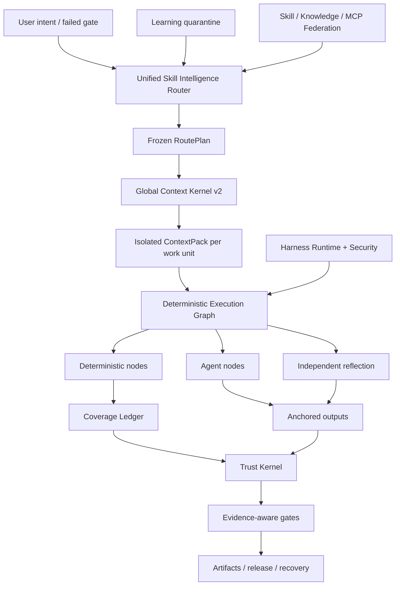

<p align="center">
  
</p>

<p align="center">
  <a href="LICENSE"></a>
  <a href="CHANGELOG.md"></a>
  
  
  
</p>

<p align="center"></p>
<h1 align="center">ForgeOS</h1>
<p align="center">ForgeOS تصمیم می‌گیرد <strong>چه مهارتی ممکن است اجرا شود قاطع باشید</strong> و <strong> که شواهد به اندازه کافی قوی هستند که تکمیل را بپذیرید</strong>.</p>

---

## چرا ForgeOS وجود دارد

یک عامل قابل اعتماد نمی شود زیرا دارای درخواست های بیشتر، ابزارهای بیشتر یا پنجره زمینه طولانی تری است.

زمانی قابل اعتماد می شود که سیستم بتواند به شش سوال پاسخ دهد:

1. **نتیجه دقیق مورد نیاز است؟**
2. **کدام تکنیک مناسب است—و کدام تکنیک های مشابه در اینجا اشتباه هستند؟**
3. **کوچکترین زمینه مورد نیاز برای این واحد کاری چیست؟**
4. **کدام مراحل باید قطعی باشد تا اینکه به یک مدل واگذار شود؟**
5. **چه شواهد مستقلی خروجی را ثابت می کند؟**
6. **آیا همان گردش کار می تواند پس از شکست خود را بازیابی، از سرگیری و ممیزی کند؟**

ForgeOS نسخه 6 این سوالات را به زمان اجرا تبدیل می کند:

```text
قصد تایید شده
  → نتیجه + بازیابی تکنیک
  → سیاست سخت و فیلترهای ضد ماشه
  → حداقل RoutePlan DAG
  ← ContextPack ایزوله در هر واحد کاری
  → نمودار اجرای قطعی / عامل / بازتاب
  → خروجی های لنگر + دفتر پوشش
  → رسیدهای قابل اعتماد + دروازه های شواهد
  ← آزادی، بازگشت، بهبودی و قرنطینه یادگیری
```

این یک مجموعه سریع نیست. این صفحه کنترل حول مهارت ها، قوانین، قلاب ها، عوامل، ابزارها، زمینه، شواهد و یادگیری است.

---

## آنچه در نسخه 0.6.1 واقعی است

| سطح | اجرای تایید شده |
|---|---:|
| داربست های نتیجه تایپ میراثی | **1024** |
| تکنیک های Deep Skill Contract v2 | **128** |
| تکنیک های ارکستراسیون/اعتماد/زمینه L0 | **32** |
| تکنیک های مهندسی متقابل دامنه L1 | **96** |
| الزامات ارزیاب مستقل | **128** |
| ارائه دهندگان رویه ای پایدار | **33** |
| ارائه دهندگان رویه کاندید | **242** |
| مهارت داخلی + نگاشت دانش | **1299** |
| بررسی کد موارد انطباق اطلاعاتی | **12** |
| موارد خصمانه عامل سطحی | **20/20** |
| تحقق ارائه دهنده پایدار | **33/33** |
| روتر Precision@1 / @3 | **93.75% / 100%** |
| روتر Recall@6 | **100%** |
| فعال سازی مسیر ناامن | **0%** |

> [!مهم]
> 1024 گره میراث **داربست های نتیجه** هستند، نه 1024 مهارت رویه ای درجه تولید. v0.6 شامل 128 قرارداد تکنیک عمیق است. سی و سه ارائه‌دهنده رویه‌ای در کانال مسیریابی ثابت اعلام‌شده برای سازگاری باقی می‌مانند، اما ممیزی گواهی نهایی 0/128 را ثابت می‌کند و 0 را طبق تعریف ویرایش 2 تأیید می‌کند. شواهد باقی‌مانده نیاز به نگه‌داری، چند مدل جفتی، فشار، بررسی مستقل و رسید تولید دارد.

** موجودی هسته: ** 32 تکنیک L0 + 96 تکنیک L1 = 128 تکنیک هسته عمیق.

** مسیریابی کاتالوگ بیان می کند: ** 33 ارائه دهنده رویه کانال پایدار و 242 نامزد اعلام شده است. **شواهد گواهی رسمی:** 0 دارای صلاحیت پایدار، 0 تایید شده. به [حسابرسی گواهی نهایی](docs/FINAL-CERTIFICATION-AUDIT.md) مراجعه کنید.

ممیزی انتشار عمداً این ادعاها را نادرست نگه می دارد:

```text
1024 مهارت رویه ای درجه تولید نادرست است
کامل چرخه عمر PostgreSQL HA نادرست است
یونیورسال ماسهبازی microVM false
معیار بررسی 200-PR با برچسب کارشناسی نادرست است
10000 ارزیابی زوجی نادرست است
```

ForgeOS نسخه 6 ادعای کامل بودن تولید جهانی یا 1024 مهارت رویه ای درجه تولید ندارد.

به [Claims Boundary v0.6](docs/CLAIMS-BOUNDARY-V0.6.md) مراجعه کنید.

---

## مسیر پنج دقیقه ای

از این مسیر زمانی استفاده کنید که بدون یادگیری Trust Kernel ابتدا مقداری را می خواهید.

### 1. نصب کنید

```bash
npm install
npm test
node src/cli/forge.mjs init
```

بسته نصب شده:

```bash
npx forgeos init
forge doctor
```

`forge init` یک نمایه محلی امن SQLite-WAL ایجاد می کند. کلید API آن در یک فایل `0600` نوشته شده است و هرگز چاپ نمی شود.

### 2. تکنیک مناسب را پیدا کنید

```bash
forge skills search "react rerender"
forge skills inspect reducing-react-render-thrashing
forge route --query "compile the minimum context for a large monorepo"
```

### 3. Inspect v0.6

```bash
forge v06 status
forge profile plan coding --target codex
forge security scan --file agent-surface.json
```

### 4. صفحه کنترل محلی را راه اندازی کنید

```bash
npm start
# Dashboard: http://127.0.0.1:8787/dashboard
# MCP:       http://127.0.0.1:8787/mcp
# A2A:       http://127.0.0.1:8787/a2a
```

---

## مسیر عملگر عمیق

از این مسیر هنگام جاسازی ForgeOS در Codex، Claude Code، ChatGPT، یک عامل منبع باز، CI یا یک پلت فرم داخلی استفاده کنید.

### روتر هوش مهارتی

روتر به جای تطبیق نام مهارت، بازیابی دو مرحله ای را انجام می دهد:

```text
هدف / دروازه شکست خورده
  → بازیابی نتیجه
  → بازیابی مستقیم تکنیک-ماشه
  → حذف ضد ماشه
  → اعتماد، مستاجر، بلوغ، ابزار، مجوز، فیلترهای تازگی
  ← رتبه بندی مجدد ابزار اندازه گیری شده
  → حداقل تکنیک DAG
  → وضوح ارائه دهنده
  → RoutePlan منجمد
```

هر تکنیک انتخاب شده و رد شده دلیلی دارد. مسدود کننده های سخت همیشه امتیاز را شکست می دهند.

### Global Context Kernel v2

ForgeOS درخواست کامل را بودجه بندی می کند:

```text
سیستم · کار · بخش های مهارت انتخاب شده · نمادهای کد · مصنوعات
· حافظه · خروجی ابزار · منابع · طرحواره ابزار تنبل
· ذخیره خروجی · ذخیره ایمنی
```

فراهم می کند:

- یک رابط حسابداری رمزی به اشتراک گذاشته شده توسط حل کننده و متریال ساز.
- بارگذاری مهارت در سطح بخش.
- زمینه ایزوله در هر واحد کاری؛
- تحقق طرح و ابزار تنبل؛
- شناسه نمادهای ABI معنایی و رد هش بیات.
- طرح دلتای مصنوع.
- تزریق غریزی در محدوده، منقضی شده؛
- سیاهههای مربوط به محتوا با محدوده شکست مقطر.
- مانیفست حذف برای هر منبعی که گنجانده نشده است.

### پارچه مهارت قطعی

یک تکنیک v0.6 در یک نمودار اجرایی کامپایل شده است:

```text
گره های قطعی
  گستره-انتخاب · بسته بندی

گره های عامل
  تحقیق · فرضیه · قضاوت حوزه

گره های بازتابی
  تناقض · فیلتر مثبت کاذب · قابلیت عمل

گره های کنترل
  پیوستن موازی · گیت پوشش · تلاش مجدد · برگشت
```

دفتر کل پوشش SQLite از اجاره نامه، ضربان قلب، شمشیربازی و رسیدهای مورد اعتماد استفاده می کند. یک کارگر بازیابی شده نمی تواند یک واحد کاری را کامل نشان دهد.

### کد بررسی هوش برش عمودی

اولین برش عمودی کامل معماری را از انتها به انتها ثابت می کند:

```text
دامنه کامل
← واحدهای کاری آگاه از رابطه
→ انتخاب قاعده متنی
→ تجزیه و تحلیل عامل ایزوله
→ لنگرهای خط/هش
→ جابجایی پس از ویرایش
← بازتاب مستقل
← رسید پوشش
```

مجموعه 12 موردی یک معیار انطباق قطعی است. به عنوان یک معیار 200-PR با برچسب متخصص، **نه ** تبلیغ می شود.

### یادگیری مستمر – بدون خود مسموم سازی خودکار

الگوهای مشاهده شده به غرایز دامنه دار تبدیل می شوند، نه مهارت های پایدار:

```text
رسید اجرا قابل اعتماد
  ← غریزه مشاهده شده
  → جداسازی مستاجر/پروژه/ مهار + TTL
  ← خوشه غریزی سازگار
  → پیشنهاد تکامل نامزد
  ← ارزیابی مستقل
  ← ارتقا یا عقب نشینی انسان
```

تولیدکننده نمی تواند رفتار آموخته شده خود را ترویج کند.

### Harness Runtime v2

ForgeOS چهار سطح را متمایز می کند:

| سطح | استفاده از آن برای |
|---|---|
| **قاعده** | ثابت کوتاه که همیشه باید اعمال شود |
| **قلاب** | اقدام قطعی وابسته به یک رویداد |
| **مهارت** | رویه مشروط مستلزم قضاوت |
| **نقش مامور** | زمینه، ابزار، مدل، یا اختیار جداگانه |

رویدادهای خنثی عبارتند از `before.tool.execute`، `after.file.write`، `verification.checkpoint`، `session.compact`، و `session.ended`. آداپتورهای میزبان باید به جای ادعای برابری کاذب، ویژگی‌های پشتیبانی‌نشده را علامت‌گذاری کنند.

پروفایل ها:

```text
حداقل · کدنویسی · خلاقانه · تحقیق · تنظیم شده
محلی-کوچک · سازمانی
```

### Agent Surface Security

موتور امنیتی خود سیستم عامل را اسکن می کند:

- دستورالعمل و نقض سریع مرزها؛
- قلاب ها و اسکریپت های چرخه عمر بسته.
- توضیحات MCP، مجوزها و قابلیت دسترسی به ابزار؛
- لیست های مجاز دستور.
- منابع مخفی/محیطی؛
- مسیرهای مجوز مخفی خروج؛
- قابلیت لوله به پوسته و عام
- مجوز پروفایل قبل از نصب متفاوت است.

مجموعه خصمانه آن در حال حاضر **20/20** موارد را پشت سر می گذارد.

### اجرای محلی با واسطه

دونده محلی یک مرز ایمنی واقعی برای دستورات عادی فراهم می کند:

- بدون درون یابی پوسته؛
- لیست های مجاز فرمان و محیط؛
- فضای کاری و محتوی پیوند نمادین؛
- مهلت زمانی و خاتمه گروه فرآیند.
- stdout/stderr محدود شده؛
- رسید اجرای خطاب به محتوا.

**نه** یک جعبه ماسه ای میکرو وی ام که شبکه جهانی را انکار می کند. اجرای شخص ثالث پرخطر همچنان به یک ظرف خارجی یا لایه جداسازی microVM نیاز دارد.

---


# چگونه ForgeOS کار می کند

ForgeOS دو محصول را در یک زمان اجرا ترکیب می کند:

1. **یک لایه هوش مهارت** که تکنیک ها را بازیابی می کند، مسابقات نزدیک ناامن را رد می کند، فقط بخش های مهارت مورد نیاز را جمع آوری می کند و یک طرح اجرای ثابت می سازد.
2. **یک هواپیمای کنترل هوش مصنوعی** که پروژه ها، مصنوعات، شواهد، تاییدیه ها، اجاره ها، بازیابی، فدراسیون و دروازه های انتشار را مدیریت می کند.

```text
هدف تایید شده یا گیت ناموفق
  → نتیجه و بازیابی مستقیم تکنیک
  ← فیلترهای ضد ماشه، مستاجر، اعتماد، ابزار، مجوز و تازگی
  → حداقل منجمد RoutePlan DAG
  ← ContextPack ایزوله در هر واحد کاری
  ← نمودار اجرای قطعی / عامل / بازتاب
  ← خروجی های لنگر انداخته و دفتر کل پوشش محصور شده
  ← رسیدهای مورد اعتماد و گیت های آگاه از اطمینان
  ← رهاسازی، بهبودی، بازگشت، یا قرنطینه یادگیری
```

## ده سیستم همکار

| سیستم | آنچه را کنترل می کند |
|---|---|
| **روتر هوش مهارت** | بازیابی نتیجه، امتیازدهی تکنیک، ضد محرک ها، خط مشی سخت، انتخاب ارائه دهنده، و RoutePlans قابل توضیح |
| **Global Context Kernel v2** | یک بودجه توکن کل در خط مشی، وظیفه، بخش مهارت، نمادها، مصنوعات، حافظه، خروجی ابزار، مراجع، و ذخیره خروجی |
| **پارچه مهارت قطعی** | نمودارهای ترکیبی حاوی گره های قطعی، گره های عامل، گره های بازتابی، تاییدیه ها، لنگرها و شرایط توقف |
| **دفتر کل پوشش** | مالکیت واحد کاری، اجاره نامه، ژتون های حصارکشی، پوشش تکمیل، رد کارگر قدیمی، و قابلیت از سرگیری مجدد |
| **Trust Kernel** | تازگی شواهد، اصل و نسب مصنوعات، مجوز تایید، سطوح تضمین، و تصمیمات انتشار |
| **Agent Surface Security** | الگوهای تزریق سریع، اسکریپت های بسته خطرناک، مسیرهای مخفی به خروج، مجوزها، و صداقت قابلیت آداپتور |
| **اعدام محلی با واسطه** | تخم ریزی دستور بدون پوسته، لیست های مجاز، مهلت زمانی، محدودیت های خروجی، و رسیدهای ساخت یافته |
| **یادگیری مستمر** | غرایز محدود، انقضا، اعتماد به نفس، قرنطینه، پیشنهادات نامزد، و ارتقای کنترل شده |
| **فدراسیون مهارت** | منابع امضا شده، سطوح اعتماد، قرنطینه، رسیدگی به درگیری، لغو، و کاتالوگ های همگام |
| **Harness Runtime v2** | قوانین، قلاب‌ها، مهارت‌ها، نقش‌های عامل، تفاوت‌های مجوز، و نمایه‌ها برای مهارهای مختلف هوش مصنوعی |

---

# مقایسه اکوسیستم

> [!مهم]
> این مقایسه، **تمرکز اصلی و درجه یک هر مخزن اصلی** را توصیف می کند. `◐` به معنای پشتیبانی جزئی، پشتیبانی مبتنی بر افزونه یا پشتیبانی از طریق یک محصول مجاور است. `—` به این معنی است که تمرکز اصلی پروژه نیست، نه اینکه ساختن آن غیرممکن است.

ستاره‌های GitHub در زیر ارقام تقریبی هستند که در **26 ژوئیه 2026** بررسی شده‌اند. آنها نمایانگر جامعه هستند، نه کیفیت مهندسی به خودی خود.

## نقشه اکوسیستم

| پروژه | تقریبا ستاره های GitHub | نقش اصلی |
|---|---:|---|
| [Superpowers](https://github.com/obra/superpowers) | **255k** | چارچوب مهارت عامل و روش شناسی توسعه نرم افزار |
| [مهارت های عامل آنتروپیک](https://github.com/anthropics/skills) | **151k** | استاندارد مهارت و کتابخانه مهارت عمومی برای کلود |
| [LangChain](https://github.com/langchain-ai/langchain) | **139k** | پلت فرم مهندسی عامل و اکوسیستم ادغام بزرگ |
| [OpenHands](https://github.com/All-Hands-AI/OpenHands) | **75k+** | برنامه کاربردی عامل توسعه نرم افزار انتها به انتها |
| [CrewAI](https://github.com/crewAIInc/crewAI) | **56k+** | خدمه چند عاملی و جریان های رویداد محور |
| [AutoGen](https://github.com/microsoft/autogen) | **50k+** | زمان اجرای پیام و تحقیق چند عاملی |
| [LangGraph](https://github.com/langchain-ai/langgraph) | **37k+** | نمودارهای عامل حالت دار و طولانی مدت |
| [هسته معنایی](https://github.com/microsoft/semantic-kernel) | **28k+** | SDK ارکستراسیون سازمانی چند زبانه |
| [مهارت های عامل عالی](https://github.com/VoltAgent/awesome-agent-skills) | **28k+** | کاتالوگ جامعه بیش از هزار مهارت |
| [OpenAI Agents SDK](https://github.com/openai/openai-agents-python) | **27k+** | عوامل، انتقال، حفاظ ها، جلسات، و ردیابی |
| [اسمولاژنت](https://github.com/huggingface/smolagents) | **27k+** | کتابخانه حداقل عامل با تاکید عامل کد |
| [Letta](https://github.com/letta-ai/letta) | **23k+** | عوامل حالت دار و حافظه پایدار |
| [Google ADK](https://github.com/google/adk-python) | **حدود 20 هزار ** | ساخت، ارزیابی و استقرار عامل کد اول |
| [PydanticAI](https://github.com/pydantic/pydantic-ai) | **حدود 19 هزار** | چارچوب عامل پایتون ایمن |

## ماتریس قابلیت هسته

| سیستم | مهارت های بسته بندی شده | مسیریابی + ضد ماشه | زمینه حکومت شده | نمودار ترکیبی قطعی/عامل | مدارک + رسید اعتماد | عامل امنیت سطح | قدرت بومی |
|---|:---:|:---:|:---:|:---:|:---:|:---:|---|
| **ForgeOS** | ✅ | ✅ | ✅ | ✅ | ✅ | ✅ | هوشمندی مهارت و اجرای قابل اعتماد |
| مهارت های انسان شناسی | ✅ | ◐ | ◐ | — | — | ◐ | استاندارد مهارت ساده و قابل حمل |
| ابرقدرت ها | ✅ | ✅ | ◐ | ◐ | ◐ | — | روش SDLC بسیار صریح برای عوامل کدنویسی |
| مهارت های عالی مامور | ✅ | — | — | — | — | ◐ | کشف مهارت در بسیاری از منابع |
| LangChain | ◐ | ◐ | ◐ | ◐ | ◐ | ◐ | اکوسیستم ادغام بسیار بزرگ |
| LangGraph | ◐ | ◐ | ◐ | ✅ | ◐ | ◐ | اجرای بادوام و نمودارهای حالت دار |
| OpenAI Agents SDK | ◐ | ◐ | ◐ | ◐ | ◐ | ◐ | چارچوب سبک وزن، انتقال و ردیابی |
| CrewAI | ◐ | ◐ | ◐ | ✅ | ◐ | ◐ | عوامل مبتنی بر نقش همراه با Flow |
| AutoGen | ◐ | ◐ | ◐ | ✅ | ◐ | ◐ | زمان اجرا چند عامله رویداد محور |
| هسته معنایی / MAF | ◐ | ◐ | ◐ | ✅ | ◐ | ◐ | ارکستراسیون سازمانی در طول زمان اجرا |
| گوگل ADK | ◐ | ◐ | ◐ | ✅ | ◐ | ◐ | ساخت، ارزیابی و استقرار در اکوسیستم گوگل |
| PydanticAI | ◐ | ◐ | ◐ | ◐ | ◐ | ◐ | نوع ایمنی، اعتبارسنجی و ارگونومی پایتون |
| مواد سمی | ◐ | ◐ | ◐ | ◐ | — | ◐ | اجرای عامل حداقل و خوانا |
| لتا | ◐ | ◐ | ✅ | ◐ | ◐ | ◐ | حافظه پایدار و عوامل حالت دار |
| دست باز | ◐ | ◐ | ◐ | ◐ | ◐ | ✅ | تجربه عامل کدنویسی سرتاسر |

## ForgeOS میدان جنگ متفاوتی را انتخاب می‌کند

یک مخزن مهارت پاسخ می دهد: **"عامل چه رویه هایی را می تواند یاد بگیرد؟"**

ForgeOS همچنین می‌پرسد: **"کدام تکنیک اکنون مجاز است، کدام بخش نزدیک باید رد شود، کدام بخش ممکن است وارد متن شود، کدام ابزار مورد نیاز است، چه مدرکی باید تولید شود، و چه دروازه‌ای ممکن است کار را کامل اعلام کند؟"**

یک چارچوب عامل به ایجاد عامل ها، ابزارها، انتقال ها و گردش کار کمک می کند. ForgeOS بر لایه‌ای که زمان اجرا را احاطه می‌کند تمرکز می‌کند: بازیابی قابلیت، ضد محرک‌ها، بودجه‌های زمینه جهانی، نمودارهای قطعی/عامل/بازتاب، شواهد فعلی، مجوز تایید، اصل و نسب مصنوع، بازیابی و قرنطینه یادگیری.

یک سیستم حافظه بر آنچه یک عامل به خاطر می آورد تمرکز می کند. ForgeOS به‌علاوه کنترل می‌کند که مستاجر، پروژه، کاربر، دامنه اعتماد، انقضا، اطمینان و خط‌مشی ارتقای حافظه متعلق به کدام یک است.

یک عامل کدنویسی سرتاسر، تجربه کاربر را فراهم می کند. ForgeOS می تواند **زیر یا کنار** آن عامل به عنوان لایه انتخاب مهارت، حاکمیت زمینه، شواهد، اعتماد و چرخه عمر پروژه اجرا شود.

## جایی که اکوسیستم های بالغ هنوز پیشرو هستند

آن‌ها در حال حاضر دارای جوامع بزرگ‌تر، آموزش‌ها و ادغام‌های بیشتر، تجربیات ابری مدیریت‌شده‌تر، نصب بدون کد قوی‌تر، و استقرار تولید مستند شده‌تر هستند. ForgeOS عمداً روی یک مشکل کمتر استاندارد تمرکز می کند: **کنترل انتخاب مهارت، زمینه، شواهد، اختیارات و وضعیت تکمیل برای عوامل هوش مصنوعی**.

---

# سه مسیر ورودی

## برای کاربران روزمره

شما نیازی به درک هر زیرسیستم ندارید. با چهار تست قابل مشاهده شروع کنید:

```bash
node src/cli/forge.mjs doctor
node src/cli/forge.mjs skills search --query "review authentication changes"
node src/cli/forge.mjs route --query "review authentication changes without missing tests"
node src/cli/forge.mjs scan agent-surface --path .
```

می‌توانید بررسی کنید که کدام تکنیک انتخاب شده است، چرا گزینه‌های جایگزین رد شده‌اند، چه مقدار زمینه جمع‌آوری شده است، چه مجوزهایی درخواست شده است، و کدام شواهد هنوز وجود ندارد.

## برای توسعه دهندگان

ForgeOS همان زمان اجرا را از طریق:

- CLI برای عملیات محلی و CI.
- API های HTTP و داشبورد استودیو؛
- **60 ابزار MCP با طرح دقیق**؛
- سطوح کار و کارت عامل A2A.
- واردات مستقیم سرویس از درخت منبع Node.js.
- ** 15 آداپتور ** برای اکوسیستم عامل و IDE.
- هفت پروفایل مهار: `minimal`، `coding`، `creative`، `research`، `regulated`، https://forgeos-token.invalid.invalid/5، https://forgeos-token.invalid.invalid/5,

توسعه‌دهندگان می‌توانند پروژه‌ها را ایجاد کنند، مصنوعات را ثبت کنند، شواهد را پیوند دهند، درخواست تأیید کنند، RoutePlans و ContextPacks را کامپایل کنند، نمودارها را اجرا کنند، بازبینی‌ها را بازیابی کنند، مهارت‌های فدرال را همگام‌سازی کنند، یا یک Skill Contract v2 جدید اضافه کنند.

## برای کارشناسان و محققان

ForgeOS به گونه ای طراحی شده است که به جای پذیرش از یک صفحه بازاریابی، به چالش کشیده شود. کارشناسان می توانند به طور مستقل آزمایش کنند:

- دقت روتر، فراخوانی، رفتار ضد ماشه، و فعال سازی ناامن.
- سرریز کل متن و کاهش ABI معنایی.
- پوشش قطعی، لنگرها، بازتاب، اجاره و حصارکشی؛
- تازگی شواهد، اصل و نسب مصنوعات، و دروازه های آگاه از اطمینان؛
- تزریق سریع، اسکریپت های بسته، مسیرهای مخفی به خروج، و صداقت آداپتور.
- تعارض فدراسیون، قرنطینه، لغو، و اعتماد منبع؛
- تأیید بایگانی بدون `.git`.

```bash
npm run validate
npm run v06:audit
npm run router:benchmark
npm run context:benchmark
npm run federation:eval
npm run federation:audit
npm run smoke
npm run adapter:tck
npm run release:verify
```

---

# نقشه مخزن

```text
اجرای src/ زمان اجرا
  رابط خط فرمان cli/forge
  هسته / پروژه، مصنوع، شواهد، تایید، بازیابی
  مهارت-هوش/ قراردادها، مسیریابی، ارزیابی، تحقق
  متن/ گردآوری هسته زمینه جهانی و واحد کاری
  اجرا / کامپایلر گراف، گره های قطعی، پوشش
  اعتماد / شواهد، اطمینان، اقتدار، دروازه های آزادی
  کارگزاری امنیتی/عامل-سطح اسکن و فرمان
  فدراسیون/منابع راه دور، اعتماد، قرنطینه، همگام سازی
  یادگیری / غرایز، نامزدها، انقضا، ارتقاء
  سرور mcp/MCP و 60 ابزار عمومی
  a2a/ کارت‌ها، وظایف، پیام‌ها و رسیدهای A2A
  سرور / API های HTTP، احراز هویت، داشبورد
  ذخیره سازی/ ماندگاری و مهاجرت SQLite-WAL
آداپتورها/ 15 آداپتور عامل و IDE
skills-v2/ 128 تکنیک Deep Skill Contract v2
capabilities-v2/نتایج، تکنیک ها، ارائه دهندگان، روابط، نمودار
schemas/ قراردادهای عمومی JSON Schema 2020-12
بسته ها / بسته های قابلیت عمودی و معیارها
موارد ارزیابی/ارزیابی، روبریک ها و مجموعه ها
tests/ 125 فایل تست و نسخه ثابت
شواهد / ممیزی تولید شده، معیار، SBOM و شواهد داشبورد
اسناد/معماری، پروتکل ها، امنیت، تست، تولید
اسکریپت ها/تولید، اعتبارسنجی، ممیزی، معیار، و ابزارهای انتشار
```

# موارد استفاده مناسب

- منضبط تر و قابل ممیزی تر کردن عوامل کدنویسی.
- ساخت هواپیمای کنترلی برای چندین مدل، عامل و ابزار.
- راه اندازی یک پلت فرم مهارت داخلی با کنترل های مسیریابی و بلوغ.
- بررسی پیکربندی‌های عامل، مجوزها، درخواست‌ها و سطوح زنجیره تامین.
- گردش کار با اطمینان بالا یا تنظیم شده که نیاز به شواهد و دروازه های تأیید دارد.
- کاهش ضایعات زمینه در مخازن بزرگ از طریق جداسازی واحد کاری و Semantic ABI.

ForgeOS جایگزینی برای اتوماسیون گردش کار تجاری به سبک n8n نیست. n8n برنامه ها و رویدادهای تجاری را به هم متصل می کند. ForgeOS انتخاب تکنیک هوش مصنوعی، زمینه، اجرا، شواهد و اختیارات را کنترل می کند. آنها را می توان با هم استفاده کرد.

---

## معماری



---

## MCP و یکپارچه سازی عامل

ForgeOS از MCP `2025-11-25`، A2A `1.0`، بسته های سازگار با مهارت های عامل، HTTP و CLI صحبت می کند.

v0.6 ابزارهای عمومی عبارتند از:

```text
forge_v06_status
forge_execution_graph_compile
forge_review_scope_compile
forge_context_work_units_compile
forge_harness_profile_plan
forge_agent_surface_scan
```

آنها به پروژه موجود، مصنوعات، شواهد قابل اعتماد، بازیابی، فدراسیون، هوش مهارتی و ابزار کارگزار MCP می پیوندند. Stdio، HTTP MCP، CLI و Studio خدمات مشابه و طرحواره‌های JSON را به اشتراک می‌گذارند.

بسته های آداپتور پشتیبانی شده عبارتند از ChatGPT، Codex، Claude Code، Cursor، OpenCode، Gemini CLI، Copilot CLI، Cline، Roo Code، Windsurf، Continue، NolaneNative، OpenClaw، Pi و عمومی MCP/A2A. شواهد، آداپتورهای **تست شده با پروتکل** را از راهنماهای **فقط مستند** متمایز می کند.

---

## تأیید

```bash
npm run validate
npm run skills:v2:audit
npm run v06:audit
npm run router:benchmark
npm run context:benchmark
npm run federation:eval
npm run federation:audit
npm run smoke
npm run adapter:tck
npm run release:verify
```

دروازه انتشار رفتار و قراردادها را بررسی می کند، نه تنها پوشش خط:

- وضعیت، شمشیربازی، ضد کهنه، و متغیرهای چرخه حیات؛
- چرخه عمر کامل MCP/A2A و ​​طرحواره های خروجی.
- عمق مهارت، دیگ بخار، هش بخش، و تحقق
- دقت روتر، فراخوانی، جبر و فعال سازی ناامن.
- حسابداری سرریز و حذف زمینه جهانی؛
- دفتر اجرایی و پوشش قطعی؛
- بررسی مجریان و بازتاب.
- ارزیابی مستقل و قرنطینه یادگیری مستمر؛
- موارد خصمانه عامل سطحی؛
- نصب بایگانی و تأیید خود بدون `.git`.

---

## مرز تولید

**امروز ادغام شد**

- باطن چرخه عمر تک گره SQLite WAL.
- تجدید نظر / CAS، اجاره، حصار، عکس های فوری، بازیابی، ACL، کلید OIDC/API.
- رسیدهای مورد اعتماد، هش های پاکت مصنوع، دروازه های آگاه از اطمینان؛
- مهارت/دانش/فدراسیون MCP با محدوده مستاجر؛
- تخلیه برازنده، آمادگی، معیارها، منشأ انتشار امضا شده؛
- پروفایل های استقرار غیر ریشه/فقط خواندنی.

**هنوز ادعای نسخه 0.6 نشده**

- چرخه کامل زندگی PostgreSQL drop-in backend و خطای چند گره تست شده.
- جعبه سندباکس میکرو وی ام شخص ثالث جهانی؛
- مدیریت سازمان SCIM/ تفویض شده؛
- خدمات شفافیت مدیریت شده و PKI؛
- رزومه پخش / فشار و توزیع A2A.
- 1024 مهارت رویه ای درجه تولید؛
- 10000 دوش معادل جفت.
- معیار بررسی کد بین زبانی که توسط متخصص قضاوت شده است.

[Production](docs/PRODUCTION.md)، [Security Model](docs/SECURITY-MODEL.md) و [Self-Audit v0.6](docs/SELF-AUDIT-V0.6.md) را بخوانید.

---

## نقشه اسناد

| از اینجا شروع کنید | شیرجه عمیق |
|---|---|
| [شروع سریع](docs/QUICKSTART.md) | [معماری](docs/ARCHITECTURE.md) |
| [هوش مهارتی](docs/SKILL-INTELLIGENCE.md) | [Deterministic Fabric v0.6](docs/DETERMINISTIC-SKILL-FABRIC-V06.md) |
| [CLI و نمایه‌ها](docs/HARNESS-RUNTIME-V2.md) | [Global Context Kernel](docs/GLOBAL-CONTEXT-KERNEL.md) |
| [امنیت](docs/AGENT-SURFACE-SECURITY.md) | [یادگیری مستمر](docs/CONTINUOUS-LEARNING-V06.md) |
| [تست](docs/TESTING.md) | [مرز ادعاها](docs/CLAIMS-BOUNDARY-V0.6.md) |
| [مشارکت](CONTRIBUTING.md) | [خود حسابرسی](docs/SELF-AUDIT-V0.6.md) |

---

## زبان‌ها

[Universal Lanes](docs/UNIVERSAL-LANES.md) · [Remote MicroVM Sandbox](docs/REMOTE-MICROVM-SANDBOX.md) · [Tiếng Việt](README-vn.md) · [简体中文](README-cn.md) · [繁體中文](README-tw.md) · [日本語](README-ja.md) · [한국어](README-ko.md) · [Español](README-es.md) · [Français](README-fr.md) · [Deutsch](README-de.md) · [Português](README-pt-br.md) · [Русский](README-ru.md) · [العربية](README-ar.md) · [हिन्दी](README-hi.md) · [Bahasa Indonesia](README-id.md) · [ไทย](README-th.md) · [Türkçe](README-tr.md) · [Italiano](README-it.md) · [Polski](README-pl.md) · [Українська](README-uk.md) · [Nederlands](README-nl.md) · [فارسی](README-fa.md) · [עברית](README-he.md) · [Svenska](README-sv.md)

---

## مشارکت

یک مهارت جدید پذیرفته نمی شود زیرا نثر آن متخصص به نظر می رسد. نیاز دارد:

1. خط پایه قرمز که بدون تکنیک شکست می خورد.
2. محرک های دقیق و ضد ماشه.
3. یک روش خاص دامنه و مدل شکست.
4. ورودی ها، خروجی ها، ابزارها و شواهد تایپ شده.
5. بخش هش و بودجه نشانه.
6. الزامات ارزیاب مستقل.
7. شواهد معیار و تصمیم بلوغ.

[CONTRIBUTING.md](CONTRIBUTING.md)، [GOVERNANCE.md](GOVERNANCE.md) و [SECURITY.md](SECURITY.md) را ببینید.

## مجوز

MIT - به [LICENSE](LICENSE) مراجعه کنید.


## ممیزی نسخه نهایی

- [گزارش نهایی سخت شدن](docs/FINAL-HARDENING-REPORT.md)
- [ممیزی گواهینامه مهارت نهایی](docs/FINAL-CERTIFICATION-AUDIT.md)
