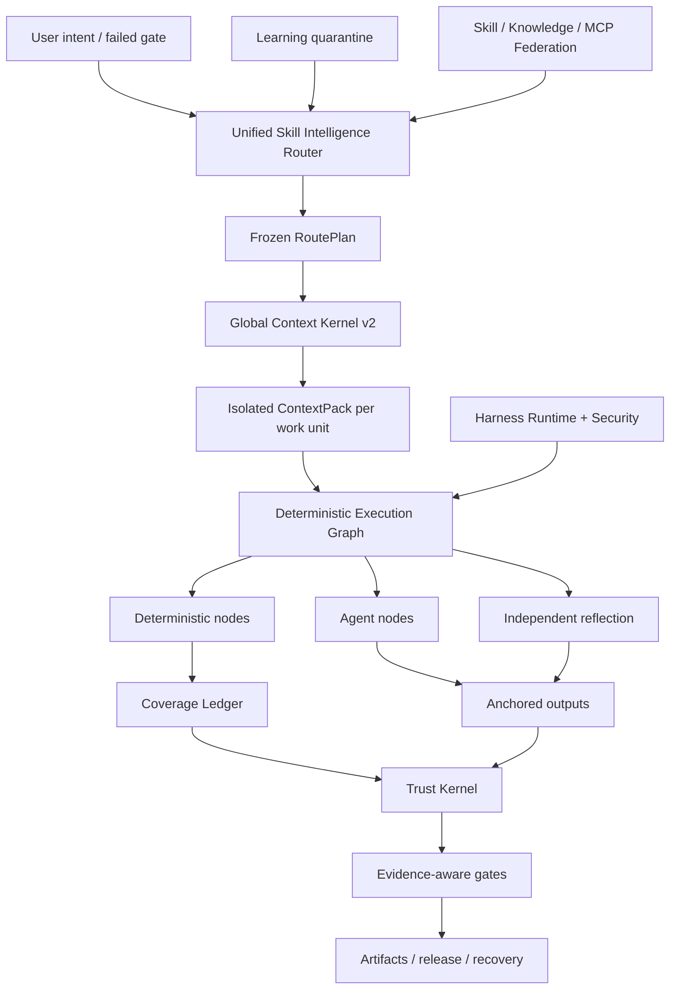

<p align="center">
  
</p>

<p align="center">
  <a href="LICENSE"></a>
  <a href="CHANGELOG.md"></a>
  
  
  
</p>

<p align="center"></p>
<h1 align="center">ForgeOS</h1>
<p align="center">ForgeOS décide <strong>quelle compétence peut être exécutée</strong>, <strong>quel contexte peut entrer</strong>, <strong>quelles étapes doivent être déterministe</strong> et <strong>dont les preuves sont suffisamment solides pour accepter l'achèvement</strong>.</p>

---

## Pourquoi ForgeOS existe

Un agent ne devient pas fiable parce qu'il dispose de plus d'invites, de plus d'outils ou d'une fenêtre contextuelle plus longue.

Il devient fiable lorsque le système peut répondre à six questions :

1. **Quel résultat exact est requis ?**
2. **Quelle technique est appropriée et quelles techniques similaires sont erronées ici ?**
3. **Quel est le plus petit contexte nécessaire pour cette unité de travail ?**
4. **Quelles étapes doivent être déterministes plutôt que déléguées à un modèle ?**
5. **Quelles preuves indépendantes prouvent le résultat ?**
6. **Le même flux de travail peut-il se récupérer, reprendre et s'auditer après un échec ?**

ForgeOS v0.6 transforme ces questions en un runtime :

```text
intention confirmée
  → résultat + récupération technique
  → politique stricte et filtres anti-déclencheurs
  → DAG RoutePlan minimum
  → ContextPack isolé par unité de travail
  → graphe d'exécution déterministe / agent / réflexion
  → sorties ancrées + registre de couverture
  → reçus fiables + portes de preuves
  → version, restauration, récupération et quarantaine d'apprentissage
```

Il ne s'agit pas d'une collecte rapide. Il s'agit du plan de contrôle autour des compétences, des règles, des crochets, des agents, des outils, du contexte, des preuves et de l'apprentissage.

---

## Qu'est-ce qui est réel dans la v0.6.1

| Surfaces | Implémentation vérifiée |
|---|---:|
| Échafaudages de résultats typés hérités | **1 024** |
| Techniques du contrat de compétences approfondies v2 | **128** |
| Techniques d'orchestration/confiance/contexte L0 | **32** |
| Techniques d'ingénierie transversales L1 | **96** |
| Liaisons des évaluateurs indépendants | **128** |
| Prestataires de procédures stables | **33** |
| Fournisseurs de procédures candidats | **242** |
| Cartographies de compétences et de connaissances intégrées | **1 299** |
| Cas de conformité de Code Review Intelligence | **12** |
| Cas contradictoires agent-surface | **20/20** |
| Matérialisation du fournisseur stable | **33/33** |
| Précision du routeur @1 / @3 | **93,75 % / 100 %** |
| Rappel du routeur@6 | **100 %** |
| Activation d'itinéraires dangereux | **0%** |

> [!IMPORTANT]
> Les 1 024 nœuds hérités sont des **échafaudages de résultats**, et non 1 024 compétences procédurales de niveau production. La v0.6 contient 128 contrats techniques approfondis. Trente-trois fournisseurs procéduraux restent dans le canal de routage stable déclaré pour des raisons de compatibilité, mais l'audit de certification final trouve 0/128 stables qualifiés par des preuves et 0 certifiés selon la définition de Révision 2 de Terminé. Les preuves restantes nécessitent une résistance, des modèles multiples couplés, des pressions, un examen indépendant et des reçus de production.

**Inventaire du noyau :** 32 techniques L0 + 96 techniques L1 = 128 techniques approfondies du noyau.

**États de routage du catalogue :** 33 fournisseurs procéduraux de canal stable déclarés et 242 candidats. **Preuve de certification formelle :** 0 stable-qualifié, 0 certifié. Voir [Audit de certification final](docs/FINAL-CERTIFICATION-AUDIT.md).

L’audit de version maintient intentionnellement ces affirmations fausses :

```text
1 024 compétences procédurales de niveau production fausses
cycle de vie complet de PostgreSQL HA faux
bac à sable microVM universel faux
Référentiel d'examen 200-PR étiqueté par des experts faux
10 000 évaluations appariées sont fausses
```

ForgeOS v0.6 ne revendique pas l'exhaustivité universelle de la production ni 1 024 compétences procédurales de niveau production.

Voir [Claims Boundary v0.6](docs/CLAIMS-BOUNDARY-V0.6.md).

---

## Chemin de cinq minutes

Utilisez ce chemin lorsque vous voulez de la valeur sans apprendre au préalable le Trust Kernel.

### 1. Installer

```bash
npm install
npm test
node src/cli/forge.mjs init
```

Paquet installé :

```bash
npx forgeos init
forge doctor
```

`forge init` crée un profil SQLite-WAL local sécurisé. Sa clé API est écrite dans un fichier `0600` et n'est jamais imprimée.

### 2. Trouver la bonne technique

```bash
forge skills search "react rerender"
forge skills inspect reducing-react-render-thrashing
forge route --query "compile the minimum context for a large monorepo"
```

### 3. Inspectez la v0.6

```bash
forge v06 status
forge profile plan coding --target codex
forge security scan --file agent-surface.json
```

### 4. Démarrez le plan de contrôle local

```bash
npm start
# Dashboard: http://127.0.0.1:8787/dashboard
# MCP:       http://127.0.0.1:8787/mcp
# A2A:       http://127.0.0.1:8787/a2a
```

---

## Chemin d'accès approfondi de l'opérateur

Utilisez ce chemin lors de l'intégration de ForgeOS dans Codex, Claude Code, ChatGPT, un agent open source, CI ou une plateforme interne.

### Routeur d'intelligence de compétences

Le routeur effectue une récupération en deux étapes au lieu de faire correspondre un nom de compétence :

```text
intention / échec de la porte
  → récupération des résultats
  → récupération directe du déclencheur technique
  → exclusion anti-déclenchement
  → filtres de confiance, de locataire, de maturité, d'outil, de licence, de fraîcheur
  → reclassement d'utilité mesurée
  → technique minimale DAG
  → résolution du fournisseur
  → Plan d'itinéraire gelé
```

Chaque technique sélectionnée et rejetée a une raison. Les bloqueurs durs battent toujours le score.

### Noyau de contexte global v2

ForgeOS budgétise la demande complète :

```text
système · tâche · sections de compétences sélectionnées · symboles de code · artefacts
· mémoire · sortie de l'outil · références · schémas d'outils paresseux
· réserve de puissance · réserve de sécurité
```

Il fournit :

- une interface de comptabilité de jetons partagée par le résolveur et le matérialiseur ;
- chargement des compétences au niveau de la section ;
- contexte isolé par unité de travail ;
- matérialisation paresseuse du schéma d'outil ;
- ID de symbole ABI sémantique et rejet de hachage obsolète ;
- projection delta d'artefact ;
- injection instinctive limitée et expirante ;
- journaux bruts adressés par contenu avec plages de défaillance distillées ;
- un manifeste d'omission pour chaque source non incluse.

### Tissu de compétences déterministes

Une technique v0.6 est compilée dans un graphe exécutable :

```text
Nœuds déterministes
  sélection de portée · regroupement · résolution de règles · ancrage · preuves

Nœuds d'agent
  enquête · hypothèse · jugement de domaine

Nœuds de réflexion
  contradiction · filtre faux positif · actionnabilité

Nœuds de contrôle
  jointure parallèle · porte de couverture · réessayer · restauration
```

Le grand livre de couverture SQLite utilise des baux, des pulsations, des clôtures et des reçus fiables. Un travailleur récupéré ne peut pas marquer une unité de travail comme terminée.

### Tranche verticale de Code Review Intelligence

La première tranche verticale complète prouve l’architecture de bout en bout :

```text
portée complète
→ unités de travail sensibles aux relations
→ sélection de règles contextuelles
→ analyse d'agent isolé
→ ancres de ligne/hachage
→ déménagement après modifications
→ réflexion indépendante
→ reçu de couverture
```

Le corpus regroupé de 12 cas est un test de conformité déterministe. Il n'est **pas** annoncé comme une référence 200-PR labellisée par des experts.

### Apprentissage continu — sans auto-empoisonnement automatique

Les modèles observés deviennent des instincts ciblés, et non des compétences stables :

```text
reçus d'exécution fiables
  → instinct observé
  → isolation locataire/projet/faisceau + TTL
  → cluster d'instinct compatible
  → proposition d'évolution du candidat
  → évaluation indépendante
  → promotion humaine ou restauration
```

Le producteur ne peut pas promouvoir son propre comportement appris.

### Exploiter l'environnement d'exécution v2

ForgeOS distingue quatre surfaces :

| Surfaces | Utilisez-le pour |
|---|---|
| **Règle** | Invariant court qui doit toujours s'appliquer |
| **Crochet** | Action déterministe liée à un événement |
| **Compétence** | Procédure conditionnelle nécessitant jugement |
| **Rôle d'agent** | Contexte, outils, modèle ou autorité séparés |

Les événements neutres incluent `before.tool.execute`, `after.file.write`, `verification.checkpoint`, `session.compact` et `session.ended`. Les adaptateurs hôtes doivent marquer les fonctionnalités non prises en charge au lieu de revendiquer une fausse parité.

Profils :

```text
minimal · codage · créatif · recherche · réglementé
local-petite · entreprise
```

### Sécurité de la surface des agents

Le moteur de sécurité analyse le système d'agent lui-même :

- instructions et violations rapides des limites ;
- les hooks et les scripts de cycle de vie des packages ;
- Descriptions MCP, autorisations et accessibilité des outils ;
- listes d'autorisation de commandes ;
- références secrètes/environnementales ;
- chemins d'autorisation secrets de sortie ;
- capacités pipe-to-shell et larges caractères génériques ;
- différences d'autorisation de profil avant l'installation.

Son corpus contradictoire passe actuellement **20/20** dossiers.

### Exécution locale négociée

Le coureur local fournit une véritable limite de sécurité pour les commandes normales :

- pas d'interpolation de coque ;
- listes autorisées de commandes et d'environnements ;
- confinement de l'espace de travail et des liens symboliques ;
- expiration du délai d'attente et terminaison du groupe de processus ;
- stdout/stderr délimité ;
- reçu d'exécution adressé par contenu.

Il ne s'agit **pas** d'un bac à sable microVM universel refusant le réseau. L’exécution par des tiers à haut risque nécessite toujours un conteneur externe ou une couche d’isolation microVM.

---


# Comment fonctionne ForgeOS

ForgeOS combine deux produits en un seul runtime :

1. **Une couche Skill Intelligence** qui récupère les techniques, rejette les quasi-matchs dangereux, compile uniquement les sections de compétences requises et crée un plan d'exécution gelé.
2. **Un plan de contrôle IA** qui gère les projets, les artefacts, les preuves, les approbations, les baux, la récupération, la fédération et les portes de publication.

```text
intention confirmée ou échec de la porte
  → résultat et récupération par technique directe
  → filtres anti-déclencheur, locataire, confiance, outil, licence et fraîcheur
  → DAG RoutePlan gelé minimum
  → ContextPack isolé par unité de travail
  → Graphe d'exécution déterministe / agent / réflexion
  → sorties ancrées et registre de couverture clôturé
  → reçus fiables et portes sensibles à l'assurance
  → libération, récupération, restauration ou quarantaine d'apprentissage
```

## Dix systèmes coopérants

| Système | Ce qu'il contrôle |
|---|---|
| **Routeur d'intelligence de compétences** | Récupération des résultats, notation technique, anti-déclencheurs, politique stricte, sélection du fournisseur et plans d'itinéraire explicables |
| **Noyau de contexte global v2** | Un budget total de jetons pour les stratégies, les tâches, les sections de compétences, les symboles, les artefacts, la mémoire, la sortie des outils, les références et la réserve de sortie |
| **Tissu de compétences déterministes** | Graphiques hybrides contenant des nœuds déterministes, des nœuds d'agent, des nœuds de réflexion, des approbations, des ancres et des conditions d'arrêt |
| **Grand livre de couverture** | Propriété des unités de travail, baux, jetons de clôture, couverture d'achèvement, rejet des travailleurs obsolètes et possibilité de reprise |
| **Faire confiance au noyau** | Fraîcheur des preuves, lignée des artefacts, autorité d'approbation, niveaux d'assurance et décisions de publication |
| **Sécurité de surface des agents** | Modèles d'injection d'invites, scripts de packages dangereux, chemins secrets de sortie, autorisations et honnêteté des capacités de l'adaptateur |
| **Exécution locale négociée** | Génération de commandes sans shell, listes autorisées, délais d'attente, limites de sortie et reçus structurés |
| **Apprentissage continu** | Instincts ciblés, expiration, confiance, quarantaine, propositions de candidats et promotion contrôlée |
| **Fédération de compétences** | Sources signées, niveaux de confiance, quarantaine, gestion des conflits, révocation et catalogues synchronisés |
| **Exploiter Runtime v2** | Règles, hooks, compétences, rôles d'agent, différences d'autorisations et profils pour différents harnais d'IA |

---

# Comparaison des écosystèmes

> [!IMPORTANT]
> Cette comparaison décrit l'**objectif natif et de première classe de chaque référentiel principal**. `◐` signifie une prise en charge partielle, une prise en charge basée sur une extension ou une prise en charge via un produit adjacent. `—` signifie que ce n'est pas l'objectif principal du projet, et non qu'il soit impossible à construire.

Les étoiles GitHub ci-dessous sont des chiffres approximatifs vérifiés le **26 juillet 2026**. Ils indiquent la visibilité de la communauté, et non la qualité de l'ingénierie en soi.

## Carte de l'écosystème

| Projet | Env. étoiles GitHub | Rôle principal |
|---|---:|---|
| [Superpouvoirs](https://github.com/obra/superpowers) | **255 000** | Cadre de compétences des agents et méthodologie de développement logiciel |
| [Compétences d'agent anthropique](https://github.com/anthropics/skills) | **151 000** | Norme de compétence et bibliothèque de compétences publique pour Claude |
| [LangChain](https://github.com/langchain-ai/langchain) | **139 000** | Plateforme d'ingénierie d'agents et vaste écosystème d'intégration |
| [OpenHands](https://github.com/All-Hands-AI/OpenHands) | **75 000+** | Application d'agent de développement logiciel de bout en bout |
| [CrewAI](https://github.com/crewAIInc/crewAI) | **56k+** | Equipes multi-agents et flux événementiels |
| [AutoGen](https://github.com/microsoft/autogen) | **50 000+** | Messagerie multi-agents et environnement d'exécution de recherche |
| [LangGraph](https://github.com/langchain-ai/langgraph) | **37k+** | Graphiques d'agents avec état et de longue durée |
| [Noyau sémantique](https://github.com/microsoft/semantic-kernel) | **28k+** | SDK d'orchestration d'entreprise multilingue |
| [Compétences d'agent impressionnantes](https://github.com/VoltAgent/awesome-agent-skills) | **28k+** | Catalogue communautaire de plus de mille compétences |
| [SDK OpenAI Agents](https://github.com/openai/openai-agents-python) | **27k+** | Agents, transferts, garde-fous, sessions et traçage |
| [smolagents](https://github.com/huggingface/smolagents) | **27k+** | Bibliothèque d'agents minimale avec accent sur l'agent de code |
| [Letta](https://github.com/letta-ai/letta) | **23k+** | Agents avec état et mémoire persistante |
| [Google ADK](https://github.com/google/adk-python) | **environ 20 000** | Création, évaluation et déploiement d'agents axés sur le code |
| [PydanticAI](https://github.com/pydantic/pydantic-ai) | **environ 19k** | Cadre d'agent Python de type sécurisé |

## Matrice des capacités de base

| Système | Compétences packagées | Routage + anti-déclenchement | Contexte régi | Graphique hybride déterministe/agent | Preuves + reçus de confiance | Sécurité de la surface de l'agent | Force native |
|---|:---:|:---:|:---:|:---:|:---:|:---:|---|
| **ForgeOS** | ✅ | ✅ | ✅ | ✅ | ✅ | ✅ | Intelligence des compétences et exécution fiable |
| Compétences anthropiques | ✅ | ◐ | ◐ | — | — | ◐ | Norme de compétence simple et portable |
| Superpouvoirs | ✅ | ✅ | ◐ | ◐ | ◐ | — | Méthodologie SDLC hautement explicite pour les agents de codage |
| Compétences impressionnantes des agents | ✅ | — | — | — | — | ◐ | Découverte de compétences à travers de nombreuses sources |
| LangChaîne | ◐ | ◐ | ◐ | ◐ | ◐ | ◐ | Très grand écosystème d'intégration |
| LangGraph | ◐ | ◐ | ◐ | ✅ | ◐ | ◐ | Exécution durable et graphiques avec état |
| SDK des agents OpenAI | ◐ | ◐ | ◐ | ◐ | ◐ | ◐ | Framework léger, transferts et traçage |
| CrewAI | ◐ | ◐ | ◐ | ✅ | ◐ | ◐ | Agents basés sur les rôles combinés avec Flows |
| Génération automatique | ◐ | ◐ | ◐ | ✅ | ◐ | ◐ | Runtime multi-agent basé sur les événements |
| Noyau Sémantique / MAF | ◐ | ◐ | ◐ | ✅ | ◐ | ◐ | Orchestration d'entreprise sur tous les environnements d'exécution |
| GoogleADK | ◐ | ◐ | ◐ | ✅ | ◐ | ◐ | Créer, évaluer et déployer dans l'écosystème de Google |
| PydanticAI | ◐ | ◐ | ◐ | ◐ | ◐ | ◐ | Sécurité des types, validation et ergonomie Python |
| agents smoliques | ◐ | ◐ | ◐ | ◐ | — | ◐ | Implémentation d'agent minimale et lisible |
| Lettre | ◐ | ◐ | ✅ | ◐ | ◐ | ◐ | Mémoire persistante et agents avec état |
| Mains ouvertes | ◐ | ◐ | ◐ | ◐ | ◐ | ✅ | Expérience d'agent de codage de bout en bout |

## ForgeOS choisit un champ de bataille différent

Un référentiel de compétences répond : **« Quelles procédures l'agent peut-il apprendre ? »**

ForgeOS demande également : **"Quelle technique est autorisée désormais, quelle quasi-correspondance doit être rejetée, quelles sections peuvent être mises en contexte, quels outils sont requis, quelles preuves doivent être produites et quelle porte peut déclarer le travail terminé ?"**

Une infrastructure d'agents permet de créer des agents, des outils, des transferts et des flux de travail. ForgeOS se concentre sur la couche entourant ce runtime : récupération de capacités, anti-déclencheurs, budgets de contexte global, graphiques déterministes/agents/réflexion, preuves actuelles, autorité d'approbation, lignée d'artefacts, récupération et quarantaine d'apprentissage.

Un système de mémoire se concentre sur ce dont un agent se souvient. ForgeOS contrôle en outre à quel locataire, projet, utilisateur, domaine de confiance, expiration, confiance et politique de promotion appartient la mémoire.

Un agent de codage de bout en bout fournit l'expérience utilisateur. ForgeOS peut s'exécuter **sous ou à côté** de cet agent en tant que couche de sélection des compétences, de gouvernance du contexte, de preuve, de confiance et de cycle de vie du projet.

## Là où les écosystèmes matures mènent encore

Ils disposent actuellement de communautés plus larges, de davantage de didacticiels et d'intégrations, d'expériences de cloud géré plus raffinées, d'une intégration sans code plus solide et de déploiements de production plus documentés publiquement. ForgeOS se concentre délibérément sur un problème moins standardisé : **le contrôle du choix des compétences, du contexte, des preuves, de l'autorité et de l'état d'achèvement des agents IA**.

---

# Trois chemins d'entrée

## Pour les utilisateurs quotidiens

Vous n'avez pas besoin de comprendre tous les sous-systèmes. Commencez par quatre tests observables :

```bash
node src/cli/forge.mjs doctor
node src/cli/forge.mjs skills search --query "review authentication changes"
node src/cli/forge.mjs route --query "review authentication changes without missing tests"
node src/cli/forge.mjs scan agent-surface --path .
```

Vous pouvez vérifier quelle technique a été sélectionnée, pourquoi les alternatives ont été rejetées, quelle quantité de contexte a été compilée, quelles autorisations sont demandées et quelles preuves manquent encore.

## Pour les développeurs

ForgeOS expose le même runtime via :

- CLI pour le fonctionnement local et CI ;
- API HTTP et tableau de bord Studio ;
- **60 outils MCP stricts au niveau du schéma** ;
- Surfaces de tâches et de cartes d'agent A2A ;
- importations directes de services depuis l'arborescence source Node.js ;
- **15 adaptateurs** pour les écosystèmes d'agents et IDE ;
- sept profils de harnais : `minimal`, `coding`, `creative`, `research`, `regulated`, `local-small` et `enterprise`.

Les développeurs peuvent créer des projets, enregistrer des artefacts, lier des preuves, demander des approbations, compiler des RoutePlans et des ContextPacks, exécuter des graphiques, récupérer des révisions, synchroniser des compétences fédérées ou ajouter un nouveau contrat de compétences v2.

## Pour les experts et les chercheurs

ForgeOS est conçu pour être contesté plutôt que accepté sur une page marketing. Les experts peuvent tester indépendamment :

- précision du routeur, rappel, comportement anti-déclenchement et activation dangereuse ;
- débordement de contexte total et réduction de l'ABI sémantique ;
- couverture déterministe, ancrages, réflexion, baux et clôtures ;
- fraîcheur des preuves, lignée des artefacts et portes sensibles à l'assurance ;
- injection rapide, scripts de package, chemins secrets de sortie et honnêteté de l'adaptateur ;
- conflit de fédération, quarantaine, révocation et confiance de source ;
- vérification des archives sans `.git`.

```bash
npm run validate
npm run v06:audit
npm run router:benchmark
npm run context:benchmark
npm run federation:eval
npm run federation:audit
npm run smoke
npm run adapter:tck
npm run release:verify
```

---

# Carte du référentiel

```text
implémentation src/runtime
  interface de ligne de commande cli/forge
  noyau/projet, artefact, preuve, approbation, récupération
  skills-intelligence/contrats, routage, évaluation, matérialisation
  contexte/Contexte global Compilation du noyau et des unités de travail
  exécution/compilateur de graphes, nœuds déterministes, couverture
  confiance/preuve, assurance, autorité, portes de libération
  sécurité/analyse de la surface de l'agent et courtier de commandes
  fédération/sources distantes, confiance, quarantaine, synchronisation
  apprentissage/instincts, candidats, expiration, promotion
  Serveur mcp/ MCP et 60 outils publics
  Cartes, tâches, messages et reçus a2a/A2A
  serveur/ API HTTP, authentification, tableau de bord
  stockage/persistance et migrations SQLite-WAL
adaptateurs/15 adaptateurs agents et IDE
skills-v2/ 128 techniques approfondies de Skill Contract v2
capacités-v2/résultats, techniques, prestataires, relations, graphique
schémas/contrats publics JSON Schema 2020-12
packs/packs de capacités verticales et benchmarks
évaluations/cas d'évaluation, rubriques et corpus
tests/ 125 fichiers de test et invariants de version
preuves/preuves générées par l'audit, l'analyse comparative, le SBOM et le tableau de bord
docs/architecture, protocoles, sécurité, tests, production
scripts/outils de génération, de validation, d'audit, de référence et de publication
```

# Cas d'utilisation appropriés

- Rendre les agents de codage plus disciplinés et auditables.
- Construction d'un plan de contrôle pour plusieurs modèles, agents et outils.
- Exploiter une plateforme de compétences interne avec des contrôles de routage et de maturité.
- Examen des configurations des agents, des autorisations, des invites et des surfaces de la chaîne d'approvisionnement.
- Flux de travail à haute assurance ou réglementés nécessitant des preuves et des portes d'approbation.
- Réduire le gaspillage de contexte dans les grands référentiels grâce à l'isolation des unités de travail et à l'ABI sémantique.

ForgeOS ne remplace pas l’automatisation des flux de travail métier de type n8n. n8n connecte les applications et les événements professionnels ; ForgeOS contrôle la sélection, le contexte, l'exécution, les preuves et l'autorité des techniques d'IA. Ils peuvent être utilisés ensemble.

---

## Architecture



---

## Intégration MCP et agents

ForgeOS parle MCP `2025-11-25`, A2A `1.0`, les packages compatibles Agent Skills, HTTP et CLI.

Les outils publics v0.6 incluent :

```text
forge_v06_statut
forge_execution_graph_compile
forge_review_scope_compile
forge_context_work_units_compile
forge_harness_profile_plan
forge_agent_surface_scan
```

Ils rejoignent les outils existants de projet, d'artefact, de preuves fiables, de récupération, de fédération, de Skill Intelligence et de courtier MCP. Stdio, HTTP MCP, CLI et Studio partagent les mêmes services et schémas JSON.

Les packs d'adaptateurs pris en charge incluent ChatGPT, Codex, Claude Code, Cursor, OpenCode, Gemini CLI, Copilot CLI, Cline, Roo Code, Windsurf, Continue, NolaneNative, OpenClaw, Pi et MCP/A2A générique. Des preuves distinguent les adaptateurs **testés par protocole** des guides **documentation uniquement**.

---

## Vérification

```bash
npm run validate
npm run skills:v2:audit
npm run v06:audit
npm run router:benchmark
npm run context:benchmark
npm run federation:eval
npm run federation:audit
npm run smoke
npm run adapter:tck
npm run release:verify
```

La porte de libération vérifie le comportement et les contrats, pas seulement la couverture de la ligne :

- les invariants d'état, de clôture, de péremption et de cycle de vie ;
- Cycle de vie complet MCP/A2A et schémas de sortie ;
- profondeur des compétences, passe-partout, hachage de section et matérialisation ;
- précision du routeur, rappel, déterminisme et activation dangereuse ;
- comptabilité globale des débordements et des omissions de contexte ;
- grand livre d'exécution et de couverture déterministe ;
- revoir les points d'ancrage et la réflexion ;
- évaluation indépendante et quarantaine d'apprentissage continu ;
- les cas contradictoires agent-surface ;
- installation d'archives et auto-vérification sans `.git`.

---

## Limite de production

**Intégré aujourd'hui**

- Backend de cycle de vie à nœud unique SQLite WAL ;
- révision/CAS, baux, clôture, instantanés, restauration, ACL, clé OIDC/API ;
- reçus fiables, hachages d'enveloppes d'artefacts, portes sensibles à l'assurance ;
- fédération de compétences/connaissances/MCP à l'échelle du locataire ;
- vidange gracieuse, état de préparation, mesures, provenance de la version signée ;
- profils de déploiement non root/lecture seule.

**Pas encore de réclamation v0.6**

- backend PostgreSQL à cycle de vie complet et basculement multi-nœuds testé ;
- sandbox microVM tiers universel ;
- Administration SCIM/organisation déléguée ;
- service de transparence géré et PKI ;
- CV streaming/push et distribué A2A ;
- 1 024 compétences procédurales de niveau production ;
- 10 000 exécutions d'évaluation appariées ;
- référence de révision de code multilingue évaluée par des experts.

Lisez [Production](docs/PRODUCTION.md), [Modèle de sécurité](docs/SECURITY-MODEL.md) et [Self-Audit v0.6](docs/SELF-AUDIT-V0.6.md).

---

## Plan de la documentation

| Commencez ici | Plongée profonde |
|---|---|
| [Démarrage rapide](docs/QUICKSTART.md) | [Architecture](docs/ARCHITECTURE.md) |
| [Intelligence des compétences](docs/SKILL-INTELLIGENCE.md) | [Tissu déterministe v0.6](docs/DETERMINISTIC-SKILL-FABRIC-V06.md) |
| [CLI et profils](docs/HARNESS-RUNTIME-V2.md) | [Noyau de contexte global](docs/GLOBAL-CONTEXT-KERNEL.md) |
| [Sécurité](docs/AGENT-SURFACE-SECURITY.md) | [Apprentissage continu](docs/CONTINUOUS-LEARNING-V06.md) |
| [Tests](docs/TESTING.md) | [Limite des réclamations](docs/CLAIMS-BOUNDARY-V0.6.md) |
| [Contribuer](CONTRIBUTING.md) | [Auto-audit](docs/SELF-AUDIT-V0.6.md) |

---

## Langues

[Universal Lanes](docs/UNIVERSAL-LANES.md) · [Remote MicroVM Sandbox](docs/REMOTE-MICROVM-SANDBOX.md) · [Tiếng Việt](README-vn.md) · [简体中文](README-cn.md) · [繁體中文](README-tw.md) · [日本語](README-ja.md) · [한국어](README-ko.md) · [Español](README-es.md) · [Français](README-fr.md) · [Deutsch](README-de.md) · [Português](README-pt-br.md) · [Русский](README-ru.md) · [العربية](README-ar.md) · [हिन्दी](README-hi.md) · [Bahasa Indonesia](README-id.md) · [ไทย](README-th.md) · [Türkçe](README-tr.md) · [Italiano](README-it.md) · [Polski](README-pl.md) · [Українська](README-uk.md) · [Nederlands](README-nl.md) · [فارسی](README-fa.md) · [עברית](README-he.md) · [Svenska](README-sv.md)

---

## Contribuer

Une nouvelle compétence n’est pas acceptée parce que sa prose semble experte. Il lui faut :

1. une ligne de base ROUGE qui échoue sans la technique ;
2. déclencheurs et anti-déclencheurs précis ;
3. une procédure et un modèle de défaillance spécifiques au domaine ;
4. entrées, sorties, outils et preuves dactylographiés ;
5. hachages de sections et budgets de jetons ;
6. obligations d'un évaluateur indépendant ;
7. des preuves de référence et une décision de maturité.

Voir [CONTRIBUTING.md](CONTRIBUTING.md), [GOVERNANCE.md](GOVERNANCE.md) et [SECURITY.md](SECURITY.md).

## Licence

MIT — voir [LICENCE](LICENSE).


## Audits de la version finale

- [Rapport final de durcissement](docs/FINAL-HARDENING-REPORT.md)
- [Audit final de certification des compétences](docs/FINAL-CERTIFICATION-AUDIT.md)
