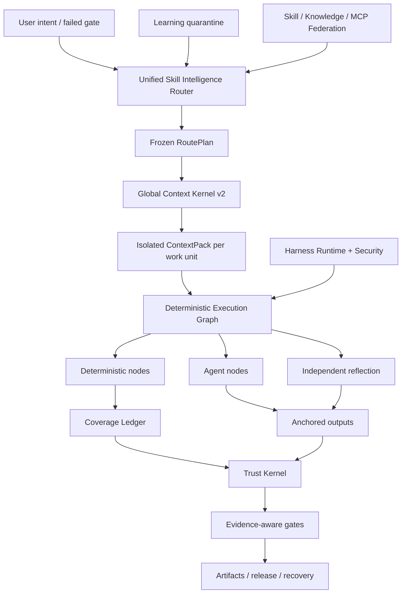

<p align="center">
  
</p>

<p align="center">
  <a href="LICENSE"></a>
  <a href="CHANGELOG.md"></a>
  
  
  
</p>

<p align="center"></p>
<h1 align="center">ForgeOS</h1>
<p align="center">ForgeOS מחליטה <strong>איזו מיומנות עשויה לפעול דטרמיניסטית</strong>, ו-<strong>אשר הראיות חזקות מספיק כדי לקבל השלמה</strong>.</p>

---

## מדוע ForgeOS קיימת

סוכן לא הופך לאמין מכיוון שיש לו יותר הנחיות, יותר כלים או חלון הקשר ארוך יותר.

זה הופך להיות אמין כאשר המערכת יכולה לענות על שש שאלות:

1. **איזו תוצאה מדויקת נדרשת?**
2. **איזו טכניקה מתאימה — ואילו טכניקות דומות שגויות כאן?**
3. **מהו ההקשר הקטן ביותר הדרוש ליחידת עבודה זו?**
4. **אילו שלבים חייבים להיות דטרמיניסטיים במקום להאצל למודל?**
5. **איזה ראיה עצמאית מוכיחה את הפלט?**
6. **האם אותו תהליך עבודה יכול לשחזר, לחדש ולבדוק את עצמו לאחר כשל?**

ForgeOS v0.6 הופך את השאלות הללו לזמן ריצה:

```text
כוונה מאושרת
  → תוצאה + אחזור טכניקה
  ← מסנני מדיניות קשיחים ואנטי-טריגרים
  ← מינימום RoutePlan DAG
  ← ContextPack מבודד ליחידת עבודה
  → גרף ביצוע דטרמיניסטי / סוכן / השתקפות
  ← יציאות מעוגנות + ספר כיסוי
  → קבלות מהימנות + שערי ראיות
  ← שחרור, החזרה, התאוששות והסגר למידה
```

זה לא איסוף מהיר. זהו מישור הבקרה סביב מיומנויות, כללים, ווים, סוכנים, כלים, הקשר, ראיות ולמידה.

---

## מה אמיתי בגרסה 0.6.1

| משטח | יישום מאומת |
|---|---:|
| פיגומי תוצאה שהוקלדו מדור קודם | **1,024** |
| טכניקות Deep Skill Contract v2 | **128** |
| L0 טכניקות תזמור/אמון/הקשר | **32** |
| טכניקות הנדסה חוצת תחומים L1 | **96** |
| כריכות מעריך עצמאי | **128** |
| ספקי פרוצדורליים יציבים | **33** |
| ספקי פרוצדורליים מועמדים | **242** |
| מיומנות מובנית + מיפוי ידע | **1,299** |
| קוד סקירת מודיעין מקרי התאמה | **12** |
| מקרים יריבים משטח הסוכן | **20/20** |
| התממשות ספק יציב | **33/33** |
| נתב Precision@1 / @3 | **93.75% / 100%** |
| ראוטר Recall@6 | **100%** |
| הפעלת מסלול לא בטוח | **0%** |

> [!חשוב]
> 1,024 הצמתים מדור קודם הם **פיגומי תוצאה**, לא 1,024 מיומנויות פרוצדורליות בדרגת ייצור. v0.6 מכיל 128 חוזי טכניקה עמוקים. 33 ספקי פרוצדורליים נותרו בערוץ הניתוב היציב המוצהר לצורך תאימות, אך ביקורת ההסמכה הסופית מוצאת 0/128 יציבים עם הוכחה ו-0 מאושרים תחת הגדרה של עדכון 2 של בוצע. העדויות הנותרות דורשות החזקה, ריבוי מודלים משולב, לחץ, סקירה עצמאית וקבלות ייצור.

**מלאי ליבה:** 32 טכניקות L0 + 96 טכניקות L1 = 128 טכניקות ליבה עמוקות.

**מצבי ניתוב קטלוגים:** 33 ספקי פרוצדורליים מוצהרים בערוץ יציב ו-242 מועמדים. **הוכחות הסמכה פורמליות:** 0 מוסמכים יציבים, 0 מוסמכים. ראה [ביקורת הסמכה סופית](docs/FINAL-CERTIFICATION-AUDIT.md).

ביקורת השחרור שומרת בכוונה על הטענות האלה כוזבות:

```text
1,024 מיומנויות פרוצדורליות בדרגת ייצור שקר
מחזור חיים מלא של PostgreSQL HA false
ארגז חול אוניברסלי microVM false
מדד סקירת 200-PR עם תווית מומחה שקר
10,000 הערכה זוגית פועלת כשווא
```

ForgeOS v0.6 אינו טוען לשלמות ייצור אוניברסלית או 1,024 כישורי פרוצדורליים בדרגת ייצור.

ראה [גבול תביעות v0.6](docs/CLAIMS-BOUNDARY-V0.6.md).

---

## נתיב של חמש דקות

השתמש בנתיב זה כאשר אתה רוצה ערך מבלי ללמוד תחילה את ליבת האמון.

### 1. התקן

```bash
npm install
npm test
node src/cli/forge.mjs init
```

חבילה מותקנת:

```bash
npx forgeos init
forge doctor
```

`forge init` יוצר פרופיל SQLite-WAL מקומי בטוח. מפתח ה-API שלו נכתב לקובץ `0600` ולעולם לא מודפס.

### 2. מצא את הטכניקה הנכונה

```bash
forge skills search "react rerender"
forge skills inspect reducing-react-render-thrashing
forge route --query "compile the minimum context for a large monorepo"
```

### 3. בדוק את v0.6

```bash
forge v06 status
forge profile plan coding --target codex
forge security scan --file agent-surface.json
```

### 4. הפעל את מטוס הבקרה המקומי

```bash
npm start
# Dashboard: http://127.0.0.1:8787/dashboard
# MCP:       http://127.0.0.1:8787/mcp
# A2A:       http://127.0.0.1:8787/a2a
```

---

## נתיב מפעיל עמוק

השתמש בנתיב זה בעת הטמעת ForgeOS לתוך Codex, Claude Code, ChatGPT, סוכן קוד פתוח, CI או פלטפורמה פנימית.

### נתב מודיעין מיומנות

הנתב מבצע אחזור דו-שלבי במקום להתאים לשם מיומנות:

```text
שער כוונה / נכשל
  → שליפת תוצאות
  → שליפה ישירה של טכניקה-טריגר
  → אי הכללת אנטי טריגר
  → מסנני אמון, דייר, בגרות, כלי, רישיון, טריות
  ← דירוג מחדש של השירות המדוד
  → מינימום טכניקה DAG
  ← רזולוציית ספק
  ← RoutePlan קפוא
```

לכל טכניקה שנבחרה ונדחה יש סיבה. חוסמים קשים תמיד מנצחים את התוצאה.

### ליבת הקשר גלובלי v2

ForgeOS מתקצב את הבקשה המלאה:

```text
מערכת · משימה · חלקי מיומנות נבחרים · סמלי קוד · חפצים
· זיכרון · פלט כלי · הפניות · סכימות כלים עצלות
· עתודת תפוקה · עתודת בטיחות
```

הוא מספק:

- ממשק אחד לחשבונאות אסימון משותף לפותר ולחומר;
- טעינת מיומנות ברמת הקטע;
- הקשר מבודד ליחידת עבודה;
- התממשות כלי-סכימה עצלנית;
- מזהי סמל ABI סמנטיים ודחיית חשיש מעופש;
- הקרנת דלתא של חפץ;
- הזרקת אינסטינקט עם טווח פקיעה;
- יומנים גולמיים עם כתובות תוכן עם טווחי כשל מזוקקים;
- מניפסט השמטה לכל מקור שאינו כלול.

### בד מיומנות דטרמיניסטית

טכניקת v0.6 מורכבת לתוך גרף בר הפעלה:

```text
צמתים דטרמיניסטיים
  היקף-בחירת · צרור · כלל-החלטה · עיגון · ראיות

צמתים של סוכן
  חקירה · השערה · שיפוט תחום

צמתי השתקפות
  סתירה · מסנן חיובי כוזב · יכולת פעולה

צמתי בקרה
  צירוף מקביל · שער כיסוי · ניסיון חוזר · חזרה לאחור
```

ספר הכיסוי של SQLite משתמש בחוזי שכירות, פעימות לב, גידור וקבלות מהימנות. עובד שהוחזר אינו יכול לסמן יחידת עבודה שהשלמה.

### קוד סקירת מודיעין פרוסה אנכית

הפרוסה האנכית השלמה הראשונה מוכיחה את הארכיטקטורה מקצה לקצה:

```text
היקף מלא
→ יחידות עבודה מודעות ליחסים
← בחירת כללים הקשריים
← ניתוח סוכנים מבודד
→ עוגני קו/גיבוש
← העברה לאחר עריכות
→ השתקפות עצמאית
← קבלה על כיסוי
```

הקורפוס המצורף בן 12 המקרים הוא מדד התאמה דטרמיניסטי. הוא **לא** מפורסם כמבחן 200-PR עם תווית מומחה.

### למידה מתמשכת - ללא הרעלה עצמית אוטומטית

דפוסים שנצפו הופכים לאינסטינקטים בעלי היקף, לא כישורים יציבים:

```text
קבלות הפעלה מהימנות
  → אינסטינקט נצפה
  ← בידוד דייר/פרויקט/רתמה + TTL
  → אשכול אינסטינקט תואם
  → הצעת אבולוציה של המועמד
  ← הערכה עצמאית
  ← קידום אנושי או החזרה לאחור
```

המפיק אינו יכול לקדם את ההתנהגות הנלמדת שלו.

### לרתום זמן ריצה v2

ForgeOS מבחין בין ארבעה משטחים:

| משטח | השתמש בו עבור |
|---|---|
| **כלל** | אינוריאנט קצר שחייב לחול תמיד |
| **הוק** | פעולה דטרמיניסטית הקשורה לאירוע |
| **מיומנות** | הליך מותנה המחייב שיפוט |
| **תפקיד סוכן** | הפרד הקשר, כלים, מודל או סמכות |

אירועים ניטרליים כוללים `before.tool.execute`, `after.file.write`, `verification.checkpoint`, `session.compact` ו-`session.ended`. מתאמי מארח חייבים לסמן תכונות שאינן נתמכות במקום לטעון לשוויון כוזב.

פרופילים:

```text
מינימלי · קידוד · יצירתי · מחקר · מוסדר
מפעל מקומי- קטן
```

### Agent Surface Security

מנוע האבטחה סורק את מערכת הסוכן עצמה:

- הוראות והפרות גבולות מיידיות;
- ווים ותסריטי מחזור חיים של חבילה;
- תיאורי MCP, הרשאות ונגישות לכלי;
- רשימות היתרים לפיקוד;
- הפניות סודיות/סביבתיות;
- נתיבי הרשאה סודיים ליציאה;
- צינור לקליפה ויכולת כללית רחבה;
- הרשאת הפרופיל משתנה לפני ההתקנה.

הקורפוס היריב שלו עובר כיום מקרים של **20/20**.

### ביצוע מקומי בתיווך

הרץ המקומי מספק גבול בטיחותי אמיתי לפקודות רגילות:

- אין אינטרפולציה של מעטפת;
- רשימות הרשאות פיקוד וסביבה;
- סביבת עבודה והכלת סימלינקים;
- פסק זמן וסיום קבוצת תהליך;
- bounded stdout/stderr;
- קבלה על ביצוע כתובה בתוכן.

זה **לא** ארגז חול אוניברסלי שמונע רשתות microVM. ביצוע של צד שלישי בסיכון גבוה עדיין דורש מיכל חיצוני או שכבת בידוד microVM.

---


# איך עובדת ForgeOS

ForgeOS משלבת שני מוצרים בזמן ריצה אחד:

1. **שכבת Skill Intelligence** המאחזרת טכניקות, דוחה התאמות כמעט לא בטוחות, מרכיבה רק את סעיפי המיומנות הנדרשים ובונה תוכנית ביצוע קפואה.
2. **מטוס בקרה בינה מלאכותית** שמנהל פרויקטים, חפצים, ראיות, אישורים, חכירה, שחזור, פדרציה ושערי שחרור.

```text
כוונה מאושרת או שער כושל
  ← תוצאה ואחזור טכניקה ישירה
  → מסנני אנטי-טריגר, דייר, אמון, כלי, רישיון ורעננות
  ← מינימום RoutePlan DAG קפוא
  ← ContextPack מבודד ליחידת עבודה
  ← דטרמיניסטי / סוכן / השתקפות גרף ביצוע
  ← יציאות מעוגנות ופנקס כיסוי מגודר
  ← קבלות מהימנות ושערים מודעים להבטחה
  ← שחרור, התאוששות, החזרה לאחור או הסגר למידה
```

## עשר מערכות משתפות פעולה

| מערכת | מה זה שולט |
|---|---|
| **נתב Skill Intelligence** | שליפת תוצאות, ניקוד טכניקה, אנטי טריגרים, מדיניות קשיחה, בחירת ספק ותוכניות מסלול הניתנות להסבר |
| **Global Context Kernel v2** | תקציב סמלי אחד כולל על פני מדיניות, משימה, סעיפי מיומנות, סמלים, חפצים, זיכרון, פלט כלי, הפניות ועתודות פלט |
| **בד מיומנות דטרמיניסטית** | גרפים היברידיים המכילים צמתים דטרמיניסטים, צמתים סוכנים, צמתי השתקפות, אישורים, עוגנים ותנאי עצירה |
| **פנקס כיסויים** ​​| בעלות על יחידות עבודה, חוזי שכירות, אסימוני גידור, כיסוי השלמות, דחיית עובדים מיושנים ואפשרות חידוש |
| **גרעין אמון** | עדויות טריות, שושלת חפץ, סמכות אישור, רמות הבטחה והחלטות שחרור |
| **סוכן שטח אבטחה** | דפוסי הזרקה מהירה, סקריפטים מסוכנים של חבילות, נתיבים סודיים ליציאה, הרשאות ויושר יכולת מתאם |
| **ביצוע מקומי בתיווך** | השרצת פקודות ללא מעטפת, רשימות היתרים, פסקי זמן, מגבלות פלט וקבלות מובנות |
| **למידה מתמשכת** | אינסטינקטים בהיקף, תפוגה, אמון, הסגר, הצעות מועמדים וקידום מבוקר |
| **הסתדרות הכישורים** | מקורות חתומים, שכבות אמון, הסגר, טיפול בסכסוכים, ביטול וקטלוגים מסונכרנים |
| **Harness Runtime v2** | כללים, ווים, כישורים, תפקידי סוכן, הבדלי הרשאות ופרופילים עבור רתמות AI שונות |

---

# השוואה של מערכות אקולוגיות

> [!חשוב]
> השוואה זו מתארת את **המיקוד המקורי והמדרגה הראשונה של כל מאגר ליבה**. `◐` פירושו תמיכה חלקית, תמיכה מבוססת הרחבות או תמיכה באמצעות מוצר סמוך. `—` אומר שזה לא המוקד העיקרי של הפרויקט, לא שזה בלתי אפשרי לבנות.

כוכבי GitHub למטה הם נתונים משוערים שנבדקו ב-**26 ביולי 2026**. הם מצביעים על נראות קהילתית, לא על איכות הנדסית כשלעצמם.

## מפת המערכת האקולוגית

| פרויקט | כ. כוכבי GitHub | תפקיד ראשי |
|---|---:|---|
| [כוחות על](https://github.com/obra/superpowers) | **255k** | מסגרת כישורי סוכן ומתודולוגיה לפיתוח תוכנה |
| [מיומנויות סוכן אנתרופיות](https://github.com/anthropics/skills) | **151k** | ספריית מיומנויות תקן וציבורי עבור קלוד |
| [LangChain](https://github.com/langchain-ai/langchain) | **139k** | פלטפורמה הנדסית סוכנים ואקוסיסטם גדול של אינטגרציה |
| [OpenHands](https://github.com/All-Hands-AI/OpenHands) | **75k+** | יישום סוכן פיתוח תוכנה מקצה לקצה |
| [CrewAI](https://github.com/crewAIInc/crewAI) | **56k+** | צוותים מרובי סוכנים וזרימות מונעות אירועים |
| [AutoGen](https://github.com/microsoft/autogen) | **50k+** | זמן ריצה של הודעות מרובות סוכנים ומחקר |
| [LangGraph](https://github.com/langchain-ai/langgraph) | **37k+** | גרפי סוכנים ממלכתיים וארוכי טווח |
| [גרעין סמנטי](https://github.com/microsoft/semantic-kernel) | **28k+** | SDK לתזמור ארגוני מרובת שפות |
| [מיומנויות סוכן מדהימות](https://github.com/VoltAgent/awesome-agent-skills) | **28k+** | קטלוג קהילתי של יותר מאלף מיומנויות |
| [OpenAI Agents SDK](https://github.com/openai/openai-agents-python) | **27k+** | סוכנים, מסירות, מעקות בטיחות, הפעלות ואיתור |
| [smolagents](https://github.com/huggingface/smolagents) | **27k+** | ספריית סוכנים מינימלית עם הדגשת קוד-סוכן |
| [לטה](https://github.com/letta-ai/letta) | **23k+** | סוכנים ממלכתיים וזיכרון מתמשך |
| [Google ADK](https://github.com/google/adk-python) | **בערך 20k** | בניית, הערכה ופריסה של סוכנים בקוד ראשון |
| [PydanticAI](https://github.com/pydantic/pydantic-ai) | **בערך 19k** | מסגרת בטוחה לסוג Python |

## מטריצת יכולת ליבה

| מערכת | מיומנויות ארוזות | ניתוב + אנטי טריגר | הקשר נשלט | גרף היברידי דטרמיניסטי/סוכן | ראיות + קבלות אמון | אבטחה משטח סוכן | חוזק יליד |
|---|:---:|:---:|:---:|:---:|:---:|:---:|---|
| **ForgeOS** | ✅ | ✅ | ✅ | ✅ | ✅ | ✅ | מודיעין מיומנות וביצוע אמין |
| מיומנויות אנתרופיות | ✅ | ◐ | ◐ | — | — | ◐ | תקן מיומנות פשוט ונייד |
| כוחות על | ✅ | ✅ | ◐ | ◐ | ◐ | — | מתודולוגיית SDLC מפורשת מאוד עבור סוכני קידוד |
| כישורי סוכן מדהימים | ✅ | — | — | — | — | ◐ | גילוי מיומנויות על פני מקורות רבים |
| LangChain | ◐ | ◐ | ◐ | ◐ | ◐ | ◐ | מערכת אקולוגית אינטגרציה גדולה מאוד |
| LangGraph | ◐ | ◐ | ◐ | ✅ | ◐ | ◐ | ביצוע עמיד וגרפים ממלכתיים |
| OpenAI Agents SDK | ◐ | ◐ | ◐ | ◐ | ◐ | ◐ | מסגרת קלת משקל, מסירות ומעקב |
| CrewAI | ◐ | ◐ | ◐ | ✅ | ◐ | ◐ | סוכנים מבוססי תפקידים בשילוב עם Flows |
| AutoGen | ◐ | ◐ | ◐ | ✅ | ◐ | ◐ | זמן ריצה מרובה סוכנים מונע אירועים |
| גרעין סמנטי / MAF | ◐ | ◐ | ◐ | ✅ | ◐ | ◐ | תזמור ארגוני על פני זמני ריצה |
| Google ADK | ◐ | ◐ | ◐ | ✅ | ◐ | ◐ | בנה, העריך ופריסה במערכת האקולוגית של Google |
| PydanticAI | ◐ | ◐ | ◐ | ◐ | ◐ | ◐ | בטיחות סוג, אימות וארגונומיה של Python |
| חומרי smolagent | ◐ | ◐ | ◐ | ◐ | — | ◐ | יישום סוכן מינימלי וקריא |
| לטה | ◐ | ◐ | ✅ | ◐ | ◐ | ◐ | זיכרון מתמיד וסוכנים ממלכתיים |
| OpenHands | ◐ | ◐ | ◐ | ◐ | ◐ | ✅ | חווית סוכן קידוד מקצה לקצה |

## ForgeOS בוחר בשדה קרב אחר

מאגר מיומנויות עונה: **"אילו נהלים יכול הסוכן ללמוד?"**

ForgeOS שואלת גם: **"איזו טכניקה מותרת כעת, איזו התאמה כמעט חייבת להידחות, אילו קטעים עשויים להיכנס להקשר, אילו כלים נדרשים, אילו ראיות יש להפיק ואיזה שער עשוי להכריז על העבודה הושלמה?"**

מסגרת סוכן עוזרת ליצור סוכנים, כלים, מסירות וזרימות עבודה. ForgeOS מתמקדת בשכבה המקיפה את זמן הריצה הזה: אחזור יכולות, אנטי טריגרים, תקציבי הקשר גלובליים, גרפים דטרמיניסטים/סוכן/שתקפות, ראיות עדכניות, סמכות אישור, שושלת חפצים, התאוששות והסגר למידה.

מערכת זיכרון מתמקדת במה שסוכן זוכר. ForgeOS שולט בנוסף לאיזה דייר, פרויקט, משתמש, תחום אמון, תפוגה, אמון ומדיניות קידום הזיכרון שייך אליו.

סוכן קידוד מקצה לקצה מספק את חווית המשתמש. ForgeOS יכולה לפעול **תחת או לצד** של הסוכן הזה כשכבת בחירת המיומנויות, ההקשר-ממשל, הראיות, האמון ומחזור החיים של הפרויקט.

## לאן עדיין מובילות מערכות אקולוגיות בוגרות

יש להם כרגע קהילות גדולות יותר, יותר מדריכים ואינטגרציות, חוויות מלוטשות יותר בענן מנוהל, שילוב חזק יותר ללא קוד, ופריסות ייצור מתועדות יותר בפומבי. ForgeOS מתרכז בכוונה בבעיה פחות סטנדרטית: **שליטה בבחירת מיומנויות, הקשר, ראיות, סמכות ומצב השלמה עבור סוכני AI**.

---

# שלושה שבילי כניסה

## למשתמשים יומיומיים

אתה לא צריך להבין כל תת-מערכת. התחל עם ארבעה מבחנים שניתנים לצפייה:

```bash
node src/cli/forge.mjs doctor
node src/cli/forge.mjs skills search --query "review authentication changes"
node src/cli/forge.mjs route --query "review authentication changes without missing tests"
node src/cli/forge.mjs scan agent-surface --path .
```

אתה יכול לבדוק איזו טכניקה נבחרה, מדוע חלופות נדחו, כמה הקשר נערך, אילו הרשאות מתבקשות, ואילו ראיות עדיין חסרות.

## למפתחים

ForgeOS חושף את אותו זמן ריצה באמצעות:

- CLI לתפעול מקומי ו-CI;
- ממשקי API של HTTP ולוח המחוונים של Studio;
- **60 כלי MCP המחמירים לסכימה**;
- משטחי משימות A2A וכרטיס סוכן;
- ייבוא ​​שירות ישיר מעץ המקור של Node.js;
- **15 מתאמים** למערכות אקולוגיות של סוכן ו-IDE;
- שבעה פרופילי רתמה: `minimal`, `coding`, `creative`, `research`, `regulated`, `local-small`, ו-https://forgeostoken.invalid/5, ו-https://forgeostoken.invalid/6.

מפתחים יכולים ליצור פרויקטים, לרשום חפצים, לאגד ראיות, לבקש אישורים, להרכיב RoutePlans ו-ContextPacks, לבצע גרפים, לשחזר תיקונים, לסנכרן מיומנויות מאוחדות או להוסיף חוזה מיומנות חדש v2.

## למומחים וחוקרים

ForgeOS מיועד לאתגר ולא להתקבל מדף שיווקי. מומחים יכולים לבדוק באופן עצמאי:

- דיוק הנתב, אחזור, התנהגות אנטי-טריגר והפעלה לא בטוחה;
- הצפת ההקשר הכולל והפחתת ABI סמנטית;
- כיסוי דטרמיניסטי, עוגנים, השתקפות, חכירה וגידור;
- עדויות רעננות, שושלת חפצים ושערים מודעים לביטחון;
- הזרקה מהירה, סקריפטים של חבילה, נתיבי סוד ליציאה, וכנות מתאם;
- סכסוך פדרציה, הסגר, ביטול ואמון במקור;
- אימות ארכיון ללא `.git`.

```bash
npm run validate
npm run v06:audit
npm run router:benchmark
npm run context:benchmark
npm run federation:eval
npm run federation:audit
npm run smoke
npm run adapter:tck
npm run release:verify
```

---

# מפת מאגר

```text
יישום src/זמן ריצה
  ממשק שורת הפקודה cli/forge
  ליבה/פרויקט, חפץ, ראיות, אישור, התאוששות
  מיומנות-מודיעין/ חוזים, ניתוב, הערכה, התממשות
  הקשר/הקשר גלובלי קומפילציה של ליבת ויחידות עבודה
  ביצוע/ מהדר גרפים, צמתים דטרמיניסטים, כיסוי
  אמון/ראיות, ביטחון, סמכות, שערי שחרור
  אבטחה / סריקת משטח סוכן ותווך פקודות
  פדרציה/מקורות מרוחקים, אמון, הסגר, סנכרון
  למידה/ אינסטינקטים, מועמדים, תפוגה, קידום
  שרת mcp/MCP ו-60 כלים ציבוריים
  כרטיסים, משימות, הודעות וקבלות a2a/A2A
  ממשקי API של שרת/ HTTP, אימות, לוח מחוונים
  התמדה והגירות של אחסון/ SQLite-WAL
מתאמים/ 15 מתאמי סוכן ומתאמי IDE
skills-v2/ 128 טכניקות עמוקות של חוזה מיומנות v2
יכולות-v2/ תוצאות, טכניקות, ספקים, יחסים, גרף
סכימות/ חוזי JSON Schema 2020-12 ציבוריים
חבילות/ חבילות יכולת אנכית ומדדי ביצוע
הערכות/מקרי הערכה, רובריקות וקורפוסים
בדיקות/ 125 קבצי בדיקה ושחרור אינוריאנטים
ראיות/ביקורת שנוצרה, בנצ'מרק, SBOM, ולוח מחוונים
מסמכים/ארכיטקטורה, פרוטוקולים, אבטחה, בדיקות, ייצור
כלי סקריפטים/יצירה, אימות, ביקורת, השוואות והפצה
```

# מקרי שימוש מתאימים

- הפיכת סוכני קידוד לממושמעים יותר וניתנים לביקורת.
- בניית מישור בקרה למספר דגמים, סוכנים וכלים.
- הפעלת פלטפורמת מיומנות פנימית עם בקרות ניתוב ובגרות.
- סקירת תצורות סוכן, הרשאות, הנחיות ומשטחי שרשרת האספקה.
- זרימות עבודה עם בטחון גבוה או מוסדרים הדורשים ראיות ושערי אישור.
- הפחתת בזבוז ההקשר במאגרים גדולים באמצעות בידוד יחידות עבודה ו-ABI סמנטי.

ForgeOS אינה תחליף לאוטומציה של זרימת עבודה עסקית בסגנון n8n. n8n מחבר בין אפליקציות ואירועים עסקיים; ForgeOS שולטת בבחירת טכניקת AI, בהקשר, בביצוע, בהוכחות ובסמכות. ניתן להשתמש בהם יחד.

---

## אדריכלות



---

## שילוב MCP וסוכן

ForgeOS דובר MCP `2025-11-25`, A2A `1.0`, חבילות תואמות Agent Skills, HTTP ו-CLI.

כלים ציבוריים v0.6 כוללים:

```text
forge_v06_status
forge_execution_graph_compile
forge_review_scope_compile
forge_context_work_units_compile
forge_harness_profile_plan
forge_agent_surface_scan
```

הם מצטרפים לכלי הפרויקט הקיים, חפץ, ראיות מהימנות, התאוששות, הפדרציה, Skill Intelligence וכלי מתווך MCP. Stdio, HTTP MCP, CLI ו-Studio חולקים את אותם שירותים וסכימות JSON.

חבילות מתאמים נתמכות כוללות ChatGPT, Codex, Claude Code, Cursor, OpenCode, Gemini CLI, Copilot CLI, Cline, Roo Code, Windsurf, Continue, NolaneNative, OpenClaw, Pi ו-MCP/A2A גנרי. הראיות מבדילות בין מתאמים **נבדקו בפרוטוקול** לבין מדריכים **תיעוד בלבד**.

---

## אימות

```bash
npm run validate
npm run skills:v2:audit
npm run v06:audit
npm run router:benchmark
npm run context:benchmark
npm run federation:eval
npm run federation:audit
npm run smoke
npm run adapter:tck
npm run release:verify
```

שער השחרור בודק התנהגות וחוזים, לא רק כיסוי קווים:

- מצב, גידור, הוכחה לאיבוד ושינויי מחזור חיים;
- מחזור חיים מלא של MCP/A2A וסכימות פלט;
- עומק מיומנות, לוח, חשיש קטעים והתממשות;
- דיוק, זיכרון, דטרמיניזם והפעלה לא בטוחה של הנתב;
- הצפת ההקשר וההשמטה הגלובלית;
- פנקס ביצוע וכיסוי דטרמיניסטי;
- סקירת עוגנים והשתקפות;
- הערכה עצמאית והסגר למידה מתמשכת;
- מקרים יריבים על פני השטח;
- התקנת ארכיון ואימות עצמי ללא `.git`.

---

## גבול ייצור

**משולב היום**

- קצה אחורי של מחזור חיים של SQLite WAL עם צומת יחיד;
- עדכון/CAS, חוזי שכירות, גידור, צילומי מצב, שחזור, מפתח ACL, OIDC/API;
- קבלות מהימנות, גיבוב של מעטפות חפצים, שערים מודעים להבטחה;
- מיומנות/ידע/פדרציית MCP בהיקף של דיירים;
- ניקוז חינני, מוכנות, מדדים, מקור שחרור חתום;
- פרופילי פריסה שאינם בסיס/קריאה בלבד.

**עדיין לא תביעה בגרסה 0.6**

- מחזור חיים מלא של PostgreSQL קצה אחורי ונבדק כשל מרובה צומתים;
- ארגז חול אוניברסלי של צד שלישי microVM;
- SCIM/ניהול ארגון מואצל;
- שירות שקיפות מנוהל ו-PKI;
- קורות חיים בסטרימינג/דחיפה A2A והפצה;
- 1,024 מיומנויות פרוצדורליות בדרגת ייצור;
- 10,000 ריצות הבראה זוגיות;
- מדד סקירת קוד חוצה שפות שנקבע על ידי מומחה.

קרא את [Production](docs/PRODUCTION.md), [מודל אבטחה](docs/SECURITY-MODEL.md) ו-[Self-Audit v0.6](docs/SELF-AUDIT-V0.6.md).

---

## מפת תיעוד

| התחל כאן | צלילת עומק |
|---|---|
| [התחלה מהירה](docs/QUICKSTART.md) | [ארכיטקטורה](docs/ARCHITECTURE.md) |
| [Skill Intelligence](docs/SKILL-INTELLIGENCE.md) | [בד דטרמיניסטי v0.6](docs/DETERMINISTIC-SKILL-FABRIC-V06.md) |
| [CLI ופרופילים](docs/HARNESS-RUNTIME-V2.md) | [גרעין ההקשר הגלובלי](docs/GLOBAL-CONTEXT-KERNEL.md) |
| [אבטחה](docs/AGENT-SURFACE-SECURITY.md) | [למידה מתמשכת](docs/CONTINUOUS-LEARNING-V06.md) |
| [בדיקה](docs/TESTING.md) | [גבול התביעות](docs/CLAIMS-BOUNDARY-V0.6.md) |
| [תורם](CONTRIBUTING.md) | [ביקורת עצמית](docs/SELF-AUDIT-V0.6.md) |

---

## שפות

[Universal Lanes](docs/UNIVERSAL-LANES.md) · [Remote MicroVM Sandbox](docs/REMOTE-MICROVM-SANDBOX.md) · [Tiếng Việt](README-vn.md) · [简体中文](README-cn.md) · [繁體中文](README-tw.md) · [日本語](README-ja.md) · [한국어](README-ko.md) · [Español](README-es.md) · [Français](README-fr.md) · [Deutsch](README-de.md) · [Português](README-pt-br.md) · [Русский](README-ru.md) · [العربية](README-ar.md) · [हिन्दी](README-hi.md) · [Bahasa Indonesia](README-id.md) · [ไทย](README-th.md) · [Türkçe](README-tr.md) · [Italiano](README-it.md) · [Polski](README-pl.md) · [Українська](README-uk.md) · [Nederlands](README-nl.md) · [فارسی](README-fa.md) · [עברית](README-he.md) · [Svenska](README-sv.md)

---

## תורם

מיומנות חדשה אינה מתקבלת כי הפרוזה שלה נשמעת מומחית. זה צריך:

1. קו בסיס אדום שנכשל ללא הטכניקה;
2. טריגרים ואנטי טריגרים מדויקים;
3. מודל הליך וכשל ספציפי לתחום;
4. תשומות, פלטים, כלים וראיות מוקלדות;
5. גיבוב של סעיפים ותקציבים סמליים;
6. כריכות מעריך עצמאי;
7. ראיות אמת מידה והחלטת בגרות.

ראה [CONTRIBUTING.md](CONTRIBUTING.md), [GOVERNANCE.md](GOVERNANCE.md) ו-[SECURITY.md](SECURITY.md).

## רישיון

MIT - ראה [רישיון](LICENSE).


## ביקורות פרסום סופיות

- [דוח הקשחה סופי](docs/FINAL-HARDENING-REPORT.md)
- [ביקורת הסמכת מיומנות סופית](docs/FINAL-CERTIFICATION-AUDIT.md)
