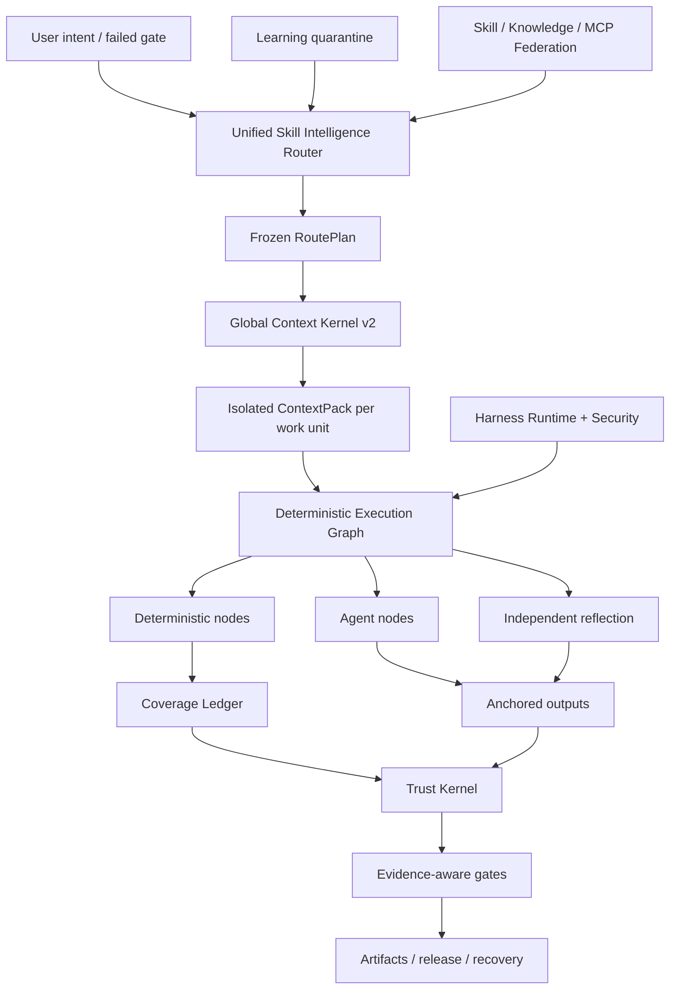

<p align="center">
  
</p>

<p align="center">
  <a href="LICENSE"></a>
  <a href="CHANGELOG.md"></a>
  
  
  
</p>

<p align="center"></p>
<h1 align="center">ForgeOS</h1>
<p align="center">ForgeOS memutuskan <strong>keahlian mana yang boleh dijalankan</strong>, <strong>konteks mana yang boleh dijalankan</strong>, <strong>langkah mana yang harus dilakukan deterministik</strong>, dan <strong>yang buktinya cukup kuat untuk menerima penyelesaian</strong>.</p>

---

## Mengapa ForgeOS ada

Agen tidak dapat diandalkan karena memiliki lebih banyak perintah, lebih banyak alat, atau jendela konteks yang lebih panjang.

Sistem menjadi andal bila dapat menjawab enam pertanyaan:

1. **Hasil persis apa yang diperlukan?**
2. **Teknik manakah yang tepat—dan teknik serupa manakah yang salah di sini?**
3. **Konteks terkecil apa yang dibutuhkan unit kerja ini?**
4. **Langkah-langkah manakah yang harus bersifat deterministik dan bukan didelegasikan ke suatu model?**
5. **Bukti independen apa yang membuktikan keluarannya?**
6. **Dapatkah alur kerja yang sama pulih, dilanjutkan, dan diaudit sendiri setelah kegagalan?**

ForgeOS v0.6 mengubah pertanyaan-pertanyaan tersebut menjadi runtime:

```text
niat yang dikonfirmasi
  → pengambilan hasil + teknik
  → kebijakan keras dan filter anti-pemicu
  → DAG RoutePlan minimum
  → ContextPack terisolasi per unit kerja
  → grafik eksekusi deterministik / agen / refleksi
  → keluaran berlabuh + buku besar cakupan
  → kuitansi terpercaya + gerbang bukti
  → rilis, rollback, pemulihan, dan karantina pembelajaran
```

Ini bukan koleksi cepat. Ini adalah bidang kendali seputar keterampilan, aturan, kaitan, agen, alat, konteks, bukti, dan pembelajaran.

---

## Apa yang nyata di v0.6.1

| Permukaan | Implementasi terverifikasi |
|---|---:|
| Perancah hasil yang diketik lama | **1.024** |
| Teknik Kontrak Keterampilan Mendalam v2 | **128** |
| L0 teknik orkestrasi/kepercayaan/konteks | **32** |
| Teknik rekayasa lintas domain L1 | **96** |
| Ikatan evaluator independen | **128** |
| Penyedia prosedural yang stabil | **33** |
| Calon penyedia prosedur | **242** |
| Keterampilan bawaan + pemetaan pengetahuan | **1.299** |
| Kasus kepatuhan Intelijen Tinjauan Kode | **12** |
| Kasus permusuhan permukaan agen | **20/20** |
| Materialisasi penyedia yang stabil | **33/33** |
| Router Presisi@1 / @3 | **93,75% / 100%** |
| Penarikan Router@6 | **100%** |
| Aktivasi rute tidak aman | **0%** |

> [!PENTING]
> 1.024 node lama adalah **perancah hasil**, bukan 1.024 keterampilan prosedural tingkat produksi. v0.6 berisi 128 kontrak teknik mendalam. Tiga puluh tiga penyedia prosedural tetap berada dalam saluran perutean stabil yang dinyatakan untuk kompatibilitas, namun audit sertifikasi akhir menemukan 0/128 stabil yang memenuhi syarat bukti dan 0 tersertifikasi berdasarkan Definisi Selesai Revisi 2. Bukti yang tersisa memerlukan ketidaksepakatan, multi-model berpasangan, tekanan, tinjauan independen, dan penerimaan produksi.

**Inventaris kernel:** 32 teknik L0 + 96 teknik L1 = 128 teknik kernel dalam.

**Status perutean katalog:** 33 penyedia prosedur saluran stabil yang dinyatakan dan 242 kandidat. **Bukti sertifikasi formal:** 0 berkualifikasi stabil, 0 bersertifikasi. Lihat [Audit Sertifikasi Akhir](docs/FINAL-CERTIFICATION-AUDIT.md).

Audit rilis dengan sengaja membuat klaim berikut ini salah:

```text
1.024 keterampilan prosedural tingkat produksi salah
siklus hidup PostgreSQL penuh HA salah
kotak pasir microVM universal salah
tolok ukur ulasan 200-PR yang diberi label ahli salah
10.000 evaluasi berpasangan berjalan salah
```

ForgeOS v0.6 tidak mengklaim kelengkapan produksi universal atau 1.024 keterampilan prosedural tingkat produksi.

Lihat [Batas Klaim v0.6](docs/CLAIMS-BOUNDARY-V0.6.md).

---

## Jalur lima menit

Gunakan jalur ini ketika Anda menginginkan nilai tanpa mempelajari Trust Kernel terlebih dahulu.

### 1. Instal

```bash
npm install
npm test
node src/cli/forge.mjs init
```

Paket yang diinstal:

```bash
npx forgeos init
forge doctor
```

`forge init` membuat profil SQLite-WAL lokal yang aman. Kunci API-nya ditulis ke file `0600` dan tidak pernah dicetak.

### 2. Temukan teknik yang tepat

```bash
forge skills search "react rerender"
forge skills inspect reducing-react-render-thrashing
forge route --query "compile the minimum context for a large monorepo"
```

### 3. Periksa v0.6

```bash
forge v06 status
forge profile plan coding --target codex
forge security scan --file agent-surface.json
```

### 4. Mulai bidang kontrol lokal

```bash
npm start
# Dashboard: http://127.0.0.1:8787/dashboard
# MCP:       http://127.0.0.1:8787/mcp
# A2A:       http://127.0.0.1:8787/a2a
```

---

## Jalur operator yang dalam

Gunakan jalur ini saat menyematkan ForgeOS ke Codex, Claude Code, ChatGPT, agen sumber terbuka, CI, atau platform internal.

### Router Kecerdasan Keterampilan

Router melakukan pengambilan dua tahap alih-alih mencocokkan nama keahlian:

```text
gerbang niat/gagal
  → pengambilan hasil
  → pengambilan pemicu teknik langsung
  → pengecualian anti-pemicu
  → kepercayaan, penyewa, jatuh tempo, alat, lisensi, filter kesegaran
  → pemeringkatan utilitas terukur
  → teknik minimum DAG
  → resolusi penyedia
  → RoutePlan beku
```

Setiap teknik yang dipilih dan ditolak pasti ada alasannya. Pemblokir keras selalu mengalahkan skor.

### Kernel Konteks Global v2

ForgeOS menganggarkan permintaan lengkap:

```text
sistem · tugas · bagian keterampilan yang dipilih · simbol kode · artefak
· memori · keluaran alat · referensi · skema alat malas
· cadangan keluaran · cadangan pengaman
```

Ini menyediakan:

- satu antarmuka token-akuntansi yang digunakan bersama oleh penyelesai dan materializer;
- pemuatan keterampilan tingkat bagian;
- konteks terisolasi per unit kerja;
- materialisasi skema alat yang malas;
- ID simbol ABI semantik dan penolakan hash basi;
- proyeksi delta artefak;
- suntikan insting yang terbatas dan kadaluwarsa;
- log mentah yang ditujukan pada konten dengan rentang kegagalan yang disaring;
- manifes kelalaian untuk setiap sumber yang tidak disertakan.

### Struktur Keterampilan deterministik

Teknik v0.6 dikompilasi menjadi grafik yang dapat dieksekusi:

```text
Node deterministik
  seleksi ruang lingkup · bundling · resolusi aturan · penahan · bukti

Node agen
  penyelidikan · hipotesis · penilaian domain

Node refleksi
  kontradiksi · filter positif palsu · kemampuan untuk ditindaklanjuti

Node kontrol
  gabung paralel · gerbang cakupan · coba lagi · kembalikan
```

Buku besar cakupan SQLite menggunakan sewa, detak jantung, pagar, dan tanda terima tepercaya. Pekerja yang direklamasi tidak dapat menandai suatu unit kerja sebagai selesai.

### Potongan vertikal Intelijen Tinjauan Kode

Irisan vertikal lengkap pertama membuktikan arsitektur ujung ke ujung:

```text
cakupan yang lengkap
→ unit kerja yang sadar akan hubungan
→ pemilihan aturan kontekstual
→ analisis agen terisolasi
→ jangkar garis/hash
→ relokasi setelah pengeditan
→ refleksi mandiri
→ tanda terima cakupan
```

Kumpulan 12 kasus korpus adalah tolok ukur kesesuaian deterministik. Ini **tidak** diiklankan sebagai tolok ukur 200-PR yang diberi label ahli.

### Pembelajaran Berkelanjutan—tanpa keracunan diri secara otomatis

Pola yang diamati menjadi naluri yang tercakup, bukan keterampilan yang stabil:

```text
tanda terima berjalan tepercaya
  → naluri yang diamati
  → isolasi penyewa/proyek/harness + TTL
  → cluster naluri yang kompatibel
  → proposal evolusi kandidat
  → evaluasi independen
  → promosi atau kemunduran manusia
```

Produser tidak dapat mempromosikan perilaku yang dipelajarinya sendiri.

### Memanfaatkan Waktu Proses v2

ForgeOS membedakan empat permukaan:

| Permukaan | Gunakan untuk |
|---|---|
| **Aturan** | Invarian pendek yang harus selalu diterapkan |
| **Kait** | Tindakan deterministik terikat pada suatu peristiwa |
| **Keterampilan** | Prosedur bersyarat yang memerlukan penilaian |
| **Peran agen** | Pisahkan konteks, alat, model, atau otoritas |

Peristiwa netral meliputi `before.tool.execute`, `after.file.write`, `verification.checkpoint`, `session.compact`, dan `session.ended`. Adaptor host harus menandai fitur yang tidak didukung alih-alih mengklaim paritas palsu.

Profil:

```text
minimal · coding · kreatif · penelitian · diatur
lokal-kecil · perusahaan
```

### Keamanan Permukaan Agen

Mesin keamanan memindai sistem agen itu sendiri:

- instruksi dan pelanggaran batas segera;
- kait dan skrip siklus hidup paket;
- Deskripsi MCP, izin, dan jangkauan alat;
- daftar perintah yang diizinkan;
- referensi rahasia/lingkungan;
- jalur izin rahasia-ke-keluar;
- kemampuan pipe-to-shell dan wildcard yang luas;
- izin profil berbeda sebelum instalasi.

Korpus musuhnya saat ini melewati **20/20** kasus.

### Eksekusi lokal yang diperantarai

Pelari lokal memberikan batas keamanan nyata untuk perintah normal:

- tidak ada interpolasi cangkang;
- daftar izin perintah dan lingkungan;
- ruang kerja dan penahanan symlink;
- batas waktu dan penghentian grup proses;
- stdout/stderr terbatas;
- tanda terima eksekusi yang ditujukan pada konten.

Ini **bukan** sandbox mikroVM penyangkal jaringan universal. Eksekusi pihak ketiga yang berisiko tinggi masih memerlukan wadah eksternal atau lapisan isolasi mikroVM.

---


# Cara kerja ForgeOS

ForgeOS menggabungkan dua produk dalam satu runtime:

1. **Lapisan Skill Intelligence** yang mengambil teknik, menolak hampir cocok yang tidak aman, hanya mengkompilasi bagian keterampilan yang diperlukan, dan membuat rencana eksekusi yang dibekukan.
2. **Pesawat kendali AI** yang mengelola proyek, artefak, bukti, persetujuan, sewa, pemulihan, federasi, dan gerbang pelepasan.

```text
niat terkonfirmasi atau gerbang gagal
  → pengambilan hasil dan teknik langsung
  → filter anti-pemicu, penyewa, kepercayaan, alat, lisensi, dan kesegaran
  → RoutePlan DAG minimum yang dibekukan
  → ContextPack terisolasi per unit kerja
  → Grafik Eksekusi deterministik / agen / refleksi
  → keluaran berlabuh dan Buku Besar Cakupan yang dipagari
  → tanda terima tepercaya dan gerbang yang sadar akan jaminan
  → rilis, pemulihan, rollback, atau karantina pembelajaran
```

## Sepuluh sistem kerja sama

| Sistem | Apa yang dikontrolnya |
|---|---|
| **Router Kecerdasan Keterampilan** | Pengambilan hasil, penilaian teknik, anti-pemicu, kebijakan keras, pemilihan penyedia, dan RoutePlans yang dapat dijelaskan |
| **Kernel Konteks Global v2** | Satu total anggaran token di seluruh kebijakan, tugas, bagian keterampilan, simbol, artefak, memori, keluaran alat, referensi, dan cadangan keluaran |
| **Fasilitas Keterampilan Deterministik** | Grafik hibrid berisi node deterministik, node agen, node refleksi, persetujuan, jangkar, dan kondisi berhenti |
| **Buku Besar Cakupan** | Kepemilikan unit kerja, sewa, token pagar, cakupan penyelesaian, penolakan pekerja basi, dan dapat dilanjutkan |
| **Percayai Kernel** | Kesegaran bukti, silsilah artefak, otoritas persetujuan, tingkat jaminan, dan keputusan pelepasan |
| **Agen Keamanan Permukaan** | Pola injeksi cepat, skrip paket berbahaya, jalur rahasia ke jalan keluar, izin, dan kejujuran kemampuan adaptor |
| **Eksekusi Lokal yang Diperantarai** | Pemijahan perintah bebas shell, daftar yang diizinkan, batas waktu, batas keluaran, dan penerimaan terstruktur |
| **Belajar Berkelanjutan** | Naluri yang tercakup, kadaluwarsa, kepercayaan diri, karantina, usulan kandidat, dan promosi terkendali |
| **Federasi Keterampilan** | Sumber yang ditandatangani, tingkat kepercayaan, karantina, penanganan konflik, pencabutan, dan katalog yang disinkronkan |
| **Memanfaatkan Waktu Proses v2** | Aturan, kaitan, keterampilan, peran agen, perbedaan izin, dan profil untuk berbagai pemanfaatan AI |

---

# Perbandingan ekosistem

> [!PENTING]
> Perbandingan ini menjelaskan **fokus asli kelas satu dari setiap repositori inti**. `◐` berarti dukungan parsial, dukungan berbasis ekstensi, atau dukungan melalui produk yang berdekatan. `—` berarti ini bukan fokus utama proyek, bukan berarti tidak mungkin untuk dibangun.

Bintang GitHub di bawah adalah perkiraan angka yang diperiksa pada **26 Juli 2026**. Mereka menunjukkan visibilitas komunitas, bukan kualitas rekayasa itu sendiri.

## Peta ekosistem

| Proyek | Kira-kira. Bintang GitHub | Peran utama |
|---|---:|---|
| [Kekuatan Super](https://github.com/obra/superpowers) | **255rb** | Kerangka keterampilan agen dan metodologi pengembangan perangkat lunak |
| [Keterampilan Agen Antropik](https://github.com/anthropics/skills) | **151rb** | Standar keterampilan dan perpustakaan keterampilan umum untuk Claude |
| [LangChain](https://github.com/langchain-ai/langchain) | **139rb** | Platform rekayasa agen dan ekosistem integrasi besar |
| [OpenHands](https://github.com/All-Hands-AI/OpenHands) | **75rb+** | Aplikasi agen pengembangan perangkat lunak ujung ke ujung |
| [CrewAI](https://github.com/crewAIInc/crewAI) | **56rb+** | Kru multi-agen dan aliran berbasis peristiwa |
| [Gen Otomatis](https://github.com/microsoft/autogen) | **50rb+** | Pesan multi-agen dan runtime penelitian |
| [LangGraph](https://github.com/langchain-ai/langgraph) | **37rb+** | Grafik agen yang sudah berjalan lama |
| [Kernel Semantik](https://github.com/microsoft/semantic-kernel) | **28rb+** | SDK orkestrasi perusahaan multi-bahasa |
| [Keterampilan Agen yang Luar Biasa](https://github.com/VoltAgent/awesome-agent-skills) | **28rb+** | Katalog komunitas lebih dari seribu keterampilan |
| [SDK Agen OpenAI](https://github.com/openai/openai-agents-python) | **27rb+** | Agen, serah terima, pagar pembatas, sesi, dan penelusuran |
| [agen pembakar](https://github.com/huggingface/smolagents) | **27rb+** | Pustaka agen minimal dengan penekanan agen kode |
| [Letta](https://github.com/letta-ai/letta) | **23rb+** | Agen stateful dan memori persisten |
| [Google ADK](https://github.com/google/adk-python) | **sekitar 20rb** | Pembuatan, evaluasi, dan penerapan agen yang mengutamakan kode |
| [PydanticAI](https://github.com/pydantic/pydantic-ai) | **sekitar 19rb** | Kerangka kerja agen Python yang aman untuk tipe |

## Matriks kemampuan inti

| Sistem | Keterampilan yang dikemas | Perutean + anti-pemicu | Konteks yang diatur | Grafik hibrid deterministik/agen | Bukti + kwitansi kepercayaan | Keamanan permukaan agen | Kekuatan asli |
|---|:---:|:---:|:---:|:---:|:---:|:---:|---|
| **ForgeOS** | ✅ | ✅ | ✅ | ✅ | ✅ | ✅ | Kecerdasan keterampilan dan eksekusi yang dapat dipercaya |
| Keterampilan Antropik | ✅ | ◐ | ◐ | — | — | ◐ | Standar keterampilan portabel yang sederhana |
| Kekuatan Super | ✅ | ✅ | ◐ | ◐ | ◐ | — | Metodologi SDLC yang sangat eksplisit untuk agen pengkodean |
| Keterampilan Agen yang Luar Biasa | ✅ | — | — | — | — | ◐ | Penemuan keterampilan di banyak sumber |
| Rantai Lang | ◐ | ◐ | ◐ | ◐ | ◐ | ◐ | Ekosistem integrasi yang sangat besar |
| Grafik Lang | ◐ | ◐ | ◐ | ✅ | ◐ | ◐ | Eksekusi yang tahan lama dan grafik stateful |
| SDK Agen OpenAI | ◐ | ◐ | ◐ | ◐ | ◐ | ◐ | Kerangka kerja ringan, handoff, dan penelusuran |
| kruAI | ◐ | ◐ | ◐ | ✅ | ◐ | ◐ | Agen berbasis peran dikombinasikan dengan Flows |
| Generasi Otomatis | ◐ | ◐ | ◐ | ✅ | ◐ | ◐ | Runtime multi-agen berbasis peristiwa |
| Kernel Semantik / MAF | ◐ | ◐ | ◐ | ✅ | ◐ | ◐ | Orkestrasi perusahaan di seluruh runtime |
| Google ADK | ◐ | ◐ | ◐ | ✅ | ◐ | ◐ | Membangun, mengevaluasi, dan menerapkan di ekosistem Google |
| PydanticAI | ◐ | ◐ | ◐ | ◐ | ◐ | ◐ | Ketik keamanan, validasi, dan ergonomi Python |
| agen smolagen | ◐ | ◐ | ◐ | ◐ | — | ◐ | Implementasi agen yang minimal dan mudah dibaca |
| Ayo | ◐ | ◐ | ✅ | ◐ | ◐ | ◐ | Memori persisten dan agen stateful |
| Tangan Terbuka | ◐ | ◐ | ◐ | ◐ | ◐ | ✅ | Pengalaman agen pengkodean ujung ke ujung |

## ForgeOS memilih medan perang yang berbeda

Gudang keterampilan menjawab: **“Prosedur apa yang dapat dipelajari agen?”**

ForgeOS juga menanyakan: **“Teknik manakah yang diperbolehkan saat ini, pencocokan jarak dekat mana yang harus ditolak, bagian mana yang boleh masuk konteks, alat apa yang diperlukan, bukti apa yang harus ditunjukkan, dan gerbang mana yang dapat menyatakan pekerjaan telah selesai?”**

Kerangka kerja agen membantu membuat agen, alat, handoff, dan alur kerja. ForgeOS berfokus pada lapisan di sekitar runtime tersebut: pengambilan kemampuan, anti-pemicu, anggaran konteks global, grafik deterministik/agen/refleksi, bukti terkini, otoritas persetujuan, silsilah artefak, pemulihan, dan karantina pembelajaran.

Sistem memori berfokus pada apa yang diingat agen. ForgeOS juga mengontrol penyewa, proyek, pengguna, domain kepercayaan, masa berlaku, kepercayaan, dan kebijakan promosi mana yang termasuk dalam memori.

Agen pengkodean ujung ke ujung memberikan pengalaman pengguna. ForgeOS dapat berjalan **di bawah atau di samping** agen tersebut sebagai lapisan pemilihan keterampilan, tata kelola konteks, bukti, kepercayaan, dan siklus hidup proyek.

## Dimana ekosistem yang matang masih memimpin

Mereka saat ini memiliki komunitas yang lebih besar, lebih banyak tutorial dan integrasi, pengalaman cloud terkelola yang lebih baik, orientasi tanpa kode yang lebih kuat, dan penerapan produksi yang lebih terdokumentasi secara publik. ForgeOS sengaja berkonsentrasi pada masalah yang kurang terstandarisasi: **mengontrol pilihan keterampilan, konteks, bukti, otoritas, dan status penyelesaian untuk agen AI**.

---

# Tiga jalur masuk

## Untuk pengguna sehari-hari

Anda tidak perlu memahami setiap subsistem. Mulailah dengan empat tes yang dapat diamati:

```bash
node src/cli/forge.mjs doctor
node src/cli/forge.mjs skills search --query "review authentication changes"
node src/cli/forge.mjs route --query "review authentication changes without missing tests"
node src/cli/forge.mjs scan agent-surface --path .
```

Anda dapat memeriksa teknik mana yang dipilih, mengapa alternatif ditolak, seberapa banyak konteks yang dikumpulkan, izin apa yang diminta, dan bukti mana yang masih hilang.

## Untuk pengembang

ForgeOS memaparkan runtime yang sama melalui:

- CLI untuk operasi lokal dan CI;
- API HTTP dan dasbor Studio;
- **60 alat MCP dengan skema ketat**;
- Permukaan tugas A2A dan kartu agen;
- impor layanan langsung dari pohon sumber Node.js;
- **15 adaptor** untuk agen dan ekosistem IDE;
- tujuh profil harness: `minimal`, `coding`, `creative`, `research`, `regulated`, `local-small`, dan `enterprise`.

Pengembang dapat membuat proyek, mendaftarkan artefak, mengikat bukti, meminta persetujuan, mengkompilasi RoutePlans dan ContextPacks, mengeksekusi grafik, memulihkan revisi, menyinkronkan keterampilan gabungan, atau menambahkan Skill Contract v2.

## Untuk para ahli dan peneliti

ForgeOS dirancang untuk ditantang daripada diterima dari halaman pemasaran. Para ahli dapat menguji secara mandiri:

- presisi router, penarikan kembali, perilaku anti-pemicu, dan aktivasi yang tidak aman;
- luapan konteks total dan pengurangan ABI Semantik;
- cakupan deterministik, jangkar, refleksi, sewa, dan pagar;
- kesegaran bukti, silsilah artefak, dan gerbang yang sadar akan jaminan;
- injeksi cepat, skrip paket, jalur rahasia ke jalan keluar, dan kejujuran adaptor;
- konflik federasi, karantina, pencabutan, dan kepercayaan sumber;
- verifikasi arsip tanpa `.git`.

```bash
npm run validate
npm run v06:audit
npm run router:benchmark
npm run context:benchmark
npm run federation:eval
npm run federation:audit
npm run smoke
npm run adapter:tck
npm run release:verify
```

---

# Peta repositori

```text
src/ implementasi waktu proses
  cli/ menempa antarmuka baris perintah
  inti/proyek, artefak, bukti, persetujuan, pemulihan
  keterampilan-kecerdasan/kontrak, perutean, evaluasi, materialisasi
  konteks/Konteks Global Kernel dan kompilasi unit kerja
  eksekusi/kompiler grafik, node deterministik, cakupan
  kepercayaan/bukti, jaminan, otoritas, gerbang pelepasan
  pemindaian permukaan agen/keamanan dan perantara perintah
  federasi/sumber jarak jauh, kepercayaan, karantina, sinkronisasi
  pembelajaran / naluri, kandidat, kadaluwarsa, promosi
  server mcp/ MCP dan 60 alat publik
  kartu a2a/ A2A, tugas, pesan, dan tanda terima
  server/API HTTP, otentikasi, dasbor
  penyimpanan/ persistensi dan migrasi SQLite-WAL
adaptor/15 agen dan adaptor IDE
skill-v2/ 128 teknik Kontrak Keterampilan v2 yang mendalam
kemampuan-v2/ hasil, teknik, penyedia, hubungan, grafik
skema/kontrak Skema JSON publik 2020-12
paket/paket kemampuan vertikal dan tolok ukur
kasus evaluasi/evaluasi, rubrik, dan corpora
tes/ 125 file uji dan rilis invarian
bukti/hasil audit, benchmark, SBOM, dan bukti dashboard
dokumen/arsitektur, protokol, keamanan, pengujian, produksi
skrip/pembuatan, validasi, audit, benchmark, dan alat rilis
```

# Kasus penggunaan yang sesuai

- Membuat agen pengkodean lebih disiplin dan dapat diaudit.
- Membangun bidang kendali untuk beberapa model, agen, dan alat.
- Mengoperasikan platform keterampilan internal dengan kontrol perutean dan kematangan.
- Meninjau konfigurasi agen, izin, perintah, dan permukaan rantai pasokan.
- Alur kerja dengan jaminan tinggi atau teregulasi yang memerlukan bukti dan gerbang persetujuan.
- Mengurangi pemborosan konteks dalam repositori besar melalui isolasi unit kerja dan ABI Semantik.

ForgeOS bukanlah pengganti otomatisasi alur kerja bisnis bergaya n8n. n8n menghubungkan aplikasi dan acara bisnis; ForgeOS mengontrol pemilihan teknik AI, konteks, eksekusi, bukti, dan otoritas. Mereka dapat digunakan bersama-sama.

---

## Arsitektur



---

## Integrasi MCP dan agen

ForgeOS menggunakan MCP `2025-11-25`, A2A `1.0`, paket yang kompatibel dengan Keterampilan Agen, HTTP, dan CLI.

v0.6 alat publik meliputi:

```text
menempa_v06_status
forge_execution_graph_compile
forge_review_scope_compile
menempa_konteks_kerja_unit_kompilasi
menempa_harness_profile_plan
forge_agent_surface_scan
```

Mereka bergabung dengan proyek yang ada, artefak, bukti tepercaya, pemulihan, federasi, Skill Intelligence, dan alat broker MCP. Stdio, HTTP MCP, CLI, dan Studio berbagi layanan dan Skema JSON yang sama.

Paket adaptor yang didukung mencakup ChatGPT, Codex, Claude Code, Cursor, OpenCode, Gemini CLI, Copilot CLI, Cline, Roo Code, Windsurf, Continue, NolaneNative, OpenClaw, Pi, dan MCP/A2A generik. Bukti membedakan adaptor yang **telah diuji protokol** dengan panduan **hanya dokumentasi**.

---

## Verifikasi

```bash
npm run validate
npm run skills:v2:audit
npm run v06:audit
npm run router:benchmark
npm run context:benchmark
npm run federation:eval
npm run federation:audit
npm run smoke
npm run adapter:tck
npm run release:verify
```

Gerbang rilis memeriksa perilaku dan kontrak, tidak hanya cakupan jalur:

- invarian status, pagar, anti basi, dan siklus hidup;
- siklus hidup dan skema keluaran MCP/A2A penuh;
- kedalaman keterampilan, boilerplate, hash bagian, dan materialisasi;
- presisi router, penarikan kembali, determinisme, dan aktivasi yang tidak aman;
- akuntansi luapan dan kelalaian konteks global;
- buku besar eksekusi dan cakupan deterministik;
- meninjau jangkar dan refleksi;
- evaluasi independen dan karantina pembelajaran berkelanjutan;
- kasus permusuhan di permukaan agen;
- instalasi arsip dan verifikasi mandiri tanpa `.git`.

---

## Batas produksi

**Terintegrasi hari ini**

- Backend siklus hidup node tunggal SQLite WAL;
- revisi/CAS, sewa, pagar, snapshot, pemulihan, ACL, kunci OIDC/API;
- tanda terima tepercaya, hash amplop artefak, gerbang yang sadar akan jaminan;
- federasi keterampilan/pengetahuan/MCP yang mencakup penyewa;
- pengurasan yang baik, kesiapan, metrik, asal rilis yang ditandatangani;
- profil penerapan non-root/read-only.

**Belum klaim v0.6**

- backend drop-in PostgreSQL siklus hidup penuh dan failover multi-node yang diuji;
- kotak pasir microVM pihak ketiga universal;
- SCIM/administrasi organisasi yang didelegasikan;
- layanan transparansi yang dikelola dan PKI;
- Streaming/push A2A dan resume yang didistribusikan;
- 1.024 keterampilan prosedural tingkat produksi;
- 10.000 eval run berpasangan;
- tolok ukur peninjauan kode lintas bahasa yang diputuskan oleh pakar.

Baca [Produksi](docs/PRODUCTION.md), [Model Keamanan](docs/SECURITY-MODEL.md), dan [Self-Audit v0.6](docs/SELF-AUDIT-V0.6.md).

---

## Peta dokumentasi

| Mulai di sini | Menyelam lebih dalam |
|---|---|
| [Mulai Cepat](docs/QUICKSTART.md) | [Arsitektur](docs/ARCHITECTURE.md) |
| [Kecerdasan Keterampilan](docs/SKILL-INTELLIGENCE.md) | [Deterministic Fabric v0.6](docs/DETERMINISTIC-SKILL-FABRIC-V06.md) |
| [CLI dan profil](docs/HARNESS-RUNTIME-V2.md) | [Kernel Konteks Global](docs/GLOBAL-CONTEXT-KERNEL.md) |
| [Keamanan](docs/AGENT-SURFACE-SECURITY.md) | [Pembelajaran Berkelanjutan](docs/CONTINUOUS-LEARNING-V06.md) |
| [Pengujian](docs/TESTING.md) | [Batas Klaim](docs/CLAIMS-BOUNDARY-V0.6.md) |
| [Berkontribusi](CONTRIBUTING.md) | [Audit Mandiri](docs/SELF-AUDIT-V0.6.md) |

---

## Bahasa

[Universal Lanes](docs/UNIVERSAL-LANES.md) · [Remote MicroVM Sandbox](docs/REMOTE-MICROVM-SANDBOX.md) · [Tiếng Việt](README-vn.md) · [简体中文](README-cn.md) · [繁體中文](README-tw.md) · [日本語](README-ja.md) · [한국어](README-ko.md) · [Español](README-es.md) · [Français](README-fr.md) · [Deutsch](README-de.md) · [Português](README-pt-br.md) · [Русский](README-ru.md) · [العربية](README-ar.md) · [हिन्दी](README-hi.md) · [Bahasa Indonesia](README-id.md) · [ไทย](README-th.md) · [Türkçe](README-tr.md) · [Italiano](README-it.md) · [Polski](README-pl.md) · [Українська](README-uk.md) · [Nederlands](README-nl.md) · [فارسی](README-fa.md) · [עברית](README-he.md) · [Svenska](README-sv.md)

---

## Berkontribusi

Keterampilan baru tidak diterima karena prosanya terdengar ahli. Ini membutuhkan:

1. baseline MERAH yang gagal tanpa teknik tersebut;
2. pemicu dan anti pemicu yang tepat;
3. prosedur dan model kegagalan domain tertentu;
4. mengetik masukan, keluaran, alat, dan bukti;
5. bagian hash dan anggaran token;
6. pengikatan evaluator independen;
7. bukti patokan dan keputusan yang matang.

Lihat [CONTRIBUTING.md](CONTRIBUTING.md), [GOVERNANCE.md](GOVERNANCE.md), dan [SECURITY.md](SECURITY.md).

## Lisensi

MIT — lihat [LISENSI](LICENSE).


## Audit rilis akhir

- [Laporan Pengerasan Akhir](docs/FINAL-HARDENING-REPORT.md)
- [Audit Sertifikasi Keterampilan Akhir](docs/FINAL-CERTIFICATION-AUDIT.md)
