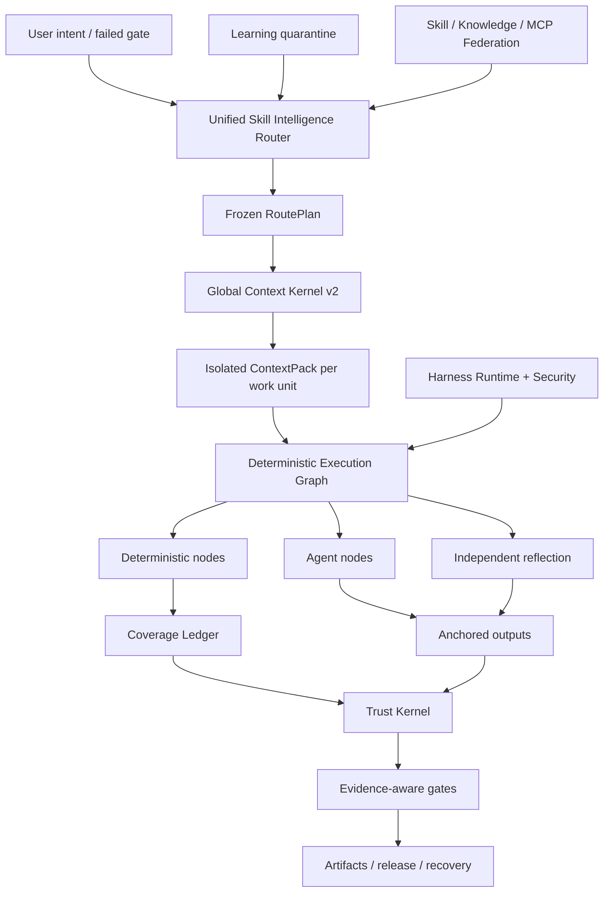

<p align="center">
  
</p>

<p align="center">
  <a href="LICENSE"></a>
  <a href="CHANGELOG.md"></a>
  
  
  
</p>

<p align="center"></p>
<h1 align="center">ForgeOS</h1>
<p align="center">ForgeOS decide <strong>quale abilità può essere eseguita</strong>, <strong>quale contesto può entrare</strong>, <strong>quali passaggi devono essere deterministico</strong> e <strong>quale prova è abbastanza forte da accettare il completamento</strong>.</p>

---

## Perché esiste ForgeOS

Un agente non diventa affidabile perché dispone di più prompt, più strumenti o una finestra di contesto più lunga.

Diventa affidabile quando il sistema può rispondere a sei domande:

1. **Quale risultato esatto è richiesto?**
2. **Quale tecnica è appropriata e quali tecniche simili sono sbagliate in questo caso?**
3. **Qual è il contesto più piccolo necessario per questa unità di lavoro?**
4. **Quali passaggi devono essere deterministici anziché delegati a un modello?**
5. **Quali prove indipendenti dimostrano il risultato?**
6. **Lo stesso flusso di lavoro può essere ripristinato, ripreso e sottoposto a controllo dopo un errore?**

ForgeOS v0.6 trasforma queste domande in un runtime:

```text
intenzione confermata
  → risultato + recupero della tecnica
  → hard policy e filtri anti-trigger
  → DAG RoutePlan minimo
  → ContextPack isolato per unità di lavoro
  → grafico di esecuzione deterministico/agente/riflessione
  → output ancorati + registro di copertura
  → ricevute attendibili + controlli delle prove
  → rilascio, rollback, ripristino e quarantena di apprendimento
```

Non è una raccolta immediata. È il piano di controllo attorno a competenze, regole, ganci, agenti, strumenti, contesto, prove e apprendimento.

---

## Cosa c'è di reale nella v0.6.1

| Superficie | Implementazione verificata |
|---|---:|
| Impalcature dei risultati tipizzati legacy | **1.024** |
| Tecniche Deep Skill Contract v2 | **128** |
| L0 tecniche di orchestrazione/trust/contesto | **32** |
| Tecniche di ingegneria interdominio L1 | **96** |
| Associazioni del valutatore indipendente | **128** |
| Fornitori procedurali stabili | **33** |
| Fornitori procedurali candidati | **242** |
| Abilità integrate + mappature delle conoscenze | **1.299** |
| Casi di conformità di Code Review Intelligence | **12** |
| Casi di contraddittorio agente-superficie | **20/20** |
| Materializzazione del fornitore stabile | **33/33** |
| Precisione della fresa@1 / @3 | **93,75% / 100%** |
| Richiamo router@6 | **100%** |
| Attivazione percorso non sicuro | **0%** |

> [!IMPORTANTE]
> I 1.024 nodi legacy sono **impalcature dei risultati**, non 1.024 competenze procedurali di livello produttivo. v0.6 contiene 128 contratti di tecnica profonda. Trentatré fornitori procedurali rimangono nel canale di instradamento stabile dichiarato per compatibilità, ma l'audit di certificazione finale rileva 0/128 stabili qualificati per l'evidenza e 0 certificati secondo la definizione di Fatto della Revisione 2. Le restanti prove richiedono resistenze, multi-modello accoppiato, pressione, revisione indipendente e ricevute di produzione.

**Inventario del kernel:** 32 tecniche L0 + 96 tecniche L1 = 128 tecniche del kernel profondo.

**Stati di routing del catalogo:** 33 fornitori procedurali dichiarati a canale stabile e 242 candidati. **Prova di certificazione formale:** 0 qualificato stabile, 0 certificato. Consulta [Verifica di certificazione finale](docs/FINAL-CERTIFICATION-AUDIT.md).

Il controllo del rilascio mantiene intenzionalmente false queste affermazioni:

```text
1.024 abilità procedurali di livello produttivo false
ciclo di vita completo di PostgreSQL HA falso
sandbox microVM universale falso
Benchmark di revisione 200-PR etichettato da esperti falso
La valutazione di 10.000 coppie risulta falsa
```

ForgeOS v0.6 non rivendica la completezza della produzione universale o 1.024 competenze procedurali di livello produttivo.

Vedere [Limite delle rivendicazioni v0.6](docs/CLAIMS-BOUNDARY-V0.6.md).

---

## Percorso di cinque minuti

Utilizza questo percorso quando desideri ottenere valore senza prima apprendere il Trust Kernel.

### 1. Installa

```bash
npm install
npm test
node src/cli/forge.mjs init
```

Pacchetto installato:

```bash
npx forgeos init
forge doctor
```

`forge init` crea un profilo SQLite-WAL locale sicuro. La sua chiave API viene scritta in un file `0600` e non viene mai stampata.

### 2. Trova la tecnica giusta

```bash
forge skills search "react rerender"
forge skills inspect reducing-react-render-thrashing
forge route --query "compile the minimum context for a large monorepo"
```

### 3. Esamina la versione 0.6

```bash
forge v06 status
forge profile plan coding --target codex
forge security scan --file agent-surface.json
```

### 4. Avviare il piano di controllo locale

```bash
npm start
# Dashboard: http://127.0.0.1:8787/dashboard
# MCP:       http://127.0.0.1:8787/mcp
# A2A:       http://127.0.0.1:8787/a2a
```

---

## Percorso operatore profondo

Utilizza questo percorso quando incorpori ForgeOS in Codex, Claude Code, ChatGPT, un agente open source, CI o una piattaforma interna.

### Router di intelligenza delle abilità

Il router esegue il recupero in due fasi invece di associare un nome di abilità:

```text
intento/cancello fallito
  → recupero dei risultati
  → recupero diretto dell'attivazione della tecnica
  → esclusione anti-trigger
  → filtri fiducia, inquilino, maturità, strumento, licenza, freschezza
  → riclassificazione dell'utilità misurata
  → tecnica minima DAG
  → risoluzione del fornitore
  → RoutePlan congelato
```

Ogni tecnica selezionata e scartata ha un motivo. I bloccanti duri battono sempre il punteggio.

### Kernel di contesto globale v2

ForgeOS preventiva la richiesta completa:

```text
sistema · compito · sezioni di abilità selezionate · simboli di codice · artefatti
· memoria · output dello strumento · riferimenti · schemi di strumenti pigri
· riserva di potenza · riserva di sicurezza
```

Fornisce:

- un'interfaccia di token accounting condivisa da risolutore e materializzatore;
- caricamento delle competenze a livello di sezione;
- contesto isolato per unità di lavoro;
- materializzazione pigra dello schema degli strumenti;
- ID dei simboli ABI semantici e rifiuto degli hash obsoleti;
- proiezione delta dell'artefatto;
- iniezione d'istinto mirata e in scadenza;
- registri grezzi indirizzati al contenuto con intervalli di errore distillati;
- un manifesto di omissione per ogni fonte non inclusa.

### Tessuto di abilità deterministiche

Una tecnica v0.6 è compilata in un grafico eseguibile:

```text
Nodi deterministici
  selezione dell'ambito · raggruppamento · risoluzione delle regole · ancoraggio · prove

Nodi dell'agente
  indagine · ipotesi · giudizio di dominio

Nodi di riflessione
  contraddizione · filtro falsi positivi · perseguibilità

Nodi di controllo
  unione parallela · gate di copertura · riprova · rollback
```

Il registro di copertura SQLite utilizza contratti di locazione, heartbeat, fencing e ricevute attendibili. Un lavoratore reclamato non può contrassegnare un'unità di lavoro come completata.

### Sezione verticale di Code Review Intelligence

La prima fetta verticale completa dimostra l'architettura dall'inizio alla fine:

```text
ambito completo
→ unità di lavoro relazionali
→ selezione contestuale delle regole
→ analisi dell'agente isolato
→ ancoraggi di linea/hash
→ trasferimento dopo le modifiche
→ riflessione indipendente
→ ricevuta di copertura
```

Il corpus di 12 casi in bundle è un benchmark di conformità deterministica. **Non** è pubblicizzato come benchmark 200-PR etichettato da esperti.

### Apprendimento continuo: senza avvelenamento automatico

I modelli osservati diventano istinti mirati, non abilità stabili:

```text
ricevute di esecuzione attendibili
  → istinto osservato
  → isolamento locatario/progetto/cablaggio + TTL
  → gruppo di istinti compatibili
  → proposta di evoluzione del candidato
  → valutazione indipendente
  → promozione o arretramento umano
```

Il produttore non può promuovere il proprio comportamento appreso.

### Cablaggio Runtime v2

ForgeOS distingue quattro superfici:

| Superficie | Usalo per |
|---|---|
| **Regola** | Invariante breve che deve sempre applicarsi |
| **Gancio** | Azione deterministica legata ad un evento |
| **Abilità** | Procedura condizionale con obbligo di giudizio |
| **Ruolo agente** | Contesto, strumenti, modello o autorità separati |

Gli eventi neutrali includono `before.tool.execute`, `after.file.write`, `verification.checkpoint`, `session.compact` e `session.ended`. Gli adattatori host devono contrassegnare le funzionalità non supportate invece di dichiarare una falsa parità.

Profili:

```text
minimo · codifica · creativo · ricerca · regolamentato
locale-piccola ·impresa
```

### Sicurezza della superficie dell'agente

Il motore di sicurezza esegue la scansione del sistema agente stesso:

- istruzioni e tempestive violazioni dei confini;
- hook e script del ciclo di vita del pacchetto;
- Descrizioni MCP, autorizzazioni e raggiungibilità dello strumento;
- liste consentite dei comandi;
- riferimenti segreti/ambientali;
- percorsi di autorizzazione secret-to-egress;
- capacità pipe-to-shell e ampia di caratteri jolly;
- Differenze di autorizzazione del profilo prima dell'installazione.

Il suo corpo accusatorio attualmente supera **20/20** casi.

### Esecuzione locale mediata

Il corridore locale fornisce un vero e proprio confine di sicurezza per i normali comandi:

- nessuna interpolazione della shell;
- liste consentite di comandi e ambienti;
- contenimento dello spazio di lavoro e dei collegamenti simbolici;
- timeout e terminazione del gruppo di processi;
- stdout/stderr limitato;
- ricevuta di esecuzione indirizzata al contenuto.

**Non** è un sandbox microVM universale che nega la rete. L'esecuzione da parte di terze parti ad alto rischio richiede comunque un contenitore esterno o un livello di isolamento microVM.

---


# Come funziona ForgeOS

ForgeOS combina due prodotti in un unico runtime:

1. **Un livello di Skill Intelligence** che recupera le tecniche, rifiuta le corrispondenze quasi non sicure, compila solo le sezioni delle abilità richieste e crea un piano di esecuzione congelato.
2. **Un piano di controllo AI** che gestisce progetti, artefatti, prove, approvazioni, lease, ripristino, federazione e gate di rilascio.

```text
intento confermato o gate fallito
  → risultato e recupero tramite tecnica diretta
  → filtri anti-trigger, tenant, attendibilità, strumento, licenza e aggiornamento
  → DAG RoutePlan minimo congelato
  → ContextPack isolato per unità di lavoro
  → Grafico di esecuzione deterministico/agente/riflessione
  → uscite ancorate e Coverage Ledger recintato
  → ricevute attendibili e gate consapevoli
  → rilascio, ripristino, rollback o quarantena di apprendimento
```

## Dieci sistemi cooperanti

| Sistema | Cosa controlla |
|---|---|
| **Router di intelligenza delle competenze** | Recupero dei risultati, punteggio della tecnica, anti-trigger, policy rigida, selezione del fornitore e RoutePlans spiegabili |
| **Kernel contesto globale v2** | Un budget totale per token tra policy, attività, sezioni di competenze, simboli, artefatti, memoria, output dello strumento, riferimenti e riserva di output |
| **Tessuto di abilità deterministiche** | Grafici ibridi contenenti nodi deterministici, nodi agente, nodi riflessione, approvazioni, ancoraggi e condizioni di arresto |
| **Registro di copertura** | Proprietà di unità di lavoro, locazioni, gettoni di recinzione, copertura del completamento, rifiuto del lavoratore obsoleto e recuperabilità |
| **Trust Kernel** | Freschezza delle prove, derivazione degli artefatti, autorità di approvazione, livelli di garanzia e decisioni di rilascio |
| **Sicurezza superficie agente** | Modelli di prompt-injection, script di pacchetti pericolosi, percorsi di uscita dei segreti, autorizzazioni e onestà delle funzionalità dell'adattatore |
| **Esecuzione locale mediata** | Generazione di comandi senza shell, liste consentite, timeout, limiti di output e ricevute strutturate |
| **Apprendimento continuo** | Istinti mirati, scadenza, fiducia, quarantena, proposte di candidati e promozione controllata |
| **Federazione delle competenze** | Origini firmate, livelli di attendibilità, quarantena, gestione dei conflitti, revoca e cataloghi sincronizzati |
| **Harness Runtime v2** | Regole, hook, competenze, ruoli degli agenti, differenze di autorizzazione e profili per diversi cablaggi AI |

---

# Confronto degli ecosistemi

> [!IMPORTANTE]
> Questo confronto descrive il **focus nativo e di prima classe di ciascun repository principale**. `◐` indica supporto parziale, supporto basato su estensione o supporto tramite un prodotto adiacente. `—` significa che non è l'obiettivo principale del progetto, non che sia impossibile da costruire.

Le stelle di GitHub riportate di seguito sono cifre approssimative verificate il **26 luglio 2026**. Indicano la visibilità della comunità, non la qualità ingegneristica di per sé.

## Mappa dell'ecosistema

| Progetto | ca. Stelle di GitHub | Ruolo primario |
|---|---:|---|
| [Superpoteri](https://github.com/obra/superpowers) | **255k** | Quadro delle competenze degli agenti e metodologia di sviluppo software |
| [Abilità dell'agente antropico](https://github.com/anthropics/skills) | **151k** | Standard di abilità e libreria di abilità pubbliche per Claude |
| [LangChain](https://github.com/langchain-ai/langchain) | **139k** | Piattaforma di ingegneria degli agenti e ampio ecosistema di integrazione |
| [OpenHands](https://github.com/All-Hands-AI/OpenHands) | **75k+** | Applicazione agente di sviluppo software end-to-end |
| [CrewAI](https://github.com/crewAIInc/crewAI) | **56k+** | Equipe multi-agente e flussi guidati dagli eventi |
| [AutoGen](https://github.com/microsoft/autogen) | **50k+** | Messaggistica multi-agente e runtime di ricerca |
| [LangGraph](https://github.com/langchain-ai/langgraph) | **37k+** | Grafici dell'agente con stato e di lunga esecuzione |
| [Kernel semantico](https://github.com/microsoft/semantic-kernel) | **28k+** | SDK di orchestrazione aziendale multilingue |
| [Fantastiche abilità dell'agente](https://github.com/VoltAgent/awesome-agent-skills) | **28k+** | Catalogo comunitario di oltre mille competenze |
| [SDK degli agenti OpenAI](https://github.com/openai/openai-agents-python) | **27k+** | Agenti, trasferimenti, guardrail, sessioni e tracciamento |
| [smolagenti](https://github.com/huggingface/smolagents) | **27k+** | Libreria di agenti minima con enfasi sull'agente di codice |
| [Letta](https://github.com/letta-ai/letta) | **23k+** | Agenti con stato e memoria persistente |
| [Google ADK](https://github.com/google/adk-python) | **circa 20k** | Creazione, valutazione e distribuzione di agenti code-first |
| [PydanticAI](https://github.com/pydantic/pydantic-ai) | **circa 19k** | Framework agente Python indipendente dai tipi |

## Matrice delle capacità principali

| Sistema | Competenze confezionate | Routing + anti-trigger | Contesto governato | Grafico ibrido deterministico/agente | Prove + ricevute fiduciarie | Sicurezza della superficie dell'agente | Forza nativa |
|---|:---:|:---:|:---:|:---:|:---:|:---:|---|
| **ForgeOS** | ✅ | ✅ | ✅ | ✅ | ✅ | ✅ | Competenze intelligenti ed esecuzione affidabile |
| Competenze antropiche | ✅ | ◐ | ◐ | — | — | ◐ | Standard di abilità semplice e portatile |
| Superpoteri | ✅ | ✅ | ◐ | ◐ | ◐ | — | Metodologia SDLC altamente esplicita per gli agenti di codifica |
| Abilità straordinarie dell'agente | ✅ | — | — | — | — | ◐ | Scoperta di abilità attraverso molte fonti |
| LangChain | ◐ | ◐ | ◐ | ◐ | ◐ | ◐ | Ecosistema di integrazione molto ampio |
| GraficoLang | ◐ | ◐ | ◐ | ✅ | ◐ | ◐ | Esecuzione durevole e grafici con stato |
| SDK degli agenti OpenAI | ◐ | ◐ | ◐ | ◐ | ◐ | ◐ | Framework leggero, trasferimenti e tracciamento |
| EquipaggioAI | ◐ | ◐ | ◐ | ✅ | ◐ | ◐ | Agenti basati su ruoli combinati con Flows |
| Generazione automatica | ◐ | ◐ | ◐ | ✅ | ◐ | ◐ | Runtime multi-agente basato sugli eventi |
| Kernel semantico/MAF | ◐ | ◐ | ◐ | ✅ | ◐ | ◐ | Orchestrazione aziendale tra i runtime |
| ADK di Google | ◐ | ◐ | ◐ | ✅ | ◐ | ◐ | Costruisci, valuta e implementa nell'ecosistema di Google |
| PydanticAI | ◐ | ◐ | ◐ | ◐ | ◐ | ◐ | Sicurezza del tipo, convalida ed ergonomia Python |
| smolanti | ◐ | ◐ | ◐ | ◐ | — | ◐ | Implementazione dell'agente minima e leggibile |
| Letta | ◐ | ◐ | ✅ | ◐ | ◐ | ◐ | Memoria persistente e agenti con stato |
| Mani Aperte | ◐ | ◐ | ◐ | ◐ | ◐ | ✅ | Esperienza con agente di codifica end-to-end |

## ForgeOS sceglie un campo di battaglia diverso

Un repository di competenze risponde: **“Quali procedure può apprendere l'agente?”**

ForgeOS chiede inoltre: **"Quale tecnica è consentita ora, quale quasi corrispondenza deve essere rifiutata, quali sezioni possono entrare nel contesto, quali strumenti sono richiesti, quali prove devono essere prodotte e quale cancello può dichiarare il lavoro completato?"**

Una struttura di agenti aiuta a creare agenti, strumenti, trasferimenti e flussi di lavoro. ForgeOS si concentra sul livello che circonda quel runtime: recupero delle capacità, anti-trigger, budget del contesto globale, grafici deterministici/agente/riflessione, prove attuali, autorità di approvazione, derivazione degli artefatti, recupero e quarantena dell'apprendimento.

Un sistema di memoria si concentra su ciò che un agente ricorda. ForgeOS controlla inoltre a quale tenant, progetto, utente, dominio di trust, scadenza, policy di confidenza e promozione appartiene la memoria.

Un agente di codifica end-to-end fornisce l'esperienza dell'utente. ForgeOS può essere eseguito **sotto o accanto** a quell'agente come livello di selezione delle competenze, governance del contesto, prove, fiducia e ciclo di vita del progetto.

## Dove conducono ancora gli ecosistemi maturi

Attualmente dispongono di community più grandi, più tutorial e integrazioni, esperienze di cloud gestito più raffinate, un più forte onboarding senza codice e implementazioni di produzione più documentate pubblicamente. ForgeOS si concentra deliberatamente su un problema meno standardizzato: **controllare la scelta delle competenze, il contesto, le prove, l'autorità e lo stato di completamento per gli agenti IA**.

---

# Tre percorsi di ingresso

## Per gli utenti di tutti i giorni

Non è necessario comprendere ogni sottosistema. Inizia con quattro test osservabili:

```bash
node src/cli/forge.mjs doctor
node src/cli/forge.mjs skills search --query "review authentication changes"
node src/cli/forge.mjs route --query "review authentication changes without missing tests"
node src/cli/forge.mjs scan agent-surface --path .
```

È possibile verificare quale tecnica è stata selezionata, perché le alternative sono state rifiutate, quanto contesto è stato compilato, quali autorizzazioni sono richieste e quali prove mancano ancora.

## Per gli sviluppatori

ForgeOS espone lo stesso runtime attraverso:

- CLI per funzionamento locale e CI;
- API HTTP e dashboard di Studio;
- **60 strumenti MCP con vincoli di schema**;
- Superfici task e carte agente A2A;
- importazioni dirette di servizi dall'albero dei sorgenti Node.js;
- **15 adattatori** per ecosistemi agenti e IDE;
- sette profili di cablaggio: `minimal`, `coding`, `creative`, `research`, `regulated`, `local-small` e `enterprise`.

Gli sviluppatori possono creare progetti, registrare artefatti, associare prove, richiedere approvazioni, compilare RoutePlan e ContextPack, eseguire grafici, recuperare revisioni, sincronizzare competenze federate o aggiungere un nuovo contratto di competenza v2.

## Per esperti e ricercatori

ForgeOS è progettato per essere sfidato piuttosto che accettato da una pagina di marketing. Gli esperti possono testare in modo indipendente:

- precisione del router, richiamo, comportamento anti-trigger e attivazione non sicura;
- overflow del contesto totale e riduzione dell'ABI semantica;
- copertura deterministica, ancore, riflessione, locazioni e recinzioni;
- freschezza delle prove, discendenza degli artefatti e cancelli di riconoscimento della garanzia;
- inserimento tempestivo, script dei pacchetti, percorsi segreti in uscita e onestà dell'adattatore;
- conflitto federativo, quarantena, revoca e trust della fonte;
- verifica dell'archivio senza `.git`.

```bash
npm run validate
npm run v06:audit
npm run router:benchmark
npm run context:benchmark
npm run federation:eval
npm run federation:audit
npm run smoke
npm run adapter:tck
npm run release:verify
```

---

# Mappa del repository

```text
src/implementazione runtime
  cli/ forge interfaccia della riga di comando
  nucleo/progetto, artefatto, evidenza, approvazione, recupero
  skill-intelligence/contratti, instradamento, valutazione, materializzazione
  contesto/Contesto globale Kernel e compilazione di unità di lavoro
  esecuzione/compilatore di grafi, nodi deterministici, copertura
  fiducia/evidenza, garanzia, autorità, porte di rilascio
  scansione della sicurezza/superficie dell'agente e broker dei comandi
  federazione/origini remote, fiducia, quarantena, sincronizzazione
  apprendimento/istinto, candidati, scadenza, promozione
  server mcp/MCP e 60 strumenti pubblici
  Carte, attività, messaggi e ricevute a2a/A2A
  server/API HTTP, autenticazione, dashboard
  storage/persistenza e migrazioni SQLite-WAL
adattatori/15 agenti e adattatori IDE
skills-v2/ 128 tecniche approfondite di Skill Contract v2
capacità-v2/ risultati, tecniche, fornitori, relazioni, grafico
schemi/contratti pubblici JSON Schema 2020-12
pacchetti/pacchetti di capacità verticale e benchmark
valutazioni/casi di valutazione, rubriche e corpora
tests/ 125 file di test e invarianti di rilascio
prove/prove di audit, benchmark, SBOM e dashboard generate
documenti/architettura, protocolli, sicurezza, test, produzione
script/generazione, convalida, audit, benchmark e strumenti di rilascio
```

# Casi d'uso idonei

- Rendere gli agenti di codifica più disciplinati e verificabili.
- Costruire un piano di controllo per diversi modelli, agenti e strumenti.
- Gestione di una piattaforma di competenze interna con controlli di routing e maturità.
- Revisione delle configurazioni degli agenti, delle autorizzazioni, delle richieste e delle superfici della catena di fornitura.
- Flussi di lavoro regolamentati o ad alta garanzia che richiedono prove e cancelli di approvazione.
- Riduzione degli sprechi di contesto in repository di grandi dimensioni attraverso l'isolamento delle unità di lavoro e l'ABI semantica.

ForgeOS non sostituisce l'automazione del flusso di lavoro aziendale in stile n8n. n8n collega applicazioni ed eventi aziendali; ForgeOS controlla la selezione, il contesto, l'esecuzione, le prove e l'autorità delle tecniche di intelligenza artificiale. Possono essere usati insieme.

---

## Architettura



---

## Integrazione di MCP e agenti

ForgeOS supporta MCP `2025-11-25`, A2A `1.0`, pacchetti compatibili con Agent Skills, HTTP e CLI.

Gli strumenti pubblici v0.6 includono:

```text
forge_v06_status
forge_execution_graph_compile
forge_review_scope_compile
forge_context_work_units_compile
forge_harness_profile_plan
forge_agent_surface_scan
```

Si uniscono agli strumenti esistenti di progetto, artefatto, prove attendibili, ripristino, federazione, Skill Intelligence e broker MCP. Stdio, HTTP MCP, CLI e Studio condividono gli stessi servizi e schemi JSON.

I pacchetti di adattatori supportati includono ChatGPT, Codex, Claude Code, Cursor, OpenCode, Gemini CLI, Copilot CLI, Cline, Roo Code, Windsurf, Continue, NolaneNative, OpenClaw, Pi e MCP/A2A generico. Le prove distinguono gli adattatori **testati con protocollo** dalle guide **di sola documentazione**.

---

## Verifica

```bash
npm run validate
npm run skills:v2:audit
npm run v06:audit
npm run router:benchmark
npm run context:benchmark
npm run federation:eval
npm run federation:audit
npm run smoke
npm run adapter:tck
npm run release:verify
```

Il gate di rilascio controlla il comportamento e i contratti, non solo la copertura della linea:

- invarianti state, fencing, stale-proof e lifecycle;
- ciclo di vita completo di MCP/A2A e schemi di output;
- profondità delle competenze, boilerplate, hash della sezione e materializzazione;
- precisione, richiamo, determinismo e attivazione non sicura del router;
- overflow del contesto globale e contabilità delle omissioni;
- esecuzione deterministica e registro di copertura;
- rivedere ancoraggi e riflessioni;
- valutazione indipendente e quarantena per l'apprendimento continuo;
- casi di contraddittorio agente-superficie;
- installazione dell'archivio e autoverifica senza `.git`.

---

## Confine di produzione

**Integrato oggi**

- Backend del ciclo di vita a nodo singolo SQLite WAL;
- revisione/CAS, lease, fencing, snapshot, ripristino, ACL, chiave OIDC/API;
- ricevute attendibili, hash delle buste degli artefatti, gate di riconoscimento della garanzia;
- federazione di competenze/conoscenze/MCP a livello di locatario;
- drenaggio grazioso, prontezza, metriche, provenienza del rilascio firmato;
- Profili di distribuzione non root/di sola lettura.

**Non ancora una richiesta v0.6**

- backend drop-in PostgreSQL per l'intero ciclo di vita e failover multinodo testato;
- sandbox microVM universale di terze parti;
- Amministrazione SCIM/organismi delegati;
- servizio di trasparenza gestito e PKI;
- Curriculum vitae streaming/push e distribuito A2A;
- 1.024 competenze procedurali di livello produttivo;
- 10.000 corse di valutazione accoppiate;
- Benchmark di revisione del codice multilingue giudicato da esperti.

Leggi [Produzione](docs/PRODUCTION.md), [Modello di sicurezza](docs/SECURITY-MODEL.md) e [Self-Audit v0.6](docs/SELF-AUDIT-V0.6.md).

---

## Mappa della documentazione

| Inizia qui | Immersione profonda |
|---|---|
| [Avvio rapido](docs/QUICKSTART.md) | [Architettura](docs/ARCHITECTURE.md) |
| [Intelligenza abilità](docs/SKILL-INTELLIGENCE.md) | [Tessuto deterministico v0.6](docs/DETERMINISTIC-SKILL-FABRIC-V06.md) |
| [CLI e profili](docs/HARNESS-RUNTIME-V2.md) | [Kernel del contesto globale](docs/GLOBAL-CONTEXT-KERNEL.md) |
| [Sicurezza](docs/AGENT-SURFACE-SECURITY.md) | [Apprendimento continuo](docs/CONTINUOUS-LEARNING-V06.md) |
| [Test](docs/TESTING.md) | [Limite delle rivendicazioni](docs/CLAIMS-BOUNDARY-V0.6.md) |
| [Contribuire](CONTRIBUTING.md) | [Autocontrollo](docs/SELF-AUDIT-V0.6.md) |

---

## Lingue

[Universal Lanes](docs/UNIVERSAL-LANES.md) · [Remote MicroVM Sandbox](docs/REMOTE-MICROVM-SANDBOX.md) · [Tiếng Việt](README-vn.md) · [简体中文](README-cn.md) · [繁體中文](README-tw.md) · [日本語](README-ja.md) · [한국어](README-ko.md) · [Español](README-es.md) · [Français](README-fr.md) · [Deutsch](README-de.md) · [Português](README-pt-br.md) · [Русский](README-ru.md) · [العربية](README-ar.md) · [हिन्दी](README-hi.md) · [Bahasa Indonesia](README-id.md) · [ไทย](README-th.md) · [Türkçe](README-tr.md) · [Italiano](README-it.md) · [Polski](README-pl.md) · [Українська](README-uk.md) · [Nederlands](README-nl.md) · [فارسی](README-fa.md) · [עברית](README-he.md) · [Svenska](README-sv.md)

---

## Contribuire

Una nuova abilità non è accettata perché la sua prosa sembra esperta. Ha bisogno di:

1. una linea di base ROSSA che fallisce senza la tecnica;
2. trigger e anti-trigger precisi;
3. una procedura specifica per il dominio e un modello di fallimento;
4. input, output, strumenti e prove digitati;
5. hash di sezione e budget dei token;
6. vincoli del valutatore indipendente;
7. prove di riferimento e una decisione sulla maturità.

Vedi [CONTRIBUTING.md](CONTRIBUTING.md), [GOVERNANCE.md](GOVERNANCE.md) e [SECURITY.md](SECURITY.md).

## Licenza

MIT: vedere [LICENZA](LICENSE).


## Verifiche del rilascio finale

- [Rapporto finale sul rafforzamento](docs/FINAL-HARDENING-REPORT.md)
- [Verifica finale della certificazione delle competenze](docs/FINAL-CERTIFICATION-AUDIT.md)
