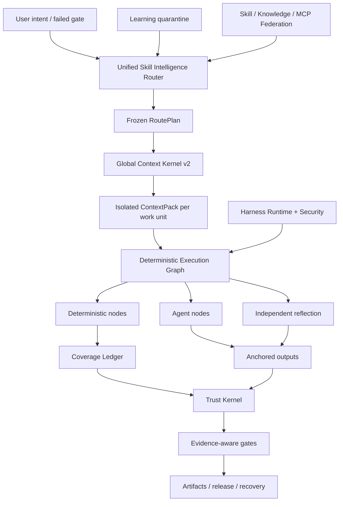

<p align="center">
  
</p>

<p align="center">
  <a href="LICENSE"></a>
  <a href="CHANGELOG.md"></a>
  
  
  
</p>

<p align="center"></p>
<h1 align="center">ForgeOS</h1>
<p align="center">ForgeOS는 <strong>실행할 수 있는 스킬을 결정합니다</strong>, <strong>어떤 컨텍스트가 입력될 수 있는지</strong>, <strong>어떤 단계를 거쳐야 하는지 결정적</strong> 및 <strong>완료를 승인할 만큼 강력한 증거</strong>.</p>

---

## ForgeOS가 존재하는 이유

더 많은 프롬프트, 더 많은 도구 또는 더 긴 컨텍스트 창이 있기 때문에 에이전트를 신뢰할 수 없습니다.

시스템이 다음과 같은 6가지 질문에 답할 수 있으면 신뢰성이 높아집니다.

1. **정확히 어떤 결과가 필요합니까?**
2. **여기서 어떤 기술이 적절하고 어떤 유사한 기술이 잘못되었습니까?**
3. **이 작업 단위에 필요한 가장 작은 컨텍스트는 무엇입니까?**
4. **어떤 단계가 모델에 위임되지 않고 결정적이어야 합니까?**
5. **결과를 입증하는 독립적인 증거는 무엇입니까?**
6. **실패 후 동일한 워크플로우가 자체적으로 복구, 재개 및 감사될 수 있습니까?**

ForgeOS v0.6은 이러한 질문을 런타임으로 전환합니다.

```text
확인된 의도
  → 결과 + 기술 검색
  → 하드 정책 및 안티 트리거 필터
  → 최소 RoutePlan DAG
  → 작업 단위별로 격리된 ContextPack
  → 결정론적/에이전트/반사 실행 그래프
  → 고정된 출력 + 적용 범위 원장
  → 신뢰할 수 있는 영수증 + 증거 게이트
  → 릴리스, 롤백, 복구 및 학습 격리
```

프롬프트 컬렉션이 아닙니다. 이는 기술, 규칙, 후크, 에이전트, 도구, 컨텍스트, 증거 및 학습에 대한 제어 평면입니다.

---

## v0.6.1에서 진짜란 무엇인가

| 표면 | 검증된 구현 |
|---|---:|
| 레거시 유형의 결과 스캐폴드 | **1,024** |
| Deep Skill Contract v2 기술 | **128** |
| L0 오케스트레이션/신뢰/컨텍스트 기술 | **32** |
| L1 크로스 도메인 엔지니어링 기술 | **96** |
| 독립 평가자 바인딩 | **128** |
| 안정적인 절차 제공자 | **33** |
| 후보자 절차 제공자 | **242** |
| 내장된 기술 + 지식 매핑 | **1,299** |
| 코드 검토 인텔리전스 적합성 사례 | **12** |
| 에이전트-표면 적대 사례 | **20/20** |
| 안정적인 공급자 구현 | **33/33** |
| 라우터 정밀@1 / @3 | **93.75% / 100%** |
| 라우터 리콜@6 | **100%** |
| 안전하지 않은 경로 활성화 | **0%** |

> [!중요]
> 1,024개의 레거시 노드는 1,024개의 프로덕션 등급 절차 기술이 아닌 **결과 발판**입니다. v0.6에는 128개의 심층 기술 계약이 포함되어 있습니다. 33개의 절차 공급자는 호환성을 위해 선언된 안정 라우팅 채널에 남아 있지만 최종 인증 감사에서는 0/128 증거 자격을 갖춘 안정 및 개정 2 정의 완료에 따라 인증된 0을 찾습니다. 나머지 증거에는 검증, 쌍을 이루는 다중 모델, 압력, 독립적 검토 및 생산 영수증이 필요합니다.

**커널 인벤토리:** 32개 L0 기술 + 96개 L1 기술 = 128개 딥 커널 기술.

**카탈로그 라우팅 상태:** 33개의 선언된 안정 채널 절차 제공자와 242개의 후보. **공식 인증 증거:** 안정적 자격을 갖춘 0개, 인증된 0개. [최종 인증 감사](docs/FINAL-CERTIFICATION-AUDIT.md)를 참조하세요.

릴리스 감사에서는 의도적으로 이러한 주장을 거짓으로 유지합니다.

```text
1,024개의 프로덕션급 절차 기술 거짓
전체 PostgreSQL 수명 주기 HA false
범용 microVM 샌드박스 false
전문가 라벨이 붙은 200-PR 리뷰 벤치마크 거짓
10,000개의 쌍 평가가 거짓으로 실행됨
```

ForgeOS v0.6은 보편적인 생산 완성도나 1,024개의 생산 등급 절차 기술을 요구하지 않습니다.

[클레임 경계 v0.6](docs/CLAIMS-BOUNDARY-V0.6.md)을 참조하세요.

---

## 5분 코스

Trust Kernel을 먼저 학습하지 않고 가치를 원할 때 이 경로를 사용하십시오.

### 1. 설치

```bash
npm install
npm test
node src/cli/forge.mjs init
```

설치된 패키지:

```bash
npx forgeos init
forge doctor
```

`forge init`은 안전한 로컬 SQLite-WAL 프로필을 생성합니다. 해당 API 키는 `0600` 파일에 기록되며 인쇄되지 않습니다.

### 2. 적합한 기술 찾기

```bash
forge skills search "react rerender"
forge skills inspect reducing-react-render-thrashing
forge route --query "compile the minimum context for a large monorepo"
```

### 3. v0.6 검사

```bash
forge v06 status
forge profile plan coding --target codex
forge security scan --file agent-surface.json
```

### 4. 로컬 제어 플레인 시작

```bash
npm start
# Dashboard: http://127.0.0.1:8787/dashboard
# MCP:       http://127.0.0.1:8787/mcp
# A2A:       http://127.0.0.1:8787/a2a
```

---

## 깊은 연산자 경로

ForgeOS를 Codex, Claude Code, ChatGPT, 오픈 소스 에이전트, CI 또는 내부 플랫폼에 포함할 때 이 경로를 사용하십시오.

### 스킬 인텔리전스 라우터

라우터는 스킬 이름을 일치시키는 대신 2단계 검색을 수행합니다.

```text
의도/실패한 게이트
  → 결과 검색
  → 직접적인 기술-트리거 검색
  → 안티 트리거 제외
  → 신뢰, 임차인, 성숙도, 도구, 라이센스, 신선도 필터
  → 측정된 효용 재순위
  → 최소 기술 DAG
  → 공급자 해상도
  → RoutePlan 고정
```

선택되거나 거부된 모든 기술에는 이유가 있습니다. 하드 블로커는 항상 점수를 이깁니다.

### 글로벌 컨텍스트 커널 v2

ForgeOS는 전체 요청의 예산을 책정합니다.

```text
시스템 · 작업 · 선택된 기술 섹션 · 코드 기호 · 인공물
· 메모리 · 도구 출력 · 참조 · 게으른 도구 스키마
· 출력 예비 · 안전 예비
```

다음을 제공합니다:

- Resolver와 Materializer가 공유하는 하나의 토큰 계산 인터페이스
- 섹션 수준 스킬 로딩
- 작업 단위별로 격리된 컨텍스트
- 게으른 도구 스키마 구체화;
- 시맨틱 ABI 기호 ID 및 오래된 해시 거부
- 아티팩트 델타 투영;
- 범위가 지정되고 만료되는 본능 주입;
- 증류된 실패 범위가 포함된 콘텐츠 주소가 지정된 원시 로그
- 포함되지 않은 모든 소스에 대한 누락 매니페스트.

### 결정적 스킬 패브릭

v0.6 기술은 실행 가능한 그래프로 컴파일됩니다.

```text
결정적 노드
  범위 선택 · 묶음 · 규칙 해결 · 앵커링 · 증거

에이전트 노드
  조사 · 가설 · 영역 판단

반사 노드
  모순 · 위양성 필터 · 실행 가능성

제어 노드
  병렬 조인 · 커버리지 게이트 · 재시도 · 롤백
```

SQLite 적용 범위 원장은 임대, 하트비트, 펜싱 및 신뢰할 수 있는 영수증을 사용합니다. 복귀 근로자는 작업 단위를 완료로 표시할 수 없습니다.

### 코드 검토 인텔리전스 수직 슬라이스

첫 번째 완전한 수직 조각은 아키텍처의 엔드투엔드를 증명합니다.

```text
전체 범위
→ 관계 인식 작업 단위
→ 상황에 맞는 규칙 선택
→ 분리된 에이전트 분석
→ 라인/해시 앵커
→ 편집 후 재배치
→ 독립적인 반성
→ 보장 영수증
```

번들로 제공되는 12가지 사례 코퍼스는 결정론적 적합성 벤치마크입니다. 전문가가 표시한 200-PR 벤치마크로 광고되지 **않습니다**.

### 지속적인 학습—자동 자가 중독 없음

관찰된 패턴은 안정적인 기술이 아니라 범위가 지정된 본능이 됩니다.

```text
신뢰할 수 있는 실행 영수증
  → 관찰된 본능
  → 테넌트/프로젝트/하네스 격리 + TTL
  → 호환 본능 클러스터
  → 후보 진화 제안
  → 독립적인 평가
  → 인간 승격 또는 롤백
```

생산자는 자신의 학습된 행동을 홍보할 수 없습니다.

### 하네스 런타임 v2

ForgeOS는 네 가지 표면을 구별합니다.

| 표면 | 다음 용도로 사용 |
|---|---|
| **규칙** | 항상 적용되어야 하는 짧은 불변성 |
| **훅** | 이벤트에 바인딩된 결정적 작업 |
| **스킬** | 판단이 필요한 조건부 절차 |
| **상담원 역할** | 별도의 컨텍스트, 도구, 모델 또는 권한 |

중립 이벤트에는 `before.tool.execute`, `after.file.write`, `verification.checkpoint`, `session.compact` 및 `session.ended`가 포함됩니다. 호스트 어댑터는 잘못된 패리티를 주장하는 대신 지원되지 않는 기능을 표시해야 합니다.

프로필:

```text
최소 · 코딩 · 창의적 · 연구 · 규제
지역-소기업
```

### 에이전트 표면 보안

보안 엔진은 에이전트 시스템 자체를 검사합니다.

- 지시 및 즉각적인 경계 위반;
- 후크 및 패키지 라이프사이클 스크립트
- MCP 설명, 권한 및 도구 도달 가능성
- 명령 허용 목록;
- 비밀/환경 참조;
- 비밀에서 나가는 권한 경로;
- 파이프-쉘 및 광범위한 와일드카드 기능
- 설치 전 프로필 권한이 다릅니다.

현재 적대적 자료는 **20/20** 건을 통과했습니다.

### 중개된 로컬 실행

로컬 러너는 일반 명령에 대한 실제 안전 경계를 제공합니다.

- 쉘 보간 없음;
- 명령 및 환경 허용 목록
- 작업 공간 및 심볼릭 링크 포함;
- 시간 초과 및 프로세스 그룹 종료
- 제한된 stdout/stderr;
- 콘텐츠 주소가 지정된 실행 영수증.

이는 범용 네트워크 거부 microVM 샌드박스가 **아닙니다**. 고위험 타사 실행에는 여전히 외부 컨테이너 또는 microVM 격리 계층이 필요합니다.

---


# ForgeOS 작동 방식

ForgeOS는 두 제품을 하나의 런타임에 결합합니다.

1. 기술을 검색하고, 안전하지 않은 근접 일치를 거부하고, 필요한 기술 섹션만 컴파일하고, 동결된 실행 계획을 구축하는 **기술 인텔리전스 레이어**.
2. 프로젝트, 아티팩트, 증거, 승인, 임대, 복구, 연합 및 릴리스 게이트를 관리하는 **AI 제어 플레인**.

```text
확인된 의도 또는 실패한 게이트
  → 결과 및 직접기술 검색
  → 안티 트리거, 테넌트, 신뢰, 도구, 라이센스 및 신선도 필터
  → 최소 동결된 RoutePlan DAG
  → 작업 단위별로 격리된 ContextPack
  → 결정론적 / 에이전트 / 반영 실행 그래프
  → 고정된 출력 및 차단된 Coverage Ledger
  → 신뢰할 수 있는 영수증 및 보증 인식 게이트
  → 릴리스, 복구, 롤백 또는 학습 격리
```

## 10개의 협력 시스템

| 시스템 | 제어 대상 |
|---|---|
| **스킬 인텔리전스 라우터** | 결과 검색, 기술 채점, 안티 트리거, 하드 정책, 공급자 선택 및 설명 가능한 RoutePlans |
| **글로벌 컨텍스트 커널 v2** | 정책, 작업, 기술 섹션, 기호, 아티팩트, 메모리, 도구 출력, 참조 및 출력 예비에 걸쳐 하나의 총 토큰 예산 |
| **결정적 스킬 패브릭** | 결정적 노드, 에이전트 노드, 반사 노드, 승인, 앵커 및 중지 조건을 포함하는 하이브리드 그래프 |
| **커버리지 원장** | 작업 단위 소유권, 임대, 펜싱 토큰, 완료 범위, 오래된 작업자 거부 및 재개 가능성 |
| **신뢰 커널** | 증거 신선도, 유물 계보, 승인 권한, 보증 수준 및 릴리스 결정 |
| **에이전트 노출 보안** | 프롬프트 주입 패턴, 위험한 패키지 스크립트, 비밀 송신 경로, 권한 및 어댑터 기능 정직성 |
| **중개된 로컬 실행** | 셸 없는 명령 생성, 허용 목록, 시간 초과, 출력 제한 및 구조화된 영수증 |
| **지속적인 학습** | 범위가 지정된 본능, 만료, 신뢰, 격리, 후보 제안 및 통제된 프로모션 |
| **스킬 연합** | 서명된 소스, 신뢰 계층, 격리, 충돌 처리, 해지 및 동기화된 카탈로그 |
| **하네스 런타임 v2** | 다양한 AI 하네스에 대한 규칙, 후크, 기술, 상담원 역할, 권한 차이 및 프로필 |

---

# 생태계 비교

> [!중요]
> 이 비교에서는 **각 핵심 저장소의 기본, 최고 수준**에 대해 설명합니다. `◐`은 부분 지원, 확장 기반 지원 또는 인접 제품을 통한 지원을 의미합니다. `—`은 프로젝트의 주요 초점이 아니며 빌드가 불가능하다는 것을 의미합니다.

아래 GitHub 별은 **2026년 7월 26일**에 확인된 대략적인 수치입니다. 이는 엔지니어링 품질 자체가 아닌 커뮤니티 가시성을 나타냅니다.

## 생태계 지도

| 프로젝트 | 대략. GitHub 스타 | 주요 역할 |
|---|---:|---|
| [초능력](https://github.com/obra/superpowers) | **255,000** | 에이전트 스킬 프레임워크 및 소프트웨어 개발 방법론 |
| [인류 에이전트 스킬](https://github.com/anthropics/skills) | **151,000** | Claude의 기술 표준 및 공개 기술 라이브러리 |
| [LangChain](https://github.com/langchain-ai/langchain) | **139,000** | 에이전트 엔지니어링 플랫폼 및 대규모 통합 생태계 |
| [오픈핸즈](https://github.com/All-Hands-AI/OpenHands) | **75,000+** | 엔드투엔드 소프트웨어 개발 에이전트 애플리케이션 |
| [CrewAI](https://github.com/crewAIInc/crewAI) | **56k+** | 다중 에이전트 팀 및 이벤트 중심 흐름 |
| [AutoGen](https://github.com/microsoft/autogen) | **50,000+** | 다중 에이전트 메시징 및 연구 런타임 |
| [LangGraph](https://github.com/langchain-ai/langgraph) | **37,000+** | 상태 저장, 장기 실행 에이전트 그래프 |
| [시맨틱 커널](https://github.com/microsoft/semantic-kernel) | **28,000+** | 다국어 기업 오케스트레이션 SDK |
| [훌륭한 에이전트 기술](https://github.com/VoltAgent/awesome-agent-skills) | **28,000+** | 1,000개 이상의 기술이 포함된 커뮤니티 카탈로그 |
| [OpenAI 에이전트 SDK](https://github.com/openai/openai-agents-python) | **27,000+** | 에이전트, 핸드오프, 가드레일, 세션 및 추적 |
| [smolagents](https://github.com/huggingface/smolagents) | **27,000+** | 코드 에이전트에 중점을 둔 최소 에이전트 라이브러리 |
| [레타](https://github.com/letta-ai/letta) | **23,000+** | 상태 저장 에이전트 및 영구 메모리 |
| [구글 ADK](https://github.com/google/adk-python) | **약 20,000** | 코드 우선 에이전트 구축, 평가 및 배포 |
| [PydanticAI](https://github.com/pydantic/pydantic-ai) | **약 19,000** | 유형이 안전한 Python 에이전트 프레임워크 |

## 핵심 역량 매트릭스

| 시스템 | 패키지 기술 | 라우팅 + 안티트리거 | 관리되는 컨텍스트 | 결정적/에이전트 하이브리드 그래프 | 증거 + 신탁 영수증 | 에이전트 표면 보안 | 네이티브 강도 |
|---|:---:|:---:|:---:|:---:|:---:|:---:|---|
| **ForgeOS** | ✅ | ✅ | ✅ | ✅ | ✅ | ✅ | 스킬 지능과 신뢰할 수 있는 실행 |
| 인류학적 기술 | ✅ | ◐ | ◐ | — | — | ◐ | 간단하고 휴대 가능한 기술 표준 |
| 초능력 | ✅ | ✅ | ◐ | ◐ | ◐ | — | 코딩 에이전트를 위한 매우 명확한 SDLC 방법론 |
| 뛰어난 에이전트 기술 | ✅ | — | — | — | — | ◐ | 다양한 소스에서 기술 발견 |
| 랭체인 | ◐ | ◐ | ◐ | ◐ | ◐ | ◐ | 매우 큰 통합 생태계 |
| 랭그래프 | ◐ | ◐ | ◐ | ✅ | ◐ | ◐ | 내구성 있는 실행 및 상태 저장 그래프 |
| OpenAI 에이전트 SDK | ◐ | ◐ | ◐ | ◐ | ◐ | ◐ | 경량 프레임워크, 핸드오프 및 추적 |
| 크루AI | ◐ | ◐ | ◐ | ✅ | ◐ | ◐ | Flows와 결합된 역할 기반 에이전트 |
| 자동 생성 | ◐ | ◐ | ◐ | ✅ | ◐ | ◐ | 이벤트 기반 다중 에이전트 런타임 |
| 시맨틱 커널/MAF | ◐ | ◐ | ◐ | ✅ | ◐ | ◐ | 런타임 전반에 걸친 엔터프라이즈 오케스트레이션 |
| 구글 ADK | ◐ | ◐ | ◐ | ✅ | ◐ | ◐ | Google 생태계에서 구축, 평가, 배포 |
| 피단틱AI | ◐ | ◐ | ◐ | ◐ | ◐ | ◐ | 유형 안전성, 검증 및 Python 인체공학 |
| 연기발생제 | ◐ | ◐ | ◐ | ◐ | — | ◐ | 최소한의 읽기 가능한 에이전트 구현 |
| 레타 | ◐ | ◐ | ✅ | ◐ | ◐ | ◐ | 영구 메모리 및 상태 저장 에이전트 |
| 오픈핸즈 | ◐ | ◐ | ◐ | ◐ | ◐ | ✅ | 엔드투엔드 코딩 에이전트 경험 |

## ForgeOS는 다른 전장을 선택합니다

기술 저장소는 다음과 같이 대답합니다. **"에이전트는 어떤 절차를 배울 수 있습니까?"**

ForgeOS는 또한 다음과 같이 질문합니다. **"현재 허용되는 기술은 무엇이며, 거의 일치하는 것을 거부해야 하는지, 어떤 섹션이 컨텍스트에 들어갈 수 있는지, 어떤 도구가 필요한지, 어떤 증거를 생성해야 하는지, 어떤 게이트가 작업 완료를 선언할 수 있습니까?"**

에이전트 프레임워크는 에이전트, 도구, 전달 및 워크플로를 만드는 데 도움이 됩니다. ForgeOS는 기능 검색, 안티 트리거, 글로벌 컨텍스트 예산, 결정론적/에이전트/반사 그래프, 현재 증거, 승인 권한, 아티팩트 계보, 복구 및 학습 격리 등 해당 런타임을 둘러싼 계층에 중점을 둡니다.

기억 시스템은 에이전트가 기억하는 것에 초점을 맞춥니다. ForgeOS는 메모리가 속한 테넌트, 프로젝트, 사용자, 신뢰 도메인, 만료, 신뢰 및 승격 정책을 추가로 제어합니다.

엔드투엔드 코딩 에이전트는 사용자 경험을 제공합니다. ForgeOS는 기술 선택, 컨텍스트 거버넌스, 증거, 신뢰 및 프로젝트 수명 주기 계층으로 해당 에이전트 **아래 또는 옆**에서 실행될 수 있습니다.

## 성숙한 생태계가 여전히 이끄는 곳

현재는 더 큰 커뮤니티, 더 많은 튜토리얼 및 통합, 더 세련된 관리형 클라우드 경험, 더 강력한 노코드 온보딩, 더 공개적으로 문서화된 프로덕션 배포를 보유하고 있습니다. ForgeOS는 덜 표준화된 문제인 **AI 에이전트의 기술 선택, 컨텍스트, 증거, 권한 및 완료 상태 제어**에 의도적으로 집중합니다.

---

# 세 가지 진입 경로

## 일상적인 사용자를 위한

모든 하위 시스템을 이해할 필요는 없습니다. 관찰 가능한 네 가지 테스트로 시작하세요.

```bash
node src/cli/forge.mjs doctor
node src/cli/forge.mjs skills search --query "review authentication changes"
node src/cli/forge.mjs route --query "review authentication changes without missing tests"
node src/cli/forge.mjs scan agent-surface --path .
```

어떤 기술이 선택되었는지, 대안이 거부된 이유, 얼마나 많은 컨텍스트가 컴파일되었는지, 어떤 권한이 요청되었는지, 어떤 증거가 아직 누락되었는지 검사할 수 있습니다.

## 개발자를 위한

ForgeOS는 다음을 통해 동일한 런타임을 노출합니다.

- 로컬 운영 및 CI를 위한 CLI;
- HTTP API 및 Studio 대시보드
- **58개의 스키마 엄격한 MCP 도구**;
- A2A 작업 및 에이전트 카드 표면
- Node.js 소스 트리에서 직접 서비스 가져오기
- 에이전트 및 IDE 에코시스템용 **15개 어댑터**
- 7개의 하네스 프로필: `minimal`, `coding`, `creative`, `research`, `regulated`, `local-small` 및 `enterprise`.

개발자는 프로젝트 생성, 아티팩트 등록, 증거 바인딩, 승인 요청, RoutePlan 및 ContextPacks 컴파일, 그래프 실행, 개정 복구, 연합 기술 동기화 또는 새로운 Skill Contract v2 추가 등의 작업을 수행할 수 있습니다.

## 전문가 및 연구자용

ForgeOS는 마케팅 페이지에서 받아들이기보다는 도전하도록 설계되었습니다. 전문가는 다음을 독립적으로 테스트할 수 있습니다.

- 라우터 정밀도, 리콜, 트리거 방지 동작 및 안전하지 않은 활성화
- 전체 컨텍스트 오버플로 및 의미론적 ABI 감소
- 결정론적 적용 범위, 앵커, 반사, 임대 및 펜싱
- 증거 신선도, 유물 계보 및 보증 인식 게이트
- 신속한 주입, 패키지 스크립트, 비밀 송신 경로 및 어댑터 정직성
- 페더레이션 충돌, 격리, 해지 및 소스 신뢰;
- `.git` 없이 아카이브 확인.

```bash
npm run validate
npm run v06:audit
npm run router:benchmark
npm run context:benchmark
npm run federation:eval
npm run federation:audit
npm run smoke
npm run adapter:tck
npm run release:verify
```

---

# 저장소 맵

```text
src/런타임 구현
  cli/forge 명령줄 인터페이스
  코어/프로젝트, 유물, 증거, 승인, 복구
  기술 지능/계약, 라우팅, 평가, 구체화
  context/ Global Context 커널 및 작업 단위 컴파일
  실행/그래프 컴파일러, 결정적 노드, 적용 범위
  신뢰/증거, 보증, 권위, 릴리스 게이트
  보안/에이전트 표면 스캐닝 및 명령 브로커
  페더레이션/원격 소스, 신뢰, 격리, 동기화
  학습/본능, 후보자, 만료, 승진
  mcp/MCP 서버 및 58개 공개 도구
  a2a/ A2A 카드, 작업, 메시지, 영수증
  서버/HTTP API, 인증, 대시보드
  스토리지/SQLite-WAL 지속성 및 마이그레이션
어댑터/에이전트 및 IDE 어댑터 15개
Skill-v2/ 128 심층 스킬 계약 v2 기술
기능-v2/ 결과, 기술, 제공자, 관계, 그래프
스키마/공개 JSON 스키마 2020-12 계약
팩/수직 기능 팩 및 벤치마크
평가/평가 사례, 루브릭, 말뭉치
테스트/ 125개 테스트 파일 및 릴리스 불변성
증거/생성된 감사, 벤치마크, SBOM 및 대시보드 증거
문서/아키텍처, 프로토콜, 보안, 테스트, 생산
스크립트/생성, 검증, 감사, 벤치마크 및 릴리스 도구
```

# 적합한 사용 사례

- 코딩 에이전트를 더욱 엄격하고 감사 가능하게 만듭니다.
- 여러 모델, 에이전트 및 도구에 대한 제어 평면을 구축합니다.
- 라우팅 및 성숙도 제어 기능을 갖춘 내부 기술 플랫폼을 운영합니다.
- 상담원 구성, 권한, 프롬프트 및 공급망 표면을 검토합니다.
- 증거 및 승인 게이트가 필요한 높은 보증 또는 규제된 워크플로우.
- 작업 단위 격리 및 Semantic ABI를 통해 대규모 저장소에서 컨텍스트 낭비를 줄입니다.

ForgeOS는 n8n 스타일 비즈니스 워크플로 자동화를 대체하지 않습니다. n8n은 애플리케이션과 비즈니스 이벤트를 연결합니다. ForgeOS는 AI 기술 선택, 컨텍스트, 실행, 증거 및 권한을 제어합니다. 함께 사용할 수 있습니다.

---

## 건축학



---

## MCP 및 에이전트 통합

ForgeOS는 MCP `2025-11-25`, A2A `1.0`, Agent Skills 호환 패키지, HTTP 및 CLI를 사용합니다.

v0.6 공개 도구에는 다음이 포함됩니다.

```text
forge_v06_status
forge_execution_graph_compile
forge_review_scope_compile
forge_context_work_units_compile
forge_harness_profile_plan
forge_agent_surface_scan
```

이들은 기존 프로젝트, 아티팩트, 신뢰할 수 있는 증거, 복구, 연합, Skill Intelligence 및 MCP 브로커 도구에 참여합니다. Stdio, HTTP MCP, CLI 및 Studio는 동일한 서비스와 JSON 스키마를 공유합니다.

지원되는 어댑터 팩에는 ChatGPT, Codex, Claude Code, Cursor, OpenCode, Gemini CLI, Copilot CLI, Cline, Roo Code, Windsurf, Continue, NolaneNative, OpenClaw, Pi 및 일반 MCP/A2A가 포함됩니다. 증거에 따르면 **프로토콜 테스트** 어댑터와 **문서 전용** 가이드가 구별됩니다.

---

## 확인

```bash
npm run validate
npm run skills:v2:audit
npm run v06:audit
npm run router:benchmark
npm run context:benchmark
npm run federation:eval
npm run federation:audit
npm run smoke
npm run adapter:tck
npm run release:verify
```

릴리스 게이트는 회선 범위뿐만 아니라 동작과 계약도 확인합니다.

- 상태, 펜싱, 부실 방지 및 수명 주기 불변성
- 전체 MCP/A2A 수명주기 및 출력 스키마
- 스킬 깊이, 상용구, 섹션 해시 및 구체화
- 라우터 정밀도, 리콜, 결정성 및 안전하지 않은 활성화
- 글로벌 컨텍스트 오버플로 및 누락 계산;
- 결정론적 실행 및 적용 범위 원장
- 앵커와 반영을 검토합니다.
- 독립적인 평가 및 지속적인 학습 격리
- 에이전트 표면의 적대적인 경우
- `.git` 없이 아카이브 설치 및 자체 검증.

---

## 생산 경계

**오늘 통합됨**

- SQLite WAL 단일 노드 수명 주기 백엔드
- 개정/CAS, 임대, 펜싱, 스냅샷, 복원, ACL, OIDC/API 키
- 신뢰할 수 있는 영수증, 아티팩트 봉투 해시, 보증 인식 게이트
- 테넌트 범위의 기술/지식/MCP 연합
- 우아한 배출, 준비 상태, 메트릭, 서명된 릴리스 출처;
- 루트가 아닌/읽기 전용 배포 프로필.

**아직 v0.6 소유권 주장이 아님**

- 전체 수명 주기 PostgreSQL 드롭인 백엔드 및 테스트된 다중 노드 장애 조치;
- 범용 타사 microVM 샌드박스
- SCIM/위임기관 관리
- 관리형 투명성 서비스 및 PKI
- A2A 스트리밍/푸시 및 분산 이력서;
- 1,024개의 프로덕션 등급 절차 기술
- 10,000회 쌍의 평가 실행
- 전문가가 판단한 교차 언어 코드 검토 벤치마크.

[프로덕션](docs/PRODUCTION.md), [보안 모델](docs/SECURITY-MODEL.md) 및 [자체 감사 v0.6](docs/SELF-AUDIT-V0.6.md)을 읽어보세요.

---

## 문서 맵

| 여기서 시작하세요 | 심층 분석 |
|---|---|
| [빠른 시작](docs/QUICKSTART.md) | [아키텍처](docs/ARCHITECTURE.md) |
| [스킬 인텔리전스](docs/SKILL-INTELLIGENCE.md) | [결정적 패브릭 v0.6](docs/DETERMINISTIC-SKILL-FABRIC-V06.md) |
| [CLI 및 프로필](docs/HARNESS-RUNTIME-V2.md) | [글로벌 컨텍스트 커널](docs/GLOBAL-CONTEXT-KERNEL.md) |
| [보안](docs/AGENT-SURFACE-SECURITY.md) | [지속적 학습](docs/CONTINUOUS-LEARNING-V06.md) |
| [테스트](docs/TESTING.md) | [클레임 경계](docs/CLAIMS-BOUNDARY-V0.6.md) |
| [기여하기](CONTRIBUTING.md) | [자체감사](docs/SELF-AUDIT-V0.6.md) |

---

## 언어

[Universal Lanes](docs/UNIVERSAL-LANES.md) · [Remote MicroVM Sandbox](docs/REMOTE-MICROVM-SANDBOX.md) · [Tiếng Việt](README-vn.md) · [简体中文](README-cn.md) · [繁體中文](README-tw.md) · [日本語](README-ja.md) · [한국어](README-ko.md) · [Español](README-es.md) · [Français](README-fr.md) · [Deutsch](README-de.md) · [Português](README-pt-br.md) · [Русский](README-ru.md) · [العربية](README-ar.md) · [हिन्दी](README-hi.md) · [Bahasa Indonesia](README-id.md) · [ไทย](README-th.md) · [Türkçe](README-tr.md) · [Italiano](README-it.md) · [Polski](README-pl.md) · [Українська](README-uk.md) · [Nederlands](README-nl.md) · [فارسی](README-fa.md) · [עברית](README-he.md) · [Svenska](README-sv.md)

---

## 기여

새로운 기술은 전문적인 것처럼 들리기 때문에 받아들여지지 않습니다. 다음이 필요합니다.

1. 기술 없이는 실패하는 RED 기준선
2. 정확한 트리거 및 안티 트리거;
3. 영역별 절차 및 실패 모델
4. 입력, 출력, 도구 및 증거를 입력합니다.
5. 섹션 해시 및 토큰 예산;
6. 독립적인 평가자 구속력;
7. 벤치마크 증거 및 성숙도 결정.

[CONTRIBUTING.md](CONTRIBUTING.md), [GOVERNANCE.md](GOVERNANCE.md) 및 [SECURITY.md](SECURITY.md)를 참조하세요.

## 라이센스

MIT — [라이센스](LICENSE)를 참조하세요.


## 최종 릴리스 감사

- [최종 강화 보고서](docs/FINAL-HARDENING-REPORT.md)
- [최종 기술 인증 감사](docs/FINAL-CERTIFICATION-AUDIT.md)
