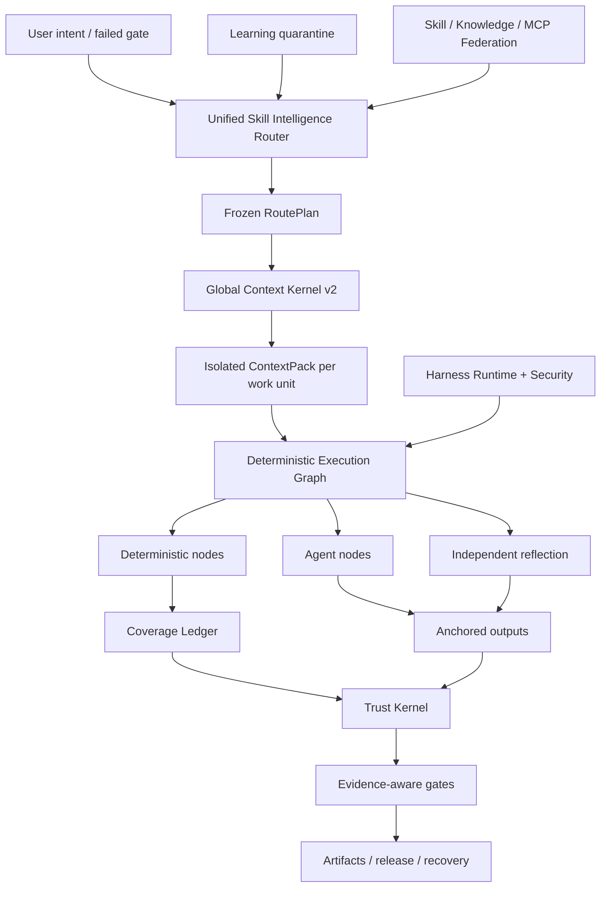

<p align="center">
  
</p>

<p align="center">
  <a href="LICENSE"></a>
  <a href="CHANGELOG.md"></a>
  
  
  
</p>

<p align="center"></p>
<h1 align="center">ForgeOS</h1>
<p align="center">ForgeOS decide <strong>qual habilidade pode ser executada</strong>, <strong>qual contexto pode entrar</strong>, <strong>quais etapas devem ser determinístico</strong> e <strong>cuja evidência é forte o suficiente para aceitar a conclusão</strong>.</p>

---

## Por que o ForgeOS existe

Um agente não se torna confiável porque possui mais prompts, mais ferramentas ou uma janela de contexto mais longa.

Torna-se confiável quando o sistema consegue responder seis perguntas:

1. **Qual resultado exato é necessário?**
2. **Qual técnica é apropriada – e quais técnicas semelhantes estão erradas aqui?**
3. **Qual é o menor contexto necessário para esta unidade de trabalho?**
4. **Quais etapas devem ser determinísticas em vez de delegadas a um modelo?**
5. **Quais evidências independentes comprovam o resultado?**
6. **O mesmo fluxo de trabalho pode se recuperar, retomar e auditar após uma falha?**

ForgeOS v0.6 transforma essas questões em tempo de execução:

```text
intenção confirmada
  → resultado + recuperação de técnica
  → políticas rígidas e filtros anti-gatilho
  → RoutePlan DAG mínimo
  → ContextPack isolado por unidade de trabalho
  → gráfico de execução determinístico/agente/reflexão
  → saídas ancoradas + razão de cobertura
  → recibos confiáveis + portas de evidências
  → liberação, reversão, recuperação e quarentena de aprendizagem
```

Não é uma coleta imediata. É o plano de controle em torno de habilidades, regras, ganchos, agentes, ferramentas, contexto, evidências e aprendizagem.

---

## O que é real na v0.6.1

| Superfície | Implementação verificada |
|---|---:|
| Andaimes de resultados digitados legados | **1.024** |
| Técnicas do Deep Skill Contract v2 | **128** |
| Técnicas de orquestração/confiança/contexto L0 | **32** |
| Técnicas de engenharia de domínio cruzado L1 | **96** |
| Vinculações de avaliadores independentes | **128** |
| Prestadores processuais estáveis ​​| **33** |
| Fornecedores processuais candidatos | **242** |
| Mapeamentos integrados de habilidade + conhecimento | **1.299** |
| Casos de conformidade de inteligência de revisão de código | **12** |
| Casos contraditórios de superfície de agente | **20/20** |
| Materialização de provedor estável | **33/33** |
| Precisão do roteador@1 / @3 | **93,75%/100%** |
| Recuperação de roteador@6 | **100%** |
| Ativação de rota insegura | **0%** |

> [!IMPORTANTE]
> Os 1.024 nós legados são **andaimes de resultados**, e não 1.024 habilidades procedimentais de nível de produção. v0.6 contém 128 contratos técnicos profundos. Trinta e três provedores processuais permanecem no canal de roteamento estável declarado para compatibilidade, mas a auditoria de certificação final encontra 0/128 estáveis ​​qualificados por evidência e 0 certificados sob a Definição de Concluído da Revisão 2. As evidências restantes requerem resistência, multimodelos emparelhados, pressão, revisão independente e receitas de produção.

**Inventário de kernel:** 32 técnicas L0 + 96 técnicas L1 = 128 técnicas profundas de kernel.

**Estados de roteamento de catálogo:** 33 provedores processuais de canal estável declarados e 242 candidatos. **Evidência de certificação formal:** 0 qualificação estável, 0 certificação. Consulte [Auditoria de certificação final](docs/FINAL-CERTIFICATION-AUDIT.md).

A auditoria de lançamento mantém intencionalmente estas afirmações falsas:

```text
1.024 habilidades processuais de nível de produção falsas
Ciclo de vida completo do PostgreSQL HA falso
sandbox microVM universal falso
benchmark de revisão 200-PR rotulado por especialista falso
10.000 avaliações pareadas são falsas
```

O ForgeOS v0.6 não reivindica completude de produção universal ou 1.024 habilidades processuais de nível de produção.

Consulte [Limite de reivindicações v0.6](docs/CLAIMS-BOUNDARY-V0.6.md).

---

## Caminho de cinco minutos

Use este caminho quando quiser valor sem aprender primeiro o Trust Kernel.

### 1. Instalar

```bash
npm install
npm test
node src/cli/forge.mjs init
```

Pacote instalado:

```bash
npx forgeos init
forge doctor
```

`forge init` cria um perfil SQLite-WAL local seguro. Sua chave API é gravada em um arquivo `0600` e nunca é impressa.

### 2. Encontre a técnica certa

```bash
forge skills search "react rerender"
forge skills inspect reducing-react-render-thrashing
forge route --query "compile the minimum context for a large monorepo"
```

### 3. Inspecione v0.6

```bash
forge v06 status
forge profile plan coding --target codex
forge security scan --file agent-surface.json
```

### 4. Inicie o plano de controle local

```bash
npm start
# Dashboard: http://127.0.0.1:8787/dashboard
# MCP:       http://127.0.0.1:8787/mcp
# A2A:       http://127.0.0.1:8787/a2a
```

---

## Caminho profundo do operador

Use este caminho ao incorporar o ForgeOS no Codex, Claude Code, ChatGPT, um agente de código aberto, CI ou uma plataforma interna.

### Roteador de Inteligência de Habilidades

O roteador executa a recuperação em dois estágios em vez de corresponder a um nome de habilidade:

```text
intenção / portão com falha
  → recuperação de resultado
  → recuperação direta do gatilho da técnica
  → exclusão anti-gatilho
  → filtros de confiança, inquilino, maturidade, ferramenta, licença, atualização
  → reclassificação da utilidade medida
  → técnica mínima DAG
  → resolução do provedor
  → RoutePlan congelado
```

Toda técnica selecionada e rejeitada tem um motivo. Os bloqueadores fortes sempre vencem a pontuação.

### Kernel de Contexto Global v2

ForgeOS orçamenta a solicitação completa:

```text
sistema · tarefa · seções de habilidades selecionadas · símbolos de código · artefatos
· memória · saída da ferramenta · referências · esquemas de ferramentas lentas
· reserva de produção · reserva de segurança
```

Ele fornece:

- uma interface de contabilidade de token compartilhada pelo resolvedor e pelo materializador;
- carregamento de habilidades em nível de seção;
- contexto isolado por unidade de trabalho;
- materialização preguiçosa de esquema de ferramenta;
- IDs de símbolos ABI semânticos e rejeição de hash obsoleto;
- projeção delta do artefato;
- injeção de instinto com escopo expirado;
- logs brutos endereçados por conteúdo com intervalos de falha destilados;
- um manifesto de omissão para cada fonte não incluída.

### Tecido de habilidades determinísticas

Uma técnica v0.6 é compilada em um gráfico executável:

```text
Nós determinísticos
  seleção de escopo · agrupamento · resolução de regras · ancoragem · evidência

Nós de agente
  investigação · hipótese · julgamento de domínio

Nós de reflexão
  contradição · filtro falso-positivo · acionabilidade

Nós de controle
  junção paralela · porta de cobertura · tentar novamente · reversão
```

O livro-razão de cobertura SQLite usa arrendamentos, pulsação, cercas e recibos confiáveis. Um trabalhador recuperado não pode marcar uma unidade de trabalho como concluída.

### Fatia vertical de inteligência de revisão de código

A primeira fatia vertical completa prova a arquitetura de ponta a ponta:

```text
escopo completo
→ unidades de trabalho com reconhecimento de relacionamento
→ seleção de regras contextuais
→ análise de agente isolado
→ âncoras de linha/hash
→ realocação após edições
→ reflexão independente
→ recibo de cobertura
```

O corpus agrupado de 12 casos é um benchmark de conformidade determinístico. **Não** é anunciado como um benchmark 200-PR rotulado por especialistas.

### Aprendizado Contínuo – sem autoenvenenamento automático

Os padrões observados tornam-se instintos com escopo definido, não habilidades estáveis:

```text
recibos de execução confiável
  → instinto observado
  → isolamento de inquilino/projeto/arnês + TTL
  → cluster de instinto compatível
  → proposta de evolução do candidato
  → avaliação independente
  → promoção humana ou reversão
```

O produtor não pode promover o seu próprio comportamento aprendido.

### Aproveite o tempo de execução v2

ForgeOS distingue quatro superfícies:

| Superfície | Use-o para |
|---|---|
| **Regra** | Invariante curto que deve sempre ser aplicado |
| **Gancho** | Ação determinística vinculada a um evento |
| **Habilidade** | Procedimento condicional que requer julgamento |
| **Função de agente** | Contexto, ferramentas, modelo ou autoridade separados |

Os eventos neutros incluem `before.tool.execute`, `after.file.write`, `verification.checkpoint`, `session.compact` e `session.ended`. Os adaptadores host devem marcar recursos não suportados em vez de reivindicar falsa paridade.

Perfis:

```text
mínimo · codificação · criativo · pesquisa · regulamentado
pequena empresa local · empresa
```

### Segurança de superfície do agente

O mecanismo de segurança verifica o próprio sistema do agente:

- instruções e violações imediatas dos limites;
- ganchos e scripts de ciclo de vida de pacotes;
- Descrições, permissões e acessibilidade da ferramenta do MCP;
- listas de permissões de comando;
- referências secretas/ambientais;
- caminhos de permissão secretos para saída;
- capacidade pipe-to-shell e curinga ampla;
- diferenças de permissão de perfil antes da instalação.

Seu corpus adversário atualmente passa por **20/20** casos.

### Execução local intermediada

O executor local fornece um limite de segurança real para comandos normais:

- sem interpolação de shell;
- listas de permissões de comando e ambiente;
- espaço de trabalho e contenção de links simbólicos;
- timeout e encerramento do grupo de processos;
- stdout/stderr limitado;
- recibo de execução endereçado ao conteúdo.

**não** é uma sandbox microVM universal que nega rede. A execução de terceiros de alto risco ainda requer um contêiner externo ou uma camada de isolamento microVM.

---


# Como funciona o ForgeOS

ForgeOS combina dois produtos em um tempo de execução:

1. **Uma camada de Skill Intelligence** que recupera técnicas, rejeita quase correspondências inseguras, compila apenas as seções de habilidades necessárias e cria um plano de execução congelado.
2. **Um plano de controle de IA** que gerencia projetos, artefatos, evidências, aprovações, concessões, recuperação, federação e portões de liberação.

```text
intenção confirmada ou portão com falha
  → resultado e recuperação de técnica direta
  → filtros anti-trigger, locatário, confiança, ferramenta, licença e atualização
  → RoutePlan DAG congelado mínimo
  → ContextPack isolado por unidade de trabalho
  → gráfico de execução determinístico/agente/reflexão
  → saídas ancoradas e livro de cobertura cercado
  → recibos confiáveis e portões com reconhecimento de garantia
  → liberação, recuperação, reversão ou quarentena de aprendizagem
```

## Dez sistemas cooperativos

| Sistema | O que controla |
|---|---|
| **Roteador de Inteligência de Habilidades** | Recuperação de resultados, pontuação técnica, anti-gatilhos, política rígida, seleção de fornecedores e RoutePlans explicáveis ​​|
| **Kernel de Contexto Global v2** | Um orçamento total de tokens para políticas, tarefas, seções de habilidades, símbolos, artefatos, memória, saída de ferramentas, referências e reserva de saída |
| **Tela de habilidades determinísticas** | Gráficos híbridos contendo nós determinísticos, nós de agente, nós de reflexão, aprovações, âncoras e condições de parada |
| **Registro de cobertura** | Propriedade de unidades de trabalho, arrendamentos, tokens de vedação, cobertura de conclusão, rejeição de trabalhadores obsoletos e retomada |
| **Kernel de confiança** | Atualização de evidências, linhagem de artefatos, autoridade de aprovação, níveis de garantia e decisões de liberação |
| **Segurança de superfície do agente** | Padrões de injeção de prompt, scripts de pacotes perigosos, caminhos secretos para saída, permissões e honestidade de capacidade do adaptador |
| **Execução local intermediada** | Geração de comandos sem shell, listas de permissões, tempos limite, limites de saída e recebimentos estruturados |
| **Aprendizagem Contínua** | Instintos com escopo definido, vencimento, confiança, quarentena, propostas de candidatos e promoção controlada |
| **Federação de Habilidades** | Fontes assinadas, níveis de confiança, quarentena, tratamento de conflitos, revogação e catálogos sincronizados |
| **Aproveite o tempo de execução v2** | Regras, ganchos, habilidades, funções de agente, diferenças de permissão e perfis para diferentes equipamentos de IA |

---

# Comparação de ecossistemas

> [!IMPORTANTE]
> Esta comparação descreve o **foco nativo e de primeira classe de cada repositório principal**. `◐` significa suporte parcial, suporte baseado em extensão ou suporte por meio de um produto adjacente. `—` significa que não é o foco principal do projeto, não que seja impossível de construir.

As estrelas do GitHub abaixo são números aproximados verificados em **26 de julho de 2026**. Eles indicam a visibilidade da comunidade, e não a qualidade da engenharia por si só.

## Mapa do ecossistema

| Projeto | Aprox. Estrelas do GitHub | Papel principal |
|---|---:|---|
| [Superpoderes](https://github.com/obra/superpowers) | **255 mil** | Estrutura de habilidades do agente e metodologia de desenvolvimento de software |
| [Habilidades de Agente Antrópico](https://github.com/anthropics/skills) | **151k** | Padrão de habilidades e biblioteca de habilidades públicas para Claude |
| [LangChain](https://github.com/langchain-ai/langchain) | **139k** | Plataforma de engenharia de agentes e grande ecossistema de integração |
| [Mãos Abertas](https://github.com/All-Hands-AI/OpenHands) | **75k+** | Aplicativo de agente de desenvolvimento de software ponta a ponta |
| [CrewAI](https://github.com/crewAIInc/crewAI) | **56k+** | Tripulações multiagentes e fluxos orientados a eventos |
| [AutoGen](https://github.com/microsoft/autogen) | **50k+** | Mensagens multiagentes e tempo de execução de pesquisa |
| [LangGraph](https://github.com/langchain-ai/langgraph) | **37k+** | Gráficos de agentes com estado e de longa duração |
| [Kernel Semântico](https://github.com/microsoft/semantic-kernel) | **28k+** | SDK de orquestração empresarial multilíngue |
| [Habilidades incríveis de agente](https://github.com/VoltAgent/awesome-agent-skills) | **28k+** | Catálogo comunitário com mais de mil competências |
| [SDK de agentes OpenAI](https://github.com/openai/openai-agents-python) | **27k+** | Agentes, transferências, proteções, sessões e rastreamento |
| [smolagentes](https://github.com/huggingface/smolagents) | **27k+** | Biblioteca mínima de agentes com ênfase em agente de código |
| [Letta](https://github.com/letta-ai/letta) | **23k+** | Agentes com estado e memória persistente |
| [Google ADK](https://github.com/google/adk-python) | **cerca de 20k** | Construção, avaliação e implantação de agente com foco no código |
| [PydanticAI](https://github.com/pydantic/pydantic-ai) | **cerca de 19k** | Estrutura de agente Python com segurança de tipo |

## Matriz de capacidade central

| Sistema | Habilidades empacotadas | Roteamento + anti-trigger | Contexto governado | Gráfico híbrido determinístico/agente | Provas + recibos de confiança | Segurança de superfície do agente | Força nativa |
|---|:---:|:---:|:---:|:---:|:---:|:---:|---|
| **ForgeOS** | ✅ | ✅ | ✅ | ✅ | ✅ | ✅ | Inteligência de habilidades e execução confiável |
| Habilidades Antrópicas | ✅ | ◐ | ◐ | — | — | ◐ | Padrão de habilidade simples e portátil |
| Superpoderes | ✅ | ✅ | ◐ | ◐ | ◐ | — | Metodologia SDLC altamente explícita para agentes de codificação |
| Habilidades incríveis de agente | ✅ | — | — | — | — | ◐ | Descoberta de habilidades em muitas fontes |
| LangChain | ◐ | ◐ | ◐ | ◐ | ◐ | ◐ | Ecossistema de integração muito grande |
| LangGraph | ◐ | ◐ | ◐ | ✅ | ◐ | ◐ | Execução durável e gráficos com estado |
| SDK de agentes OpenAI | ◐ | ◐ | ◐ | ◐ | ◐ | ◐ | Estrutura leve, transferências e rastreamento |
| TripulaçãoAI | ◐ | ◐ | ◐ | ✅ | ◐ | ◐ | Agentes baseados em funções combinados com Flows |
| Geração automática | ◐ | ◐ | ◐ | ✅ | ◐ | ◐ | Tempo de execução multiagente orientado a eventos |
| Kernel Semântico/MAF | ◐ | ◐ | ◐ | ✅ | ◐ | ◐ | Orquestração empresarial em tempos de execução |
| GoogleADK | ◐ | ◐ | ◐ | ✅ | ◐ | ◐ | Crie, avalie e implante no ecossistema do Google |
| PydanticAI | ◐ | ◐ | ◐ | ◐ | ◐ | ◐ | Segurança de tipo, validação e ergonomia Python |
| smolagentes | ◐ | ◐ | ◐ | ◐ | — | ◐ | Implementação de agente mínima e legível |
| Letta | ◐ | ◐ | ✅ | ◐ | ◐ | ◐ | Memória persistente e agentes com estado |
| Mãos Abertas | ◐ | ◐ | ◐ | ◐ | ◐ | ✅ | Experiência de agente de codificação ponta a ponta |

## ForgeOS escolhe um campo de batalha diferente

Um repositório de habilidades responde: **“Quais procedimentos o agente pode aprender?”**

O ForgeOS também pergunta: **“Qual técnica é permitida agora, qual quase correspondência deve ser rejeitada, quais seções podem entrar no contexto, quais ferramentas são necessárias, quais evidências devem ser produzidas e qual portão pode declarar o trabalho concluído?”**

Uma estrutura de agente ajuda a criar agentes, ferramentas, transferências e fluxos de trabalho. O ForgeOS se concentra na camada que envolve esse tempo de execução: recuperação de capacidade, anti-gatilhos, orçamentos de contexto global, gráficos determinísticos/agentes/reflexão, evidências atuais, autoridade de aprovação, linhagem de artefatos, recuperação e quarentena de aprendizagem.

Um sistema de memória concentra-se no que um agente lembra. O ForgeOS também controla a qual locatário, projeto, usuário, domínio de confiança, expiração, confiança e política de promoção essa memória pertence.

Um agente de codificação ponta a ponta fornece a experiência do usuário. O ForgeOS pode ser executado **sob ou ao lado** desse agente como a camada de seleção de habilidades, governança de contexto, evidências, confiança e ciclo de vida do projeto.

## Aonde os ecossistemas maduros ainda levam

Atualmente, eles têm comunidades maiores, mais tutoriais e integrações, experiências de nuvem gerenciada mais refinadas, integração sem código mais forte e implantações de produção mais documentadas publicamente. O ForgeOS concentra-se deliberadamente em um problema menos padronizado: **controlar a escolha de habilidades, contexto, evidências, autoridade e estado de conclusão para agentes de IA**.

---

# Três caminhos de entrada

## Para usuários comuns

Você não precisa entender todos os subsistemas. Comece com quatro testes observáveis:

```bash
node src/cli/forge.mjs doctor
node src/cli/forge.mjs skills search --query "review authentication changes"
node src/cli/forge.mjs route --query "review authentication changes without missing tests"
node src/cli/forge.mjs scan agent-surface --path .
```

Você pode inspecionar qual técnica foi selecionada, por que as alternativas foram rejeitadas, quanto contexto foi compilado, quais permissões foram solicitadas e quais evidências ainda estão faltando.

## Para desenvolvedores

ForgeOS expõe o mesmo tempo de execução por meio de:

- CLI para operação local e CI;
- APIs HTTP e painel do Studio;
- **60 ferramentas MCP com esquema restrito**;
- Superfícies de tarefas e cartões de agente A2A;
- importações diretas de serviços da árvore de origem do Node.js;
- **15 adaptadores** para ecossistemas de agente e IDE;
- sete perfis de chicote: `minimal`, `coding`, `creative`, `research`, `regulated`, `local-small` e `enterprise`.

Os desenvolvedores podem criar projetos, registrar artefatos, vincular evidências, solicitar aprovações, compilar RoutePlans e ContextPacks, executar gráficos, recuperar revisões, sincronizar habilidades federadas ou adicionar um novo Skill Contract v2.

## Para especialistas e pesquisadores

O ForgeOS foi projetado para ser desafiado e não aceito em uma página de marketing. Os especialistas podem testar de forma independente:

- precisão do roteador, recall, comportamento anti-trigger e ativação insegura;
- estouro de contexto total e redução de ABI semântica;
- cobertura determinística, âncoras, reflexão, arrendamentos e cercas;
- atualização de evidências, linhagem de artefatos e portas com reconhecimento de garantia;
- injeção imediata, scripts de pacotes, caminhos secretos para saída e honestidade do adaptador;
- conflito de federação, quarentena, revogação e confiança na fonte;
- verificação de arquivo sem `.git`.

```bash
npm run validate
npm run v06:audit
npm run router:benchmark
npm run context:benchmark
npm run federation:eval
npm run federation:audit
npm run smoke
npm run adapter:tck
npm run release:verify
```

---

# Mapa do repositório

```text
implementação de src/tempo de execução
  interface de linha de comando cli/forge
  núcleo/projeto, artefato, evidência, aprovação, recuperação
  habilidade-inteligência/contratos, roteamento, avaliação, materialização
  contexto/Contexto Global Kernel e compilação de unidades de trabalho
  execução/compilador gráfico, nós determinísticos, cobertura
  confiança/evidência, garantia, autoridade, portas de liberação
  verificação de segurança/superfície do agente e corretor de comando
  federação/fontes remotas, confiança, quarentena, sincronização
  aprendizagem/instintos, candidatos, vencimento, promoção
  Servidor mcp/ MCP e 60 ferramentas públicas
  cartões, tarefas, mensagens e recibos a2a/A2A
  servidor/APIs HTTP, autenticação, painel
  armazenamento/ persistência e migrações SQLite-WAL
adaptadores/15 adaptadores de agente e IDE
skills-v2/ 128 técnicas profundas de contrato de habilidade v2
capacidades-v2/ resultados, técnicas, provedores, relações, gráfico
esquemas/contratos públicos do esquema JSON 2020-12
pacotes/pacotes de capacidade verticais e benchmarks
avaliações/casos de avaliação, rubricas e corpora
testes/125 arquivos de teste e invariantes de lançamento
evidências/auditoria gerada, benchmark, SBOM e evidências de painel
documentos/arquitetura, protocolos, segurança, testes, produção
scripts/geração, validação, auditoria, benchmark e ferramentas de lançamento
```

# Casos de uso adequados

- Tornar os agentes de codificação mais disciplinados e auditáveis.
- Construir um plano de controle para diversos modelos, agentes e ferramentas.
- Operar uma plataforma interna de habilidades com controles de roteamento e maturidade.
- Revisar configurações, permissões, prompts e superfícies da cadeia de suprimentos do agente.
- Fluxos de trabalho regulamentados ou de alta garantia que exigem evidências e portas de aprovação.
- Redução do desperdício de contexto em grandes repositórios por meio do isolamento de unidades de trabalho e da ABI semântica.

O ForgeOS não substitui a automação do fluxo de trabalho empresarial no estilo n8n. n8n conecta aplicativos e eventos de negócios; ForgeOS controla a seleção, contexto, execução, evidência e autoridade da técnica de IA. Eles podem ser usados ​​juntos.

---

## Arquitetura



---

## MCP e integração de agente

ForgeOS fala MCP `2025-11-25`, A2A `1.0`, pacotes compatíveis com Agent Skills, HTTP e CLI.

As ferramentas públicas v0.6 incluem:

```text
forge_v06_status
forge_execution_graph_compile
forge_review_scope_compile
forge_context_work_units_compile
forge_harness_profile_plan
forge_agent_surface_scan
```

Eles se unem às ferramentas existentes de projeto, artefato, evidência confiável, recuperação, federação, Skill Intelligence e corretor MCP. Stdio, HTTP MCP, CLI e Studio compartilham os mesmos serviços e esquemas JSON.

Os pacotes de adaptadores suportados incluem ChatGPT, Codex, Claude Code, Cursor, OpenCode, Gemini CLI, Copilot CLI, Cline, Roo Code, Windsurf, Continue, NolaneNative, OpenClaw, Pi e MCP/A2A genérico. As evidências distinguem adaptadores **testados por protocolo** de guias **somente com documentação**.

---

## Verificação

```bash
npm run validate
npm run skills:v2:audit
npm run v06:audit
npm run router:benchmark
npm run context:benchmark
npm run federation:eval
npm run federation:audit
npm run smoke
npm run adapter:tck
npm run release:verify
```

O portão de liberação verifica o comportamento e os contratos, não apenas a cobertura da linha:

- invariantes de estado, vedação, prova de obsolescência e ciclo de vida;
- ciclo de vida completo do MCP/A2A e esquemas de saída;
- profundidade de habilidade, padrão, hash de seção e materialização;
- precisão, recall, determinismo e ativação insegura do roteador;
- excesso de contexto global e contabilização de omissões;
- ledger determinístico de execução e cobertura;
- rever âncoras e reflexão;
- avaliação independente e quarentena de aprendizagem contínua;
- casos contraditórios entre agentes e superfícies;
- instalação de arquivo e autoverificação sem `.git`.

---

## Limite de produção

**Integrado hoje**

- Backend de ciclo de vida de nó único SQLite WAL;
- revisão/CAS, arrendamentos, fencing, snapshots, restauração, ACL, chave OIDC/API;
- recibos confiáveis, hashes de envelope de artefatos, portas com reconhecimento de garantia;
- federação de habilidades/conhecimentos/MCP no escopo do locatário;
- drenagem graciosa, prontidão, métricas, proveniência da liberação assinada;
- perfis de implantação não raiz/somente leitura.

**Ainda não é uma reivindicação v0.6**

- backend drop-in PostgreSQL de ciclo de vida completo e failover de vários nós testado;
- sandbox microVM universal de terceiros;
- SCIM/administração de organização delegada;
- serviço gerenciado de transparência e PKI;
- Streaming/push A2A e currículo distribuído;
- 1.024 habilidades processuais de nível de produção;
- 10.000 execuções de avaliação emparelhadas;
- benchmark de revisão de código em vários idiomas avaliado por especialistas.

Leia [Produção](docs/PRODUCTION.md), [Modelo de segurança](docs/SECURITY-MODEL.md) e [Autoauditoria v0.6](docs/SELF-AUDIT-V0.6.md).

---

## Mapa de documentação

| Comece aqui | Mergulho profundo |
|---|---|
| [Início rápido](docs/QUICKSTART.md) | [Arquitetura](docs/ARCHITECTURE.md) |
| [Inteligência de habilidades](docs/SKILL-INTELLIGENCE.md) | [Malha Determinística v0.6](docs/DETERMINISTIC-SKILL-FABRIC-V06.md) |
| [CLI e perfis](docs/HARNESS-RUNTIME-V2.md) | [Kernel de Contexto Global](docs/GLOBAL-CONTEXT-KERNEL.md) |
| [Segurança](docs/AGENT-SURFACE-SECURITY.md) | [Aprendizagem Contínua](docs/CONTINUOUS-LEARNING-V06.md) |
| [Teste](docs/TESTING.md) | [Limite de reivindicações](docs/CLAIMS-BOUNDARY-V0.6.md) |
| [Contribuindo](CONTRIBUTING.md) | [Autoauditoria](docs/SELF-AUDIT-V0.6.md) |

---

## Idiomas

[Universal Lanes](docs/UNIVERSAL-LANES.md) · [Remote MicroVM Sandbox](docs/REMOTE-MICROVM-SANDBOX.md) · [Tiếng Việt](README-vn.md) · [简体中文](README-cn.md) · [繁體中文](README-tw.md) · [日本語](README-ja.md) · [한국어](README-ko.md) · [Español](README-es.md) · [Français](README-fr.md) · [Deutsch](README-de.md) · [Português](README-pt-br.md) · [Русский](README-ru.md) · [العربية](README-ar.md) · [हिन्दी](README-hi.md) · [Bahasa Indonesia](README-id.md) · [ไทย](README-th.md) · [Türkçe](README-tr.md) · [Italiano](README-it.md) · [Polski](README-pl.md) · [Українська](README-uk.md) · [Nederlands](README-nl.md) · [فارسی](README-fa.md) · [עברית](README-he.md) · [Svenska](README-sv.md)

---

## Contribuindo

Uma nova habilidade não é aceita porque sua prosa parece especializada. Precisa de:

1. uma linha de base RED que falha sem a técnica;
2. Gatilhos e anti-gatilhos precisos;
3. um procedimento específico de domínio e um modelo de falha;
4. entradas, resultados, ferramentas e evidências digitadas;
5. hashes de seção e orçamentos de token;
6. vínculos de avaliadores independentes;
7. Evidência de referência e decisão de maturidade.

Consulte [CONTRIBUTING.md](CONTRIBUTING.md), [GOVERNANCE.md](GOVERNANCE.md) e [SECURITY.md](SECURITY.md).

## Licença

MIT — consulte [LICENÇA](LICENSE).


## Auditorias de lançamento final

- [Relatório Final de Proteção](docs/FINAL-HARDENING-REPORT.md)
- [Auditoria final de certificação de habilidades](docs/FINAL-CERTIFICATION-AUDIT.md)
