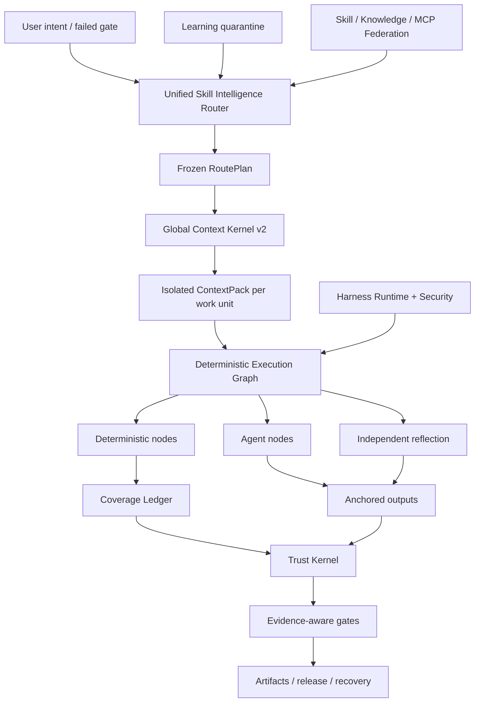

<p align="center">
  
</p>

<p align="center">
  <a href="LICENSE"></a>
  <a href="CHANGELOG.md"></a>
  
  
  
</p>

<p align="center"></p>
<h1 align="center">ForgeOS</h1>
<p align="center">ForgeOS решает <strong>какой навык может выполняться</strong>, <strong>какой контекст может входить</strong>, <strong>какие шаги должны быть выполнены детерминированный </strong> и <strong>, свидетельства которого достаточно убедительны, чтобы признать завершение </strong>. </p>

---

## Почему существует ForgeOS

Агент не становится надежным, если у него больше подсказок, больше инструментов или более длинное контекстное окно.

Она становится надежной, когда система может ответить на шесть вопросов:

1. **Какой именно результат требуется?**
2. **Какой метод подходит, а какие из подобных методов здесь неверны?**
3. **Какой наименьший контекст необходим для этого задания?**
4. **Какие шаги должны быть детерминированными, а не делегированными модели?**
5. **Какие независимые доказательства подтверждают результат?**
6. **Может ли один и тот же рабочий процесс восстановиться, возобновиться и провести аудит после сбоя?**

ForgeOS v0.6 превращает эти вопросы в среду выполнения:

```text
подтвержденное намерение
  → результат + восстановление техники
  → жесткая политика и антитриггерные фильтры
  → минимальный DAG RoutePlan
  → изолированный ContextPack для каждой рабочей единицы
  → граф выполнения детерминированный/агент/отражение
  → закрепленные результаты + книга покрытия
  → доверенные квитанции + шлюзы доказательств
  → выпуск, откат, восстановление и изучение карантина
```

Это не быстрый сбор. Это плоскость управления навыками, правилами, крючками, агентами, инструментами, контекстом, доказательствами и обучением.

---

## Что реально в v0.6.1

| Поверхность | Проверенная реализация |
|---|---:|
| Унаследованные типизированные каркасы для результатов | **1024** |
| Техники Deep Skill Contract v2 | **128** |
| L0 методы оркестровки/доверия/контекста | **32** |
| L1 методы междоменного проектирования | **96** |
| Независимый оценщик привязок | **128** |
| Стабильные процедурные провайдеры | **33** |
| Кандидаты в процессуальные провайдеры | **242** |
| Встроенные карты навыков + знаний | **1299** |
| Случаи соответствия Code Review Intelligence | **12** |
| Агент-поверхностные состязательные случаи | **20/20** |
| Стабильная материализация поставщика | **33/33** |
| Маршрутизатор Precision@1 / @3 | **93,75% / 100%** |
| Отзыв маршрутизатора@6 | **100%** |
| Активация небезопасного маршрута | **0%** |

> [!ВАЖНО]
> 1024 устаревших узла являются **основами результатов**, а не 1024 процедурными навыками производственного уровня. Версия 0.6 содержит 128 контрактов на глубокую технику. Тридцать три процедурных поставщика остаются в заявленном стабильном канале маршрутизации для обеспечения совместимости, но окончательный сертификационный аудит обнаруживает, что 0/128 являются стабильными, имеющими подтвержденные доказательства, и 0 сертифицированы в соответствии с определением «Готово» версии 2. Остальные доказательства требуют возражений, парной мультимодели, давления, независимой проверки и квитанций о производстве.

**Инвентаризация ядра:** 32 метода L0 + 96 методов L1 = 128 методов глубокого ядра.

**Каталог маршрутизации сообщает:** 33 заявленных процедурных провайдера стабильного канала и 242 кандидата. **Официальное свидетельство о сертификации:** 0 имеют стабильную квалификацию, 0 сертифицированы. См. [Окончательный сертификационный аудит](docs/FINAL-CERTIFICATION-AUDIT.md).

Аудит выпуска намеренно делает эти утверждения ложными:

```text
1024 процедурных навыка производственного уровня ложны
полный жизненный цикл PostgreSQL HA false
универсальная песочница microVM false
экспертный рейтинг 200-PR, рейтинг ложный
10 000 парных оценок оказались ошибочными
```

ForgeOS v0.6 не претендует на универсальную полноту производства или 1024 процедурных навыка производственного уровня.

См. [Claims Boundary v0.6](docs/CLAIMS-BOUNDARY-V0.6.md).

---

##Пятиминутный путь

Используйте этот путь, если вам нужна ценность без предварительного изучения ядра доверия.

### 1. Установить

```bash
npm install
npm test
node src/cli/forge.mjs init
```

Установленный пакет:

```bash
npx forgeos init
forge doctor
```

`forge init` создает безопасный локальный профиль SQLite-WAL. Его ключ API записывается в файл `0600` и никогда не печатается.

### 2. Найдите правильную технику

```bash
forge skills search "react rerender"
forge skills inspect reducing-react-render-thrashing
forge route --query "compile the minimum context for a large monorepo"
```

### 3. Проверьте версию 0.6

```bash
forge v06 status
forge profile plan coding --target codex
forge security scan --file agent-surface.json
```

### 4. Запустите локальную плоскость управления.

```bash
npm start
# Dashboard: http://127.0.0.1:8787/dashboard
# MCP:       http://127.0.0.1:8787/mcp
# A2A:       http://127.0.0.1:8787/a2a
```

---

## Глубокий путь оператора

Используйте этот путь при встраивании ForgeOS в Codex, Claude Code, ChatGPT, агент с открытым исходным кодом, CI или внутреннюю платформу.

### Маршрутизатор интеллекта навыков

Маршрутизатор выполняет двухэтапный поиск вместо сопоставления имени навыка:

```text
намерение/неудачные ворота
  → получение результатов
  → прямое извлечение триггера техники
  → исключение антитриггеров
  → фильтры доверия, арендатора, зрелости, инструмента, лицензии, актуальности
  → изменение рейтинга измеряемой полезности
  → минимальная техника ДАГ
  → разрешение провайдера
  → замороженный план маршрута
```

У каждой выбранной и отвергнутой техники есть причина. Жесткие блокирующие всегда бьют по счету.

### Ядро глобального контекста v2

ForgeOS бюджетирует весь запрос:

```text
система · задача · выбранные разделы навыков · кодовые символы · артефакты
· память · выходные данные инструмента · ссылки · схемы ленивых инструментов
· резерв мощности · резерв безопасности
```

Он обеспечивает:

- один интерфейс учета токенов, общий для резолвера и материализатора;
- загрузка навыков на уровне раздела;
- изолированный контекст для каждой единицы работы;
- ленивая материализация инструментальной схемы;
- Идентификаторы семантических символов ABI и отклонение устаревшего хеша;
- дельта-проекция артефакта;
- ограниченный, истекающий инстинкт инъекции;
- необработанные журналы с адресацией по содержимому и определенными диапазонами отказов;
- декларация об упущениях для каждого не включенного источника.

### Детерминированная ткань навыков

Техника v0.6 скомпилирована в исполняемый граф:

```text
Детерминированные узлы
  выбор объема · объединение · разрешение правил · привязка · доказательства

Агентские узлы
  исследование · гипотеза · суждение о предметной области

Узлы отражения
  противоречие · ложноположительный фильтр · возможность действия

Узлы управления
  параллельное соединение · шлюз покрытия · повтор · откат
```

В реестре покрытия SQLite используются договоры аренды, контрольные сигналы, ограждение и доверенные квитанции. Восстановленный работник не может пометить рабочую единицу как завершенную.

### Вертикальный срез Code Review Intelligence

Первый полный вертикальный срез доказывает всю архитектуру:

```text
полный объем
→ рабочие единицы, учитывающие отношения
→ контекстный выбор правила
→ анализ изолированного агента
→ привязки строки/хеша
→ переезд после правок
→ независимое размышление
→ квитанция о покрытии
```

Объединенный корпус из 12 случаев представляет собой детерминированный эталон соответствия. Он **не** рекламируется как эталонный тест с рейтингом 200 PR, отмеченный экспертами.

### Непрерывное обучение — без автоматического самоотравления

Наблюдаемые закономерности становятся ограниченными инстинктами, а не устойчивыми навыками:

```text
доверенные квитанции о запуске
  → наблюдаемый инстинкт
  → изоляция арендатора/проекта/жгута + TTL
  → совместимый кластер инстинктов
  → предложение по развитию кандидата
  → независимая оценка
  → продвижение или откат человека
```

Производитель не может продвигать собственное усвоенное поведение.

### Среда выполнения v2

ForgeOS различает четыре поверхности:

| Поверхность | Используйте его для |
|---|---|
| **Правило** | Краткий инвариант, который должен применяться всегда |
| **Крюк** | Детерминированное действие, привязанное к событию |
| **Навык** | Условная процедура, требующая судебного решения |
| **Роль агента** | Отдельный контекст, инструменты, модель или авторитет |

К нейтральным событиям относятся `before.tool.execute`, `after.file.write`, `verification.checkpoint`, `session.compact` и `session.ended`. Хост-адаптеры должны отмечать неподдерживаемые функции, а не заявлять о ложной четности.

Профили:

```text
минимальный · кодирование · творческий · исследование · регулируемый
местное-малое · предприятие
```

### Поверхностная безопасность агента

Подсистема безопасности сканирует саму систему агента:

- нарушение инструкций и оперативных границ;
- перехватчики и сценарии жизненного цикла пакетов;
- Описания MCP, разрешения и доступность инструментов;
- списки разрешенных команд;
- ссылки на секреты/среду;
- пути доступа от секрета к выходу;
- возможность соединения труба-оболочка и широкие возможности подстановочных знаков;
- Разрешения профиля различаются перед установкой.

В настоящее время его состязательный корпус проходит **20/20** случаев.

### Локальное выполнение через посредника

Локальный бегун обеспечивает реальную границу безопасности для обычных команд:

- нет интерполяции оболочки;
- списки разрешенных команд и окружения;
- сдерживание рабочего пространства и символических ссылок;
- таймаут и завершение группы процессов;
- ограниченный стандартный вывод/stderr;
- квитанция об исполнении содержательного адреса.

Это **не** универсальная изолированная программная среда microVM, запрещающая использование сети. Стороннее выполнение с высоким уровнем риска по-прежнему требует внешнего контейнера или уровня изоляции microVM.

---


# Как работает ForgeOS

ForgeOS объединяет два продукта в одной среде выполнения:

1. **Уровень аналитики навыков**, который извлекает приемы, отклоняет небезопасные совпадения, компилирует только необходимые разделы навыков и строит замороженный план выполнения.
2. **Плоскость управления ИИ**, которая управляет проектами, артефактами, доказательствами, утверждениями, арендой, восстановлением, объединением и выпуском.

```text
подтвержденное намерение или неудачные ворота
  → результат и извлечение методом прямой техники
  → фильтры антитриггера, арендатора, доверия, инструмента, лицензии и актуальности
  → минимальный замороженный DAG RoutePlan
  → изолированный ContextPack для каждой рабочей единицы
  → детерминированный / агент / отражение График выполнения
  → закрепленные выходы и изолированный журнал покрытия
  → надежные квитанции и шлюзы, обеспечивающие гарантию
  → выпуск, восстановление, откат или изучение карантина
```

## Десять взаимодействующих систем

| Система | Что он контролирует |
|---|---|
| **Маршрутизатор разведки навыков** | Получение результатов, оценка техники, антитриггеры, жесткая политика, выбор поставщика и объяснимые планы маршрутов |
| **Ядро глобального контекста v2** | Один общий бюджет токенов по политике, задачам, разделам навыков, символам, артефактам, памяти, выходным данным инструмента, ссылкам и резерву выходных данных |
| **Таблица детерминированных навыков** | Гибридные графы, содержащие детерминированные узлы, узлы агентов, узлы отражения, утверждения, привязки и условия остановки |
| **Регистр покрытия** | Владение рабочими подразделениями, аренда, токены ограждения, покрытие завершения, отклонение устаревших рабочих и возможность возобновления |
| **Доверительное ядро** | Свежесть доказательств, происхождение артефактов, полномочия утверждения, уровни обеспечения и решения о выпуске |
| **Агент Surface Security** | Шаблоны быстрого внедрения, сценарии опасных пакетов, секретные пути к выходу, разрешения и честность возможностей адаптера |
| **Локальное выполнение при посредничестве** | Создание команд без оболочки, списки разрешений, тайм-ауты, ограничения вывода и структурированные квитанции |
| **Непрерывное обучение** | Ограниченные инстинкты, срок годности, уверенность, карантин, предложения кандидатов и контролируемое продвижение |
| **Федерация навыков** | Подписанные источники, уровни доверия, карантин, обработка конфликтов, отзыв и синхронизированные каталоги |
| **Среда выполнения версии 2** | Правила, приемы, навыки, роли агентов, различия в разрешениях и профили для различных средств искусственного интеллекта |

---

# Сравнение экосистем

> [!ВАЖНО]
> Это сравнение описывает **естественную, первоклассную направленность каждого основного репозитория**. `◐` означает частичную поддержку, поддержку на основе расширений или поддержку через соседний продукт. `—` означает, что это не основная цель проекта, а не то, что его невозможно построить.

Звезды GitHub ниже — это приблизительные цифры, проверенные **26 июля 2026 г.**. Они указывают на видимость сообщества, а не на инженерное качество сами по себе.

## Карта экосистемы

| Проект | Прибл. Звезды GitHub | Основная роль |
|---|---:|---|
| [Суперспособности](https://github.com/obra/superpowers) | **255 тыс.** | Структура навыков агентов и методология разработки программного обеспечения |
| [Навыки антропного агента](https://github.com/anthropics/skills) | **151 тыс.** | Стандарты навыков и общедоступная библиотека навыков для Клода |
| [LangChain](https://github.com/langchain-ai/langchain) | **139 тыс.** | Платформа агентского инжиниринга и большая интеграционная экосистема |
| [OpenHands](https://github.com/All-Hands-AI/OpenHands) | **75 тыс.+** | Комплексное приложение-агент для разработки программного обеспечения |
| [CrewAI](https://github.com/crewAIInc/crewAI) | **56 тыс.+** | Мультиагентные команды и потоки, управляемые событиями |
| [AutoGen](https://github.com/microsoft/autogen) | **50 тыс.+** | Многоагентный обмен сообщениями и среда выполнения исследований |
| [LangGraph](https://github.com/langchain-ai/langgraph) | **37 тыс.+** | Долгоживущие графы агентов с сохранением состояния |
| [Семантическое ядро](https://github.com/microsoft/semantic-kernel) | **28 тыс.+** | Многоязычный пакет SDK для оркестровки предприятий |
| [Потрясающие навыки агента](https://github.com/VoltAgent/awesome-agent-skills) | **28 тыс.+** | Каталог сообщества, содержащий более тысячи навыков |
| [SDK OpenAI Agents](https://github.com/openai/openai-agents-python) | **27 тыс.+** | Агенты, передача обслуживания, ограждения, сеансы и отслеживание |
| [смолагенты](https://github.com/huggingface/smolagents) | **27 тыс.+** | Минимальная библиотека агентов с акцентом на код-агент |
| [Летта](https://github.com/letta-ai/letta) | **23 тыс.+** | Агенты с отслеживанием состояния и постоянная память |
| [Google ADK](https://github.com/google/adk-python) | **около 20 тыс.** | Создание, оценка и развертывание агента с упором на код |
| [PydanticAI](https://github.com/pydantic/pydantic-ai) | **около 19 тысяч** | Типобезопасная среда агентов Python |

## Матрица основных возможностей

| Система | Комплексные навыки | Маршрутизация + антитриггер | Регулируемый контекст | Детерминированный/агентный гибридный граф | Доказательства + трастовые квитанции | Агент-поверхностная безопасность | Родная сила |
|---|:---:|:---:|:---:|:---:|:---:|:---:|---|
| **ФорджОС** | ✅ | ✅ | ✅ | ✅ | ✅ | ✅ | Навыки разведки и надежное исполнение |
| Антропные навыки | ✅ | ◐ | ◐ | — | — | ◐ | Простой портативный стандарт навыков |
| Суперспособности | ✅ | ✅ | ◐ | ◐ | ◐ | — | Четкая методология SDLC для агентов кодирования |
| Потрясающие навыки агента | ✅ | — | — | — | — | ◐ | Открытие навыков из многих источников |
| Лангчейн | ◐ | ◐ | ◐ | ◐ | ◐ | ◐ | Очень большая интеграционная экосистема |
| Лангграф | ◐ | ◐ | ◐ | ✅ | ◐ | ◐ | Надежное выполнение и графики с отслеживанием состояния |
| SDK агентов OpenAI | ◐ | ◐ | ◐ | ◐ | ◐ | ◐ | Упрощенная структура, передача управления и трассировка |
| CrewAI | ◐ | ◐ | ◐ | ✅ | ◐ | ◐ | Ролевые агенты в сочетании с Flows |
| АвтоГен | ◐ | ◐ | ◐ | ✅ | ◐ | ◐ | Многоагентная среда выполнения, управляемая событиями |
| Семантическое ядро ​​/ MAF | ◐ | ◐ | ◐ | ✅ | ◐ | ◐ | Корпоративная оркестровка во всех средах выполнения |
| Google АДК | ◐ | ◐ | ◐ | ✅ | ◐ | ◐ | Создавайте, оценивайте и развертывайте в экосистеме Google |
| ПидантикИИ | ◐ | ◐ | ◐ | ◐ | ◐ | ◐ | Безопасность типов, проверка и эргономика Python |
| смолагенты | ◐ | ◐ | ◐ | ◐ | — | ◐ | Минимальная, читаемая реализация агента |
| Летта | ◐ | ◐ | ✅ | ◐ | ◐ | ◐ | Постоянная память и агенты с состоянием |
| ОпенХандс | ◐ | ◐ | ◐ | ◐ | ◐ | ✅ | Опыт комплексного кодирования |

## ForgeOS выбирает другое поле боя

Хранилище навыков отвечает: ** «Каким процедурам может научиться агент?»**

ForgeOS также спрашивает: ** «Какой метод разрешен сейчас, какое почти совпадение должно быть отклонено, какие разделы могут войти в контекст, какие инструменты требуются, какие доказательства должны быть представлены и какие ворота могут объявить работу завершенной?» **

Платформа агентов помогает создавать агентов, инструменты, передачи обслуживания и рабочие процессы. ForgeOS фокусируется на слое, окружающем эту среду выполнения: поиск возможностей, антитриггеры, глобальные контекстные бюджеты, детерминированные графики/графы агентов/отражения, текущие доказательства, полномочия утверждения, происхождение артефактов, восстановление и карантин обучения.

Система памяти фокусируется на том, что помнит агент. ForgeOS дополнительно контролирует, какому арендатору, проекту, пользователю, доверительному домену, сроку действия, политике доверия и продвижения принадлежит память.

Агент сквозного кодирования обеспечивает взаимодействие с пользователем. ForgeOS может работать **под или рядом** с этим агентом в качестве уровня выбора навыков, управления контекстом, доказательств, доверия и жизненного цикла проекта.

## Куда по-прежнему ведут зрелые экосистемы

В настоящее время у них более крупные сообщества, больше учебных пособий и интеграций, более совершенный опыт работы с управляемыми облаками, более сильная адаптация без программирования и больше публично задокументированных производственных развертываний. ForgeOS намеренно концентрируется на менее стандартизированной проблеме: **управлении выбором навыков, контекстом, доказательствами, полномочиями и состоянием завершения для агентов ИИ**.

---

# Три пути входа

## Для обычных пользователей

Вам не нужно разбираться в каждой подсистеме. Начните с четырех наблюдаемых тестов:

```bash
node src/cli/forge.mjs doctor
node src/cli/forge.mjs skills search --query "review authentication changes"
node src/cli/forge.mjs route --query "review authentication changes without missing tests"
node src/cli/forge.mjs scan agent-surface --path .
```

Вы можете проверить, какой метод был выбран, почему альтернативы были отклонены, сколько контекста было скомпилировано, какие разрешения запрошены и какие доказательства все еще отсутствуют.

## Для разработчиков

ForgeOS предоставляет ту же среду выполнения через:

- CLI для локального управления и CI;
- HTTP API и панель управления Studio;
- **60 инструментов MCP со строгой схемой**;
- поверхности задач A2A и карточек агентов;
— прямой импорт сервисов из дерева исходного кода Node.js;
- **15 адаптеров** для агентских и IDE-экосистем;
- семь профилей проводки: `minimal`, `coding`, `creative`, `research`, `regulated`, `local-small` и `enterprise`.

Разработчики могут создавать проекты, регистрировать артефакты, связывать доказательства, запрашивать утверждения, компилировать планы маршрутов и контекстные пакеты, выполнять графики, восстанавливать версии, синхронизировать объединенные навыки или добавлять новый контракт на навыки v2.

## Для экспертов и исследователей

ForgeOS создан для того, чтобы его оспаривали, а не принимали на маркетинговой странице. Эксперты могут самостоятельно протестировать:

- точность маршрутизатора, отзыв, антитриггерное поведение и небезопасная активация;
- переполнение общего контекста и уменьшение семантического ABI;
- детерминированное покрытие, якоря, отражение, аренда и ограждение;
- свежесть доказательств, происхождение артефактов и ворота, обеспечивающие уверенность;
- быстрое внедрение, сценарии пакетов, секретные пути к выходу и честность адаптера;
- конфликт федерации, карантин, отзыв и доверие источника;
- проверка архива без `.git`.

```bash
npm run validate
npm run v06:audit
npm run router:benchmark
npm run context:benchmark
npm run federation:eval
npm run federation:audit
npm run smoke
npm run adapter:tck
npm run release:verify
```

---

# Карта репозитория

```text
src/ реализация времени выполнения
  интерфейс командной строки cli/forge
  ядро/проект, артефакт, свидетельство, одобрение, восстановление
  навыки-разведка/контракты, маршрутизация, оценка, материализация
  context/Global Context Ядро и компиляция рабочих единиц
  исполнение/компилятор графов, детерминированные узлы, покрытие
  доверие/доказательства, гарантия, авторитет, ворота освобождения
  безопасность/сканирование поверхности агента и брокер команд
  федерация/удаленные источники, доверие, карантин, синхронизация
  обучение/инстинкты, кандидаты, истечение срока действия, продвижение по службе
  mcp/MCP-сервер и 60 общедоступных инструментов
  Карты, задачи, сообщения и квитанции a2a/ A2A
  сервер/HTTP API, аутентификация, панель мониторинга
  хранилище/сохранение и миграция SQLite-WAL
адаптеры/ 15 агентов и адаптеров IDE
навыки-v2/ 128 глубоких техник Skill Contract v2
возможности-v2/ результаты, методы, поставщики, отношения, график
схемы/публичные контракты JSON Schema 2020-12
пакеты/пакеты вертикальных возможностей и тесты
Оценки/кейсы оценки, рубрики и корпуса
тесты/ 125 тестовых файлов и релизные инварианты
Доказательства/сгенерированные данные аудита, контрольных показателей, SBOM и данные информационной панели
документация/ архитектура, протоколы, безопасность, тестирование, производство
сценарии/инструменты генерации, проверки, аудита, тестирования и выпуска
```

# Подходящие варианты использования

- Сделать кодировщиков более дисциплинированными и проверяемыми.
- Построение плоскости управления для нескольких моделей, агентов и инструментов.
- Управление внутренней платформой навыков с контролем маршрутизации и зрелости.
- Проверка конфигураций агентов, разрешений, подсказок и поверхностей цепочки поставок.
- Высоконадежные или регламентированные рабочие процессы, требующие доказательств и одобрения.
- Сокращение потерь контекста в крупных репозиториях за счет изоляции рабочих единиц и семантического ABI.

ForgeOS не является заменой автоматизации бизнес-процессов в стиле n8n. n8n соединяет приложения и бизнес-мероприятия; ForgeOS контролирует выбор методов искусственного интеллекта, контекст, выполнение, доказательства и авторитетность. Их можно использовать вместе.

---

## Архитектура



---

## Интеграция MCP и агента

ForgeOS поддерживает MCP `2025-11-25`, A2A `1.0`, пакеты, совместимые с навыками агента, HTTP и CLI.

Общедоступные инструменты версии 0.6 включают в себя:

```text
forge_v06_status
forge_execution_graph_compile
forge_review_scope_compile
forge_context_work_units_compile
forge_harness_profile_plan
forge_agent_surface_scan
```

Они присоединяются к существующему проекту, артефакту, надежным доказательствам, восстановлению, федерации, аналитике навыков и брокерским инструментам MCP. Stdio, HTTP MCP, CLI и Studio используют одни и те же службы и схемы JSON.

Поддерживаемые пакеты адаптеров включают ChatGPT, Codex, Claude Code, Cursor, OpenCode, Gemini CLI, Copilot CLI, Cline, Roo Code, Windsurf, Continue, NolaneNative, OpenClaw, Pi и универсальный MCP/A2A. Доказательства отличают **адаптеры, протестированные по протоколу**, от **руководств, предназначенных только для документации**.

---

## Проверка

```bash
npm run validate
npm run skills:v2:audit
npm run v06:audit
npm run router:benchmark
npm run context:benchmark
npm run federation:eval
npm run federation:audit
npm run smoke
npm run adapter:tck
npm run release:verify
```

Релизный шлюз проверяет поведение и контракты, а не только покрытие линии:

- инварианты состояния, ограждения, защиты от устаревания и жизненного цикла;
- полный жизненный цикл MCP/A2A и схемы вывода;
- глубина навыка, шаблон, хэш раздела и материализация;
- точность маршрутизатора, отзыв, детерминизм и небезопасная активация;
- учет переполнений и пропусков глобального контекста;
- детерминированный реестр исполнения и покрытия;
- просмотреть якоря и рефлексию;
- независимая оценка и карантин непрерывного обучения;
- агентско-поверхностные состязательные случаи;
- установка архива и самопроверка без `.git`.

---

## Граница производства

**Интегрировано сегодня**

- Серверная часть жизненного цикла одного узла SQLite WAL;
- ревизия/CAS, аренда, ограждение, снимки, восстановление, ACL, ключ OIDC/API;
- доверенные квитанции, хэши конвертов артефактов, шлюзы с гарантией;
- Федерация навыков/знаний/MCP на уровне арендатора;
- изящный слив, готовность, метрики, подписанный провенанс релиза;
- профили развертывания без полномочий root/только для чтения.

**Пока не заявлена ​​версия 0.6**

- серверная часть PostgreSQL с полным жизненным циклом и протестированное аварийное переключение на нескольких узлах;
- универсальная сторонняя песочница microVM;
- SCIM/делегированное администрирование организации;
- служба управляемой прозрачности и PKI;
- Потоковая передача/рассылка A2A и распределенное резюме;
- 1024 процедурных навыка производственного уровня;
- 10 000 парных оценочных заездов;
- тест межъязыкового анализа кода, одобренный экспертами.

Прочтите [Производство](docs/PRODUCTION.md), [Модель безопасности](docs/SECURITY-MODEL.md) и [Self-Audit v0.6](docs/SELF-AUDIT-V0.6.md).

---

## Карта документации

| Начните здесь | Глубокое погружение |
|---|---|
| [Быстрый старт](docs/QUICKSTART.md) | [Архитектура](docs/ARCHITECTURE.md) |
| [Интеллект навыков](docs/SKILL-INTELLIGENCE.md) | [Детерминированная ткань v0.6](docs/DETERMINISTIC-SKILL-FABRIC-V06.md) |
| [CLI и профили](docs/HARNESS-RUNTIME-V2.md) | [Ядро глобального контекста](docs/GLOBAL-CONTEXT-KERNEL.md) |
| [Безопасность](docs/AGENT-SURFACE-SECURITY.md) | [Непрерывное обучение](docs/CONTINUOUS-LEARNING-V06.md) |
| [Тестирование](docs/TESTING.md) | [Граница претензий](docs/CLAIMS-BOUNDARY-V0.6.md) |
| [Содействие](CONTRIBUTING.md) | [Самоаудит](docs/SELF-AUDIT-V0.6.md) |

---

## Языки

[Universal Lanes](docs/UNIVERSAL-LANES.md) · [Remote MicroVM Sandbox](docs/REMOTE-MICROVM-SANDBOX.md) · [Tiếng Việt](README-vn.md) · [简体中文](README-cn.md) · [繁體中文](README-tw.md) · [日本語](README-ja.md) · [한국어](README-ko.md) · [Español](README-es.md) · [Français](README-fr.md) · [Deutsch](README-de.md) · [Português](README-pt-br.md) · [Русский](README-ru.md) · [العربية](README-ar.md) · [हिन्दी](README-hi.md) · [Bahasa Indonesia](README-id.md) · [ไทย](README-th.md) · [Türkçe](README-tr.md) · [Italiano](README-it.md) · [Polski](README-pl.md) · [Українська](README-uk.md) · [Nederlands](README-nl.md) · [فارسی](README-fa.md) · [עברית](README-he.md) · [Svenska](README-sv.md)

---

## Вклад

Новый навык не принимается, потому что его описание звучит экспертно. Это необходимо:

1. КРАСНАЯ базовая линия, которая не работает без техники;
2. точные триггеры и антитриггеры;
3. специфичная для предметной области процедура и модель отказа;
4. типизированные входные данные, выходные данные, инструменты и доказательства;
5. хеши разделов и бюджеты токенов;
6. привязки независимого оценщика;
7. контрольные данные и решение о сроке погашения.

См. [CONTRIBUTING.md](CONTRIBUTING.md), [GOVERNANCE.md](GOVERNANCE.md) и [SECURITY.md](SECURITY.md).

## Лицензия

MIT — см. [ЛИЦЕНЗИЮ](LICENSE).


## Аудит финальной версии

- [Окончательный отчет об усилении защиты](docs/FINAL-HARDENING-REPORT.md)
- [Заключительный аудит сертификации навыков](docs/FINAL-CERTIFICATION-AUDIT.md)
