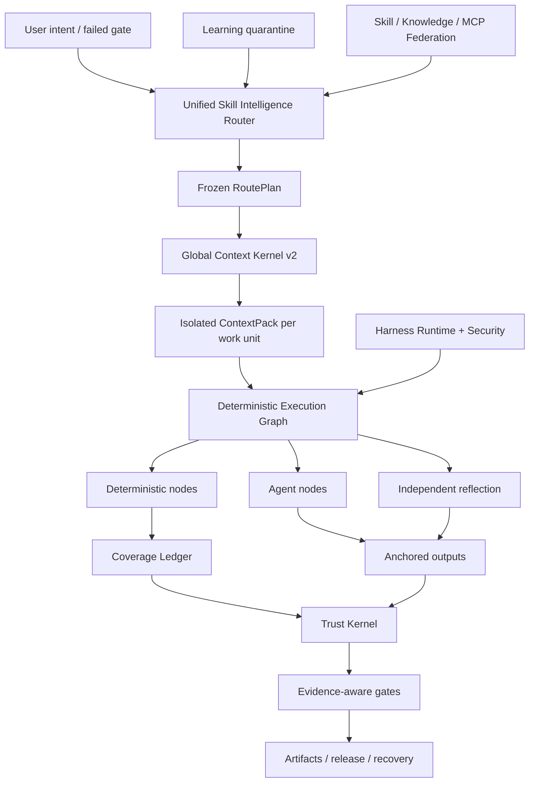

<p align="center">
  
</p>

<p align="center">
  <a href="LICENSE"></a>
  <a href="CHANGELOG.md"></a>
  
  
  
</p>

<p align="center"></p>
<h1 align="center">ForgeOS</h1>
<p align="center">ForgeOS bestämmer <strong>vilken färdighet som får köras</strong>, <strong>vilken kontext får komma in</strong>, </strong>, https://forgeos-token.inwhen must be. deterministic</strong> och <strong>vilket bevis är tillräckligt starkt för att acceptera komplettering</strong>.</p>

---

## Varför ForgeOS finns

En agent blir inte pålitlig eftersom den har fler uppmaningar, fler verktyg eller ett längre sammanhangsfönster.

Det blir tillförlitligt när systemet kan svara på sex frågor:

1. **Vilket exakt resultat krävs?**
2. **Vilken teknik är lämplig – och vilka liknande tekniker är fel här?**
3. **Vilket är det minsta sammanhang som behövs för denna arbetsenhet?**
4. **Vilka steg måste vara deterministiska snarare än delegerade till en modell?**
5. **Vilka oberoende bevis bevisar resultatet?**
6. **Kan samma arbetsflöde återställa, återuppta och granska sig själv efter fel?**

ForgeOS v0.6 förvandlar dessa frågor till en runtime:

```text
bekräftad avsikt
  → utfall + teknikåterhämtning
  → hård policy och anti-trigger filter
  → lägsta RoutePlan DAG
  → isolerat ContextPack per arbetsenhet
  → deterministisk / agent / reflektionsutförandegraf
  → förankrade utgångar + täckningsbok
  → betrodda kvitton + bevisportar
  → frigivning, återställning, återställning och inlärningskarantän
```

Det är inte en snabb insamling. Det är kontrollplanet kring färdigheter, regler, krokar, agenter, verktyg, sammanhang, bevis och lärande.

---

## Vad är verkligt i v0.6.1

| Yta | Verifierad implementering |
|---|---:|
| Äldre maskinskrivna utfallsställningar | **1 024** |
| Deep Skill Contract v2-tekniker | **128** |
| L0 orkestrerings-/förtroende-/kontexttekniker | **32** |
| L1 cross-domän ingenjörsteknik | **96** |
| Oberoende utvärderare bindningar | **128** |
| Stabila procedurleverantörer | **33** |
| Kandidater för procedurleverantörer | **242** |
| Inbyggd skicklighet + kunskapskartläggningar | **1 299** |
| Kodgranskning Underrättelseöverensstämmelsefall | **12** |
| Agent-yta motstridiga fall | **20/20** |
| Stabil leverantörsmaterialisering | **33/33** |
| Router Precision@1 / @3 | **93,75 % / 100 %** |
| Router Recall@6 | **100 %** |
| Osäker ruttaktivering | **0 %** |

> [!VIKTIGT]
> De 1 024 äldre noderna är **resultatställningar**, inte 1 024 procedurkunskaper i produktionsklass. v0.6 innehåller 128 djupa teknikkontrakt. Trettiotre procedurleverantörer finns kvar i den deklarerade stabila routingkanalen för kompatibilitet, men den slutliga certifieringsrevisionen finner 0/128 beviskvalificerade stabila och 0 certifierade enligt Revision 2 Definitionen av Klar. De återstående bevisen kräver stopp, parad multimodell, tryck, oberoende granskning och produktionskvitton.

**Kärninventering:** 32 L0-tekniker + 96 L1-tekniker = 128 djupa kärntekniker.

**Katalogruttstatus:** 33 deklarerade leverantörer av stabila kanaler och 242 kandidater. **Formella certifieringsbevis:** 0 stallkvalificerade, 0 certifierade. Se [Slutlig certifieringsrevision](docs/FINAL-CERTIFICATION-AUDIT.md).

Utgivningsgranskningen håller avsiktligt dessa påståenden falska:

```text
1 024 procedurkunskaper i produktionsklass falska
fullständig PostgreSQL-livscykel HA falsk
universal microVM sandlåda falsk
expertmärkt 200-PR granskningsriktmärke falskt
10 000 parade utvärderingar är falska
```

ForgeOS v0.6 gör inte anspråk på universell produktionskompletthet eller 1 024 procedurkunskaper i produktionsklass.

Se [Claims Boundary v0.6](docs/CLAIMS-BOUNDARY-V0.6.md).

---

## Fem minuters väg

Använd den här sökvägen när du vill ha värde utan att först lära dig Trust Kernel.

### 1. Installera

```bash
npm install
npm test
node src/cli/forge.mjs init
```

Installerat paket:

```bash
npx forgeos init
forge doctor
```

`forge init` skapar en säker lokal SQLite-WAL-profil. Dess API-nyckel skrivs till en `0600`-fil och skrivs aldrig ut.

### 2. Hitta rätt teknik

```bash
forge skills search "react rerender"
forge skills inspect reducing-react-render-thrashing
forge route --query "compile the minimum context for a large monorepo"
```

### 3. Inspektera v0.6

```bash
forge v06 status
forge profile plan coding --target codex
forge security scan --file agent-surface.json
```

### 4. Starta det lokala styrplanet

```bash
npm start
# Dashboard: http://127.0.0.1:8787/dashboard
# MCP:       http://127.0.0.1:8787/mcp
# A2A:       http://127.0.0.1:8787/a2a
```

---

## Djup operatörsväg

Använd den här sökvägen när du bäddar in ForgeOS i Codex, Claude Code, ChatGPT, en öppen källkodsagent, CI eller en intern plattform.

### Skill Intelligence Router

Routern utför hämtning i två steg istället för att matcha ett färdighetsnamn:

```text
avsikt / misslyckad gate
  → resultathämtning
  → direkt teknik-trigger hämtning
  → anti-trigger uteslutning
  → förtroende, hyresgäst, mognad, verktyg, licens, filter för färskhet
  → omrangering av uppmätt nytta
  → minimiteknik DAG
  → leverantörens upplösning
  → frusen ruttplan
```

Varje vald och avvisad teknik har en anledning. Hårda blockerare slår alltid poäng.

### Global Context Kernel v2

ForgeOS budgeterar hela begäran:

```text
system · uppgift · valda färdighetssektioner · kodsymboler · artefakter
· minne · verktygsutgång · referenser · lata verktygsscheman
· effektreserv · säkerhetsreserv
```

Det ger:

- ett gränssnitt för token-redovisning som delas av resolver och materializer;
- färdighetsladdning på sektionsnivå;
- isolerat sammanhang per arbetsenhet;
- lat verktygsschema materialisering;
- Semantiska ABI-symbol-ID:n och avvisning av gammal hash;
- artefakt deltaprojektion;
- scoped, utlöpande instinktinjektion;
- Innehållsadresserade råloggar med destillerade felintervall;
- Ett utelämnandemanifest för varje källa som inte ingår.

### Deterministisk skicklighetstyg

En v0.6-teknik kompileras till en körbar graf:

```text
Deterministiska noder
  räckviddsval · buntning · regelupplösning · förankring · bevis

Agentnoder
  utredning · hypotes · domänbedömning

Reflektion noder
  motsägelse · falskt positivt filter · handlingsförmåga

Kontrollnoder
  parallellkoppling · täckningsgrind · försök igen · rollback
```

SQLite-täckningsreskontran använder leasingavtal, hjärtslag, stängsel och betrodda kvitton. En återvunnen arbetare kan inte markera en arbetsenhet som färdig.

### Code Review Intelligence vertikal skiva

Den första kompletta vertikala skivan bevisar arkitekturen från början:

```text
fullständig omfattning
→ relationsmedvetna arbetsenheter
→ kontextuellt regelval
→ analys av isolerade medel
→ lina/hash-ankare
→ omlokalisering efter redigeringar
→ självständig reflektion
→ täckningskvitto
```

Den medföljande 12-fallskorpusen är ett deterministiskt riktmärke för överensstämmelse. Det är **inte** annonserat som ett expertmärkt 200-PR-riktmärke.

### Kontinuerlig inlärning—utan automatisk självförgiftning

Observerade mönster blir omfångade instinkter, inte stabila färdigheter:

```text
betrodda körkvitton
  → observerad instinkt
  → hyresgäst/projekt/seleisolering + TTL
  → kompatibelt instinktkluster
  → förslag till kandidatutveckling
  → oberoende utvärdering
  → mänsklig marknadsföring eller återställning
```

Producenten kan inte främja sitt eget inlärda beteende.

### Harness Runtime v2

ForgeOS särskiljer fyra ytor:

| Yta | Använd den för |
|---|---|
| **Regel** | Kort invariant som alltid måste gälla |
| **Hook** | Deterministisk handling bunden till en händelse |
| **Färdighet** | Villkorligt förfarande som kräver dom |
| **Agentroll** | Separat sammanhang, verktyg, modell eller auktoritet |

Neutrala händelser inkluderar `before.tool.execute`, `after.file.write`, `verification.checkpoint`, `session.compact` och `session.ended`. Värdadaptrar måste markera funktioner som inte stöds istället för att hävda falsk paritet.

Profiler:

```text
minimal · kodning · kreativ · forskning · reglerad
lokalt-litet · företag
```

### Agent Surface Security

Säkerhetsmotorn skannar själva agentsystemet:

- Instruktioner och omedelbara gränsöverträdelser;
- krokar och paketlivscykelskript;
- MCP-beskrivningar, behörigheter och verktygsåtkomlighet;
- kommandogodkända listor;
- hemliga referenser/miljöhänvisningar;
- tillståndsvägar för hemlighet till utgång;
- pipe-to-shell och bred jokertecken kapacitet;
- profiltillstånd skiljer sig före installation.

Dess motstridiga korpus passerar för närvarande **20/20** fall.

### Förmedlat lokalt utförande

Den lokala löparen ger en riktig säkerhetsgräns för normala kommandon:

- ingen skalinterpolation;
- Listor över ledning och miljö;
- arbetsyta och inneslutning av symbollänkar;
- timeout och avslutande av processgrupp;
- avgränsad stdout/stderr;
- innehållsadresserat utförandekvitto.

Det är **inte** en universell nätverksförnekare microVM-sandlåda. Exekvering från tredje part med hög risk kräver fortfarande en extern behållare eller ett microVM-isoleringslager.

---


# Hur ForgeOS fungerar

ForgeOS kombinerar två produkter i en körning:

1. **Ett Skill Intelligence-lager** som hämtar tekniker, avvisar osäkra nära-matcher, kompilerar endast de nödvändiga färdighetssektionerna och bygger en frusen exekveringsplan.
2. **Ett AI-kontrollplan** som hanterar projekt, artefakter, bevis, godkännanden, leasing, återhämtning, federation och utsläppsgrindar.

```text
bekräftad avsikt eller misslyckad gate
  → resultat och direkt-teknik hämtning
  → anti-trigger-, hyresgäst-, trust-, verktygs-, licens- och färskhetsfilter
  → minsta frusna RoutePlan DAG
  → isolerat ContextPack per arbetsenhet
  → deterministisk / agent / reflektion Execution Graph
  → förankrade utgångar och inhägnad täckningsbok
  → betrodda kvitton och garantimedvetna grindar
  → frigivning, återställning, återställning eller inlärningskarantän
```

## Tio samverkande system

| System | Vad den kontrollerar |
|---|---|
| **Skill Intelligence Router** | Resultathämtning, teknikpoäng, anti-triggers, hård policy, val av leverantör och förklarliga ruttplaner |
| **Global Context Kernel v2** | En total tokenbudget för policy, uppgift, färdighetssektioner, symboler, artefakter, minne, verktygsutdata, referenser och utdatareserv |
| **Deterministisk skicklighetstyg** | Hybridgrafer som innehåller deterministiska noder, agentnoder, reflektionsnoder, godkännanden, ankare och stoppvillkor |
| **Täckningsreskontra** | Ägande av arbetsenheter, hyresavtal, stängselpolletter, slutförandetäckning, avvisning av inaktuella arbetare och återupptagande |
| **Trust Kernel** | Bevisets färskhet, artefakthärkomst, godkännandemyndighet, säkerhetsnivåer och beslut om frigivning |
| **Agent Surface Security** | Prompt-injektionsmönster, farliga paketskript, hemliga-till-utgångsvägar, behörigheter och adapterkapacitet ärlighet |
| **Förmedlat lokalt utförande** | Snäckfria kommandon, godkännandelistor, timeouts, utdatagränser och strukturerade kvitton |
| **Kontinuerligt lärande** | Avgränsade instinkter, utgång, förtroende, karantän, kandidatförslag och kontrollerad befordran |
| **Skill Federation** | Signerade källor, förtroendenivåer, karantän, konflikthantering, återkallelse och synkroniserade kataloger |
| **Harness Runtime v2** | Regler, krokar, färdigheter, agentroller, behörighetsdifferenser och profiler för olika AI-selar |

---

# Jämförelse av ekosystem

> [!VIKTIGT]
> Den här jämförelsen beskriver det **infödda, förstklassiga fokuset för varje kärnförråd**. `◐` betyder partiellt stöd, tilläggsbaserat stöd eller support genom en angränsande produkt. `—` betyder att det inte är projektets primära fokus, inte att det är omöjligt att bygga.

GitHub-stjärnorna nedan är ungefärliga siffror kontrollerade den **26 juli 2026**. De indikerar samhällssynlighet, inte teknisk kvalitet i sig.

## Ekosystemkarta

| Projekt | Ca. GitHub stjärnor | Primär roll |
|---|---:|---|
| [Superpowers](https://github.com/obra/superpowers) | **255k** | Agentfärdighetsramverk och metodik för mjukvaruutveckling |
| [Antropiska agentfärdigheter](https://github.com/anthropics/skills) | **151k** | Färdighetsstandard och offentligt färdighetsbibliotek för Claude |
| [LangChain](https://github.com/langchain-ai/langchain) | **139k** | Agentteknikplattform och stort integrationsekosystem |
| [OpenHands](https://github.com/All-Hands-AI/OpenHands) | **75k+** | End-to-end program för programvaruutvecklingsagent |
| [CrewAI](https://github.com/crewAIInc/crewAI) | **56k+** | Multiagentbesättningar och händelsedrivna flöden |
| [AutoGen](https://github.com/microsoft/autogen) | **50k+** | Multi-agent meddelandehantering och forskning runtime |
| [LangGraph](https://github.com/langchain-ai/langgraph) | **37k+** | Statliga, långvariga agentgrafer |
| [Semantisk kärna](https://github.com/microsoft/semantic-kernel) | **28k+** | Multi-language enterprise orchestration SDK |
| [Awesome Agent Skills](https://github.com/VoltAgent/awesome-agent-skills) | **28k+** | Gemenskapskatalog med mer än tusen kunskaper |
| [OpenAI Agents SDK](https://github.com/openai/openai-agents-python) | **27k+** | Agenter, handoffs, skyddsräcken, sessioner och spårning |
| [smolagents](https://github.com/huggingface/smolagents) | **27k+** | Minimalt agentbibliotek med kod-agent betoning |
| [Letta](https://github.com/letta-ai/letta) | **23k+** | Statliga agenter och ihållande minne |
| [Google ADK](https://github.com/google/adk-python) | **ca 20k** | Kod-först agent byggande, utvärdering och distribution |
| [PydanticAI](https://github.com/pydantic/pydantic-ai) | **ca 19k** | Typsäkert Python-agentramverk |

## Kärnkapacitetsmatris

| System | Förpackade färdigheter | Routing + anti-trigger | Styrt sammanhang | Deterministisk/agent hybridgraf | Bevis + förtroendekvitton | Agent-ytsäkerhet | Infödd styrka |
|---|:---:|:---:|:---:|:---:|:---:|:---:|---|
| **ForgeOS** | ✅ | ✅ | ✅ | ✅ | ✅ | ✅ | Skicklighetsintelligens och pålitligt utförande |
| Antropiska färdigheter | ✅ | ◐ | ◐ | — | — | ◐ | Enkel, bärbar färdighetsstandard |
| Superkrafter | ✅ | ✅ | ◐ | ◐ | ◐ | — | Mycket explicit SDLC-metodik för kodningsmedel |
| Fantastiska agentfärdigheter | ✅ | — | — | — | — | ◐ | Färdighetsupptäckt i många källor |
| Langkedja | ◐ | ◐ | ◐ | ◐ | ◐ | ◐ | Mycket stort integrationsekosystem |
| LangGraph | ◐ | ◐ | ◐ | ✅ | ◐ | ◐ | Hållbart utförande och tillståndsfulla grafer |
| OpenAI Agents SDK | ◐ | ◐ | ◐ | ◐ | ◐ | ◐ | Lätt ramverk, handoffs och spårning |
| CrewAI | ◐ | ◐ | ◐ | ✅ | ◐ | ◐ | Rollbaserade agenter kombinerade med Flows |
| AutoGen | ◐ | ◐ | ◐ | ✅ | ◐ | ◐ | Händelsestyrd körtid för flera agenter |
| Semantisk kärna / MAF | ◐ | ◐ | ◐ | ✅ | ◐ | ◐ | Enterprise orkestrering över körtider |
| Google ADK | ◐ | ◐ | ◐ | ✅ | ◐ | ◐ | Bygg, utvärdera och distribuera i Googles ekosystem |
| PydanticAI | ◐ | ◐ | ◐ | ◐ | ◐ | ◐ | Typsäkerhet, validering och Python-ergonomi |
| smolagens | ◐ | ◐ | ◐ | ◐ | — | ◐ | Minimal, läsbar agentimplementering |
| Letta | ◐ | ◐ | ✅ | ◐ | ◐ | ◐ | Ihållande minne och tillståndsfulla agenter |
| OpenHands | ◐ | ◐ | ◐ | ◐ | ◐ | ✅ | Upplevelse av end-to-end kodningsagent |

## ForgeOS väljer ett annat slagfält

Ett färdighetsarkiv svarar: **"Vilka procedurer kan agenten lära sig?"**

ForgeOS frågar också: **"Vilken teknik är tillåten nu, vilken nära-matchning måste avvisas, vilka avsnitt kan komma in i sammanhanget, vilka verktyg krävs, vilka bevis måste produceras och vilken port kan förklara att arbetet är färdig?"**

Ett agentramverk hjälper till att skapa agenter, verktyg, handoffs och arbetsflöden. ForgeOS fokuserar på lagret som omger den körtiden: hämtning av kapacitet, anti-triggers, globala kontextbudgetar, deterministiska/agent/reflektionsgrafer, aktuella bevis, godkännandemyndighet, artefaktlinje, återställning och inlärningskarantän.

Ett minnessystem fokuserar på vad en agent kommer ihåg. ForgeOS kontrollerar dessutom vilken hyresgäst, projekt, användare, förtroendedomän, utgångsdatum, förtroende och marknadsföringspolicy som minnet tillhör.

En end-to-end kodningsagent ger användarupplevelsen. ForgeOS kan köras **under eller bredvid** den agenten som skicklighetsurval, kontextstyrning, bevis, förtroende och projektlivscykelskikt.

## Dit mogna ekosystem fortfarande leder

De har för närvarande större gemenskaper, fler handledningar och integrationer, mer polerade hanterade molnupplevelser, starkare introduktion utan kod och fler offentligt dokumenterade produktionsinstallationer. ForgeOS koncentrerar sig medvetet på ett mindre standardiserat problem: **kontrollera färdighetsval, sammanhang, bevis, auktoritet och slutförandestatus för AI-agenter**.

---

# Tre infartsvägar

## För vanliga användare

Du behöver inte förstå varje delsystem. Börja med fyra observerbara tester:

```bash
node src/cli/forge.mjs doctor
node src/cli/forge.mjs skills search --query "review authentication changes"
node src/cli/forge.mjs route --query "review authentication changes without missing tests"
node src/cli/forge.mjs scan agent-surface --path .
```

Du kan inspektera vilken teknik som valdes, varför alternativ avvisades, hur mycket sammanhang som sammanställdes, vilka behörigheter som begärs och vilka bevis som fortfarande saknas.

## För utvecklare

ForgeOS exponerar samma körtid genom:

- CLI för lokal drift och CI;
- HTTP API:er och Studio instrumentpanel;
- **60 schemastränga MCP-verktyg**;
- Ytor för A2A-uppgifter och agentkort;
- direkt import av tjänster från källträdet Node.js;
- **15 adaptrar** för agent- och IDE-ekosystem;
- sju seleprofiler: `minimal`, `coding`, `creative`, `research`, `regulated`, `local-small`, och https://forgeostoken.invalid/5,/6.

Utvecklare kan skapa projekt, registrera artefakter, binda bevis, begära godkännanden, kompilera RoutePlans och ContextPacks, exekvera grafer, återställa revisioner, synkronisera federerade färdigheter eller lägga till ett nytt Skill Contract v2.

## För experter och forskare

ForgeOS är designat för att utmanas snarare än accepteras från en marknadsföringssida. Experter kan självständigt testa:

- routerprecision, återkallelse, anti-triggerbeteende och osäker aktivering;
- totalkontextspill och semantisk ABI-reduktion;
- Deterministisk täckning, ankare, reflektion, hyresavtal och stängsel;
- Bevis färskhet, artefakthärkomst och garantimedvetna portar;
- snabb injektion, paketskript, hemliga-till-utgångsvägar och adapterärlighet;
- federationskonflikt, karantän, återkallelse och källaförtroende;
- arkivverifiering utan `.git`.

```bash
npm run validate
npm run v06:audit
npm run router:benchmark
npm run context:benchmark
npm run federation:eval
npm run federation:audit
npm run smoke
npm run adapter:tck
npm run release:verify
```

---

# Förvarskarta

```text
src/ runtime implementering
  cli/forge kommandoradsgränssnitt
  kärna/projekt, artefakt, bevis, godkännande, återhämtning
  kompetens-intelligens/ kontrakt, routing, utvärdering, materialisering
  kontext/ Global Context Sammanställning av kärnor och arbetsenheter
  exekvering/ grafkompilator, deterministiska noder, täckning
  förtroende/bevis, försäkran, auktoritet, släppportar
  säkerhets-/agent-yteskanning och kommandomäklare
  federation/fjärrkällor, förtroende, karantän, synkronisering
  lärande/instinkter, kandidater, utgång, befordran
  mcp/MCP-server och 60 offentliga verktyg
  a2a/A2A-kort, uppgifter, meddelanden och kvitton
  server/ HTTP API:er, autentisering, instrumentpanel
  lagring/ SQLite-WAL beständighet och migrering
adaptrar/ 15 agent- och IDE-adaptrar
skills-v2/ 128 djupa Skill Contract v2-tekniker
capabilities-v2/ resultat, tekniker, leverantörer, relationer, graf
scheman/offentliga JSON Schema 2020-12-kontrakt
paket/ vertikala kapacitetspaket och riktmärken
utvärderingar/utvärderingsfall, rubriker och korpus
tester/ 125 testfiler och släpp invarianter
bevis/genererad revision, benchmark, SBOM och instrumentpanelsbevis
docs/arkitektur, protokoll, säkerhet, testning, produktion
verktyg för skript/generering, validering, revision, benchmark och release
```

# Lämpliga användningsfall

- Göra kodningsagenter mer disciplinerade och kontrollerbara.
- Bygga ett kontrollplan för flera modeller, agenter och verktyg.
- Drift av en intern kompetensplattform med routing- och mognadskontroller.
- Granska agentkonfigurationer, behörigheter, uppmaningar och ytor i leveranskedjan.
- Högsäkra eller reglerade arbetsflöden som kräver bevis och godkännandeportar.
- Minska kontextavfall i stora förvar genom isolering av arbetsenheter och semantisk ABI.

ForgeOS är inte en ersättning för automatisering av affärsflöden i n8n-stil. n8n kopplar samman applikationer och affärsevenemang; ForgeOS kontrollerar val av AI-teknik, sammanhang, utförande, bevis och auktoritet. De kan användas tillsammans.

---

## Arkitektur



---

## MCP och agentintegration

ForgeOS talar MCP `2025-11-25`, A2A `1.0`, Agent Skills-kompatibla paket, HTTP och CLI.

v0.6 offentliga verktyg inkluderar:

```text
forge_v06_status
forge_execution_graph_compile
forge_review_scope_compile
forge_context_work_units_compile
forge_harness_profile_plan
forge_agent_surface_scan
```

De ansluter sig till det befintliga projektet, artefakter, betrodda bevis, återställning, federation, Skill Intelligence och MCP-mäklarverktyg. Stdio, HTTP MCP, CLI och Studio delar samma tjänster och JSON-scheman.

Adapterpaket som stöds inkluderar ChatGPT, Codex, Claude Code, Cursor, OpenCode, Gemini CLI, Copilot CLI, Cline, Roo Code, Windsurf, Continue, NolaneNative, OpenClaw, Pi och generisk MCP/A2A. Bevis skiljer **protokolltestade** adaptrar från **guider endast för dokumentation**.

---

## Verifiering

```bash
npm run validate
npm run skills:v2:audit
npm run v06:audit
npm run router:benchmark
npm run context:benchmark
npm run federation:eval
npm run federation:audit
npm run smoke
npm run adapter:tck
npm run release:verify
```

Release gate kontrollerar beteende och kontrakt, inte bara linjetäckning:

- tillstånds-, stängsel-, inaktuella och livscykelinvarianter;
- fullständiga MCP/A2A-livscykel- och utdatascheman;
- Färdighetsdjup, boilerplate, sektionshash och materialisering;
- routerprecision, återkallande, determinism och osäker aktivering;
- Översvämnings- och utelämnanden av globala sammanhang;
- Deterministisk utförande och täckningsbok;
- granska ankare och reflektion;
- Oberoende utvärdering och karantän för kontinuerligt lärande;
- kontradiktoriska mål på agentytan;
- arkivinstallation och självverifiering utan `.git`.

---

## Produktionsgräns

**Integrerad idag**

- SQLite WAL singelnods livscykelbackend;
- revision/CAS, leasing, stängsel, ögonblicksbilder, återställning, ACL, OIDC/API-nyckel;
- Pålitliga kvitton, artefaktkuverthaschar, garantimedvetna grindar;
- Hyresgäst-omfattad skicklighet/kunskap/MCP-federation;
- graciös dränering, beredskap, mätvärden, undertecknad frigivningshärkomst;
- icke-root/skrivskyddade distributionsprofiler.

**Inte ännu ett v0.6-anspråk**

- PostgreSQL drop-in backend för hela livscykeln och testad multi-nod failover;
- Universal microVM-sandlåda från tredje part;
- SCIM/delegerad organisationsadministration;
- hanterad transparenstjänst och PKI;
- A2A streaming/push och distribuerat CV;
- 1 024 procedurkunskaper i produktionsgrad;
- 10 000 parade evalkörningar;
- Expertbedömd riktmärke för granskning av kod för flera språk.

Läs [Produktion](docs/PRODUCTION.md), [Säkerhetsmodell](docs/SECURITY-MODEL.md) och [Self-Audit v0.6](docs/SELF-AUDIT-V0.6.md).

---

## Dokumentationskarta

| Börja här | Djupdykning |
|---|---|
| [Snabbstart](docs/QUICKSTART.md) | [Arkitektur](docs/ARCHITECTURE.md) |
| [Skill Intelligence](docs/SKILL-INTELLIGENCE.md) | [Deterministic Fabric v0.6](docs/DETERMINISTIC-SKILL-FABRIC-V06.md) |
| [CLI och profiler](docs/HARNESS-RUNTIME-V2.md) | [Global Context Kernel](docs/GLOBAL-CONTEXT-KERNEL.md) |
| [Säkerhet](docs/AGENT-SURFACE-SECURITY.md) | [Kontinuerligt lärande](docs/CONTINUOUS-LEARNING-V06.md) |
| [Testning](docs/TESTING.md) | [Anspråksgräns](docs/CLAIMS-BOUNDARY-V0.6.md) |
| [Bidrar](CONTRIBUTING.md) | [Självrevision](docs/SELF-AUDIT-V0.6.md) |

---

## Språk

[Universal Lanes](docs/UNIVERSAL-LANES.md) · [Remote MicroVM Sandbox](docs/REMOTE-MICROVM-SANDBOX.md) · [Tiếng Việt](README-vn.md) · [简体中文](README-cn.md) · [繁體中文](README-tw.md) · [日本語](README-ja.md) · [한국어](README-ko.md) · [Español](README-es.md) · [Français](README-fr.md) · [Deutsch](README-de.md) · [Português](README-pt-br.md) · [Русский](README-ru.md) · [العربية](README-ar.md) · [हिन्दी](README-hi.md) · [Bahasa Indonesia](README-id.md) · [ไทย](README-th.md) · [Türkçe](README-tr.md) · [Italiano](README-it.md) · [Polski](README-pl.md) · [Українська](README-uk.md) · [Nederlands](README-nl.md) · [فارسی](README-fa.md) · [עברית](README-he.md) · [Svenska](README-sv.md)

---

## Bidrar

En ny färdighet accepteras inte eftersom dess prosa låter expert. Den behöver:

1. en RÖD baslinje som misslyckas utan tekniken;
2. exakta triggers och anti-triggers;
3. en domänspecifik procedur och felmodell;
4. maskinskrivna indata, utdata, verktyg och bevis;
5. sektionshaschar och tokenbudgetar;
6. bindningar för oberoende utvärderare;
7. benchmarkbevis och ett beslut om löptid.

Se [CONTRIBUTING.md](CONTRIBUTING.md), [GOVERNANCE.md](GOVERNANCE.md) och [SECURITY.md](SECURITY.md).

## Licens

MIT — se [LICENS](LICENSE).


## Revisioner av slutlig release

- [Slutlig härdningsrapport](docs/FINAL-HARDENING-REPORT.md)
- [Slutlig kompetenscertifieringsrevision](docs/FINAL-CERTIFICATION-AUDIT.md)
