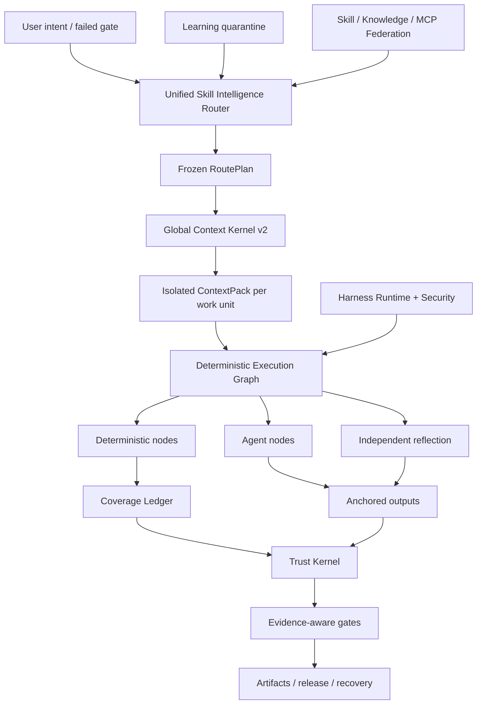

<p align="center">
  
</p>

<p align="center">
  <a href="LICENSE"></a>
  <a href="CHANGELOG.md"></a>
  
  
  
</p>

<p align="center"></p>
<h1 align="center">ForgeOS</h1>
<p align="center">ForgeOS ตัดสินใจว่า <strong>ทักษะใดที่อาจทำงาน</strong>, <strong>ซึ่งบริบทอาจเข้าสู่</strong>, <strong>ซึ่งขั้นตอนจะต้องเป็น กำหนด</strong> และ<strong>หลักฐานใดที่แข็งแกร่งพอที่จะยอมรับการเสร็จสิ้น</strong>.</p>

---

## เพราะเหตุใดจึงมี ForgeOS

ตัวแทนไม่น่าเชื่อถือเนื่องจากมีพร้อมท์มากขึ้น มีเครื่องมือมากขึ้น หรือมีหน้าต่างบริบทที่ยาวขึ้น

จะเชื่อถือได้เมื่อระบบสามารถตอบคำถามได้หกข้อ:

1. **ผลลัพธ์ที่แน่นอนคืออะไร**
2. **เทคนิคใดเหมาะสม และเทคนิคใดที่คล้ายคลึงกันในที่นี้ผิด**
3. **บริบทที่เล็กที่สุดที่จำเป็นสำหรับหน่วยงานนี้คืออะไร**
4. **ขั้นตอนใดที่ต้องกำหนดไว้แทนที่จะมอบหมายให้กับโมเดล**
5. **หลักฐานอิสระอะไรบ้างที่พิสูจน์ผลลัพธ์**
6. **เวิร์กโฟลว์เดียวกันสามารถกู้คืน ดำเนินการต่อ และตรวจสอบตัวเองหลังจากเกิดความล้มเหลวได้หรือไม่**

ForgeOS v0.6 เปลี่ยนคำถามเหล่านั้นให้เป็นรันไทม์:

```text
ยืนยันเจตนา
  → ผลลัพธ์ + การดึงเทคนิค
  → นโยบายฮาร์ดและตัวกรองป้องกันทริกเกอร์
  → แผนเส้นทางขั้นต่ำ DAG
  → ContextPack แบบแยกเดี่ยวต่อหน่วยงาน
  → กราฟการดำเนินการที่กำหนด / ตัวแทน / การสะท้อนกลับ
  → เอาท์พุตที่ยึดไว้ + บัญชีแยกประเภทความครอบคลุม
  → ใบเสร็จที่เชื่อถือได้ + ประตูหลักฐาน
  → ปล่อย ย้อนกลับ กู้คืน และกักกันการเรียนรู้
```

มันไม่ใช่การรวบรวมทันที เป็นระนาบควบคุมทักษะ กฎเกณฑ์ ตะขอ ตัวแทน เครื่องมือ บริบท หลักฐาน และการเรียนรู้

---

## สิ่งที่เป็นจริงใน v0.6.1

| พื้นผิว | ใช้งานแล้ว |
|---|---:|
| โครงผลลัพธ์ที่พิมพ์แบบเดิม | **1,024** |
| เทคนิค Deep Skill Contract v2 | **128** |
| L0 เทคนิคการเรียบเรียง/ความไว้วางใจ/บริบท | **32** |
| เทคนิควิศวกรรมข้ามโดเมน L1 | **96** |
| การผูกผู้ประเมินอิสระ | **128** |
| ผู้ให้บริการขั้นตอนที่มั่นคง | **33** |
| ผู้ให้บริการขั้นตอนการสมัคร | **242** |
| การแมปทักษะ + ความรู้ในตัว | **1,299** |
| กรณีความสอดคล้องของ Code Review Intelligence | **12** |
| กรณีฝ่ายตรงข้ามของเอเจนต์-พื้นผิว | **20/20** |
| การทำให้เป็นรูปเป็นร่างของผู้ให้บริการที่มีเสถียรภาพ | **33/33** |
| เราเตอร์พรีซิชั่น@1 / @3 | **93.75% / 100%** |
| เราเตอร์ Recall@6 | **100%** |
| การเปิดใช้งานเส้นทางที่ไม่ปลอดภัย | **0%** |

> [!สำคัญ]
> โหนดดั้งเดิม 1,024 โหนดนั้นเป็น **ฐานสนับสนุนผลลัพธ์** ไม่ใช่ทักษะขั้นตอนระดับการผลิต 1,024 รายการ v0.6 มีสัญญาเทคนิคเชิงลึก 128 สัญญา ผู้ให้บริการขั้นตอนสามสิบสามรายยังคงอยู่ในช่องทางการกำหนดเส้นทางที่เสถียรที่ประกาศไว้สำหรับความเข้ากันได้ แต่การตรวจสอบการรับรองขั้นสุดท้ายพบว่ามีคุณสมบัติตามหลักฐาน 0/128 รายการที่มีความเสถียร และ 0 รายได้รับการรับรองภายใต้คำจำกัดความการแก้ไข 2 ของเสร็จสิ้น หลักฐานที่เหลือจำเป็นต้องมีการระงับ การจับคู่หลายแบบจำลอง ความกดดัน การตรวจสอบโดยอิสระ และใบเสร็จรับเงินการผลิต

**คลังเคอร์เนล:** 32 เทคนิค L0 + 96 เทคนิค L1 = 128 เทคนิค Deep Kernel

**สถานะการกำหนดเส้นทางแคตตาล็อก:** 33 รายประกาศผู้ให้บริการขั้นตอนช่องทางเสถียรและผู้สมัคร 242 ราย **หลักฐานการรับรองอย่างเป็นทางการ:** 0 มีคุณสมบัติคงตัว, 0 ได้รับการรับรอง ดู [การตรวจสอบใบรับรองขั้นสุดท้าย](docs/FINAL-CERTIFICATION-AUDIT.md)

การตรวจสอบการเผยแพร่มีเจตนาทำให้การกล่าวอ้างเหล่านี้เป็นเท็จ:

```text
ทักษะขั้นตอนการผลิตระดับการผลิต 1,024 เท็จ
วงจรการใช้งาน PostgreSQL แบบเต็ม HA เท็จ
แซนด์บ็อกซ์ microVM สากลเป็นเท็จ
เกณฑ์มาตรฐานการตรวจสอบ 200-PR ที่มีป้ายกำกับโดยผู้เชี่ยวชาญเป็นเท็จ
การประเมินแบบจับคู่ 10,000 รายการทำงานผิดพลาด
```

ForgeOS v0.6 ไม่ได้อ้างสิทธิ์ความสมบูรณ์ของการผลิตที่เป็นสากลหรือทักษะขั้นตอนการผลิตระดับ 1,024

ดู [ขอบเขตการเรียกร้อง v0.6](docs/CLAIMS-BOUNDARY-V0.6.md)

---

## เส้นทางห้านาที

ใช้เส้นทางนี้เมื่อคุณต้องการคุณค่าโดยไม่ต้องเรียนรู้ Trust Kernel ก่อน

### 1. ติดตั้ง

```bash
npm install
npm test
node src/cli/forge.mjs init
```

แพ็คเกจที่ติดตั้ง:

```bash
npx forgeos init
forge doctor
```

`forge init` สร้างโปรไฟล์ SQLite-WAL ในเครื่องที่ปลอดภัย รหัส API ของมันถูกเขียนลงในไฟล์ `0600` และจะไม่มีการพิมพ์ออกมา

### 2.หาเทคนิคที่ใช่

```bash
forge skills search "react rerender"
forge skills inspect reducing-react-render-thrashing
forge route --query "compile the minimum context for a large monorepo"
```

### 3. ตรวจสอบ v0.6

```bash
forge v06 status
forge profile plan coding --target codex
forge security scan --file agent-surface.json
```

### 4. เริ่มระนาบควบคุมภายในเครื่อง

```bash
npm start
# Dashboard: http://127.0.0.1:8787/dashboard
# MCP:       http://127.0.0.1:8787/mcp
# A2A:       http://127.0.0.1:8787/a2a
```

---

## เส้นทางผู้ดำเนินการลึก

ใช้เส้นทางนี้เมื่อฝัง ForgeOS ลงใน Codex, Claude Code, ChatGPT, เอเจนต์โอเพ่นซอร์ส, CI หรือแพลตฟอร์มภายใน

### เราเตอร์ทักษะอัจฉริยะ

เราเตอร์ทำการดึงข้อมูลแบบสองขั้นตอนแทนที่จะจับคู่ชื่อทักษะ:

```text
ประตูเจตนา / ล้มเหลว
  → การดึงผลลัพธ์
  → การดึงข้อมูลทริกเกอร์เทคนิคโดยตรง
  → การยกเว้นการป้องกันทริกเกอร์
  → ความไว้วางใจ ผู้เช่า ครบกำหนด เครื่องมือ ใบอนุญาต ตัวกรองความใหม่
  → การจัดอันดับยูทิลิตี้การวัดใหม่
  → เทคนิคขั้นต่ำ DAG
  → ความละเอียดของผู้ให้บริการ
  → แผนเส้นทางที่ถูกแช่แข็ง
```

ทุกเทคนิคที่เลือกและถูกปฏิเสธล้วนมีเหตุผล ฮาร์ดบล็อคเกอร์จะเอาชนะคะแนนเสมอ

### เคอร์เนลบริบทสากล v2

ForgeOS จัดสรรงบประมาณให้กับคำขอทั้งหมด:

```text
ระบบ · งาน · ส่วนทักษะที่เลือก · สัญลักษณ์รหัส · สิ่งประดิษฐ์
· หน่วยความจำ · เอาท์พุตเครื่องมือ · การอ้างอิง · สกีมาเครื่องมือแบบขี้เกียจ
· สำรองผลผลิต · สำรองความปลอดภัย
```

มันมี:

- หนึ่งอินเทอร์เฟซบัญชีโทเค็นที่ใช้ร่วมกันโดยตัวแก้ไขและตัวสร้างวัตถุ
- การโหลดทักษะระดับส่วน
- บริบทที่แยกได้ต่อหน่วยงาน
- การทำให้เป็นรูปธรรมของเครื่องมือขี้เกียจ;
- รหัสสัญลักษณ์ ABI ความหมายและการปฏิเสธแฮชเก่า
- การฉายภาพเดลต้าสิ่งประดิษฐ์
- การฉีดสัญชาตญาณกำหนดขอบเขตและหมดอายุ
- บันทึกดิบที่ระบุถึงเนื้อหาซึ่งมีช่วงความล้มเหลวกลั่น
- รายการละเลยสำหรับทุกแหล่งที่มาไม่รวมอยู่ด้วย

### ผ้าทักษะการกำหนด

เทคนิค v0.6 ถูกรวบรวมเป็นกราฟที่ปฏิบัติการได้:

```text
โหนดที่กำหนด
  การเลือกขอบเขต · การรวมกลุ่ม · ความละเอียดของกฎ · การยึด · หลักฐาน

โหนดตัวแทน
  การสอบสวน · สมมติฐาน · การตัดสินโดเมน

โหนดสะท้อนแสง
  ความขัดแย้ง · ตัวกรองบวกลวง · ความสามารถในการดำเนินการ

โหนดควบคุม
  การเข้าร่วมแบบขนาน · ประตูครอบคลุม · ลองอีกครั้ง · การย้อนกลับ
```

บัญชีแยกประเภทความครอบคลุมของ SQLite ใช้สัญญาเช่า การเต้นของหัวใจ การฟันดาบ และใบเสร็จรับเงินที่เชื่อถือได้ ผู้ปฏิบัติงานที่ถูกเรียกคืนไม่สามารถทำเครื่องหมายหน่วยงานให้เสร็จสมบูรณ์ได้

### Code Review Intelligence ชิ้นแนวตั้ง

ชิ้นส่วนแนวตั้งที่สมบูรณ์ชิ้นแรกพิสูจน์สถาปัตยกรรมตั้งแต่ต้นจนจบ:

```text
ขอบเขตที่สมบูรณ์
→ หน่วยงานที่ตระหนักถึงความสัมพันธ์
→ การเลือกกฎตามบริบท
→ การวิเคราะห์ตัวแทนแบบแยก
→ พุกเส้น/แฮช
→ การย้ายตำแหน่งหลังการแก้ไข
→ การสะท้อนกลับอย่างอิสระ
→ ใบเสร็จรับเงินความคุ้มครอง
```

คลังข้อมูล 12 กรณีที่รวมไว้เป็นเกณฑ์มาตรฐานความสอดคล้องที่กำหนดได้ **ไม่**โฆษณาว่าเป็นเกณฑ์มาตรฐาน 200-PR ที่มีป้ายกำกับโดยผู้เชี่ยวชาญ

### การเรียนรู้อย่างต่อเนื่อง—โดยไม่ต้องวางยาพิษในตัวเองโดยอัตโนมัติ

รูปแบบที่สังเกตกลายเป็นสัญชาตญาณที่กำหนดขอบเขต ไม่ใช่ทักษะที่มั่นคง:

```text
ใบเสร็จรับเงินการดำเนินการที่เชื่อถือได้
  → สังเกตสัญชาตญาณ
  → ผู้เช่า/โครงการ/การแยกสายรัด + TTL
  → คลัสเตอร์สัญชาตญาณที่เข้ากันได้
  → ข้อเสนอวิวัฒนาการของผู้สมัคร
  → การประเมินโดยอิสระ
  → การเลื่อนขั้นหรือการย้อนกลับของมนุษย์
```

ผู้ผลิตไม่สามารถส่งเสริมพฤติกรรมการเรียนรู้ของตนเองได้

### รันไทม์เทียม v2

ForgeOS แบ่งความแตกต่างสี่พื้นผิว:

| พื้นผิว | ใช้สำหรับ |
|---|---|
| **กฎ** | ค่าคงที่แบบสั้นที่ต้องใช้ | เสมอ
| **ตะขอ** | การดำเนินการกำหนดที่เชื่อมโยงกับเหตุการณ์ |
| **ทักษะ** | ขั้นตอนแบบมีเงื่อนไขที่ต้องใช้วิจารณญาณ |
| **บทบาทตัวแทน** | แยกบริบท เครื่องมือ โมเดล หรือสิทธิอำนาจ |

เหตุการณ์ที่เป็นกลาง ได้แก่ `before.tool.execute`, `after.file.write`, `verification.checkpoint`, `session.compact` และ `session.ended` อะแดปเตอร์โฮสต์ต้องทำเครื่องหมายคุณลักษณะที่ไม่สนับสนุนแทนที่จะอ้างสิทธิ์ความเท่าเทียมกันที่ผิดพลาด

โปรไฟล์:

```text
น้อยที่สุด · การเขียนโค้ด · ความคิดสร้างสรรค์ · การวิจัย · มีการควบคุม
ท้องถิ่น-ขนาดเล็ก · องค์กร
```

### ตัวแทนการรักษาความปลอดภัยของพื้นผิว

เอ็นจิ้นความปลอดภัยจะสแกนระบบตัวแทนเอง:

- คำสั่งและการละเมิดขอบเขตทันที
- hooks และสคริปต์วงจรการใช้งานแพ็คเกจ
- คำอธิบาย MCP การอนุญาต และความสามารถในการเข้าถึงเครื่องมือ
- รายการคำสั่งที่อนุญาต;
- การอ้างอิงความลับ/สิ่งแวดล้อม
- เส้นทางการอนุญาตลับสู่ทางออก
- ความสามารถแบบไปป์ต่อเชลล์และไวด์การ์ดแบบกว้าง
- การอนุญาตโปรไฟล์แตกต่างก่อนการติดตั้ง

ปัจจุบันคลังข้อมูลของฝ่ายตรงข้ามผ่านคดีไปแล้ว **20/20**

### นายหน้าดำเนินการท้องถิ่น

นักวิ่งในพื้นที่กำหนดขอบเขตความปลอดภัยที่แท้จริงสำหรับคำสั่งปกติ:

- ไม่มีการแก้ไขเชลล์
- รายการคำสั่งและสภาพแวดล้อมที่อนุญาต
- พื้นที่ทำงานและการบรรจุ Symlink;
- การหมดเวลาและการสิ้นสุดกลุ่มกระบวนการ
- ขอบเขต stdout/stderr;
- ใบเสร็จรับเงินการดำเนินการตามเนื้อหา

มันไม่ใช่ **แซนด์บ็อกซ์ microVM ที่ปฏิเสธเครือข่ายสากล การดำเนินการของบุคคลที่สามที่มีความเสี่ยงสูงยังคงต้องใช้คอนเทนเนอร์ภายนอกหรือชั้นแยก microVM

---


# วิธีการทำงานของ ForgeOS

ForgeOS รวมสองผลิตภัณฑ์ไว้ในรันไทม์เดียว:

1. **เลเยอร์ Skill Intelligence** ที่ดึงเทคนิค ปฏิเสธการแข่งขันใกล้เคียงที่ไม่ปลอดภัย รวบรวมเฉพาะส่วนทักษะที่จำเป็น และสร้างแผนการดำเนินการที่หยุดนิ่ง
2. **ส่วนควบคุม AI** ที่จัดการโครงการ สิ่งประดิษฐ์ หลักฐาน การอนุมัติ สัญญาเช่า การกู้คืน สหพันธรัฐ และประตูปล่อย

```text
ยืนยันเจตนาหรือประตูล้มเหลว
  → การสืบค้นผลลัพธ์และเทคนิคโดยตรง
  → ตัวป้องกันทริกเกอร์ ผู้เช่า ความไว้วางใจ เครื่องมือ ใบอนุญาต และความสดใหม่
  → RoutePlan DAG ที่แช่แข็งขั้นต่ำ
  → ContextPack แบบแยกเดี่ยวต่อหน่วยงาน
  → กราฟการดำเนินการที่กำหนด / ตัวแทน / การสะท้อนกลับ
  → เอาต์พุตแบบยึดและบัญชีแยกประเภทความคุ้มครองแบบมีรั้วกั้น
  → ใบเสร็จรับเงินที่เชื่อถือได้และประตูที่ตระหนักถึงการรับประกัน
  → ปล่อย กู้คืน ย้อนกลับ หรือกักกันการเรียนรู้
```

## สิบระบบความร่วมมือ

| ระบบ | มันควบคุมอะไร |
|---|---|
| **เราเตอร์ทักษะอัจฉริยะ** | การดึงผลลัพธ์ การให้คะแนนเทคนิค การต่อต้านทริกเกอร์ นโยบายฮาร์ด การเลือกผู้ให้บริการ และ RoutePlans ที่อธิบายได้ |
| **เคอร์เนลบริบทสากล v2** | งบประมาณโทเค็นทั้งหมดหนึ่งรายการสำหรับนโยบาย งาน ส่วนทักษะ สัญลักษณ์ อาร์ติแฟกต์ หน่วยความจำ เอาท์พุตเครื่องมือ การอ้างอิง และสำรองเอาท์พุต |
| **ผ้าทักษะการกำหนด** | กราฟไฮบริดประกอบด้วยโหนดที่กำหนด โหนดเอเจนต์ โหนดสะท้อน การอนุมัติ จุดยึด และเงื่อนไขการหยุด |
| **บัญชีแยกประเภทความคุ้มครอง** | ความเป็นเจ้าของหน่วยงาน สัญญาเช่า โทเค็นฟันดาบ ความครอบคลุมของความสมบูรณ์ การปฏิเสธของพนักงานเก่า และความสามารถในการกลับมาทำงานต่อ |
| **เชื่อถือเคอร์เนล** | ความสดใหม่ของหลักฐาน เชื้อสายของสิ่งประดิษฐ์ อำนาจการอนุมัติ ระดับการรับประกัน และการตัดสินใจเผยแพร่ |
| **การรักษาความปลอดภัยพื้นผิวของตัวแทน** | รูปแบบการแทรกพร้อมท์ สคริปต์แพ็คเกจที่เป็นอันตราย เส้นทางลับสู่ทางออก การอนุญาต และความซื่อสัตย์ต่อความสามารถของอแด็ปเตอร์
| **การดำเนินการในท้องถิ่นแบบนายหน้า** | การวางไข่คำสั่งโดยไม่ต้องใช้เชลล์ รายการที่อนุญาต การหมดเวลา ขีดจำกัดเอาต์พุต และการรับแบบมีโครงสร้าง |
| **การเรียนรู้อย่างต่อเนื่อง** | สัญชาตญาณที่กำหนดขอบเขต การหมดอายุ ความเชื่อมั่น การกักกัน ข้อเสนอของผู้สมัคร และการเลื่อนตำแหน่งที่มีการควบคุม |
| **สหพันธ์ทักษะ** | แหล่งที่มาที่ลงนาม ระดับความน่าเชื่อถือ การกักกัน การจัดการข้อขัดแย้ง การเพิกถอน และแค็ตตาล็อกที่ซิงโครไนซ์ |
| **สายรัดรันไทม์ v2** | กฎ ตะขอ ทักษะ บทบาทของเจ้าหน้าที่ ความแตกต่างในการอนุญาต และโปรไฟล์สำหรับชุดควบคุม AI ต่างๆ

---

# เปรียบเทียบระบบนิเวศ

> [!สำคัญ]
> การเปรียบเทียบนี้อธิบาย **การมุ่งเน้นเนทีฟระดับเฟิร์สคลาสของแต่ละพื้นที่เก็บข้อมูลหลัก** `◐` หมายถึงการสนับสนุนบางส่วน การสนับสนุนตามส่วนขยาย หรือการสนับสนุนผ่านผลิตภัณฑ์ที่อยู่ติดกัน `—` หมายความว่าไม่ใช่จุดสนใจหลักของโครงการ ไม่ใช่ว่ามันเป็นไปไม่ได้ที่จะสร้าง

ดาว GitHub ด้านล่างเป็นตัวเลขโดยประมาณที่ตรวจสอบเมื่อ **26 กรกฎาคม 2026** สิ่งเหล่านี้บ่งบอกถึงการมองเห็นของชุมชน ไม่ใช่คุณภาพทางวิศวกรรมด้วยตัวมันเอง

## แผนที่ระบบนิเวศ

| โครงการ | ประมาณ GitHub ติดดาว | บทบาทหลัก |
|---|---:|---|
| [มหาอำนาจ](https://github.com/obra/superpowers) | **255k** | กรอบทักษะตัวแทนและวิธีการพัฒนาซอฟต์แวร์ |
| [ทักษะตัวแทนมานุษยวิทยา](https://github.com/anthropics/skills) | **151,000** | มาตรฐานทักษะและคลังทักษะสาธารณะสำหรับ Claude |
| [LangChain](https://github.com/langchain-ai/langchain) | **139k** | แพลตฟอร์มวิศวกรรมตัวแทนและระบบนิเวศบูรณาการขนาดใหญ่ |
| [OpenHands](https://github.com/All-Hands-AI/OpenHands) | **75k+** | แอปพลิเคชันตัวแทนการพัฒนาซอฟต์แวร์แบบครบวงจร |
| [CrewAI](https://github.com/crewAIInc/crewAI) | **56k+** | ทีมงานหลายตัวแทนและโฟลว์ที่ขับเคลื่อนด้วยเหตุการณ์ |
| [AutoGen](https://github.com/microsoft/autogen) | **50,000+** | การส่งข้อความหลายตัวแทนและรันไทม์การวิจัย |
| [LangGraph](https://github.com/langchain-ai/langgraph) | **37k+** | กราฟตัวแทนแบบมีสถานะและใช้งานได้ยาวนาน |
| [เคอร์เนลความหมาย](https://github.com/microsoft/semantic-kernel) | **28k+** | SDK การจัดการองค์กรหลายภาษา |
| [ทักษะเอเย่นต์ที่ยอดเยี่ยม](https://github.com/VoltAgent/awesome-agent-skills) | **28k+** | แคตตาล็อกชุมชนมากกว่าหนึ่งพันทักษะ |
| [SDK ตัวแทน OpenAI](https://github.com/openai/openai-agents-python) | **27k+** | ตัวแทน แฮนด์ออฟ รั้ว เซสชัน และการติดตาม |
| [สารก่อควัน](https://github.com/huggingface/smolagents) | **27k+** | ไลบรารีตัวแทนขั้นต่ำพร้อมการเน้นโค้ดเอเจนต์ |
| [เล็ต](https://github.com/letta-ai/letta) | **23k+** | ตัวแทนสถานะและหน่วยความจำถาวร |
| [Google ADK](https://github.com/google/adk-python) | **ประมาณ 20,000** | การสร้างเอเจนต์ที่เน้นโค้ดเป็นหลัก การประเมิน และการปรับใช้ |
| [PydanticAI](https://github.com/pydantic/pydantic-ai) | **ประมาณ 19,000** | เฟรมเวิร์กเอเจนต์ Python ที่ปลอดภัยสำหรับประเภท |

## เมทริกซ์ความสามารถหลัก

| ระบบ | แพ็คเกจทักษะ | การกำหนดเส้นทาง + ป้องกันทริกเกอร์ | บริบทที่ควบคุม | กราฟไฮบริดเชิงกำหนด/เอเจนต์ | หลักฐาน+ใบทรัสต์ | ความปลอดภัยของเอเจนต์พื้นผิว | พลังพื้นเมือง |
|---|:---:|:---:|:---:|:---:|:---:|:---:|---|
| **ForgeOS** | ✅ | ✅ | ✅ | ✅ | ✅ | ✅ | ความฉลาดด้านทักษะและการดำเนินการที่น่าเชื่อถือ |
| ทักษะมานุษยวิทยา | ✅ | ◐ | ◐ | — | — | ◐ | ทักษะมาตรฐาน พกพาง่าย |
| มหาอำนาจ | ✅ | ✅ | ◐ | ◐ | ◐ | — | วิธีการ SDLC ที่ชัดเจนสูงสำหรับเอเจนต์การเข้ารหัส |
| ทักษะตัวแทนที่ยอดเยี่ยม | ✅ | — | — | — | — | ◐ | การค้นพบทักษะจากหลายแหล่ง |
| แลงเชน | ◐ | ◐ | ◐ | ◐ | ◐ | ◐ | ระบบนิเวศบูรณาการขนาดใหญ่มาก |
| แลงกราฟ | ◐ | ◐ | ◐ | ✅ | ◐ | ◐ | การดำเนินการที่ทนทานและกราฟสถานะ |
| SDK ตัวแทน OpenAI | ◐ | ◐ | ◐ | ◐ | ◐ | ◐ | เฟรมเวิร์กน้ำหนักเบา แฮนด์ออฟ และการติดตาม |
| CrewAI | ◐ | ◐ | ◐ | ✅ | ◐ | ◐ | ตัวแทนตามบทบาทรวมกับ Flows |
| ออโต้เจน | ◐ | ◐ | ◐ | ✅ | ◐ | ◐ | รันไทม์หลายเอเจนต์ที่ขับเคลื่อนด้วยเหตุการณ์ |
| เคอร์เนลความหมาย / MAF | ◐ | ◐ | ◐ | ✅ | ◐ | ◐ | การประสานองค์กรข้ามรันไทม์ |
| Google ADK | ◐ | ◐ | ◐ | ✅ | ◐ | ◐ | สร้าง ประเมิน และปรับใช้ในระบบนิเวศของ Google |
| PydanticAI | ◐ | ◐ | ◐ | ◐ | ◐ | ◐ | ความปลอดภัยประเภท การตรวจสอบ และการยศาสตร์ของ Python |
| สารทำให้ระคายเคือง | ◐ | ◐ | ◐ | ◐ | — | ◐ | การใช้งานเอเจนต์น้อยที่สุดและอ่านง่าย |
| เลตต้า | ◐ | ◐ | ✅ | ◐ | ◐ | ◐ | หน่วยความจำถาวรและเอเจนต์สถานะ |
| โอเพ่นแฮนด์ | ◐ | ◐ | ◐ | ◐ | ◐ | ✅ | ประสบการณ์ตัวแทนการเข้ารหัสแบบ end-to-end |

## ForgeOS เลือกสนามรบอื่น

คำตอบจากคลังทักษะ: **“ตัวแทนสามารถเรียนรู้ขั้นตอนใดบ้าง”**

ForgeOS ยังถาม: **“เทคนิคใดที่ได้รับอนุญาตในตอนนี้ ซึ่งการจับคู่ที่ใกล้เคียงจะต้องถูกปฏิเสธ ส่วนใดที่อาจเข้าสู่บริบท เครื่องมือใดที่จำเป็น ต้องแสดงหลักฐานอะไรบ้าง และประตูใดที่อาจประกาศว่างานเสร็จสมบูรณ์”**

เฟรมเวิร์กตัวแทนช่วยสร้างตัวแทน เครื่องมือ แฮนด์ออฟ และเวิร์กโฟลว์ ForgeOS มุ่งเน้นไปที่เลเยอร์ที่อยู่รอบรันไทม์นั้น: การดึงความสามารถ, ตัวป้องกันทริกเกอร์, งบประมาณบริบททั่วโลก, กราฟที่กำหนด/ตัวแทน/การสะท้อน, หลักฐานปัจจุบัน, อำนาจการอนุมัติ, สายเลือดของสิ่งประดิษฐ์, การกู้คืน และการกักกันการเรียนรู้

ระบบหน่วยความจำมุ่งเน้นไปที่สิ่งที่เจ้าหน้าที่จดจำ ForgeOS ยังควบคุมเพิ่มเติมว่าผู้เช่า โปรเจ็กต์ ผู้ใช้ โดเมนที่เชื่อถือได้ การหมดอายุ ความเชื่อมั่น และการส่งเสริมการขายใดที่เป็นของหน่วยความจำ

เอเจนต์การเข้ารหัสแบบ end-to-end มอบประสบการณ์ผู้ใช้ ForgeOS สามารถทำงาน **ใต้หรือข้าง** เอเจนต์นั้นเป็นเลเยอร์การเลือกทักษะ การกำกับดูแลบริบท หลักฐาน ความไว้วางใจ และวงจรชีวิตของโครงการ

## ที่ที่ระบบนิเวศที่สมบูรณ์ยังคงเป็นผู้นำ

ปัจจุบันพวกเขามีชุมชนที่ใหญ่ขึ้น มีบทแนะนำสอนการใช้งานและการผสานรวมที่มากขึ้น ประสบการณ์ระบบคลาวด์ที่มีการจัดการที่สวยงามมากขึ้น การเริ่มใช้งานแบบไม่ต้องเขียนโค้ดที่แข็งแกร่งขึ้น และการปรับใช้งานจริงที่จัดทำเป็นเอกสารสาธารณะมากขึ้น ForgeOS จงใจมุ่งเน้นไปที่ปัญหาที่มีมาตรฐานน้อยกว่า: **การควบคุมตัวเลือกทักษะ บริบท หลักฐาน อำนาจ และสถานะความสมบูรณ์สำหรับตัวแทน AI**

---

#ทางเข้าสามทาง

## สำหรับผู้ใช้ในชีวิตประจำวัน

คุณไม่จำเป็นต้องเข้าใจทุกระบบย่อย เริ่มต้นด้วยการทดสอบที่สังเกตได้สี่แบบ:

```bash
node src/cli/forge.mjs doctor
node src/cli/forge.mjs skills search --query "review authentication changes"
node src/cli/forge.mjs route --query "review authentication changes without missing tests"
node src/cli/forge.mjs scan agent-surface --path .
```

คุณสามารถตรวจสอบได้ว่าเทคนิคใดถูกเลือก เหตุใดทางเลือกอื่นจึงถูกปฏิเสธ จำนวนบริบทที่ถูกรวบรวม สิทธิ์ใดบ้างที่ร้องขอ และหลักฐานใดที่ยังขาดหายไป

## สำหรับนักพัฒนา

ForgeOS เปิดเผยรันไทม์เดียวกันผ่าน:

- CLI สำหรับการดำเนินงานในพื้นที่และ CI;
- HTTP API และแดชบอร์ด Studio
- **เครื่องมือ MCP ที่เข้มงวดสคีมา 60 รายการ**;
- งาน A2A และพื้นผิวการ์ดตัวแทน
- การนำเข้าบริการโดยตรงจากแผนผังต้นทาง Node.js
- **อะแดปเตอร์ 15 ตัว** สำหรับเอเจนต์และระบบนิเวศ IDE
- โปรไฟล์สายรัดเจ็ดโปรไฟล์: `minimal`, `coding`, `creative`, `research`, `regulated`, `local-small` และ `enterprise`

นักพัฒนาสามารถสร้างโปรเจ็กต์ ลงทะเบียนสิ่งประดิษฐ์ ผูกหลักฐาน ขออนุมัติ คอมไพล์ RoutePlans และ ContextPacks รันกราฟ กู้คืนการแก้ไข ซิงโครไนซ์ทักษะแบบรวมศูนย์ หรือเพิ่ม Skill Contract v2 ใหม่

## สำหรับผู้เชี่ยวชาญและนักวิจัย

ForgeOS ได้รับการออกแบบมาให้ท้าทายมากกว่าที่จะได้รับการยอมรับจากเพจทางการตลาด ผู้เชี่ยวชาญสามารถทดสอบ:

- ความแม่นยำของเราเตอร์ การเรียกคืน พฤติกรรมต่อต้านทริกเกอร์ และการเปิดใช้งานที่ไม่ปลอดภัย
- การล้นบริบททั้งหมดและการลด ABI เชิงความหมาย
- ความคุ้มครองที่กำหนด พุก การสะท้อน สัญญาเช่า และการฟันดาบ
- พิสูจน์ความสดใหม่ เชื้อสายของสิ่งประดิษฐ์ และประตูที่ตระหนักถึงการรับประกัน
- การแทรกพร้อมต์ สคริปต์แพ็กเกจ เส้นทางลับสู่ทางออก และความซื่อสัตย์ของอะแดปเตอร์
- ความขัดแย้งของสหพันธ์ การกักกัน การเพิกถอน และความไว้วางใจจากแหล่งที่มา
- ยืนยันการเก็บถาวรโดยไม่มี `.git`

```bash
npm run validate
npm run v06:audit
npm run router:benchmark
npm run context:benchmark
npm run federation:eval
npm run federation:audit
npm run smoke
npm run adapter:tck
npm run release:verify
```

---

#แผนที่พื้นที่เก็บข้อมูล

```text
การใช้งาน src/ รันไทม์
  cli/ forge อินเตอร์เฟสบรรทัดคำสั่ง
  แกนหลัก/โครงการ สิ่งประดิษฐ์ หลักฐาน การอนุมัติ การฟื้นฟู
  ทักษะ-สติปัญญา/สัญญา การกำหนดเส้นทาง การประเมิน การเป็นรูปธรรม
  บริบท/ เคอร์เนลบริบทส่วนกลางและการคอมไพล์หน่วยงาน
  การดำเนินการ/คอมไพเลอร์กราฟ โหนดที่กำหนด ความครอบคลุม
  ความไว้วางใจ/หลักฐาน ความเชื่อมั่น อำนาจ ประตูปล่อย
  การสแกนความปลอดภัย/เอเจนต์-พื้นผิว และนายหน้าคำสั่ง
  สหพันธ์/ แหล่งที่มาระยะไกล ความน่าเชื่อถือ การกักกัน การซิงโครไนซ์
  การเรียนรู้/สัญชาตญาณ ผู้สมัคร การหมดอายุ การเลื่อนตำแหน่ง
  เซิร์ฟเวอร์ mcp/ MCP และเครื่องมือสาธารณะ 60 รายการ
  การ์ด a2a/ A2A งาน ข้อความ และใบเสร็จรับเงิน
  เซิร์ฟเวอร์/ HTTP API, การรับรองความถูกต้อง, แดชบอร์ด
  ที่เก็บข้อมูล / การคงอยู่และการโยกย้ายของ SQLite-WAL
อะแดปเตอร์/ 15 เอเจนต์และอะแดปเตอร์ IDE
skills-v2/ 128 เทคนิคสัญญาทักษะลึก v2
ความสามารถ-v2/ ผลลัพธ์ เทคนิค ผู้ให้บริการ ความสัมพันธ์ กราฟ
สคีมา/สัญญา JSON Schema สาธารณะปี 2020-12
แพ็ค/แพ็คความสามารถแนวตั้งและเกณฑ์มาตรฐาน
การประเมิน/กรณีการประเมิน รูบริก และเนื้อหา
ทดสอบ/ 125 ไฟล์ทดสอบ และปล่อยค่าคงที่
หลักฐาน/การตรวจสอบที่สร้างขึ้น เกณฑ์มาตรฐาน SBOM และหลักฐานแดชบอร์ด
เอกสาร/ สถาปัตยกรรม โปรโตคอล ความปลอดภัย การทดสอบ การผลิต
สคริปต์/การสร้าง การตรวจสอบความถูกต้อง การตรวจสอบ การวัดประสิทธิภาพ และเครื่องมือเผยแพร่
```

#กรณีการใช้งานที่เหมาะสม

- ทำให้ตัวแทนการเขียนโค้ดมีระเบียบวินัยและตรวจสอบได้มากขึ้น
- การสร้างเครื่องบินควบคุมสำหรับโมเดล ตัวแทน และเครื่องมือต่างๆ
- ใช้งานแพลตฟอร์มทักษะภายในพร้อมการควบคุมการกำหนดเส้นทางและวุฒิภาวะ
- การตรวจสอบการกำหนดค่าตัวแทน สิทธิ์ การแจ้ง และพื้นผิวของห่วงโซ่อุปทาน
- กระบวนการทำงานที่มีความเชื่อมั่นสูงหรือได้รับการควบคุมซึ่งต้องใช้หลักฐานและประตูการอนุมัติ
- ลดการสิ้นเปลืองบริบทในที่เก็บข้อมูลขนาดใหญ่ผ่านการแยกหน่วยงานและ Semantic ABI

ForgeOS ไม่ได้มาแทนที่ระบบเวิร์กโฟลว์ธุรกิจแบบอัตโนมัติสไตล์ n8n n8n เชื่อมโยงแอปพลิเคชันและกิจกรรมทางธุรกิจ ForgeOS ควบคุมการเลือกเทคนิค AI บริบท การดำเนินการ หลักฐาน และอำนาจ สามารถใช้ร่วมกันได้

---

## สถาปัตยกรรม



---

## การรวม MCP และตัวแทน

ForgeOS รองรับ MCP `2025-11-25`, A2A `1.0`, แพ็คเกจที่เข้ากันได้กับทักษะของตัวแทน, HTTP และ CLI

เครื่องมือสาธารณะ v0.6 ประกอบด้วย:

```text
forge_v06_สถานะ
forge_execution_graph_compile
forge_review_scope_compile
forge_context_work_units_compile
forge_harness_profile_plan
forge_agent_surface_scan
```

พวกเขาเข้าร่วมโครงการที่มีอยู่ สิ่งประดิษฐ์ หลักฐานที่เชื่อถือได้ การกู้คืน สหพันธ์ ข่าวกรองทักษะ และเครื่องมือนายหน้า MCP Stdio, HTTP MCP, CLI และ Studio แชร์บริการและ JSON Schemas เดียวกัน

ชุดอะแดปเตอร์ที่รองรับ ได้แก่ ChatGPT, Codex, Claude Code, Cursor, OpenCode, Gemini CLI, Copilot CLI, Cline, Roo Code, Windsurf, Continue, NolaneNative, OpenClaw, Pi และ MCP/A2A ทั่วไป หลักฐานทำให้อะแดปเตอร์ **ผ่านการทดสอบโปรโตคอล** แตกต่างจากคำแนะนำ **เฉพาะเอกสารเท่านั้น**

---

## การยืนยัน

```bash
npm run validate
npm run skills:v2:audit
npm run v06:audit
npm run router:benchmark
npm run context:benchmark
npm run federation:eval
npm run federation:audit
npm run smoke
npm run adapter:tck
npm run release:verify
```

ประตูปล่อยจะตรวจสอบพฤติกรรมและสัญญา ไม่ใช่แค่ความครอบคลุมของสาย:

- สภาพ การฟันดาบ การไม่เก่า และค่าคงที่ของวงจรชีวิต
- วงจรชีวิต MCP/A2A เต็มรูปแบบและสกีมาเอาท์พุต
- ความลึกของทักษะ ต้นแบบ แฮชของส่วน และการทำให้เป็นรูปธรรม
- ความแม่นยำของเราเตอร์ การเรียกคืน การกำหนดระดับ และการเปิดใช้งานที่ไม่ปลอดภัย
- การล้นบริบททั่วโลกและการบัญชีการละเว้น
- การดำเนินการที่กำหนดและบัญชีแยกประเภทความครอบคลุม
- ทบทวนจุดยึดและการสะท้อนกลับ
- การประเมินที่เป็นอิสระและการกักกันการเรียนรู้อย่างต่อเนื่อง
- กรณีความขัดแย้งระหว่างตัวแทนและพื้นผิว
- การติดตั้งเก็บถาวรและการยืนยันตัวเองโดยไม่ต้อง `.git`

---

## ขอบเขตการผลิต

**บูรณาการวันนี้**

- แบ็กเอนด์วงจรการใช้งานโหนดเดียวของ SQLite WAL;
- การแก้ไข/CAS, สัญญาเช่า, การฟันดาบ, สแน็ปช็อต, กู้คืน, ACL, คีย์ OIDC/API;
- ใบเสร็จรับเงินที่เชื่อถือได้, แฮชซองจดหมายสิ่งประดิษฐ์, ประตูที่รับรู้การรับประกัน
- สหพันธ์ทักษะ/ความรู้/MCP ตามขอบเขตผู้เช่า
- การระบายน้ำที่สวยงาม ความพร้อม ตัวชี้วัด แหล่งที่มาของการเปิดตัวที่ลงนาม
- โปรไฟล์การปรับใช้ที่ไม่ใช่รูท/อ่านอย่างเดียว

** ยังไม่ได้อ้างสิทธิ์ v0.6 **

- แบ็กเอนด์แบบดรอปอิน PostgreSQL ตลอดอายุการใช้งานและการทดสอบความล้มเหลวแบบหลายโหนด
- แซนด์บ็อกซ์ microVM ของบุคคลที่สามที่เป็นสากล
- SCIM/การบริหารองค์กรที่ได้รับมอบหมาย
- บริการจัดการความโปร่งใสและ PKI
- A2A สตรีมมิ่ง/พุชและกระจายเรซูเม่;
- 1,024 ทักษะขั้นตอนการผลิตระดับ;
- วิ่งประเมินคู่ 10,000 ครั้ง;
- เกณฑ์มาตรฐานการตรวจสอบโค้ดข้ามภาษาที่ผู้เชี่ยวชาญตัดสิน

อ่าน [การผลิต](docs/PRODUCTION.md), [โมเดลความปลอดภัย](docs/SECURITY-MODEL.md) และ [Self-Audit v0.6](docs/SELF-AUDIT-V0.6.md)

---

## แผนที่เอกสารประกอบ

| เริ่มที่นี่ | เจาะลึก |
|---|---|
| [เริ่มต้นอย่างรวดเร็ว](docs/QUICKSTART.md) | [สถาปัตยกรรม](docs/ARCHITECTURE.md) |
| [ความฉลาดทางทักษะ](docs/SKILL-INTELLIGENCE.md) | [โครงสร้างที่กำหนด v0.6](docs/DETERMINISTIC-SKILL-FABRIC-V06.md) |
| [CLI และโปรไฟล์](docs/HARNESS-RUNTIME-V2.md) | [เคอร์เนลบริบทสากล](docs/GLOBAL-CONTEXT-KERNEL.md) |
| [ความปลอดภัย](docs/AGENT-SURFACE-SECURITY.md) | [การเรียนรู้อย่างต่อเนื่อง](docs/CONTINUOUS-LEARNING-V06.md) |
| [การทดสอบ](docs/TESTING.md) | [ขอบเขตการเรียกร้อง](docs/CLAIMS-BOUNDARY-V0.6.md) |
| [การมีส่วนร่วม](CONTRIBUTING.md) | [การตรวจสอบตนเอง](docs/SELF-AUDIT-V0.6.md) |

---

## ภาษา

[Universal Lanes](docs/UNIVERSAL-LANES.md) · [Remote MicroVM Sandbox](docs/REMOTE-MICROVM-SANDBOX.md) · [Tiếng Việt](README-vn.md) · [简体中文](README-cn.md) · [繁體中文](README-tw.md) · [日本語](README-ja.md) · [한국어](README-ko.md) · [Español](README-es.md) · [Français](README-fr.md) · [Deutsch](README-de.md) · [Português](README-pt-br.md) · [Русский](README-ru.md) · [العربية](README-ar.md) · [हिन्दी](README-hi.md) · [Bahasa Indonesia](README-id.md) · [ไทย](README-th.md) · [Türkçe](README-tr.md) · [Italiano](README-it.md) · [Polski](README-pl.md) · [Українська](README-uk.md) · [Nederlands](README-nl.md) · [فارسی](README-fa.md) · [עברית](README-he.md) · [Svenska](README-sv.md)

---

## มีส่วนร่วม

ทักษะใหม่ไม่ได้รับการยอมรับเพราะร้อยแก้วฟังดูเชี่ยวชาญ มันต้องการ:

1. เส้นฐานสีแดงที่ล้มเหลวโดยไม่มีเทคนิค
2. ทริกเกอร์ที่แม่นยำและตัวป้องกันทริกเกอร์
3. ขั้นตอนเฉพาะโดเมนและแบบจำลองความล้มเหลว
4. ข้อมูลนำเข้า ผลลัพธ์ เครื่องมือ และหลักฐาน
5. แฮชส่วนและงบประมาณโทเค็น
6. การผูกมัดผู้ประเมินอิสระ
7. หลักฐานเกณฑ์มาตรฐานและการตัดสินใจครบกำหนด

ดู [CONTRIBUTING.md](CONTRIBUTING.md), [GOVERNANCE.md](GOVERNANCE.md) และ [SECURITY.md](SECURITY.md)

## ใบอนุญาต

MIT — ดู [ใบอนุญาต](LICENSE)


## การตรวจสอบการเปิดตัวขั้นสุดท้าย

- [รายงานการชุบแข็งครั้งสุดท้าย](docs/FINAL-HARDENING-REPORT.md)
- [การตรวจสอบใบรับรองทักษะขั้นสุดท้าย](docs/FINAL-CERTIFICATION-AUDIT.md)
