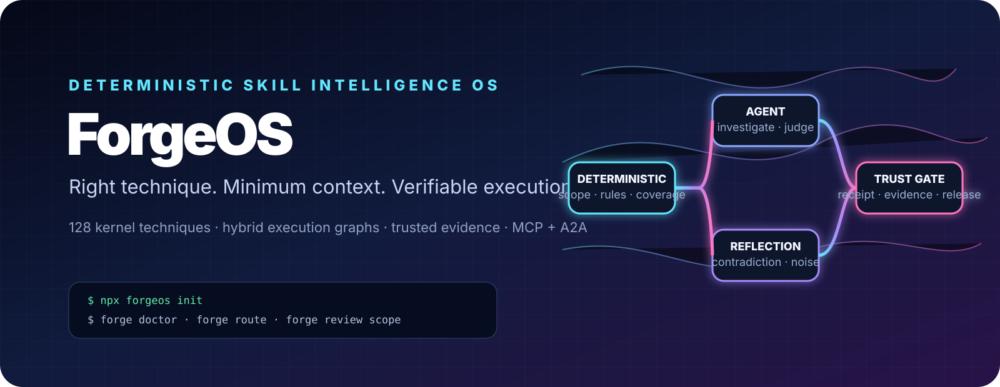
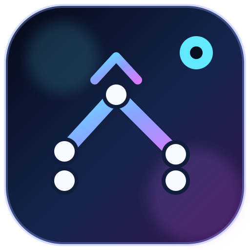
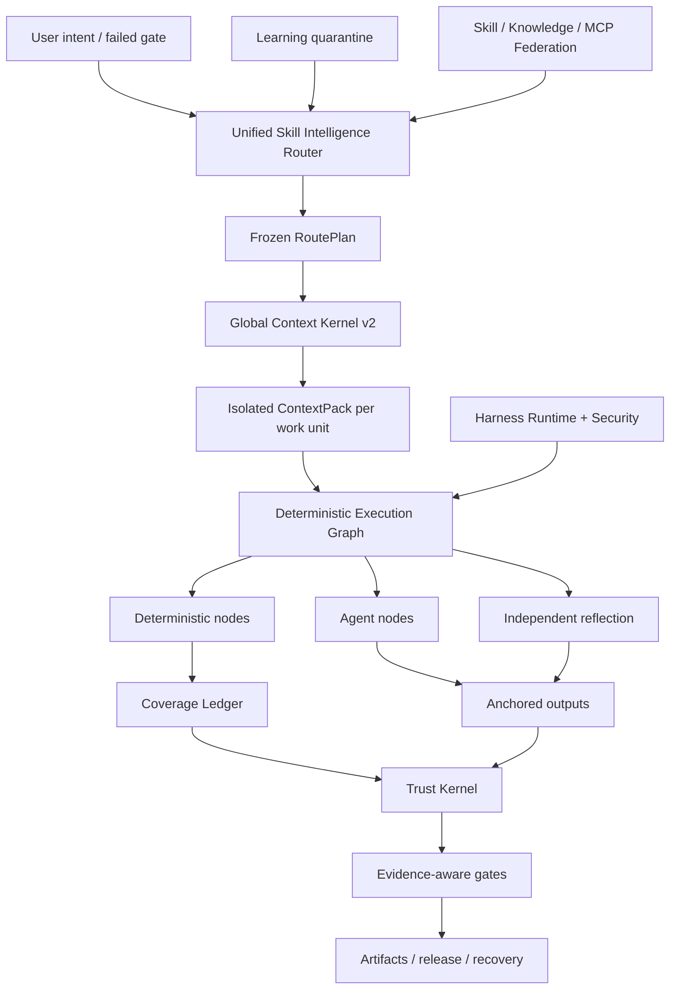

<p align="center">
  
</p>

<p align="center">
  <a href="LICENSE"></a>
  <a href="CHANGELOG.md"></a>
  
  
  
</p>

<p align="center"></p>
<h1 align="center">ForgeOS</h1>
<p align="center">ForgeOS, <strong>hangi becerinin çalışabileceğine karar verir. deterministik</strong> ve <strong>hangi kanıt tamamlanmayı kabul edecek kadar güçlü</strong>.</p>

---

## ForgeOS neden var?

Bir aracı, daha fazla istem, daha fazla araç veya daha uzun bir bağlam penceresine sahip olduğu için güvenilir hale gelmez.

Sistem altı soruyu yanıtlayabildiğinde güvenilir hale gelir:

1. **Tam olarak hangi sonuç gerekli?**
2. **Burada hangi teknik uygundur ve hangi benzer teknikler yanlıştır?**
3. **Bu çalışma birimi için gereken en küçük bağlam nedir?**
4. **Hangi adımlar bir modele devredilmek yerine deterministik olmalıdır?**
5. **Çıktıyı hangi bağımsız kanıt kanıtlıyor?**
6. **Aynı iş akışı başarısızlıktan sonra kendini kurtarabilir, devam ettirebilir ve denetleyebilir mi?**

ForgeOS v0.6 bu soruları bir çalışma zamanına dönüştürüyor:

```text
doğrulanmış niyet
  → sonuç + teknik erişimi
  → katı politika ve tetikleme önleyici filtreler
  → minimum RoutePlan DAG
  → iş birimi başına izole edilmiş ContextPack
  → deterministik / aracı / yansıma yürütme grafiği
  → bağlantılı çıkışlar + kapsama defteri
  → güvenilir makbuzlar + kanıt kapıları
  → serbest bırakma, geri alma, kurtarma ve öğrenme karantinası
```

Bu hızlı bir koleksiyon değil. Becerilerin, kuralların, kancaların, etmenlerin, araçların, bağlamın, kanıtların ve öğrenmenin etrafındaki kontrol düzlemidir.

---

## v0.6.1'de gerçek olan nedir

| Yüzey | Doğrulanmış uygulama |
|---|---:|
| Eski tipte sonuç iskeleleri | **1.024** |
| Derin Beceri Sözleşmesi v2 teknikleri | **128** |
| L0 düzenleme/güven/bağlam teknikleri | **32** |
| L1 alanlar arası mühendislik teknikleri | **96** |
| Bağımsız değerlendirici bağlamaları | **128** |
| Kararlı prosedür sağlayıcıları | **33** |
| Aday prosedür sağlayıcıları | **242** |
| Yerleşik beceri + bilgi eşlemeleri | **1.299** |
| Kod İncelemesi İstihbarat uyumluluk vakaları | **12** |
| Ajan-yüzeyindeki çekişmeli davalar | **20/20** |
| Kararlı sağlayıcı gerçekleştirme | **33/33** |
| Yönlendirici Hassasiyeti@1 / @3 | **%93,75 / %100** |
| Yönlendirici Geri Çağırma@6 | **%100** |
| Güvenli olmayan rota etkinleştirme | **%0** |

> [!ÖNEMLİ]
> 1.024 eski düğüm, 1.024 üretim düzeyinde prosedür becerisi değil, **sonuç iskelesidir**. v0.6, 128 derin teknik sözleşmesi içerir. Uyumluluk açısından otuz üç prosedür sağlayıcısı beyan edilen kararlı yönlendirme kanalında kalır, ancak son sertifika denetimi 0/128 kanıt nitelikli kararlı ve 0 Revizyon 2 Tamamlandı Tanımı kapsamında sertifikalı bulunur. Geriye kalan kanıtlar ise uzatmayı, eşleştirilmiş çoklu modeli, baskıyı, bağımsız incelemeyi ve üretim makbuzlarını gerektirir.

**Çekirdek envanteri:** 32 L0 tekniği + 96 L1 tekniği = 128 derin çekirdek tekniği.

**Katalog yönlendirme durumları:** 33 beyan edilmiş kararlı kanal prosedür sağlayıcısı ve 242 aday. **Resmi sertifika kanıtı:** 0 kararlı nitelikli, 0 sertifikalı. Bkz. [Son Sertifikasyon Denetimi](docs/FINAL-CERTIFICATION-AUDIT.md).

Sürüm denetimi kasıtlı olarak bu iddiaların yanlış olmasını sağlar:

```text
1.024 üretim düzeyinde prosedür becerileri yanlış
Tam PostgreSQL yaşam döngüsü HA yanlış
evrensel microVM korumalı alan yanlış
uzman etiketli 200-PR inceleme karşılaştırması yanlış
10.000 eşleştirilmiş değerlendirme yanlış çalışıyor
```

ForgeOS v0.6, evrensel üretim bütünlüğü veya 1.024 üretim düzeyinde prosedür becerisi iddiasında değildir.

Bkz. [İddia Sınırı v0.6](docs/CLAIMS-BOUNDARY-V0.6.md).

---

## Beş dakikalık yol

Önce Güven Çekirdeğini öğrenmeden değer elde etmek istediğinizde bu yolu kullanın.

### 1. Yükle

```bash
npm install
npm test
node src/cli/forge.mjs init
```

Kurulu paket:

```bash
npx forgeos init
forge doctor
```

`forge init` güvenli bir yerel SQLite-WAL profili oluşturur. API anahtarı `0600` dosyasına yazılır ve hiçbir zaman yazdırılmaz.

### 2. Doğru tekniği bulun

```bash
forge skills search "react rerender"
forge skills inspect reducing-react-render-thrashing
forge route --query "compile the minimum context for a large monorepo"
```

### 3. v0.6'yı inceleyin

```bash
forge v06 status
forge profile plan coding --target codex
forge security scan --file agent-surface.json
```

### 4. Yerel kontrol düzlemini başlatın

```bash
npm start
# Dashboard: http://127.0.0.1:8787/dashboard
# MCP:       http://127.0.0.1:8787/mcp
# A2A:       http://127.0.0.1:8787/a2a
```

---

## Derin operatör yolu

ForgeOS'u Codex'e, Claude Code'a, ChatGPT'ye, açık kaynaklı bir aracıya, CI'ya veya dahili bir platforma eklerken bu yolu kullanın.

### Beceri Zekası Yönlendiricisi

Yönlendirici, bir beceri adını eşleştirmek yerine iki aşamalı alım gerçekleştirir:

```text
niyet / başarısız kapı
  → sonuç alma
  → doğrudan teknik tetiklemeli erişim
  → tetikleme önleyici dışlama
  → güven, kiracı, olgunluk, araç, lisans, tazelik filtreleri
  → ölçülen fayda yeniden sıralaması
  → minimum teknik DAG
  → sağlayıcı çözünürlüğü
  → dondurulmuş Rota Planı
```

Seçilen ve reddedilen her tekniğin bir nedeni vardır. Sert blokçular her zaman skoru geçer.

### Küresel Bağlam Çekirdeği v2

ForgeOS isteğin tamamını bütçelendirir:

```text
sistem · görev · seçili beceri bölümleri · kod sembolleri · yapılar
· bellek · araç çıktısı · referanslar · tembel araç şemaları
· çıktı rezervi · güvenlik rezervi
```

Şunları sağlar:

- çözümleyici ve materyalleştirici tarafından paylaşılan bir token-muhasebe arayüzü;
- bölüm düzeyinde beceri yükleme;
- iş birimi başına yalıtılmış bağlam;
- tembel araç şeması gerçekleştirilmesi;
- Semantik ABI sembol kimlikleri ve eski hash reddi;
- artefakt delta projeksiyonu;
- kapsamlı, süresi dolan içgüdü enjeksiyonu;
- damıtılmış arıza aralıklarına sahip içerik adresli ham günlükler;
- dahil edilmeyen her kaynak için bir eksiklik bildirimi.

### Deterministik Beceri Kumaşı

Bir v0.6 tekniği yürütülebilir bir grafik halinde derlenir:

```text
Deterministik düğümler
  kapsam seçimi · paketleme · kural çözümü · sabitleme · kanıt

Aracı düğümleri
  araştırma · hipotez · alan yargısı

Yansıma düğümleri
  çelişki · yanlış pozitif filtre · eyleme geçirilebilirlik

Kontrol düğümleri
  paralel birleştirme · kapsama kapısı · yeniden deneme · geri alma
```

SQLite kapsama defteri, kiralamaları, kalp atışını, korumayı ve güvenilir makbuzları kullanır. Geri alınan bir işçi, bir iş birimini tamamlandı olarak işaretleyemez.

### Kod İnceleme İstihbaratı dikey dilimi

İlk tam dikey dilim mimariyi uçtan uca kanıtlıyor:

```text
tam kapsam
→ ilişkiye duyarlı çalışma birimleri
→ bağlamsal kural seçimi
→ izole edilmiş ajan analizi
→ satır/karma çapaları
→ düzenlemelerden sonra yer değiştirme
→ bağımsız yansıma
→ teminat makbuzu
```

Birleştirilmiş 12 vakalık derleme, deterministik bir uyumluluk kriteridir. Uzman etiketli bir 200-PR kıyaslaması olarak tanıtılmamaktadır**.

### Sürekli Öğrenme—kendini otomatik olarak zehirlemeden

Gözlemlenen modeller istikrarlı beceriler değil, kapsamlı içgüdüler haline gelir:

```text
güvenilir çalıştırma makbuzları
  → gözlemlenen içgüdü
  → kiracı/proje/kablo demeti izolasyonu + TTL
  → uyumlu içgüdü kümesi
  → aday evrim teklifi
  → bağımsız değerlendirme
  → insan yükseltme veya geri alma
```

Üretici kendi öğrenilmiş davranışını geliştiremez.

### Harness Çalışma Zamanı v2

ForgeOS dört yüzeyi birbirinden ayırır:

| Yüzey | |
|---|---|
| **Kural** | Her zaman uygulanması gereken kısa değişmez |
| **Kanca** | Bir olaya bağlı deterministik eylem |
| **Beceri** | Karar gerektiren şartlı prosedür |
| **Temsilci rolü** | Bağlamı, araçları, modeli veya otoriteyi ayırın |

Tarafsız olaylar arasında `before.tool.execute`, `after.file.write`, `verification.checkpoint`, `session.compact` ve `session.ended` bulunur. Ana bilgisayar bağdaştırıcıları, yanlış eşlik iddiasında bulunmak yerine desteklenmeyen özellikleri işaretlemelidir.

Profiller:

```text
minimal · kodlama · yaratıcı · araştırma · düzenlenmiş
yerel-küçük · işletme
```

### Ajan Yüzey Güvenliği

Güvenlik motoru, aracı sisteminin kendisini tarar:

- talimat ve sınır ihlali;
- kancalar ve paket yaşam döngüsü komut dosyaları;
- MCP açıklamaları, izinler ve aracın erişilebilirliği;
- izin verilen komut listeleri;
- gizli/ortam referansları;
- gizli çıkış izin yolları;
- borudan kabuğa ve geniş joker karakter özelliği;
- profil izinleri kurulumdan önce farklılık gösterir.

Rakip külliyatı şu anda **20/20** vakayı geçmektedir.

### Aracılı yerel yürütme

Yerel koşucu normal komutlar için gerçek bir güvenlik sınırı sağlar:

- kabuk enterpolasyonu yok;
- komut ve ortam izin verilenler listeleri;
- çalışma alanı ve sembolik bağlantı muhafazası;
- zaman aşımı ve süreç grubunun sonlandırılması;
- sınırlı stdout/stderr;
- içerik adresli yürütme makbuzu.

Bu, evrensel ağı reddeden bir mikroVM sanal alanı **değildir**. Yüksek riskli üçüncü taraf yürütme, hâlâ harici bir kapsayıcı veya mikroVM yalıtım katmanı gerektirir.

---


# ForgeOS nasıl çalışır?

ForgeOS iki ürünü tek çalışma zamanında birleştirir:

1. Teknikleri alan, güvenli olmayan yakın eşleşmeleri reddeden, yalnızca gerekli beceri bölümlerini derleyen ve dondurulmuş bir yürütme planı oluşturan **Beceri İstihbaratı katmanı**.
2. Projeleri, yapıları, kanıtları, onayları, kiralamaları, kurtarmayı, birleştirmeyi ve sürüm kapılarını yöneten **bir yapay zeka kontrol düzlemi**.

```text
onaylanmış niyet veya başarısız kapı
  → sonuç ve doğrudan teknik erişimi
  → tetikleme önleme, kiracı, güven, araç, lisans ve tazelik filtreleri
  → minimum dondurulmuş RoutePlan DAG
  → iş birimi başına izole edilmiş ContextPack
  → deterministik / aracı / yansıma Yürütme Grafiği
  → bağlantılı çıkışlar ve çitlerle çevrili Kapsam Defteri
  → güvenilir makbuzlar ve güvenceye duyarlı kapılar
  → serbest bırakma, kurtarma, geri alma veya karantinayı öğrenme
```

## On işbirliği sistemi

| Sistem | Neleri kontrol ediyor |
|---|---|
| **Beceri Zekası Yönlendiricisi** | Sonuç alma, teknik puanlama, tetikleyicileri önleme, katı politika, sağlayıcı seçimi ve açıklanabilir Rota Planları |
| **Küresel Bağlam Çekirdeği v2** | Politika, görev, beceri bölümleri, semboller, yapılar, bellek, araç çıktısı, referanslar ve çıktı rezervi genelinde toplam bir token bütçesi |
| **Deterministik Beceri Kumaşı** | Belirleyici düğümler, aracı düğümler, yansıma düğümleri, onaylar, bağlantılar ve durdurma koşullarını içeren hibrit grafikler |
| **Kapsam Defteri** | İş birimi sahipliği, kiralamalar, koruma jetonları, tamamlama kapsamı, eski çalışanların reddi ve devam ettirilebilirlik |
| **Çekirdeğe Güven** | Kanıtların güncelliği, eserin kökeni, onay yetkisi, güvence düzeyleri ve yayın kararları |
| **Ajan Yüzey Güvenliği** | İstemi enjeksiyon kalıpları, tehlikeli paket komut dosyaları, gizli çıkış yolları, izinler ve bağdaştırıcı yeteneği dürüstlüğü |
| **Aracılı Yerel Yürütme** | Kabuksuz komut oluşturma, izin verilenler listeleri, zaman aşımları, çıktı sınırları ve yapılandırılmış alındılar |
| **Sürekli Öğrenme** | Kapsamlı içgüdüler, geçerlilik süresi, güven, karantina, aday teklifleri ve kontrollü terfi |
| **Beceri Federasyonu** | İmzalı kaynaklar, güven katmanları, karantina, çakışma yönetimi, iptal ve senkronize kataloglar |
| **Harness Çalışma Zamanı v2** | Farklı yapay zeka donanımları için kurallar, kancalar, beceriler, aracı rolleri, izin farklılıkları ve profiller |

---

# Ekosistem karşılaştırması

> [!ÖNEMLİ]
> Bu karşılaştırma **her bir çekirdek havuzun yerel, birinci sınıf odağını** açıklar. `◐` kısmi destek, uzantı tabanlı destek veya bitişik bir ürün aracılığıyla destek anlamına gelir. `—`, projenin birincil odak noktası olmadığı veya inşa edilmesinin imkansız olduğu anlamına gelmez.

Aşağıdaki GitHub yıldızları **26 Temmuz 2026**'da kontrol edilen yaklaşık rakamlardır. Kendi başlarına mühendislik kalitesini değil, topluluk görünürlüğünü gösterirler.

## Ekosistem haritası

| Proje | Yaklaşık. GitHub yıldızları | Birincil rol |
|---|---:|---|
| [Süper Güçler](https://github.com/obra/superpowers) | **255 bin** | Temsilci beceri çerçevesi ve yazılım geliştirme metodolojisi |
| [Antropik Ajan Becerileri](https://github.com/anthropics/skills) | **151 bin** | Claude için beceri standardı ve halka açık beceri kütüphanesi |
| [LangChain](https://github.com/langchain-ai/langchain) | **139 bin** | Temsilci mühendislik platformu ve geniş entegrasyon ekosistemi |
| [OpenHands](https://github.com/All-Hands-AI/OpenHands) | **75k+** | Uçtan uca yazılım geliştirme aracısı uygulaması |
| [CrewAI](https://github.com/crewAIInc/crewAI) | **56k+** | Çoklu temsilci ekipleri ve olaya dayalı akışlar |
| [AutoGen](https://github.com/microsoft/autogen) | **50k+** | Çok aracılı mesajlaşma ve araştırma çalışma zamanı |
| [LangGraph](https://github.com/langchain-ai/langgraph) | **37k+** | Durum bilgisi olan, uzun süredir devam eden aracı grafikleri |
| [Anlamsal Çekirdek](https://github.com/microsoft/semantic-kernel) | **28k+** | Çok dilli kurumsal orkestrasyon SDK'sı |
| [Müthiş Ajan Becerileri](https://github.com/VoltAgent/awesome-agent-skills) | **28k+** | Binden fazla beceriden oluşan topluluk kataloğu |
| [OpenAI Aracıları SDK'sı](https://github.com/openai/openai-agents-python) | **27k+** | Aracılar, aktarımlar, korkuluklar, oturumlar ve izleme |
| [smolajanlar](https://github.com/huggingface/smolagents) | **27k+** | Kod aracısı vurgulu minimum aracı kitaplığı |
| [Letta](https://github.com/letta-ai/letta) | **23k+** | Durum bilgisi olan aracılar ve kalıcı bellek |
| [Google ADK](https://github.com/google/adk-python) | **yaklaşık 20 bin** | Kod öncelikli aracı oluşturma, değerlendirme ve dağıtım |
| [PydanticAI](https://github.com/pydantic/pydantic-ai) | **yaklaşık 19 bin** | Tür açısından güvenli Python aracı çerçevesi |

## Temel yetenek matrisi

| Sistem | Paketlenmiş beceriler | Yönlendirme + tetikleme önleme | Yönetilen bağlam | Deterministik/ajan hibrit grafiği | Kanıt + emanet makbuzları | Ajan yüzeyi güvenliği | Yerli güç |
|---|:---:|:---:|:---:|:---:|:---:|:---:|---|
| **ForgeOS** | ✅ | ✅ | ✅ | ✅ | ✅ | ✅ | Beceri zekası ve güvenilir uygulama |
| Antropik Beceriler | ✅ | ◐ | ◐ | — | — | ◐ | Basit, taşınabilir beceri standardı |
| Süper güçler | ✅ | ✅ | ◐ | ◐ | ◐ | — | Aracıları kodlamak için son derece açık SDLC metodolojisi |
| Müthiş Ajan Becerileri | ✅ | — | — | — | — | ◐ | Birçok kaynakta beceri keşfi |
| LangChain | ◐ | ◐ | ◐ | ◐ | ◐ | ◐ | Çok geniş entegrasyon ekosistemi |
| LangGrafik | ◐ | ◐ | ◐ | ✅ | ◐ | ◐ | Dayanıklı yürütme ve durum bilgisi olan grafikler |
| OpenAI Aracıları SDK'sı | ◐ | ◐ | ◐ | ◐ | ◐ | ◐ | Hafif çerçeve, aktarma ve izleme |
| MürettebatAI | ◐ | ◐ | ◐ | ✅ | ◐ | ◐ | Akışlarla birleştirilmiş rol tabanlı aracılar |
| OtoGen | ◐ | ◐ | ◐ | ✅ | ◐ | ◐ | Olay odaklı çok aracılı çalışma zamanı |
| Anlamsal Çekirdek / MAF | ◐ | ◐ | ◐ | ✅ | ◐ | ◐ | Çalışma zamanları arasında kurumsal orkestrasyon |
| Google ADK'sı | ◐ | ◐ | ◐ | ✅ | ◐ | ◐ | Google ekosisteminde oluşturun, değerlendirin ve dağıtın |
| PydanticAI | ◐ | ◐ | ◐ | ◐ | ◐ | ◐ | Tür güvenliği, doğrulama ve Python ergonomisi |
| koku verici maddeler | ◐ | ◐ | ◐ | ◐ | — | ◐ | Minimal, okunabilir aracı uygulaması |
| Letta | ◐ | ◐ | ✅ | ◐ | ◐ | ◐ | Kalıcı bellek ve durum bilgisi olan aracılar |
| Açık Eller | ◐ | ◐ | ◐ | ◐ | ◐ | ✅ | Uçtan uca kodlama aracısı deneyimi |

## ForgeOS farklı bir savaş alanı seçiyor

Bir beceri deposu şu yanıtı verir: **"Ajan hangi prosedürleri öğrenebilir?"**

ForgeOS ayrıca şunu sorar: **"Artık hangi tekniğe izin veriliyor, hangi yakın eşleşme reddedilmeli, hangi bölümler bağlama girebilir, hangi araçlar gerekli, hangi kanıtlar üretilmeli ve hangi kapı işin tamamlandığını bildirebilir?"**

Bir aracı çerçevesi, aracıların, araçların, aktarımların ve iş akışlarının oluşturulmasına yardımcı olur. ForgeOS, bu çalışma zamanını çevreleyen katmana odaklanır: yetenek alımı, tetikleyicileri önleme, küresel bağlam bütçeleri, deterministik/aracı/yansıtma grafikleri, mevcut kanıtlar, onay yetkisi, yapı kökeni, kurtarma ve öğrenme karantinası.

Bellek sistemi, bir aracının ne hatırladığına odaklanır. ForgeOS ayrıca belleğin hangi kiracı, proje, kullanıcı, güven alanı, süre sonu, güven ve promosyon politikasına ait olduğunu da kontrol eder.

Uçtan uca kodlama aracısı kullanıcı deneyimi sağlar. ForgeOS, beceri seçimi, bağlam yönetimi, kanıt, güven ve proje yaşam döngüsü katmanı olarak bu aracının **altında veya yanında** çalışabilir.

## Olgun ekosistemlerin hâlâ öncülük ettiği yer

Şu anda daha büyük topluluklara, daha fazla eğitime ve entegrasyona, daha gösterişli yönetilen bulut deneyimlerine, daha güçlü kodsuz katılıma ve daha fazla kamuya açık olarak belgelenen üretim dağıtımlarına sahipler. ForgeOS kasıtlı olarak daha az standartlaştırılmış bir soruna odaklanır: **Yapay zeka aracıları için beceri seçiminin, bağlamın, kanıtların, yetkinin ve tamamlanma durumunun kontrol edilmesi**.

---

# Üç giriş yolu

## Günlük kullanıcılar için

Her alt sistemi anlamanıza gerek yok. Dört gözlemlenebilir testle başlayın:

```bash
node src/cli/forge.mjs doctor
node src/cli/forge.mjs skills search --query "review authentication changes"
node src/cli/forge.mjs route --query "review authentication changes without missing tests"
node src/cli/forge.mjs scan agent-surface --path .
```

Hangi tekniğin seçildiğini, alternatiflerin neden reddedildiğini, ne kadar içeriğin derlendiğini, hangi izinlerin talep edildiğini ve hangi kanıtların hala eksik olduğunu inceleyebilirsiniz.

## Geliştiriciler için

ForgeOS aynı çalışma zamanını şu yollarla kullanıma sunar:

- Yerel operasyon ve CI için CLI;
- HTTP API'leri ve Studio kontrol paneli;
- **60 şema katı MCP aracı**;
- A2A görevi ve temsilci kartı yüzeyleri;
- Node.js kaynak ağacından doğrudan hizmet içe aktarmaları;
- Aracı ve IDE ekosistemleri için **15 bağdaştırıcı**;
- yedi koşum profili: `minimal`, `coding`, `creative`, `research`, `regulated`, `local-small` ve `enterprise`.

Geliştiriciler projeler oluşturabilir, yapıları kaydedebilir, kanıtları bağlayabilir, onay isteyebilir, RoutePlans ve ContextPack'leri derleyebilir, grafikler yürütebilir, revizyonları kurtarabilir, birleştirilmiş becerileri senkronize edebilir veya yeni bir Beceri Sözleşmesi v2 ekleyebilir.

## Uzmanlar ve araştırmacılar için

ForgeOS, bir pazarlama sayfasından kabul edilmek yerine meydan okunmak üzere tasarlanmıştır. Uzmanlar bağımsız olarak şunları test edebilir:

- yönlendirici hassasiyeti, geri çağırma, tetikleme önleme davranışı ve güvenli olmayan etkinleştirme;
- toplam bağlam taşması ve Anlamsal ABI azaltma;
- deterministik kapsam, dayanaklar, yansıma, kiralamalar ve çitleme;
- kanıt tazeliği, yapay köken ve güvenceye duyarlı kapılar;
- hızlı enjeksiyon, paket komut dosyaları, gizli çıkış yolları ve bağdaştırıcının dürüstlüğü;
- Federasyon çatışması, karantina, iptal ve kaynak güveni;
- `.git` olmadan arşiv doğrulaması.

```bash
npm run validate
npm run v06:audit
npm run router:benchmark
npm run context:benchmark
npm run federation:eval
npm run federation:audit
npm run smoke
npm run adapter:tck
npm run release:verify
```

---

# Depo haritası

```text
src/çalışma zamanı uygulaması
  cli/forge komut satırı arayüzü
  çekirdek/proje, eser, kanıt, onay, kurtarma
  beceri-istihbarat/sözleşmeler, yönlendirme, değerlendirme, gerçekleştirme
  bağlam/ Küresel Bağlam Çekirdek ve iş birimi derlemesi
  yürütme/grafik derleyicisi, deterministik düğümler, kapsam
  güven/kanıt, güvence, otorite, serbest bırakma kapıları
  güvenlik/aracı-yüzey taraması ve komut komisyoncusu
  Federasyon/uzak kaynaklar, güven, karantina, senkronizasyon
  öğrenme/içgüdüler, adaylar, sona erme, terfi
  mcp/MCP sunucusu ve 60 genel araç
  a2a/A2A kartları, görevler, mesajlar ve makbuzlar
  sunucu/HTTP API'leri, kimlik doğrulama, kontrol paneli
  depolama/ SQLite-WAL kalıcılığı ve geçişleri
adaptörler/ 15 aracı ve IDE adaptörleri
skill-v2/ 128 derin Beceri Sözleşmesi v2 teknikleri
yetenekler-v2/ sonuçlar, teknikler, sağlayıcılar, ilişkiler, grafik
şemalar/ genel JSON Şeması 2020-12 sözleşmeleri
paketler/dikey yetenek paketleri ve kıyaslamalar
değerlendirmeler/değerlendirme vakaları, değerlendirme listeleri ve derlemler
testler/ 125 test dosyası ve sürüm değişmezleri
kanıt/oluşturulan denetim, kıyaslama, SBOM ve kontrol paneli kanıtı
dokümanlar/ mimari, protokoller, güvenlik, test, üretim
komut dosyaları/oluşturma, doğrulama, denetim, kıyaslama ve sürüm araçları
```

# Uygun kullanım durumları

- Kodlama temsilcilerinin daha disiplinli ve denetlenebilir hale getirilmesi.
- Çeşitli modeller, aracılar ve araçlar için bir kontrol düzlemi oluşturmak.
- Yönlendirme ve olgunluk kontrollerine sahip dahili bir beceri platformunun işletilmesi.
- Temsilci yapılandırmalarının, izinlerin, istemlerin ve tedarik zinciri yüzeylerinin gözden geçirilmesi.
- Kanıt ve onay kapıları gerektiren yüksek güvenceli veya düzenlenmiş iş akışları.
- İş birimi izolasyonu ve Semantic ABI aracılığıyla büyük depolardaki bağlam israfının azaltılması.

ForgeOS, n8n tarzı iş akışı otomasyonunun yerini almaz. n8n uygulamaları ve iş etkinliklerini birbirine bağlar; ForgeOS, yapay zeka tekniğinin seçimini, bağlamını, yürütülmesini, kanıtını ve yetkisini kontrol eder. Birlikte kullanılabilirler.

---

## Mimarlık



---

## MCP ve aracı entegrasyonu

ForgeOS, MCP `2025-11-25`, A2A `1.0`, Agent Skills uyumlu paketler, HTTP ve CLI'yi konuşur.

v0.6 genel araçları şunları içerir:

```text
forge_v06_status
forge_execution_graph_compile
forge_review_scope_compile
forge_context_work_units_compile
forge_harness_profile_plan
forge_agent_surface_scan
```

Mevcut projeye, yapıya, güvenilir kanıtlara, kurtarmaya, federasyona, Skill Intelligence'a ve MCP komisyoncu araçlarına katılırlar. Stdio, HTTP MCP, CLI ve Studio aynı hizmetleri ve JSON Şemalarını paylaşır.

Desteklenen adaptör paketleri arasında ChatGPT, Codex, Claude Code, Cursor, OpenCode, Gemini CLI, Copilot CLI, Cline, Roo Code, Windsurf, Continue, NolaneNative, OpenClaw, Pi ve genel MCP/A2A bulunur. Kanıtlar, **protokolde test edilmiş** bağdaştırıcıları **yalnızca belgelere dayalı** kılavuzlardan ayırır.

---

## Doğrulama

```bash
npm run validate
npm run skills:v2:audit
npm run v06:audit
npm run router:benchmark
npm run context:benchmark
npm run federation:eval
npm run federation:audit
npm run smoke
npm run adapter:tck
npm run release:verify
```

Serbest bırakma kapısı yalnızca hat kapsamını değil, davranışı ve sözleşmeleri de kontrol eder:

- durum, çitleme, eskimeye karşı dayanıklı ve yaşam döngüsü değişmezleri;
- tam MCP/A2A yaşam döngüsü ve çıktı şemaları;
- beceri derinliği, ortak metin, bölüm karması ve gerçekleştirilmesi;
- yönlendirici hassasiyeti, geri çağırma, determinizm ve güvenli olmayan etkinleştirme;
- küresel bağlam taşması ve ihmal muhasebesi;
- deterministik yürütme ve kapsam defteri;
- dayanak noktalarının ve yansımaların gözden geçirilmesi;
- bağımsız değerlendirme ve sürekli öğrenme karantinası;
- ajan-yüzey çekişmeli vakaları;
- `.git` olmadan arşiv kurulumu ve kendi kendini doğrulama.

---

## Üretim sınırı

**Bugün entegre edildi**

- SQLite WAL tek düğümlü yaşam döngüsü arka ucu;
- revizyon/CAS, kiralamalar, koruma, anlık görüntüler, geri yükleme, ACL, OIDC/API anahtarı;
- güvenilir makbuzlar, yapay zarf karmaları, güvenceye duyarlı kapılar;
- kiracı kapsamlı beceri/bilgi/MCP federasyonu;
- zarif boşaltma, hazırlık, ölçümler, imzalı sürüm kaynağı;
- root olmayan/salt okunur dağıtım profilleri.

**Henüz bir v0.6 iddiası değil**

- tam yaşam döngüsü PostgreSQL açılır arka ucu ve test edilmiş çok düğümlü yük devretme;
- evrensel üçüncü taraf microVM sanal alanı;
- SCIM/yetki verilen kuruluş yönetimi;
- yönetilen şeffaflık hizmeti ve PKI;
- A2A akışı/itme ve dağıtılmış özgeçmiş;
- 1.024 üretim düzeyinde prosedür becerisi;
- 10.000 eşleştirilmiş değerlendirme çalışması;
- uzman kararıyla diller arası kod inceleme karşılaştırması.

[Üretim](docs/PRODUCTION.md), [Güvenlik Modeli](docs/SECURITY-MODEL.md) ve [Kendi Kendini Denetleme v0.6](docs/SELF-AUDIT-V0.6.md) bölümlerini okuyun.

---

## Dokümantasyon haritası

| Buradan başlayın | Derin dalış |
|---|---|
| [Hızlı Başlangıç](docs/QUICKSTART.md) | [Mimarlık](docs/ARCHITECTURE.md) |
| [Beceri Zekası](docs/SKILL-INTELLIGENCE.md) | [Deterministik Yapı v0.6](docs/DETERMINISTIC-SKILL-FABRIC-V06.md) |
| [CLI ve profiller](docs/HARNESS-RUNTIME-V2.md) | [Küresel Bağlam Çekirdeği](docs/GLOBAL-CONTEXT-KERNEL.md) |
| [Güvenlik](docs/AGENT-SURFACE-SECURITY.md) | [Sürekli Öğrenme](docs/CONTINUOUS-LEARNING-V06.md) |
| [Test ediliyor](docs/TESTING.md) | [İddia Sınırı](docs/CLAIMS-BOUNDARY-V0.6.md) |
| [Katkıda bulunuyor](CONTRIBUTING.md) | [Kendi Kendini Denetleme](docs/SELF-AUDIT-V0.6.md) |

---

## Diller

[Universal Lanes](docs/UNIVERSAL-LANES.md) · [Remote MicroVM Sandbox](docs/REMOTE-MICROVM-SANDBOX.md) · [Tiếng Việt](README-vn.md) · [简体中文](README-cn.md) · [繁體中文](README-tw.md) · [日本語](README-ja.md) · [한국어](README-ko.md) · [Español](README-es.md) · [Français](README-fr.md) · [Deutsch](README-de.md) · [Português](README-pt-br.md) · [Русский](README-ru.md) · [العربية](README-ar.md) · [हिन्दी](README-hi.md) · [Bahasa Indonesia](README-id.md) · [ไทย](README-th.md) · [Türkçe](README-tr.md) · [Italiano](README-it.md) · [Polski](README-pl.md) · [Українська](README-uk.md) · [Nederlands](README-nl.md) · [فارسی](README-fa.md) · [עברית](README-he.md) · [Svenska](README-sv.md)

---

## Katkıda Bulunmak

Yeni bir beceri, düzyazısı ustaca göründüğü için kabul edilmiyor. Şunlara ihtiyacı var:

1. teknik olmadan başarısız olan bir KIRMIZI taban çizgisi;
2. hassas tetikleyiciler ve anti-tetikleyiciler;
3. alana özgü bir prosedür ve başarısızlık modeli;
4. yazılı girdiler, çıktılar, araçlar ve kanıtlar;
5. bölüm karmaları ve token bütçeleri;
6. bağımsız değerlendirici bağlamaları;
7. Karşılaştırmalı kanıt ve olgunluk kararı.

Bkz. [CONTRIBUTING.md](CONTRIBUTING.md), [YÖNETİM.md](GOVERNANCE.md) ve [SECURITY.md](SECURITY.md).

## Lisans

MIT — bkz. [LİSANS](LICENSE).


## Son sürüm denetimleri

- [Nihai Sertleşme Raporu](docs/FINAL-HARDENING-REPORT.md)
- [Nihai Beceri Sertifikasyon Denetimi](docs/FINAL-CERTIFICATION-AUDIT.md)
