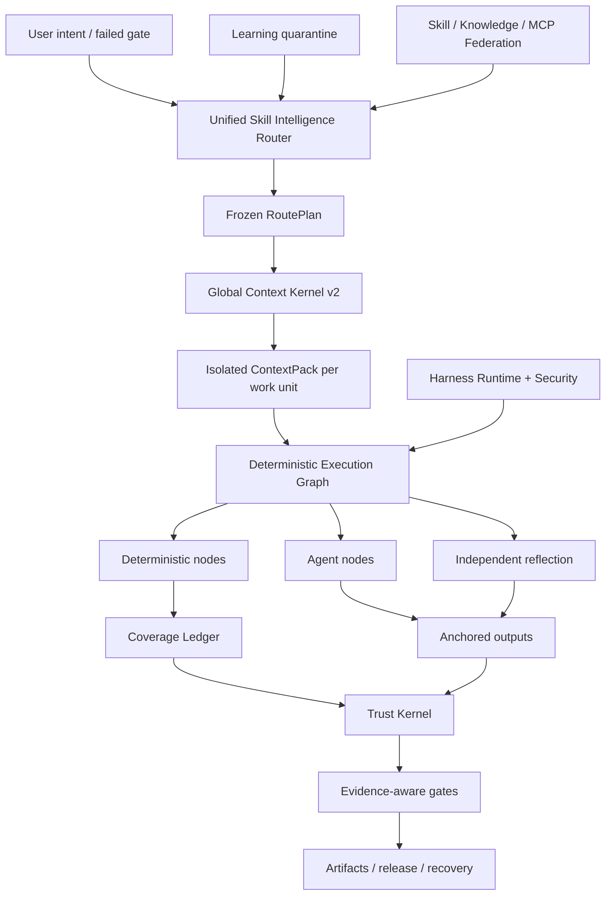

<p align="center">
  
</p>

<p align="center">
  <a href="LICENSE"></a>
  <a href="CHANGELOG.md"></a>
  
  
  
</p>

<p align="center"></p>
<h1 align="center">ForgeOS</h1>
<p align="center">ForgeOS вирішує, <strong>який навик можна запускати</strong>, <strong>який контекст може входити</strong>, <strong>які кроки мають бути детермінованими </strong> і <strong>, які є достатньо вагомими доказами, щоб прийняти завершення</strong>.</p>

---

## Чому існує ForgeOS

Агент не стає надійним, оскільки він має більше підказок, більше інструментів або довше контекстне вікно.

Він стає надійним, коли система може відповісти на шість питань:

1. **Який точний результат потрібен?**
2. **Яка техніка є прийнятною, а яка подібна техніка тут неправильна?**
3. **Який найменший контекст необхідний для цього робочого блоку?**
4. **Які кроки мають бути детермінованими, а не делегованими моделі?**
5. **Які незалежні докази підтверджують результат?**
6. **Чи може той самий робочий процес відновити, відновити та перевірити себе після збою?**

ForgeOS v0.6 перетворює ці запитання на середовище виконання:

```text
підтверджений намір
  → результат + відновлення техніки
  → жорстка політика та антитригерні фільтри
  → мінімальний RoutePlan DAG
  → ізольований ContextPack на робочу одиницю
  → детермінований / агент / графік виконання відображення
  → закріплені виходи + книга покриття
  → довірені квитанції + ворота доказів
  → випуск, відкат, відновлення та навчальний карантин
```

Це не оперативний збір. Це площина контролю навколо навичок, правил, хуків, агентів, інструментів, контексту, доказів і навчання.

---

## Що реально у v0.6.1

| Поверхня | Перевірена реалізація |
|---|---:|
| Скаффолди надрукованих результатів у спадщині | **1024** |
| Методи Deep Skill Contract v2 | **128** |
| L0 методи оркестровки/довіри/контексту | **32** |
| Методи міждоменного проектування L1 | **96** |
| Незалежний оцінювач прив'язок | **128** |
| Стабільні процедурні провайдери | **33** |
| Кандидати в процедурні провайдери | **242** |
| Вбудовані відображення навичок + знань | **1299** |
| Випадки перевірки коду Intelligence | **12** |
| Змагальні справи агент-поверхня | **20/20** |
| Матеріалізація стабільного провайдера | **33/33** |
| Маршрутизатор Precision@1 / @3 | **93,75% / 100%** |
| Відкликання маршрутизатора@6 | **100%** |
| Активація небезпечного маршруту | **0%** |

> [!ВАЖЛИВО]
> 1024 успадкованих вузла є **макетами результатів**, а не 1024 процедурними навичками виробничого рівня. v0.6 містить 128 глибоких контрактів техніки. Тридцять три процедурних провайдера залишаються в заявленому стабільному каналі маршрутизації для сумісності, але остаточний аудит сертифікації виявляє, що 0/128 підтверджено кваліфікованих стабільних і 0 сертифікованих відповідно до Редакції 2 визначення Готово. Інші докази вимагають відстрочки, парної мультимоделі, тиску, незалежного огляду та виробничих квитанцій.

**Інвентаризація ядра:** 32 техніки L0 + 96 методик L1 = 128 технік глибокого ядра.

**Стани маршрутизації каталогу: ** 33 заявлені процедурні постачальники стабільного каналу та 242 кандидати. **Офіційне підтвердження сертифікації:** 0 стабільно кваліфікованих, 0 сертифікованих. Перегляньте [Заключний аудит сертифікації](docs/FINAL-CERTIFICATION-AUDIT.md).

Аудит випуску навмисно зберігає ці твердження помилковими:

```text
1024 процедурні навички виробничого рівня помилкові
повний життєвий цикл PostgreSQL HA false
універсальна пісочниця microVM false
Позначка експерта 200-PR огляд бенчмарк false
10 000 парних оцінок виконується помилково
```

ForgeOS v0.6 не вимагає універсальної повноти виробництва або 1024 процедурних навичок виробничого рівня.

Див. [Claims Boundary v0.6](docs/CLAIMS-BOUNDARY-V0.6.md).

---

## П'ятихвилинний шлях

Використовуйте цей шлях, якщо вам потрібна цінність без попереднього вивчення ядра довіри.

### 1. Встановити

```bash
npm install
npm test
node src/cli/forge.mjs init
```

Встановлений пакет:

```bash
npx forgeos init
forge doctor
```

`forge init` створює безпечний локальний профіль SQLite-WAL. Його ключ API записується у файл `0600` і ніколи не друкується.

### 2. Знайдіть правильну техніку

```bash
forge skills search "react rerender"
forge skills inspect reducing-react-render-thrashing
forge route --query "compile the minimum context for a large monorepo"
```

### 3. Перевірте v0.6

```bash
forge v06 status
forge profile plan coding --target codex
forge security scan --file agent-surface.json
```

### 4. Запустіть площину локального керування

```bash
npm start
# Dashboard: http://127.0.0.1:8787/dashboard
# MCP:       http://127.0.0.1:8787/mcp
# A2A:       http://127.0.0.1:8787/a2a
```

---

## Шлях глибокого оператора

Використовуйте цей шлях, коли вбудовуєте ForgeOS у Codex, Claude Code, ChatGPT, агент з відкритим кодом, CI або внутрішню платформу.

### Інтелектуальний маршрутизатор навичок

Маршрутизатор виконує двоетапне пошук замість відповідності імені навички:

```text
намір / невдалий гейт
  → пошук результату
  → прямий прийом тригера
  → виключення антитригера
  → довіра, орендар, зрілість, інструмент, ліцензія, фільтри свіжості
  → переранжування вимірюваної корисності
  → мінімальна техніка DAG
  → дозвіл провайдера
  → заморожений план маршруту
```

Кожна обрана і відкинута техніка має свою причину. Жорсткі блокувальники завжди перемагають.

### Ядро глобального контексту v2

ForgeOS бюджетує повний запит:

```text
система · завдання · вибрані розділи навичок · кодові символи · артефакти
· пам'ять · вихід інструментів · посилання · ліниві схеми інструментів
· резерв виходу · запас безпеки
```

Він забезпечує:

- один інтерфейс обліку токенів, спільний для резольвера та матеріалізатора;
- розділове навичкове навантаження;
- ізольований контекст на одиницю роботи;
- лінива матеріалізація інструментальної схеми;
- Семантичні ідентифікатори символів ABI та відхилення застарілих хешів;
- дельта-проекція артефакту;
- прицільна інстинктна ін'єкція, що закінчується;
- необроблені журнали з адресою вмісту з дистильованими діапазонами відмов;
- маніфест пропуску для кожного не включеного джерела.

### Детермінована структура навичок

Техніка v0.6 компілюється у виконуваний граф:

```text
Детерміновані вузли
  вибір області · об'єднання · дозвіл правила · прив'язка · докази

Вузли агента
  дослідження · гіпотеза · предметне судження

Вузли відображення
  протиріччя · хибно-позитивний фільтр · дієздатність

Вузли керування
  паралельне з’єднання · ворота покриття · повторна спроба · відкат
```

У книзі покриття SQLite використовуються договори оренди, серцевий ритм, огородження та довірені квитанції. Відновлений працівник не може позначити робочу одиницю як завершену.

### Вертикальний зріз аналізу коду

Перший повний вертикальний зріз доводить архітектуру впритул:

```text
повний обсяг
→ робочі одиниці з усвідомленням відносин
→ вибір контекстного правила
→ аналіз ізольованого агента
→ лінії/хеш-прив’язки
→ переміщення після редагувань
→ самостійний роздум
→ квитанція про покриття
```

Об’єднаний корпус із 12 випадків є детермінованим тестом відповідності. Він **не** рекламується як експертний тест 200 PR.

### Безперервне навчання — без автоматичного самоотруєння

Спостережувані моделі стають обмеженими інстинктами, а не стабільними навичками:

```text
перевірені квитанції про виконання
  → спостерігається інстинкт
  → орендар/проект/ізоляція джгута + TTL
  → сумісний кластер інстинктів
  → пропозиція розвитку кандидата
  → незалежне оцінювання
  → людське підвищення або відкат
```

Виробник не може сприяти власній навченій поведінці.

### Harness Runtime v2

ForgeOS розрізняє чотири поверхні:

| Поверхня | Використовуйте його для |
|---|---|
| **Правило** | Короткий інваріант, який має застосовуватися завжди |
| **Гак** | Детермінована дія, прив'язана до події |
| **Навик** | Умовна процедура, що вимагає судового рішення |
| **Роль агента** | Окремий контекст, інструменти, модель або авторитет |

До нейтральних подій належать `before.tool.execute`, `after.file.write`, `verification.checkpoint`, `session.compact` і `session.ended`. Хост-адаптери повинні позначати непідтримувані функції замість того, щоб заявляти про помилкову парність.

Профілі:

```text
мінімальний · кодування · творчий · дослідницький · регульований
локальне-мале · підприємство
```

### Agent Surface Security

Механізм безпеки сканує саму агентську систему:

- інструктаж та оперативно-межові порушення;
- хуки та скрипти життєвого циклу пакетів;
- Описи MCP, дозволи та доступність інструментів;
- дозволені списки команд;
- посилання на секрет/оточення;
- шляхи дозволу секретного виходу;
- труба-оболонка та широка можливість підстановки;
- дозвіл профілю відрізняється перед установкою.

Його змагальний корпус наразі проходить **20/20** справ.

### Посередницьке локальне виконання

Локальний бігун забезпечує реальну безпеку для звичайних команд:

- відсутність інтерполяції оболонки;
- дозволені списки команд і середовища;
- робоча область і символічні посилання;
- тайм-аут і завершення групи процесів;
- обмежений stdout/stderr;
- виконавча квитанція з адресою змісту.

Це **не** універсальна пісочниця microVM, що забороняє мережу. Виконання третьою стороною з високим ризиком все ще потребує зовнішнього контейнера або рівня ізоляції microVM.

---


# Як працює ForgeOS

ForgeOS поєднує два продукти в одному середовищі виконання:

1. **Рівень інтелекту навичок**, який отримує прийоми, відхиляє небезпечні майже збіги, компілює лише необхідні розділи навичок і створює заморожений план виконання.
2. **Плоска управління AI**, яка керує проектами, артефактами, доказами, погодженнями, орендою, відновленням, об’єднанням і випусками.

```text
підтверджений намір або невдалий вихід
  → пошук результатів і пряма техніка
  → фільтри антитригерів, орендарів, довіри, інструментів, ліцензій і свіжості
  → мінімальний заморожений RoutePlan DAG
  → ізольований ContextPack на робочу одиницю
  → детермінований / агент / графік виконання відображення
  → закріплені виходи та огороджена книга покриття
  → довірені квитанції та гарантійні ворота
  → випуск, відновлення, відкат або навчальний карантин
```

## Десять взаємодіючих систем

| Система | Що він контролює |
|---|---|
| **Skill Intelligence Router** | Отримання результатів, оцінка техніки, антитригери, жорстка політика, вибір постачальника та зрозумілі плани маршруту |
| **Ядро глобального контексту v2** | Один загальний бюджет жетонів для політик, завдань, розділів навичок, символів, артефактів, пам’яті, результатів інструментів, посилань і резерву результатів |
| **Детермінована структура навичок** | Гібридні графи, що містять детерміновані вузли, вузли агентів, вузли відображення, схвалення, прив’язки та умови зупинки |
| **Книга покриття** | Власність робочої одиниці, оренда, токени захисту, покриття завершення, відхилення застарілих робочих та можливість відновлення |
| **Trust Kernel** | Актуальність доказів, походження артефактів, повноваження на затвердження, рівні надійності та рішення про випуск |
| **Agent Surface Security** | Шаблони оперативного введення, сценарії небезпечних пакетів, секретні шляхи виходу, дозволи та можливості адаптера чесність |
| **Посередницьке локальне виконання** | Створення команд без оболонки, дозволені списки, тайм-аути, вихідні обмеження та структуровані квитанції |
| **Постійне навчання** | Охоплені інстинкти, закінчення терміну дії, впевненість, карантин, пропозиції кандидатів і контрольоване просування |
| **Федерація майстерності** | Підписані джерела, рівні довіри, карантин, обробка конфліктів, відкликання та синхронізовані каталоги |
| **Harness Runtime v2** | Правила, хуки, навички, ролі агентів, відмінності дозволів і профілі для різних систем ШІ |

---

# Порівняння екосистем

> [!ВАЖЛИВО]
> Це порівняння описує **нативний, першокласний фокус кожного основного сховища**. `◐` означає часткову підтримку, підтримку на основі розширення або підтримку через суміжний продукт. `—` означає, що це не головна мета проекту, а не те, що його неможливо створити.

Зірки GitHub нижче — це приблизні цифри, перевірені **26 липня 2026 року**. Вони вказують на видимість спільноти, а не на інженерну якість самі по собі.

## Карта екосистеми

| Проект | прибл. Зірки GitHub | Основна роль |
|---|---:|---|
| [Суперздібності](https://github.com/obra/superpowers) | **255k** | Структура навичок агента та методологія розробки програмного забезпечення |
| [Навички антропного агента](https://github.com/anthropics/skills) | **151k** | Стандарт навичок і публічна бібліотека навичок для Клода |
| [LangChain](https://github.com/langchain-ai/langchain) | **139k** | Агентна інженерна платформа та велика інтеграційна екосистема |
| [OpenHands](https://github.com/All-Hands-AI/OpenHands) | **75k+** | Наскрізна програма агента розробки програмного забезпечення |
| [CrewAI](https://github.com/crewAIInc/crewAI) | **56k+** | Мультиагентні команди та потоки, керовані подіями |
| [AutoGen](https://github.com/microsoft/autogen) | **50k+** | Мультиагентне середовище обміну повідомленнями та дослідження |
| [LangGraph](https://github.com/langchain-ai/langgraph) | **37k+** | Довгострокові графи агентів із збереженням стану |
| [Семантичне ядро](https://github.com/microsoft/semantic-kernel) | **28k+** | Багатомовний корпоративний SDK оркестровки |
| [Приголомшливі навички агента](https://github.com/VoltAgent/awesome-agent-skills) | **28k+** | Каталог спільноти з понад тисячею навичок |
| [SDK агентів OpenAI](https://github.com/openai/openai-agents-python) | **27k+** | Агенти, передачі, огородження, сеанси та відстеження |
| [смолагенти](https://github.com/huggingface/smolagents) | **27k+** | Мінімальна бібліотека агентів з акцентом на код-агент |
| [Letta](https://github.com/letta-ai/letta) | **23k+** | Агенти із збереженням стану та постійна пам'ять |
| [Google ADK](https://github.com/google/adk-python) | **близько 20 тис.** | Створення, оцінка та розгортання першого агента коду |
| [PydanticAI](https://github.com/pydantic/pydantic-ai) | **близько 19 тис.** | Типобезпечна структура агента Python |

## Матриця основних можливостей

| Система | Упаковані навички | Маршрутизація + антитригер | Керований контекст | Детермінований/агентний гібридний граф | Докази + довірчі розписки | Безпека на поверхні агента | Рідна сила |
|---|:---:|:---:|:---:|:---:|:---:|:---:|---|
| **ForgeOS** | ✅ | ✅ | ✅ | ✅ | ✅ | ✅ | Навички розвідки та надійне виконання |
| Антропні навички | ✅ | ◐ | ◐ | — | — | ◐ | Простий, переносний стандарт навичок |
| Суперздатності | ✅ | ✅ | ◐ | ◐ | ◐ | — | Дуже чітка методологія SDLC для агентів кодування |
| Чудові навички агента | ✅ | — | — | — | — | ◐ | Виявлення навичок у багатьох джерелах |
| LangChain | ◐ | ◐ | ◐ | ◐ | ◐ | ◐ | Дуже велика інтеграційна екосистема |
| LangGraph | ◐ | ◐ | ◐ | ✅ | ◐ | ◐ | Надійне виконання та графіки зі збереженням стану |
| SDK агентів OpenAI | ◐ | ◐ | ◐ | ◐ | ◐ | ◐ | Легка структура, передачі та трасування |
| CrewAI | ◐ | ◐ | ◐ | ✅ | ◐ | ◐ | Рольові агенти в поєднанні з потоками |
| AutoGen | ◐ | ◐ | ◐ | ✅ | ◐ | ◐ | Кероване подіями багатоагентне середовище |
| Семантичне ядро ​​/ MAF | ◐ | ◐ | ◐ | ✅ | ◐ | ◐ | Оркестровка підприємства в середовищі виконання |
| Google ADK | ◐ | ◐ | ◐ | ✅ | ◐ | ◐ | Створюйте, оцінюйте та розгортайте в екосистемі Google |
| PydanticAI | ◐ | ◐ | ◐ | ◐ | ◐ | ◐ | Безпека типів, перевірка та ергономіка Python |
| смолягенти | ◐ | ◐ | ◐ | ◐ | — | ◐ | Мінімальна, зрозуміла реалізація агента |
| Летта | ◐ | ◐ | ✅ | ◐ | ◐ | ◐ | Постійна пам'ять і агенти стану |
| OpenHands | ◐ | ◐ | ◐ | ◐ | ◐ | ✅ | Наскрізний досвід агента кодування |

## ForgeOS обирає інше поле бою

Репозиторій навичок відповідає: **«Яким процедурам може навчитися агент?»**

ForgeOS також запитує: **«Яка техніка зараз дозволена, яку майже відповідність має бути відхилено, які розділи можуть входити в контекст, які інструменти потрібні, які докази потрібно створити та який шлюз може оголосити роботу завершеною?»**

Фреймворк агента допомагає створювати агентів, інструменти, передавання та робочі процеси. ForgeOS зосереджується на рівні, що оточує це середовище виконання: пошук можливостей, антитригери, бюджети глобального контексту, графіки детермінованих/агентів/відображення, поточні докази, повноваження на затвердження, походження артефактів, відновлення та карантин навчання.

Система пам’яті зосереджується на тому, що пам’ятає агент. ForgeOS додатково контролює, до якого клієнта, проекту, користувача, довірчого домену, терміну дії, конфіденційності та політики просування належить ця пам’ять.

Агент наскрізного кодування забезпечує взаємодію з користувачем. ForgeOS може працювати **під цим агентом або поруч** як рівень вибору навичок, керування контекстом, доказів, довіри та рівня життєвого циклу проекту.

## Куди ще ведуть зрілі екосистеми

Наразі вони мають більші спільноти, більше навчальних посібників та інтеграцій, досконаліший досвід керованої хмари, ефективнішу адаптацію без коду та більше публічно задокументованих виробничих розгортань. ForgeOS навмисно зосереджується на менш стандартизованій проблемі: **контроль вибору навичок, контексту, доказів, повноважень і стану завершення для агентів ШІ**.

---

# Три шляхи входу

## Для звичайних користувачів

Вам не потрібно розуміти кожну підсистему. Почніть з чотирьох спостережуваних тестів:

```bash
node src/cli/forge.mjs doctor
node src/cli/forge.mjs skills search --query "review authentication changes"
node src/cli/forge.mjs route --query "review authentication changes without missing tests"
node src/cli/forge.mjs scan agent-surface --path .
```

Ви можете перевірити, яку техніку було обрано, чому альтернативи відхилено, скільки контексту було скомпільовано, які дозволи запитуються та які докази ще відсутні.

## Для розробників

ForgeOS надає те саме середовище виконання через:

- CLI для локальної роботи та CI;
- HTTP API та інформаційна панель Studio;
- **60 схемно-строгих інструментів MCP**;
- Поверхні завдань A2A та картки агента;
- прямий імпорт сервісу з дерева вихідних кодів Node.js;
- **15 адаптерів** для екосистем агента та IDE;
- сім профілів мережі: `minimal`, `coding`, `creative`, `research`, `regulated`, `local-small` і `enterprise`.

Розробники можуть створювати проекти, реєструвати артефакти, зв’язувати докази, запитувати схвалення, компілювати RoutePlans і ContextPacks, виконувати графіки, відновлювати версії, синхронізувати федеративні навички або додавати новий Skill Contract v2.

## Для експертів і дослідників

ForgeOS створена для того, щоб її оскаржити, а не прийняти на маркетинговій сторінці. Експерти можуть самостійно перевірити:

- точність маршрутизатора, відкликання, антитригерна поведінка та небезпечна активація;
- переповнення загального контексту та зменшення семантичного ABI;
- детерміноване покриття, прив'язки, відображення, оренда та огородження;
- свіжість доказів, родовід артефактів і гарантійні ворота;
- оперативне впровадження, пакетні сценарії, секретні шляхи виходу та чесність адаптера;
- конфлікт федерації, карантин, відкликання та довіра джерела;
- перевірка архіву без `.git`.

```bash
npm run validate
npm run v06:audit
npm run router:benchmark
npm run context:benchmark
npm run federation:eval
npm run federation:audit
npm run smoke
npm run adapter:tck
npm run release:verify
```

---

# Карта сховища

```text
src/ реалізація середовища виконання
  інтерфейс командного рядка cli/forge
  ядро/проект, артефакт, докази, затвердження, відновлення
  навички-інтелект/ контракти, маршрутизація, оцінка, матеріалізація
  context/ Глобальний контекст Компіляція ядра та робочого блоку
  виконання/компілятор графів, детерміновані вузли, покриття
  довіра/докази, впевненість, повноваження, звільнення
  сканування безпеки/агентної поверхні та посередник команд
  федерація/ віддалені джерела, довіра, карантин, синхронізація
  навчання/інстинкти, кандидати, закінчення терміну дії, просування по службі
  mcp/сервер MCP і 60 публічних інструментів
  a2a/ A2A картки, завдання, повідомлення та квитанції
  сервер/ HTTP API, автентифікація, інформаційна панель
  зберігання/ збереження та міграції SQLite-WAL
адаптери/ 15 агентів і адаптери IDE
навички-v2/ 128 глибоких технік Skill Contract v2
capabilities-v2/ результати, методи, постачальники, відносини, графік
схеми/ публічні контракти JSON Schema 2020-12
пакети/ пакети вертикальних можливостей і тести
випадки оцінки, рубрики та корпуси
tests/ 125 тестових файлів та інваріантів випуску
свідоцтво/згенерований аудит, контрольний показник, SBOM та докази інформаційної панелі
документи/ архітектура, протоколи, безпека, тестування, виробництво
сценарії/інструменти генерації, перевірки, аудиту, порівняння та випуску
```

# Відповідні випадки використання

- Зробити агентів кодування більш дисциплінованими та доступними для перевірки.
- Побудова площини керування для кількох моделей, агентів та інструментів.
- Керування внутрішньою платформою навичок із керуванням маршрутами та зрілістю.
- Перегляд конфігурацій агента, дозволів, підказок і поверхонь ланцюга постачання.
- Робочі процеси з високим рівнем гарантії або регламентовані робочі процеси, що вимагають доказів і дозволів.
- Зменшення втрати контексту у великих сховищах завдяки ізоляції робочих одиниць і семантичному ABI.

ForgeOS не є заміною для автоматизації бізнес-процесів у стилі n8n. n8n з'єднує програми та бізнес-події; ForgeOS контролює вибір техніки ШІ, контекст, виконання, докази та повноваження. Їх можна використовувати разом.

---

## Архітектура



---

## Інтеграція MCP і агента

ForgeOS підтримує MCP `2025-11-25`, A2A `1.0`, пакети, сумісні з Agent Skills, HTTP та CLI.

Публічні інструменти v0.6 включають:

```text
forge_v06_status
forge_execution_graph_compile
forge_review_scope_compile
forge_context_work_units_compile
forge_harness_profile_plan
forge_agent_surface_scan
```

Вони приєднуються до існуючих інструментів проекту, артефакту, надійних доказів, відновлення, об’єднання, розвідки навичок і брокера MCP. Stdio, HTTP MCP, CLI та Studio спільно використовують ті самі служби та схеми JSON.

Підтримувані пакети адаптерів включають ChatGPT, Codex, Claude Code, Cursor, OpenCode, Gemini CLI, Copilot CLI, Cline, Roo Code, Windsurf, Continue, NolaneNative, OpenClaw, Pi та загальний MCP/A2A. Докази відрізняють **перевірені за протоколом** адаптери від **документованих посібників**.

---

## Перевірка

```bash
npm run validate
npm run skills:v2:audit
npm run v06:audit
npm run router:benchmark
npm run context:benchmark
npm run federation:eval
npm run federation:audit
npm run smoke
npm run adapter:tck
npm run release:verify
```

Шлюз випуску перевіряє поведінку та контракти, а не лише покриття лінії:

- інваріанти стану, захисту, захисту від старості та життєвого циклу;
- повний життєвий цикл MCP/A2A та вихідні схеми;
- глибина навичок, шаблон, хеш розділу та матеріалізація;
- точність маршрутизатора, відкликання, детермінізм і небезпечна активація;
- облік переповнення та пропусків глобального контексту;
- книга детермінованого виконання та покриття;
- оглядові прив'язки та рефлексія;
- незалежне оцінювання та карантин безперервного навчання;
- агент-поверхня змагальні справи;
- встановлення архіву та самоперевірка без `.git`.

---

## Межа виробництва

**Інтегровано сьогодні**

- SQLite WAL з одним вузлом життєвого циклу;
- перегляд/CAS, оренда, огородження, знімки, відновлення, ACL, ключ OIDC/API;
- довірені квитанції, хеші конвертів артефактів, захисні ворота;
- федерація навичок/знань/MCP на рівні орендаря;
- витончений злив, готовність, метрика, підписане походження випуску;
- профілі розгортання без root/лише для читання.

**Ще не заява версії 0.6**

- повний життєвий цикл PostgreSQL drop-in backend і перевірене багатовузлове відновлення після відмови;
- універсальна стороння пісочниця microVM;
- адміністрування SCIM/делегованої організації;
- керована служба прозорості та PKI;
- A2A потокове/push і розподілене резюме;
- 1024 процедурні навички виробничого рівня;
- 10 000 парних оціночних заїздів;
- порівняльний тест міжмовного аналізу коду за оцінкою експертів.

Прочитайте [Production](docs/PRODUCTION.md), [Security Model](docs/SECURITY-MODEL.md) і [Self-Audit v0.6](docs/SELF-AUDIT-V0.6.md).

---

## Карта документації

| Почніть тут | Глибоке занурення |
|---|---|
| [Швидкий старт](docs/QUICKSTART.md) | [Архітектура](docs/ARCHITECTURE.md) |
| [Інтелект навичок](docs/SKILL-INTELLIGENCE.md) | [Детермінована структура v0.6](docs/DETERMINISTIC-SKILL-FABRIC-V06.md) |
| [CLI та профілі](docs/HARNESS-RUNTIME-V2.md) | [Ядро глобального контексту](docs/GLOBAL-CONTEXT-KERNEL.md) |
| [Безпека](docs/AGENT-SURFACE-SECURITY.md) | [Безперервне навчання](docs/CONTINUOUS-LEARNING-V06.md) |
| [Тестування](docs/TESTING.md) | [Межа претензій](docs/CLAIMS-BOUNDARY-V0.6.md) |
| [Вносить свій внесок](CONTRIBUTING.md) | [Самоперевірка](docs/SELF-AUDIT-V0.6.md) |

---

## Мови

[Universal Lanes](docs/UNIVERSAL-LANES.md) · [Remote MicroVM Sandbox](docs/REMOTE-MICROVM-SANDBOX.md) · [Tiếng Việt](README-vn.md) · [简体中文](README-cn.md) · [繁體中文](README-tw.md) · [日本語](README-ja.md) · [한국어](README-ko.md) · [Español](README-es.md) · [Français](README-fr.md) · [Deutsch](README-de.md) · [Português](README-pt-br.md) · [Русский](README-ru.md) · [العربية](README-ar.md) · [हिन्दी](README-hi.md) · [Bahasa Indonesia](README-id.md) · [ไทย](README-th.md) · [Türkçe](README-tr.md) · [Italiano](README-it.md) · [Polski](README-pl.md) · [Українська](README-uk.md) · [Nederlands](README-nl.md) · [فارسی](README-fa.md) · [עברית](README-he.md) · [Svenska](README-sv.md)

---

## Сприяння

Нове вміння не приймається, оскільки його проза звучить експертно. Для цього потрібно:

1. ЧЕРВОНА базова лінія, яка не працює без техніки;
2. точні тригери та антитригери;
3. предметно-спеціальна процедура та модель відмови;
4. типізовані входи, виходи, інструменти та докази;
5. хеші розділів і бюджети токенів;
6. незалежний оцінювач прив'язок;
7. еталонний показник і рішення про зрілість.

Перегляньте [CONTRIBUTING.md](CONTRIBUTING.md), [GOVERNANCE.md](GOVERNANCE.md) і [SECURITY.md](SECURITY.md).

## Ліцензія

MIT — див. [ЛІЦЕНЗІЯ](LICENSE).


## Остаточний аудит випуску

- [Остаточний звіт про зміцнення](docs/FINAL-HARDENING-REPORT.md)
- [Аудит підсумкової сертифікації навичок](docs/FINAL-CERTIFICATION-AUDIT.md)
