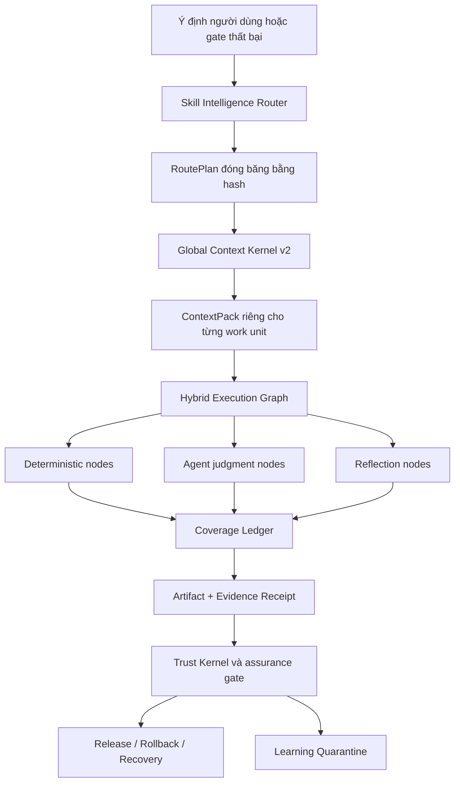

<p align="center">
  
</p>

<p align="center">
  <a href="LICENSE"></a>
  <a href="CHANGELOG.md"></a>
  
  
  
</p>

<p align="center"></p>
<h1 align="center">ForgeOS</h1>
<p align="center"><strong>Hệ điều hành Skill Intelligence và Trust Control Plane cho AI agent.</strong></p>
<p align="center">
Không chỉ đưa thêm skill cho AI. ForgeOS quyết định <strong>skill nào được dùng</strong>, <strong>context nào được nạp</strong>, <strong>bước nào phải chạy bằng mã xác định</strong> và <strong>bằng chứng nào đủ để chấp nhận kết quả</strong>.
</p>

<p align="center">
  <a href="#thử-forgeos-trong-5-phút">Thử trong 5 phút</a> ·
  <a href="#forgeos-hoạt-động-như-thế-nào">Cách hoạt động</a> ·
  <a href="#so-sánh-với-hệ-sinh-thái-agent-hiện-nay">So sánh hệ sinh thái</a> ·
  <a href="#dành-cho-nhà-phát-triển">Dành cho nhà phát triển</a> ·
  <a href="#dành-cho-chuyên-gia-và-nhà-nghiên-cứu">Dành cho chuyên gia</a> ·
  <a href="README.md">English</a>
</p>

---

## ForgeOS là gì?

Các hệ thống AI hiện nay thường giải quyết từng phần riêng biệt:

- kho skill dạy agent cách làm một nhiệm vụ;
- agent framework điều phối model và tool;
- memory system lưu trạng thái lâu dài;
- workflow graph nối các bước thực thi;
- observability system ghi trace;
- security layer giới hạn quyền truy cập.

ForgeOS kết nối những phần đó thành một lớp điều khiển thống nhất:

```text
Ý định đã xác nhận
  → tìm outcome và kỹ thuật phù hợp
  → loại skill sai bằng anti-trigger và policy
  → đóng băng RoutePlan có thể giải thích
  → biên dịch context tối thiểu cho từng work unit
  → chạy graph lai: deterministic + agent + reflection
  → neo kết quả vào dòng, hash, artifact và receipt
  → kiểm tra evidence, approval và assurance gate
  → phát hành, rollback, recovery hoặc learning quarantine
```

ForgeOS không thay thế trí thông minh của model. Nó cung cấp **kỷ luật vận hành xung quanh model** để agent làm việc có cấu trúc, ít lãng phí context hơn, khó tự tuyên bố hoàn thành hơn và dễ kiểm tra lại hơn.

> **Một model mạnh giúp agent suy luận tốt. ForgeOS giúp toàn bộ hệ thống biết phải suy luận bằng kỹ thuật nào, với dữ liệu nào, trong phạm vi nào và dựa trên bằng chứng nào.**

---

## Tại sao ForgeOS tồn tại?

Một AI agent không trở nên đáng tin chỉ vì có prompt dài hơn, nhiều tool hơn hoặc context window lớn hơn.

Một hệ thống đáng tin phải trả lời được tám câu hỏi:

1. Kết quả chính xác cần tạo ra là gì?
2. Kỹ thuật nào phù hợp và kỹ thuật gần giống nào không nên được dùng?
3. Context tối thiểu cần cấp cho từng bước là gì?
4. Phần nào cần judgment của model, phần nào bắt buộc chạy deterministic?
5. Agent có quyền truy cập tool, secret và tài nguyên nào?
6. Bằng chứng độc lập nào chứng minh đầu ra hiện vẫn đúng?
7. Hệ thống có thể resume, retry, rollback và phục hồi sau lỗi không?
8. Kinh nghiệm mới có được cách ly và đánh giá trước khi trở thành hành vi ổn định không?

ForgeOS biến các câu hỏi này thành contract, graph, policy, receipt và gate có thể thực thi.

---

## Những gì có thật trong ForgeOS v0.6.1

Các số dưới đây được tạo từ catalog, release gate và kiểm tra mã nguồn hiện tại.

| Thành phần | Hiện trạng đã kiểm tra |
|---|---:|
| Outcome scaffold có kiểu | **1.024** |
| Deep Skill Contract v2 | **128 kỹ thuật** |
| Kỹ thuật L0: orchestration, trust, context | **32** |
| Kỹ thuật L1: engineering liên miền | **96** |
| Evaluator binding độc lập | **128** |
| Skill catalog | **250** (**146 core**, **104 domain**) |
| Built-in provider và mapping | **1.299** |
| Công cụ MCP có schema nghiêm ngặt | **60** |
| Adapter agent/IDE | **15** |
| Harness profile dựng sẵn | **7** |
| Tệp kiểm thử | **126** |
| Kiểm thử, lint, smoke, mutation | **release gate bắt buộc** |
| Stable provider materialization | **33/33** |
| Agent-surface adversarial corpus | **20/20** |
| Code-review conformance corpus | **12 case** |
| Router Precision@1 / Precision@3 | **93,75% / 100%** |
| Router Recall@6 | **100%** |
| Unsafe route activation trong benchmark | **0%** |
| Giảm tool-schema trong context benchmark | **99,93%** |
| Giảm symbol payload bằng Semantic ABI | **90,45%** |

> [!NOTE]
> `1.024` là số outcome scaffold có kiểu, không phải 1.024 skill procedural hoàn chỉnh. Kernel sâu hiện tại gồm 128 kỹ thuật. ForgeOS giữ sự phân biệt rõ giữa **outcome**, **technique**, **provider** và **evaluator** để tránh biến số lượng file thành tuyên bố chất lượng.

**Phân bổ kernel:** **32 L0** + **96 L1** = 128 kỹ thuật sâu. Catalog hiện có **33 provider procedural** trong stable routing channel và 242 candidate provider. Tám skill mới cho visual, 3D, physical product và physical AI đều là candidate; chúng không tự biến thành stable chỉ vì có nội dung phong phú.

### Một Skill Contract v2 chứa gì?

Mỗi kỹ thuật không chỉ là một đoạn prompt. Contract có thể chứa:

- identity, domain, keyword và anti-trigger;
- input/output artifact contract;
- required tool và optional tool;
- entry condition, step, fallback và stop condition;
- executable check và independent reviewer role;
- evidence type bắt buộc;
- section index với SHA-256, byte và token budget theo model;
- policy profile đã version hóa và băm;
- capability mapping và evaluator package;
- execution program để biên dịch thành graph.

---

## 12 universal lanes — coverage có kiểm soát

[Universal Lane Registry](docs/UNIVERSAL-LANES.md) định tuyến công việc qua
strategy/research, product UX/UI, visual media/3D, software/platforms,
data/AI, agents/automation, security/compliance, cloud/operations,
business/commerce, education/knowledge, hardware/manufacturing và
robotics/physical AI. Lane là contract cho routing, evidence và boundary;
không phải tuyên bố ForgeOS có thể tự vận hành nhà máy, robot, thanh toán hay
hệ thống production.

Mọi hành động trong thế giới vật lý vẫn cần con người phê duyệt. Third-party
execution rủi ro cao cần remote provider tương thích đã được cấu hình; local
broker không bao giờ được gọi là microVM. Xem [Remote MicroVM Sandbox](docs/REMOTE-MICROVM-SANDBOX.md).

---

# Thử ForgeOS trong 5 phút

## Bạn cần gì?

- Node.js **22 trở lên**;
- Windows, macOS hoặc Linux;
- repository hoặc file ZIP của ForgeOS.

Bạn **không cần API key của model** để kiểm tra catalog, router, context compiler, profile planner, security scanner, dashboard và bộ test cục bộ.

## Cách nhanh nhất trên Windows PowerShell

```powershell
cd forge-os-v0.6.1
npm install
node .\src\cli\forge.mjs init
node .\src\cli\forge.mjs doctor
npm start
```

Mở:

```text
http://127.0.0.1:8787/dashboard
```

## macOS hoặc Linux

```bash
cd forge-os-v0.6.1
npm install
node src/cli/forge.mjs init
node src/cli/forge.mjs doctor
npm start
```

Mở `http://127.0.0.1:8787/dashboard`.

`forge init` tạo profile local sử dụng SQLite WAL. API key được ghi vào file `.forgeos/api-key` với quyền hạn chế và không bị in ra terminal.

---

## Bốn bài thử đơn giản cho người mới

### 1. Kiểm tra hệ thống có hoạt động không

```bash
node src/cli/forge.mjs doctor
```

Bạn sẽ thấy:

- phiên bản Node có được hỗ trợ không;
- số outcome, technique, evaluator và provider;
- SHA-256 của capability graph;
- số stable provider có materialize thành công không.

### 2. Tìm một kỹ thuật AI

```bash
node src/cli/forge.mjs skills search "react rerender" --limit 5
```

Sau đó xem contract mà không phải nạp toàn bộ nội dung skill:

```bash
node src/cli/forge.mjs skills inspect reducing-react-render-thrashing
```

### 3. Xem ForgeOS chọn skill như thế nào

```bash
node src/cli/forge.mjs route \
  --query "review this authentication change without missing related tests" \
  --domain security \
  --tool filesystem \
  --tool shell \
  --assurance A1
```

RoutePlan trả về:

- outcome được nhận diện;
- kỹ thuật được đưa vào;
- kỹ thuật bị loại và lý do;
- tool còn thiếu;
- evidence obligation;
- section skill cần nạp;
- token dự kiến;
- stop condition;
- hash của kế hoạch.

### 4. Quét cấu hình agent nguy hiểm

Tạo file `agent-surface.json`:

```json
{
  "instructions": [],
  "hooks": [],
  "mcpServers": [],
  "packages": [],
  "allowedCommands": [],
  "envReferences": []
}
```

Chạy:

```bash
node src/cli/forge.mjs security scan --file agent-surface.json
```

Exit code `2` cho biết scanner tìm thấy blocker mức cao hoặc nghiêm trọng.

---

## Ba lối vào cho ba nhóm người dùng

| Bạn là ai? | Bắt đầu ở đâu? | Bạn sẽ kiểm tra được gì? |
|---|---|---|
| Người muốn xem thử | `doctor`, `skills search`, dashboard | Hệ thống có thật, catalog có gì, router hoạt động ra sao |
| Nhà phát triển | CLI, MCP, HTTP, A2A, adapter | Tích hợp ForgeOS vào agent, IDE, CI hoặc nền tảng nội bộ |
| Chuyên gia/nhà nghiên cứu | benchmark, adversarial suite, release audit | Routing, context, trust, security, recovery và tính lặp lại |

---

# ForgeOS hoạt động như thế nào?



## 1. Skill Intelligence Router

Router không chỉ tìm skill có tên gần giống query. Nó thực hiện hai tầng retrieval:

```text
query và task class
  → outcome retrieval
  → direct technique-trigger retrieval
  → anti-trigger exclusion
  → policy, trust, tenant, maturity, license và freshness filter
  → required-tool blocker
  → measured-utility reranking
  → minimum technique DAG
  → provider resolution
  → RoutePlan có hash
```

Điểm quan trọng:

- hard blocker luôn thắng điểm số;
- skill có thể bị loại vì anti-trigger;
- provider nguy hiểm không được kích hoạt chỉ vì semantic score cao;
- mọi inclusion và exclusion đều có reason;
- cùng semantic input tạo ra RoutePlan deterministic;
- kế hoạch trở nên stale khi input mang ý nghĩa thay đổi.

## 2. Global Context Kernel v2

ForgeOS quản lý **toàn bộ ngân sách context của request**, không chỉ cắt ngắn prompt:

```text
system policy
+ task
+ skill sections
+ code symbols
+ artifacts
+ memory
+ tool output
+ references
+ lazy tool schemas
+ output reserve
+ safety reserve
```

Các cơ chế chính:

- token accounting dùng một interface chung;
- skill được nạp theo section, không phải toàn bộ body;
- mỗi work unit nhận context riêng;
- tool schema chỉ materialize khi thực sự cần;
- Semantic ABI dùng symbol ID và expected hash;
- symbol stale bị từ chối;
- artifact chỉ chiếu phần delta liên quan;
- raw log được lưu content-addressed, model nhận failure range đã chưng cất;
- omission manifest ghi lại mọi nguồn bị loại khỏi context.

Context tối ưu không còn là “model không nhìn thấy gì”. ForgeOS ghi rõ **đã giữ gì, đã bỏ gì và vì sao**.

## 3. Deterministic Skill Fabric

Một kỹ thuật có thể được biên dịch thành graph gồm bốn loại node:

| Loại node | Nhiệm vụ |
|---|---|
| Deterministic | chọn scope, bundle, resolve rule, anchor, hash, evidence |
| Agent | điều tra, đặt giả thuyết, judgment chuyên môn |
| Reflection | tìm mâu thuẫn, lọc false positive, kiểm tra actionability |
| Control | parallel join, gate, retry, rollback, cancellation |

Phần máy có thể chứng minh được sẽ chạy bằng code. Phần cần suy luận được giao cho model. Kết quả agent không tự động trở thành “đúng” chỉ vì model nói đã hoàn thành.

## 4. Coverage Ledger có lease và fencing

Trong công việc song song, ForgeOS quản lý:

- work-unit lease;
- heartbeat;
- retry accounting;
- worker fencing;
- trusted completion receipt;
- reclaim khi lease hết hạn.

Một worker đã bị thu hồi không thể quay lại đánh dấu task là hoàn thành. Đây là lớp bảo vệ quan trọng cho multi-agent và distributed execution.

## 5. Trust Kernel

Trust Kernel quản lý vòng đời kết quả:

- revision và compare-and-swap;
- semantic revision;
- artifact content hash và envelope hash;
- dependency lineage;
- review và verification state;
- approval gắn với đúng action và revision;
- assurance level `A0` đến `A4`;
- finding, closure evidence và residual-risk acceptance;
- snapshot, checksum verification và restore;
- append-only gate/evaluation history.

ForgeOS phân biệt:

```text
Model nói “đã xong”
≠
Artifact có current trusted evidence và đã qua gate
```

## 6. Agent Surface Security

ForgeOS không chỉ quét code ứng dụng. Nó quét **bề mặt cấu hình của chính agent**:

- instruction và prompt-boundary violation;
- skill, hook và package lifecycle script;
- MCP description đáng ngờ;
- command allowlist quá rộng;
- secret/environment reference;
- đường đi role → tool → resource → secret → egress;
- pipe-to-shell;
- wildcard permission;
- permission diff trước khi cài profile.

Corpus adversarial đi kèm hiện phát hiện **20/20** case kiểm thử.

## 7. Brokered Local Execution

Local runner cung cấp lớp an toàn cho command thông thường:

- dùng `argv`, không shell interpolation;
- command và environment allowlist;
- workspace realpath containment;
- chặn symlink escape;
- timeout và process-group termination;
- giới hạn stdout/stderr;
- execution receipt được băm theo nội dung.

## 8. Continuous Learning có cách ly

ForgeOS không cho agent tự sửa skill ổn định sau một lần thành công.

```text
trusted run receipt
  → observed instinct
  → scope theo tenant/project/user/harness
  → TTL và confidence
  → cluster tương thích
  → candidate evolution proposal
  → independent evaluation
  → human promotion hoặc rollback
```

Producer không được tự chấm và tự promote hành vi do chính nó tạo ra.

## 9. Skill Federation

ForgeOS có thể quản lý capability và provider từ nhiều nguồn:

- source registry;
- synchronization;
- canonical source identity;
- deduplication và conflict resolution;
- license policy;
- trust score;
- provider security scan;
- approval và promotion;
- tenant isolation;
- MCP registry search, assessment và brokered execution;
- capability bundle resolution và context materialization.

## 10. Harness Runtime v2

ForgeOS tách bốn khái niệm thường bị trộn lẫn:

| Surface | Khi nào dùng? |
|---|---|
| Rule | Bất biến ngắn phải luôn áp dụng |
| Hook | Hành động deterministic gắn với event |
| Skill | Quy trình có điều kiện và cần judgment |
| Agent role | Context, tool, model hoặc authority riêng |

Các profile có sẵn:

```text
minimal · coding · creative · research · regulated · local-small · enterprise
```

Bạn có thể xem kế hoạch cài đặt và permission diff mà chưa ghi file:

```bash
node src/cli/forge.mjs profile plan coding --target codex
```

---

# So sánh với hệ sinh thái agent hiện nay

> [!IMPORTANT]
> Bảng này so sánh **trọng tâm native/first-class của repository lõi**, không khẳng định một dự án thắng mọi dự án khác. `◐` nghĩa là có một phần, có thể đạt qua extension hoặc nằm ở sản phẩm đi kèm. `—` nghĩa là không phải trọng tâm chính, không có nghĩa hoàn toàn không thể xây dựng.

## Bản đồ các dự án lớn

Số sao GitHub là số gần đúng được kiểm tra ngày **26/07/2026** và chỉ dùng để cho thấy quy mô cộng đồng, không phải thước đo chất lượng duy nhất.

| Dự án | Sao GitHub gần đúng | Vai trò chính |
|---|---:|---|
| [Superpowers](https://github.com/obra/superpowers) | **255k** | Agent skill framework và phương pháp phát triển phần mềm |
| [Anthropic Agent Skills](https://github.com/anthropics/skills) | **151k** | Chuẩn và thư viện skill cho Claude |
| [LangChain](https://github.com/langchain-ai/langchain) | **139k** | Nền tảng agent engineering và hệ sinh thái integration |
| [OpenHands](https://github.com/All-Hands-AI/OpenHands) | **75k+** | Ứng dụng coding agent hoàn chỉnh |
| [CrewAI](https://github.com/crewAIInc/crewAI) | **56k+** | Multi-agent crews và event-driven flows |
| [AutoGen](https://github.com/microsoft/autogen) | **50k+** | Multi-agent messaging và runtime nghiên cứu |
| [LangGraph](https://github.com/langchain-ai/langgraph) | **37k+** | Stateful, long-running agent graph |
| [Semantic Kernel](https://github.com/microsoft/semantic-kernel) | **28k+** | SDK orchestration đa ngôn ngữ, đang chuyển sang Microsoft Agent Framework |
| [Awesome Agent Skills](https://github.com/VoltAgent/awesome-agent-skills) | **28k+** | Catalog hơn 1.000 skill từ cộng đồng và đội phát triển |
| [OpenAI Agents SDK](https://github.com/openai/openai-agents-python) | **27k+** | Agent, handoff, guardrail, session và tracing |
| [smolagents](https://github.com/huggingface/smolagents) | **27k+** | Thư viện agent tối giản, thiên về code agent |
| [Letta](https://github.com/letta-ai/letta) | **23k+** | Stateful agent và persistent memory |
| [Google ADK](https://github.com/google/adk-python) | **20k gần đúng** | Xây dựng, đánh giá và triển khai agent theo code-first |
| [PydanticAI](https://github.com/pydantic/pydantic-ai) | **19k gần đúng** | Type-safe Python agent framework |

## Ma trận năng lực lõi

| Hệ thống | Skill đóng gói | Routing + anti-trigger | Context được quản trị | Graph lai deterministic/agent | Evidence + trust receipt | Agent-surface security | Điểm mạnh nổi bật |
|---|:---:|:---:|:---:|:---:|:---:|:---:|---|
| **ForgeOS** | ✅ | ✅ | ✅ | ✅ | ✅ | ✅ | Skill intelligence và trustworthy execution |
| Anthropic Skills | ✅ | ◐ | ◐ | — | — | ◐ | Chuẩn skill đơn giản, portable, dễ tạo |
| Superpowers | ✅ | ✅ | ◐ | ◐ | ◐ | — | Quy trình SDLC cực rõ cho coding agent |
| Awesome Agent Skills | ✅ | — | — | — | — | ◐ | Khám phá skill từ nhiều nguồn |
| LangChain | ◐ | ◐ | ◐ | ◐ | ◐ | ◐ | Hệ sinh thái integration rất lớn |
| LangGraph | ◐ | ◐ | ◐ | ✅ | ◐ | ◐ | Durable execution và stateful graph |
| OpenAI Agents SDK | ◐ | ◐ | ◐ | ◐ | ◐ | ◐ | Framework nhẹ, handoff và tracing tốt |
| CrewAI | ◐ | ◐ | ◐ | ✅ | ◐ | ◐ | Role-based agents kết hợp Flows |
| AutoGen | ◐ | ◐ | ◐ | ✅ | ◐ | ◐ | Event-driven multi-agent runtime |
| Semantic Kernel / MAF | ◐ | ◐ | ◐ | ✅ | ◐ | ◐ | Enterprise orchestration đa runtime |
| Google ADK | ◐ | ◐ | ◐ | ✅ | ◐ | ◐ | Build, eval và deploy trong hệ sinh thái Google |
| PydanticAI | ◐ | ◐ | ◐ | ◐ | ◐ | ◐ | Type safety, validation và Python ergonomics |
| smolagents | ◐ | ◐ | ◐ | ◐ | — | ◐ | Agent tối giản, dễ đọc và dễ thử |
| Letta | ◐ | ◐ | ✅ | ◐ | ◐ | ◐ | Persistent memory và stateful agents |
| OpenHands | ◐ | ◐ | ◐ | ◐ | ◐ | ✅ | Trải nghiệm coding agent end-to-end |

## ForgeOS chọn một chiến trường khác

### So với kho Agent Skills

Kho skill trả lời:

> “Agent có thể học những quy trình nào?”

ForgeOS trả lời thêm:

> “Trong tình huống hiện tại, kỹ thuật nào được phép dùng, kỹ thuật nào phải loại, chỉ nạp section nào, cần tool gì, phải tạo evidence gì và điều kiện nào mới được xem là hoàn thành?”

### So với agent framework

Agent framework thường giúp bạn tạo agent, tool, handoff và workflow.

ForgeOS tập trung vào lớp bao quanh runtime:

- capability và technique retrieval;
- hard policy và anti-trigger;
- context budget toàn cục;
- deterministic/agent/reflection graph;
- current evidence;
- approval và assurance gate;
- artifact lineage;
- recovery và learning quarantine.

### So với memory system

Memory system tập trung vào việc agent nhớ gì.

ForgeOS tập trung thêm vào:

- ký ức đó thuộc tenant, project, user và trust domain nào;
- có hết hạn không;
- có đủ confidence không;
- có được phép ảnh hưởng đến context không;
- có thể trở thành candidate skill hay không;
- ai có quyền promote nó.

### So với coding agent hoàn chỉnh

OpenHands và các coding agent cung cấp trải nghiệm người dùng end-to-end.

ForgeOS có thể đứng **bên dưới hoặc bên cạnh** các coding agent để cung cấp skill selection, context governance, evidence, trust gate và project lifecycle. ForgeOS không bắt buộc phải thay thế agent đang dùng.

## Nơi các hệ thống trưởng thành vẫn dẫn trước

Phần này được giữ ngắn nhưng rõ ràng:

- cộng đồng, tutorial và integration marketplace lớn hơn;
- trải nghiệm cloud/managed service hoàn thiện hơn;
- UI no-code và onboarding cho người mới tốt hơn;
- nhiều case production công khai hơn.

ForgeOS tập trung vào phần khó hơn nhưng ít được chuẩn hóa: **kiểm soát skill, context, evidence, authority và trạng thái hoàn thành của AI agent**.

---

# Dành cho người dùng phổ thông

Bạn không cần hiểu toàn bộ kiến trúc. Hãy dùng ForgeOS như một phòng quan sát:

1. chạy `doctor` để kiểm tra inventory;
2. tìm skill bằng câu tự nhiên;
3. xem RoutePlan giải thích lựa chọn;
4. thử thay tool hoặc assurance để xem blocker thay đổi;
5. quét một cấu hình agent;
6. mở dashboard để xem public surfaces;
7. chạy test để xác nhận hệ thống hoạt động trên máy của bạn.

## Các tình huống dễ thử

```bash
node src/cli/forge.mjs skills search "debug race condition"
node src/cli/forge.mjs skills search "design model routing"
node src/cli/forge.mjs skills search "reduce token context"
node src/cli/forge.mjs skills search "review critical code"
node src/cli/forge.mjs skills search "release evidence"
```

Bạn có thể thay query và quan sát:

- kết quả nào đứng đầu;
- maturity của skill;
- target token;
- domain;
- manifest hash;
- lý do route hoặc loại bỏ.

---

# Dành cho nhà phát triển

## Public surfaces

ForgeOS cung cấp nhiều cách tích hợp dùng chung một service layer và JSON Schema:

| Surface | Địa chỉ hoặc entry point | Mục đích |
|---|---|---|
| CLI | `src/cli/forge.mjs` | Kiểm tra, tìm skill, route, profile và security scan |
| MCP stdio | `src/server/stdio.mjs` | Tích hợp local với coding agent và IDE |
| MCP HTTP | `/mcp` | Tool protocol qua Streamable HTTP |
| A2A 1.0 | `/a2a` | Giao tiếp agent-to-agent qua JSON-RPC |
| Agent Card | `/.well-known/agent-card.json` | Discovery capability |
| Dashboard | `/dashboard` | Forge Studio foundation |
| Docs | `/docs` | Public API overview |
| Health | `/health`, `/livez`, `/readyz` | Readiness và lifecycle probe |
| Metrics | `/metrics` | Prometheus exposition |

## Kết nối MCP local

Repository đã có `.mcp.json`:

```json
{
  "mcpServers": {
    "forgeos": {
      "command": "node",
      "args": ["src/server/stdio.mjs"]
    }
  }
}
```

Host có thể khởi chạy ForgeOS qua stdio mà không cần điều khiển HTTP server riêng.

## 15 adapter có sẵn

```text
ChatGPT · Claude Code · Codex · Cursor · Cline
Continue · Copilot CLI · Gemini CLI · NolaneNative · OpenClaw
OpenCode · Pi · Roo Code · Windsurf · Generic
```

Adapter mô tả:

- entry skill;
- MCP transport;
- file/harness mapping;
- capability được hỗ trợ;
- giới hạn mà host không hỗ trợ;
- hướng dẫn cài đặt.

ForgeOS yêu cầu adapter khai báo thiếu tính năng thay vì giả vờ mọi host có cùng capability.

## 60 MCP tool theo nhóm

### Project và recovery

- tạo, đọc, liệt kê và export project;
- cấp quyền theo capability;
- snapshot list, verify và restore;
- lifecycle stage và next action.

### Artifact, evidence và approval

- tạo, review, verify và supersede artifact;
- thêm hoặc yêu cầu trusted evidence;
- approval request;
- finding add, close và accept;
- gate evaluation.

### Skill Intelligence

- status;
- route;
- inspect và materialize skill;
- compile context;
- compile scope;
- lấy evaluation manifest.

### Deterministic Fabric v0.6

- compile execution graph;
- compile review scope;
- compile isolated work-unit context;
- plan harness profile;
- scan agent surface.

### Federation

- source list và sync;
- capability search và get;
- provider import, scan, approval và promote;
- execution bundle resolve/materialize;
- MCP search, assess và execute;
- federation audit.

## Dùng service trực tiếp từ source tree

```js
import { SkillIntelligenceService } from './src/intelligence/service.mjs';

const intelligence = new SkillIntelligenceService({
  root: process.cwd(),
});

const routePlan = await intelligence.route({
  query: 'review this authentication change',
  domains: ['security'],
  tools: ['filesystem', 'shell'],
  model: 'gpt-5.6',
  assurance: 'A1',
  operation: 'verification',
});

console.log(routePlan);
```

Compile một hybrid execution graph:

```js
import { V06RuntimeService } from './src/v06/service.mjs';

const runtime = new V06RuntimeService({ root: process.cwd() });

const graph = await runtime.compileExecutionGraph({
  skillId: 'reviewing-critical-code-line-by-line',
  workUnits: [
    {
      unitId: 'auth-change',
      files: ['src/auth/session.mjs', 'tests/auth.test.mjs'],
    },
  ],
  retryBudget: 1,
});

console.log(graph);
```

## Biến môi trường chính

```dotenv
FORGEOS_PORT=8787
HOST=127.0.0.1
FORGEOS_DATA_DIR=.forgeos-data
FORGEOS_STORAGE_BACKEND=sqlite
FORGEOS_ALLOWED_ORIGINS=http://127.0.0.1:8787
```

Production có thể cấu hình:

- API key qua mounted secret;
- OIDC issuer, audience và JWKS;
- external Policy Decision Point;
- object store;
- deployment non-root và read-only;
- Prometheus metrics và readiness probe.

## Tạo hoặc mở rộng một Skill Contract v2

Cấu trúc điển hình:

```text
skills-v2/stable/<skill-id>/
├── SKILL.md
├── manifest.json
└── sections/
    ├── procedure.md
    ├── verification.md
    ├── decision-tables.md
    ├── failure-modes.md
    └── examples.md
```

Một skill mới cần có:

1. trigger và anti-trigger cụ thể;
2. typed input/output contract;
3. procedure có step, fallback và stop condition;
4. required tool;
5. executable verification;
6. independent evaluator binding;
7. token budget và section hash;
8. policy profile;
9. benchmark hoặc evidence để quyết định maturity.

Các lệnh hữu ích:

```bash
npm run lint:skills
npm run skills:v2:audit
npm run skills:certification-audit
npm run generate:schemas
npm run generate:capabilities
npm run generate:knowledge
```

---

# Dành cho chuyên gia và nhà nghiên cứu

ForgeOS được thiết kế để có thể bị kiểm tra, không chỉ được trình diễn.

## Bộ kiểm tra nền tảng

```bash
npm test
npm run validate
npm run smoke
```

Kết quả mới nhất khi kiểm tra gói này:

```text
388 tests
388 pass
0 fail
```

## Kiểm tra Router

```bash
npm run router:benchmark
```

Các tiêu chí:

- Precision@1;
- Precision@3;
- Recall@6;
- determinism;
- anti-trigger correctness;
- required-tool blocker;
- unsafe provider activation.

Kết quả bundled benchmark hiện tại:

```text
P@1 = 0.9375
P@3 = 1.0
R@6 = 1.0
unsafe activation = 0
```

## Kiểm tra Context Kernel

```bash
npm run context:benchmark
```

Kiểm tra:

- stable skill materialization;
- global token budget;
- output và safety reserve;
- omission accounting;
- lazy tool-schema materialization;
- Semantic ABI reduction;
- large-log distillation;
- stale symbol rejection.

Kết quả bundled benchmark hiện tại:

```text
stable materialization = 33/33
tool schema reduction  = 99.93%
Semantic ABI reduction = 90.45%
```

## Kiểm tra v0.6 end-to-end

```bash
npm run v06:audit
```

Audit bao phủ:

- 128 kernel techniques;
- execution graph v2;
- code-review conformance corpus;
- work-unit context isolation;
- harness profile planning;
- agent-surface security corpus.

## Kiểm tra security và supply chain

```bash
npm run test:mutation-critical
npm run adapter:tck
npm run release:sbom
npm run release:sign
```

Các test đi kèm kiểm tra:

- prompt injection;
- secret exfiltration;
- pipe-to-shell;
- unsafe MCP description;
- package lifecycle script;
- broad permission;
- symlink/workspace escape;
- artifact tampering;
- stale evidence;
- forged proof;
- approval replay;
- release provenance.

## Kiểm tra federation

```bash
npm run federation:audit
npm run federation:eval
```

Kiểm tra:

- source identity và synchronization;
- provider trust, license và freshness;
- deduplication và conflict;
- tenant isolation;
- MCP assessment;
- promotion gate;
- adversarial provider corpus.

## Kiểm tra package phát hành độc lập với Git

```bash
npm run release:archive-test
npm run release:verify
```

Release gate xác nhận archive có thể:

- cài đặt từ gói đóng;
- chạy invariants;
- khởi động protocol surface;
- chạy adapter TCK;
- tự kiểm tra mà không dựa vào thư mục `.git`;
- sinh SBOM và signed provenance.

## Một protocol đánh giá ForgeOS đề xuất

Chuyên gia có thể đánh giá theo mười track:

| Track | Câu hỏi cần trả lời |
|---|---|
| Retrieval | Kỹ thuật đúng có được tìm thấy không? |
| Exclusion | Anti-trigger có loại đúng skill gần giống không? |
| Context | Token budget có giữ đủ thông tin quan trọng không? |
| Execution | Phần deterministic và agent có được tách đúng không? |
| Evidence | Kết quả có gắn với current evidence không? |
| Authority | Agent có thể tự vượt approval hoặc gate không? |
| Concurrency | Lease, heartbeat và fencing có chặn stale worker không? |
| Recovery | Snapshot và rollback có giữ lineage không? |
| Security | Secret-to-egress và command escape có bị phát hiện không? |
| Learning | Hành vi mới có bị cách ly trước promotion không? |

---

# Kiến trúc repository

```text
forge-os/
├── src/
│   ├── intelligence/       # retrieval, reranking, composition và RoutePlan
│   ├── context/            # token budget, Semantic ABI, omission và ContextPack
│   ├── fabric/             # execution graph, hybrid runner và Coverage Ledger
│   ├── core/               # project lifecycle, artifact, gate, approval và trust
│   ├── evidence/           # trusted evidence provider
│   ├── execution/          # brokered process runner
│   ├── security-surface/   # scan agent config và permission graph
│   ├── learning/           # instinct store, clustering và evolution lab
│   ├── federation/         # source, provider, capability, MCP và promotion
│   ├── harness/            # rule, hook, profile và event runtime
│   ├── review/             # review scope, anchor, rules và benchmark
│   ├── server/             # MCP, A2A, HTTP, tool registry
│   ├── storage/            # SQLite stores, blob store và lease
│   ├── production/         # metrics, lifecycle, object store và Postgres primitives
│   ├── auth/               # OIDC verification
│   ├── ui/                 # Forge Studio
│   └── cli/                # lệnh forge
├── skills-v2/              # 128 deep technique contracts và section index
├── capabilities-v2/        # Capability Graph v2
├── providers/              # 1.299 built-in provider/mapping
├── capabilities/           # 1.024 typed outcome scaffolds
├── skills/                 # legacy skill catalog và entry kernel
├── adapters/               # 15 host adapters
├── schemas/                # public JSON Schema draft 2020-12
├── evals/                  # evaluator, rubric, holdout metadata
├── benchmarks/             # router và review benchmark assets
├── tests/                  # 125 test files
├── tck/                    # adapter conformance kit
├── examples/               # automation và SaaS examples
├── deploy/                 # Kubernetes và SQL assets
├── config/                 # harness và policy profiles
├── docs/                   # kiến trúc, security, testing và production
└── scripts/                # generation, audit, benchmark và release tooling
```

## Các module quan trọng

| Module | Hỗ trợ gì? |
|---|---|
| `src/intelligence` | tìm outcome/technique, apply blocker, rerank, compose DAG |
| `src/context` | budget toàn cục, section loading, Semantic ABI, memory và omission |
| `src/fabric` | compile và chạy graph lai, scope, rule, anchor, coverage |
| `src/core` | project state, artifact lineage, approval, gate, assurance, audit chain |
| `src/federation` | nhập capability/provider, trust, license, MCP broker, tenant isolation |
| `src/security-surface` | quét instruction, hook, package, permission, secret và egress |
| `src/learning` | instinct có TTL, cluster, candidate evolution và promotion boundary |
| `src/server` | 60 MCP tools, A2A 1.0, HTTP, dashboard và schema validation |
| `src/storage` | SQLite WAL, lease, transaction, blob và task store |
| `src/production` | lifecycle, metrics, object store, repository abstraction |

---

# Những trường hợp sử dụng phù hợp

## Coding agent đáng tin hơn

- route đúng skill theo loại thay đổi;
- chỉ nạp symbol và test liên quan;
- review line-by-line với anchor;
- yêu cầu evidence trước khi đóng finding;
- chặn stale worker và stale proof.

## Control plane cho nhiều agent

- mỗi agent có role, tool và authority riêng;
- task được chia thành work unit;
- graph chạy deterministic và agent node;
- kết quả hợp nhất qua coverage gate;
- project có snapshot và recovery.

## Skill platform nội bộ

- đóng gói quy trình công ty thành Skill Contract;
- version hóa policy;
- chỉ materialize section cần thiết;
- đo route accuracy và regression;
- quarantine candidate trước khi promotion.

## Agent security review

- quét prompt, hook và MCP config;
- phát hiện secret-to-egress path;
- hiển thị permission diff;
- chặn package lifecycle script nguy hiểm;
- broker local command bằng allowlist.

## Regulated hoặc high-assurance workflow

- assurance level;
- independent reviewer;
- approval gắn revision;
- evidence receipt;
- artifact lineage;
- append-only audit history;
- release dossier có thể tái tạo.

## Context optimization cho codebase lớn

- Semantic ABI;
- lazy symbol body;
- stale-hash rejection;
- artifact delta;
- per-work-unit isolation;
- omission manifest;
- output và safety reserve.

---

# ForgeOS không phải là gì?

- Không phải model AI mới.
- Không phải kho prompt tĩnh.
- Không phải visual business automation thay thế n8n.
- Không phải coding agent end-to-end thay thế OpenHands.
- Không bắt buộc thay thế LangGraph, CrewAI, Letta hoặc OpenAI Agents SDK.

ForgeOS có thể hoạt động như **control layer** cho các runtime và agent hiện có.

Ví dụ:

```text
n8n kích hoạt một công việc
  → CrewAI/LangGraph/OpenAI Agents SDK chạy agent
  → ForgeOS chọn skill, cấp context, áp policy và kiểm evidence
  → artifact được chấp nhận hoặc trả về gate thất bại
```

---

# Production và triển khai

## Đã tích hợp

- SQLite WAL cho single-node lifecycle;
- revision/CAS, lease, fencing và snapshot;
- ACL, API key và OIDC;
- trusted receipt và assurance-aware gate;
- tenant-scoped federation;
- readiness, graceful drain và Prometheus metrics;
- signed release provenance;
- non-root/read-only deployment profile;
- Dockerfile và Kubernetes assets.

## Hướng triển khai

### Local

```bash
npm start
```

### Docker

```bash
docker build -t forgeos:0.6.1 .
docker run --rm -p 8787:8787 forgeos:0.6.1
```

### Kiểm tra trước phát hành

```bash
npm run validate
npm run adapter:tck
npm run release:verify
```

Chi tiết: [Production](docs/PRODUCTION.md), [Security Model](docs/SECURITY-MODEL.md) và [Threat Model](docs/THREAT-MODEL-V0.5.md).

---

# Lệnh tham khảo nhanh

```bash
# Khởi tạo và kiểm tra
node src/cli/forge.mjs init
node src/cli/forge.mjs doctor

# Skill Intelligence
node src/cli/forge.mjs skills search "stale evidence"
node src/cli/forge.mjs skills inspect validating-evidence-freshness
node src/cli/forge.mjs route --query "compile minimum context for a monorepo"

# v0.6 runtime
node src/cli/forge.mjs v06 status
node src/cli/forge.mjs profile plan coding --target codex
node src/cli/forge.mjs security scan --file agent-surface.json

# Server
npm start

# Test và audit
npm test
npm run validate
npm run router:benchmark
npm run context:benchmark
npm run v06:audit
npm run federation:audit
npm run adapter:tck
npm run release:verify
```

---

# Tài liệu chuyên sâu

| Bắt đầu | Đi sâu |
|---|---|
| [Quick Start](docs/QUICKSTART.md) | [Architecture](docs/ARCHITECTURE.md) |
| [Skill Intelligence](docs/SKILL-INTELLIGENCE.md) | [Deterministic Skill Fabric](docs/DETERMINISTIC-SKILL-FABRIC-V06.md) |
| [Harness Runtime](docs/HARNESS-RUNTIME-V2.md) | [Global Context Kernel](docs/GLOBAL-CONTEXT-KERNEL.md) |
| [Agent Surface Security](docs/AGENT-SURFACE-SECURITY.md) | [Continuous Learning](docs/CONTINUOUS-LEARNING-V06.md) |
| [Testing](docs/TESTING.md) | [Benchmark Methodology](docs/BENCHMARK-METHODOLOGY.md) |
| [MCP Federation](docs/MCP-FEDERATION.md) | [Production](docs/PRODUCTION.md) |
| [Security Model](docs/SECURITY-MODEL.md) | [Trust Kernel](docs/TRUST-KERNEL.md) |
| [Contributing](CONTRIBUTING.md) | [Governance](GOVERNANCE.md) |

---

# Đóng góp

ForgeOS chào đón:

- kỹ thuật mới có trigger và anti-trigger rõ;
- evaluator và benchmark mới;
- adapter host mới;
- adversarial security case;
- context optimization;
- storage backend;
- dashboard và developer experience;
- tài liệu và bản dịch.

Một skill không được chấp nhận chỉ vì nội dung nghe có vẻ chuyên nghiệp. Đóng góp cần procedure cụ thể, typed contract, verification, evidence requirement và test có thể lặp lại.

Xem [CONTRIBUTING.md](CONTRIBUTING.md), [GOVERNANCE.md](GOVERNANCE.md), [SECURITY.md](SECURITY.md) và [CODE_OF_CONDUCT.md](CODE_OF_CONDUCT.md).

---

# Roadmap định hướng

- mở rộng benchmark độc lập và đa model;
- tăng số kỹ thuật evidence-qualified;
- developer onboarding đơn giản hơn;
- demo scenario có thể chạy bằng một lệnh;
- UI trực quan hóa RoutePlan, ContextPack và evidence lineage;
- distributed execution và multi-node recovery;
- production PostgreSQL lifecycle hoàn chỉnh;
- sandbox cô lập mạnh hơn cho third-party execution;
- ecosystem adapter và federated provider lớn hơn.

---

# Ngôn ngữ

[English](README.md) · [简体中文](README-cn.md) · [繁體中文](README-tw.md) · [日本語](README-ja.md) · [한국어](README-ko.md) · [Español](README-es.md) · [Français](README-fr.md) · [Deutsch](README-de.md) · [Português](README-pt-br.md) · [Русский](README-ru.md) · [العربية](README-ar.md) · [हिन्दी](README-hi.md) · [Bahasa Indonesia](README-id.md) · [ไทย](README-th.md) · [Türkçe](README-tr.md) · [Italiano](README-it.md) · [Polski](README-pl.md) · [Українська](README-uk.md) · [Nederlands](README-nl.md) · [فارسی](README-fa.md) · [עברית](README-he.md) · [Svenska](README-sv.md)

---

# Giấy phép

MIT — xem [LICENSE](LICENSE).

<p align="center">
  <strong>ForgeOS không cố làm model suy nghĩ thay bạn.</strong><br>
  Nó xây dựng một hệ thống để AI biết dùng kỹ thuật nào, chỉ nhận context cần thiết, thực thi trong đúng quyền hạn và chỉ được công nhận hoàn thành khi có bằng chứng.
</p>

<p align="center">
  Nếu bạn đang xây dựng agent nghiêm túc, hãy chạy bộ test, thử router, phá security scanner và giúp ForgeOS trở thành lớp kiểm soát đáng tin cho hệ sinh thái AI mở.
</p>
