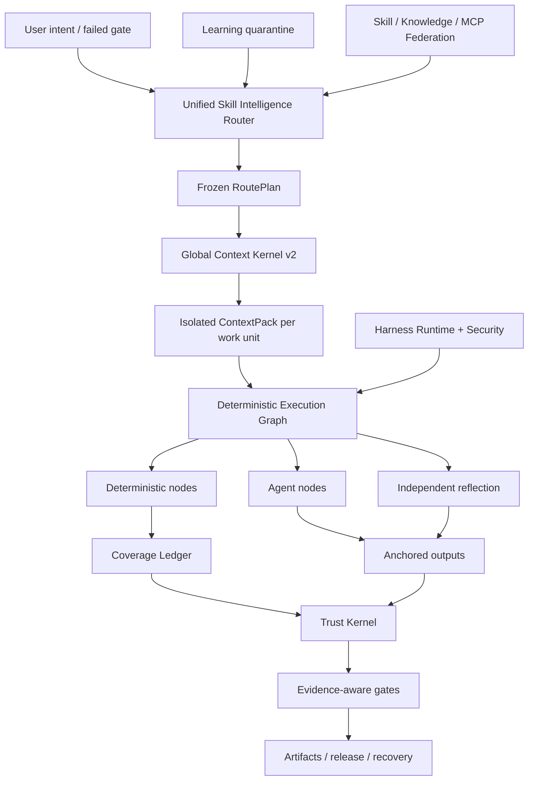

<p align="center">
  
</p>

<p align="center">
  <a href="LICENSE"></a>
  <a href="CHANGELOG.md"></a>
  
  
  
</p>

<p align="center"></p>
<h1 align="center">ForgeOS</h1>
<p align="center"><strong>Skill Intelligence OS and Trust Control Plane for AI agents.</strong></p>
<p align="center">ForgeOS decides <strong>which skill may run</strong>, <strong>which context may enter</strong>, <strong>which steps must be deterministic</strong>, and <strong>which evidence is strong enough to accept completion</strong>.</p>

<p align="center">
  <a href="#five-minute-path">5-minute path</a> ·
  <a href="#how-forgeos-works">How it works</a> ·
  <a href="#ecosystem-comparison">Ecosystem comparison</a> ·
  <a href="#for-developers">For developers</a> ·
  <a href="#for-experts-and-researchers">For experts</a> ·
  <a href="README-vn.md">Tiếng Việt</a> ·
  <a href="#languages">22 translations</a>
</p>

---

## Why ForgeOS exists

An agent does not become reliable because it has more prompts, more tools, or a longer context window.

It becomes reliable when the system can answer six questions:

1. **What exact outcome is required?**
2. **Which technique is appropriate—and which similar techniques are wrong here?**
3. **What is the smallest context needed for this work unit?**
4. **Which steps must be deterministic rather than delegated to a model?**
5. **What independent evidence proves the output?**
6. **Can the same workflow recover, resume, and audit itself after failure?**

ForgeOS v0.6 turns those questions into a runtime:

```text
confirmed intent
  → outcome + technique retrieval
  → hard policy and anti-trigger filters
  → minimum RoutePlan DAG
  → isolated ContextPack per work unit
  → deterministic / agent / reflection execution graph
  → anchored outputs + coverage ledger
  → trusted receipts + evidence gates
  → release, rollback, recovery, and learning quarantine
```

It is not a prompt collection. It is the control plane around skills, rules, hooks, agents, tools, context, evidence, and learning.

---

## What is real in v0.6.1

| Surface | Verified implementation |
|---|---:|
| Legacy typed outcome scaffolds | **1,024** |
| Deep Skill Contract v2 techniques | **128** |
| L0 orchestration/trust/context techniques | **32** |
| L1 cross-domain engineering techniques | **96** |
| Independent evaluator bindings | **128** |
| Skill catalog | **250** (**146** core, **104** domain) |
| Stable procedural providers | **33** |
| Candidate procedural providers | **242** |
| Built-in skill + knowledge mappings | **1,299** |
| Code Review Intelligence conformance cases | **12** |
| Agent-surface adversarial cases | **20/20** |
| Stable provider materialization | **33/33** |
| Router Precision@1 / @3 | **93.75% / 100%** |
| Router Recall@6 | **100%** |
| Unsafe route activation | **0%** |

> [!IMPORTANT]
> The 1,024 legacy nodes are **outcome scaffolds**, not 1,024 production-grade procedural skills. v0.6 contains 128 deep technique contracts. Thirty-three procedural providers remain in the declared stable routing channel for compatibility, but the final certification audit finds 0/128 evidence-qualified stable and 0 certified under the Revision 2 Definition of Done. The remaining evidence requires holdout, paired multi-model, pressure, independent review, and production receipts.

**Kernel inventory:** 32 L0 techniques + 96 L1 techniques = 128 deep kernel techniques.

**Catalog routing states:** 33 declared stable-channel procedural providers and 242 candidates. **Formal certification evidence:** 0 stable-qualified, 0 certified. See [Final Certification Audit](docs/FINAL-CERTIFICATION-AUDIT.md).

The release audit intentionally keeps these claims false:

```text
1,024 production-grade procedural skills       false
full PostgreSQL lifecycle HA                    false
universal microVM sandbox                       false
expert-labeled 200-PR review benchmark          false
10,000 paired evaluation runs                   false
```

ForgeOS v0.6 does not claim universal production completeness or 1,024 production-grade procedural skills.

See [Claims Boundary v0.6](docs/CLAIMS-BOUNDARY-V0.6.md).

---

## Universal lanes, governed execution

The immutable [Universal Lane Registry](docs/UNIVERSAL-LANES.md) routes work
across strategy and research, product UX/UI, visual media and 3D, software,
data and AI, agents, security, cloud operations, commerce, education,
hardware/manufacturing, and robotics/physical AI. A lane is a truthful routing
and evidence contract—not a claim that ForgeOS can autonomously operate a
factory, robot, payment flow, or production environment.

Physical-world work remains human-approved. High-risk third-party execution
requires a compatible configured remote provider; the local broker never
pretends to be a microVM. See [Remote MicroVM Sandbox](docs/REMOTE-MICROVM-SANDBOX.md).

---

## Five-minute path

Use this path when you want value without learning the Trust Kernel first.

### 1. Install

```bash
npm install
npm test
node src/cli/forge.mjs init
```

Installed package:

```bash
npx forgeos init
forge doctor
```

`forge init` creates a safe local SQLite-WAL profile. Its API key is written to a `0600` file and is never printed.

### 2. Find the right technique

```bash
forge skills search "react rerender"
forge skills inspect reducing-react-render-thrashing
forge route --query "compile the minimum context for a large monorepo"
```

### 3. Inspect v0.6

```bash
forge v06 status
forge profile plan coding --target codex
forge security scan --file agent-surface.json
```

### 4. Check the high-risk execution boundary

```bash
node src/cli/forge.mjs sandbox status --json
```

Without a configured remote provider this intentionally returns `unavailable` and exit code `2`; ForgeOS never represents the local broker as a microVM. See [Remote MicroVM Sandbox](docs/REMOTE-MICROVM-SANDBOX.md) for the signed provider contract.

### 5. Start the local control plane

```bash
npm start
# Dashboard: http://127.0.0.1:8787/dashboard
# MCP:       http://127.0.0.1:8787/mcp
# A2A:       http://127.0.0.1:8787/a2a
```

---

## Deep operator path

Use this path when embedding ForgeOS into Codex, Claude Code, ChatGPT, an open-source agent, CI, or an internal platform.

### Skill Intelligence Router

The router performs two-stage retrieval instead of matching a skill name:

```text
intent / failed gate
  → outcome retrieval
  → direct technique-trigger retrieval
  → anti-trigger exclusion
  → trust, tenant, maturity, tool, license, freshness filters
  → measured-utility reranking
  → minimum technique DAG
  → provider resolution
  → frozen RoutePlan
```

Every selected and rejected technique has a reason. Hard blockers always beat score.

### Global Context Kernel v2

ForgeOS budgets the complete request:

```text
system · task · selected skill sections · code symbols · artifacts
· memory · tool output · references · lazy tool schemas
· output reserve · safety reserve
```

It provides:

- one token-accounting interface shared by resolver and materializer;
- section-level skill loading;
- isolated context per work unit;
- lazy tool-schema materialization;
- Semantic ABI symbol IDs and stale-hash rejection;
- artifact delta projection;
- scoped, expiring instinct injection;
- content-addressed raw logs with distilled failure ranges;
- an omission manifest for every source not included.

### Deterministic Skill Fabric

A v0.6 technique is compiled into an executable graph:

```text
Deterministic nodes
  scope-selection · bundling · rule-resolution · anchoring · evidence

Agent nodes
  investigation · hypothesis · domain judgment

Reflection nodes
  contradiction · false-positive filter · actionability

Control nodes
  parallel join · coverage gate · retry · rollback
```

The SQLite coverage ledger uses leases, heartbeat, fencing, and trusted receipts. A reclaimed worker cannot mark a work unit complete.

### Code Review Intelligence vertical slice

The first complete vertical slice proves the architecture end to end:

```text
complete scope
→ relation-aware work units
→ contextual rule selection
→ isolated agent analysis
→ line/hash anchors
→ relocation after edits
→ independent reflection
→ coverage receipt
```

The bundled 12-case corpus is a deterministic conformance benchmark. It is **not** advertised as an expert-labeled 200-PR benchmark.

### Continuous Learning—without automatic self-poisoning

Observed patterns become scoped instincts, not stable skills:

```text
trusted run receipts
  → observed instinct
  → tenant/project/harness isolation + TTL
  → compatible instinct cluster
  → candidate evolution proposal
  → independent evaluation
  → human promotion or rollback
```

The producer cannot promote its own learned behavior.

### Harness Runtime v2

ForgeOS distinguishes four surfaces:

| Surface | Use it for |
|---|---|
| **Rule** | Short invariant that must always apply |
| **Hook** | Deterministic action bound to an event |
| **Skill** | Conditional procedure requiring judgment |
| **Agent role** | Separate context, tools, model, or authority |

Neutral events include `before.tool.execute`, `after.file.write`, `verification.checkpoint`, `session.compact`, and `session.ended`. Host adapters must mark unsupported features instead of claiming false parity.

Profiles:

```text
minimal · coding · creative · research · regulated
local-small · enterprise
```

### Agent Surface Security

The security engine scans the agent system itself:

- instruction and prompt-boundary violations;
- hooks and package lifecycle scripts;
- MCP descriptions, permissions, and tool reachability;
- command allowlists;
- secret/environment references;
- secret-to-egress permission paths;
- pipe-to-shell and broad wildcard capability;
- profile permission diffs before installation.

Its adversarial corpus currently passes **20/20** cases.

### Brokered local execution

The local runner provides a real safety boundary for normal commands:

- no shell interpolation;
- command and environment allowlists;
- workspace and symlink containment;
- timeout and process-group termination;
- bounded stdout/stderr;
- content-addressed execution receipt.

It is **not** a universal network-denying microVM sandbox. High-risk third-party execution still requires an external container or microVM isolation layer.

ForgeOS now has a fail-closed remote microVM control-plane adapter: it submits only to a configured HTTPS provider and accepts only request-bound, Ed25519-signed receipts with explicit network and secret isolation evidence. It never falls back to the local broker. The adapter is not a hosted microVM service; a compatible production provider remains an external deployment requirement. See [Remote MicroVM Sandbox](docs/REMOTE-MICROVM-SANDBOX.md).

---


# How ForgeOS works

ForgeOS combines two products in one runtime:

1. **A Skill Intelligence layer** that retrieves techniques, rejects unsafe near-matches, compiles only the required skill sections, and builds a frozen execution plan.
2. **An AI control plane** that manages projects, artifacts, evidence, approvals, leases, recovery, federation, and release gates.

```text
confirmed intent or failed gate
  → outcome and direct-technique retrieval
  → anti-trigger, tenant, trust, tool, license, and freshness filters
  → minimum frozen RoutePlan DAG
  → isolated ContextPack per work unit
  → deterministic / agent / reflection Execution Graph
  → anchored outputs and fenced Coverage Ledger
  → trusted receipts and assurance-aware gates
  → release, recovery, rollback, or learning quarantine
```

## Ten cooperating systems

| System | What it controls |
|---|---|
| **Skill Intelligence Router** | Outcome retrieval, technique scoring, anti-triggers, hard policy, provider selection, and explainable RoutePlans |
| **Global Context Kernel v2** | One total token budget across policy, task, skill sections, symbols, artifacts, memory, tool output, references, and output reserve |
| **Deterministic Skill Fabric** | Hybrid graphs containing deterministic nodes, agent nodes, reflection nodes, approvals, anchors, and stop conditions |
| **Coverage Ledger** | Work-unit ownership, leases, fencing tokens, completion coverage, stale-worker rejection, and resumability |
| **Trust Kernel** | Evidence freshness, artifact lineage, approval authority, assurance levels, and release decisions |
| **Agent Surface Security** | Prompt-injection patterns, dangerous package scripts, secret-to-egress paths, permissions, and adapter capability honesty |
| **Brokered Local Execution** | Shell-free command spawning, allowlists, timeouts, output limits, and structured receipts |
| **Continuous Learning** | Scoped instincts, expiry, confidence, quarantine, candidate proposals, and controlled promotion |
| **Skill Federation** | Signed sources, trust tiers, quarantine, conflict handling, revocation, and synchronized catalogs |
| **Harness Runtime v2** | Rules, hooks, skills, agent roles, permission diffs, and profiles for different AI harnesses |

---

# Ecosystem comparison

> [!IMPORTANT]
> This comparison describes the **native, first-class focus of each core repository**. `◐` means partial support, extension-based support, or support through an adjacent product. `—` means it is not the project's primary focus, not that it is impossible to build.

GitHub stars below are approximate figures checked on **July 26, 2026**. They indicate community visibility, not engineering quality by themselves.

## Ecosystem map

| Project | Approx. GitHub stars | Primary role |
|---|---:|---|
| [Superpowers](https://github.com/obra/superpowers) | **255k** | Agent skill framework and software-development methodology |
| [Anthropic Agent Skills](https://github.com/anthropics/skills) | **151k** | Skill standard and public skill library for Claude |
| [LangChain](https://github.com/langchain-ai/langchain) | **139k** | Agent engineering platform and large integration ecosystem |
| [OpenHands](https://github.com/All-Hands-AI/OpenHands) | **75k+** | End-to-end software-development agent application |
| [CrewAI](https://github.com/crewAIInc/crewAI) | **56k+** | Multi-agent crews and event-driven flows |
| [AutoGen](https://github.com/microsoft/autogen) | **50k+** | Multi-agent messaging and research runtime |
| [LangGraph](https://github.com/langchain-ai/langgraph) | **37k+** | Stateful, long-running agent graphs |
| [Semantic Kernel](https://github.com/microsoft/semantic-kernel) | **28k+** | Multi-language enterprise orchestration SDK |
| [Awesome Agent Skills](https://github.com/VoltAgent/awesome-agent-skills) | **28k+** | Community catalog of more than one thousand skills |
| [OpenAI Agents SDK](https://github.com/openai/openai-agents-python) | **27k+** | Agents, handoffs, guardrails, sessions, and tracing |
| [smolagents](https://github.com/huggingface/smolagents) | **27k+** | Minimal agent library with code-agent emphasis |
| [Letta](https://github.com/letta-ai/letta) | **23k+** | Stateful agents and persistent memory |
| [Google ADK](https://github.com/google/adk-python) | **about 20k** | Code-first agent building, evaluation, and deployment |
| [PydanticAI](https://github.com/pydantic/pydantic-ai) | **about 19k** | Type-safe Python agent framework |

## Core capability matrix

| System | Packaged skills | Routing + anti-trigger | Governed context | Deterministic/agent hybrid graph | Evidence + trust receipts | Agent-surface security | Native strength |
|---|:---:|:---:|:---:|:---:|:---:|:---:|---|
| **ForgeOS** | ✅ | ✅ | ✅ | ✅ | ✅ | ✅ | Skill intelligence and trustworthy execution |
| Anthropic Skills | ✅ | ◐ | ◐ | — | — | ◐ | Simple, portable skill standard |
| Superpowers | ✅ | ✅ | ◐ | ◐ | ◐ | — | Highly explicit SDLC methodology for coding agents |
| Awesome Agent Skills | ✅ | — | — | — | — | ◐ | Skill discovery across many sources |
| LangChain | ◐ | ◐ | ◐ | ◐ | ◐ | ◐ | Very large integration ecosystem |
| LangGraph | ◐ | ◐ | ◐ | ✅ | ◐ | ◐ | Durable execution and stateful graphs |
| OpenAI Agents SDK | ◐ | ◐ | ◐ | ◐ | ◐ | ◐ | Lightweight framework, handoffs, and tracing |
| CrewAI | ◐ | ◐ | ◐ | ✅ | ◐ | ◐ | Role-based agents combined with Flows |
| AutoGen | ◐ | ◐ | ◐ | ✅ | ◐ | ◐ | Event-driven multi-agent runtime |
| Semantic Kernel / MAF | ◐ | ◐ | ◐ | ✅ | ◐ | ◐ | Enterprise orchestration across runtimes |
| Google ADK | ◐ | ◐ | ◐ | ✅ | ◐ | ◐ | Build, evaluate, and deploy in Google's ecosystem |
| PydanticAI | ◐ | ◐ | ◐ | ◐ | ◐ | ◐ | Type safety, validation, and Python ergonomics |
| smolagents | ◐ | ◐ | ◐ | ◐ | — | ◐ | Minimal, readable agent implementation |
| Letta | ◐ | ◐ | ✅ | ◐ | ◐ | ◐ | Persistent memory and stateful agents |
| OpenHands | ◐ | ◐ | ◐ | ◐ | ◐ | ✅ | End-to-end coding-agent experience |

## ForgeOS chooses a different battlefield

A skill repository answers: **“What procedures can the agent learn?”**

ForgeOS also asks: **“Which technique is allowed now, which near-match must be rejected, which sections may enter context, which tools are required, what evidence must be produced, and what gate may declare the work complete?”**

An agent framework helps create agents, tools, handoffs, and workflows. ForgeOS focuses on the layer surrounding that runtime: capability retrieval, anti-triggers, global context budgets, deterministic/agent/reflection graphs, current evidence, approval authority, artifact lineage, recovery, and learning quarantine.

A memory system focuses on what an agent remembers. ForgeOS additionally controls which tenant, project, user, trust domain, expiry, confidence, and promotion policy that memory belongs to.

An end-to-end coding agent provides the user experience. ForgeOS can run **under or beside** that agent as the skill-selection, context-governance, evidence, trust, and project-lifecycle layer.

## Where mature ecosystems still lead

They currently have larger communities, more tutorials and integrations, more polished managed-cloud experiences, stronger no-code onboarding, and more publicly documented production deployments. ForgeOS deliberately concentrates on a less standardized problem: **controlling skill choice, context, evidence, authority, and completion state for AI agents**.

---

# Three entry paths

## For everyday users

You do not need to understand every subsystem. Start with four observable tests:

```bash
node src/cli/forge.mjs doctor
node src/cli/forge.mjs skills search --query "review authentication changes"
node src/cli/forge.mjs route --query "review authentication changes without missing tests"
node src/cli/forge.mjs scan agent-surface --path .
```

You can inspect which technique was selected, why alternatives were rejected, how much context was compiled, what permissions are requested, and which evidence is still missing.

## For developers

ForgeOS exposes the same runtime through:

- CLI for local operation and CI;
- HTTP APIs and Studio dashboard;
- **60 schema-strict MCP tools**;
- A2A task and agent-card surfaces;
- direct service imports from the Node.js source tree;
- **15 adapters** for agent and IDE ecosystems;
- seven harness profiles: `minimal`, `coding`, `creative`, `research`, `regulated`, `local-small`, and `enterprise`.

Developers can create projects, register artifacts, bind evidence, request approvals, compile RoutePlans and ContextPacks, execute graphs, recover revisions, synchronize federated skills, or add a new Skill Contract v2.

## For experts and researchers

ForgeOS is designed to be challenged rather than accepted from a marketing page. Experts can independently test:

- router precision, recall, anti-trigger behavior, and unsafe activation;
- total-context overflow and Semantic ABI reduction;
- deterministic coverage, anchors, reflection, leases, and fencing;
- evidence freshness, artifact lineage, and assurance-aware gates;
- prompt injection, package scripts, secret-to-egress paths, and adapter honesty;
- federation conflict, quarantine, revocation, and source trust;
- archive verification without `.git`.

```bash
npm run validate
npm run v06:audit
npm run router:benchmark
npm run context:benchmark
npm run federation:eval
npm run federation:audit
npm run smoke
npm run adapter:tck
npm run release:verify
```

---

# Repository map

```text
src/                         runtime implementation
  cli/                       forge command-line interface
  core/                      project, artifact, evidence, approval, recovery
  skill-intelligence/        contracts, routing, evaluation, materialization
  context/                   Global Context Kernel and work-unit compilation
  execution/                 graph compiler, deterministic nodes, coverage
  trust/                     evidence, assurance, authority, release gates
  security/                  agent-surface scanning and command broker
  federation/                remote sources, trust, quarantine, synchronization
  learning/                  instincts, candidates, expiry, promotion
  mcp/                       MCP server and 60 public tools
  a2a/                       A2A cards, tasks, messages, and receipts
  server/                    HTTP APIs, authentication, dashboard
  storage/                   SQLite-WAL persistence and migrations
adapters/                    15 agent and IDE adapters
skills/                      250 portable Agent Skills v1, including candidate 3D and physical-AI lanes
skills-v2/                   128 deep Skill Contract v2 techniques
capabilities-v2/             outcomes, techniques, providers, relations, graph
schemas/                     public JSON Schema 2020-12 contracts
packs/                       vertical capability packs and benchmarks
evals/                       evaluation cases, rubrics, and corpora
tests/                       125 test files and release invariants
evidence/                    generated audit, benchmark, SBOM, and dashboard evidence
docs/                        architecture, protocols, security, testing, production
scripts/                     generation, validation, audit, benchmark, and release tools
```

The [Universal Lanes registry](docs/UNIVERSAL-LANES.md) makes the cross-domain coverage and execution boundary of every lane inspectable. It is deliberately not an “AI can do everything” claim: physical, production, and external actions still need the declared evidence and human authority.

# Suitable use cases

- Making coding agents more disciplined and auditable.
- Building a control plane for several models, agents, and tools.
- Operating an internal skill platform with routing and maturity controls.
- Reviewing agent configurations, permissions, prompts, and supply-chain surfaces.
- High-assurance or regulated workflows requiring evidence and approval gates.
- Reducing context waste in large repositories through work-unit isolation and Semantic ABI.

ForgeOS is not a replacement for n8n-style business workflow automation. n8n connects applications and business events; ForgeOS controls AI technique selection, context, execution, evidence, and authority. They can be used together.

---

## Architecture



---

## MCP and agent integration

ForgeOS speaks MCP `2025-11-25`, A2A `1.0`, Agent Skills-compatible packages, HTTP, and CLI.

v0.6 public tools include:

```text
forge_v06_status
forge_execution_graph_compile
forge_review_scope_compile
forge_context_work_units_compile
forge_harness_profile_plan
forge_agent_surface_scan
```

They join the existing project, artifact, trusted evidence, recovery, federation, Skill Intelligence, and MCP broker tools. Stdio, HTTP MCP, CLI, and Studio share the same services and JSON Schemas.

Supported adapter packs include ChatGPT, Codex, Claude Code, Cursor, OpenCode, Gemini CLI, Copilot CLI, Cline, Roo Code, Windsurf, Continue, NolaneNative, OpenClaw, Pi, and generic MCP/A2A. Evidence distinguishes **protocol-tested** adapters from **documentation-only** guides.

---

## Verification

```bash
npm run validate
npm run skills:v2:audit
npm run v06:audit
npm run router:benchmark
npm run context:benchmark
npm run federation:eval
npm run federation:audit
npm run smoke
npm run adapter:tck
npm run release:verify
```

The release gate checks behavior and contracts, not only line coverage:

- state, fencing, stale-proof, and lifecycle invariants;
- full MCP/A2A lifecycle and output schemas;
- skill depth, boilerplate, section hash, and materialization;
- router precision, recall, determinism, and unsafe activation;
- global context overflow and omission accounting;
- deterministic execution and coverage ledger;
- review anchors and reflection;
- independent evaluation and continuous-learning quarantine;
- agent-surface adversarial cases;
- archive installation and self-verification without `.git`.

---

## Production boundary

**Integrated today**

- SQLite WAL single-node lifecycle backend;
- revision/CAS, leases, fencing, snapshots, restore, ACL, OIDC/API key;
- trusted receipts, artifact envelope hashes, assurance-aware gates;
- tenant-scoped skill/knowledge/MCP federation;
- graceful drain, readiness, metrics, signed release provenance;
- non-root/read-only deployment profiles.

**Not yet a v0.6 claim**

- full-lifecycle PostgreSQL drop-in backend and tested multi-node failover;
- universal third-party microVM sandbox;
- SCIM/delegated organization administration;
- managed transparency service and PKI;
- A2A streaming/push and distributed resume;
- 1,024 production-grade procedural skills;
- 10,000 paired eval runs;
- expert-adjudicated cross-language code-review benchmark.

Read [Production](docs/PRODUCTION.md), [Security Model](docs/SECURITY-MODEL.md), and [Self-Audit v0.6](docs/SELF-AUDIT-V0.6.md).

---

## Documentation map

| Start here | Deep dive |
|---|---|
| [Quick Start](docs/QUICKSTART.md) | [Architecture](docs/ARCHITECTURE.md) |
| [Skill Intelligence](docs/SKILL-INTELLIGENCE.md) | [Deterministic Fabric v0.6](docs/DETERMINISTIC-SKILL-FABRIC-V06.md) |
| [CLI and profiles](docs/HARNESS-RUNTIME-V2.md) | [Global Context Kernel](docs/GLOBAL-CONTEXT-KERNEL.md) |
| [Security](docs/AGENT-SURFACE-SECURITY.md) | [Continuous Learning](docs/CONTINUOUS-LEARNING-V06.md) |
| [Testing](docs/TESTING.md) | [Claims Boundary](docs/CLAIMS-BOUNDARY-V0.6.md) |
| [Contributing](CONTRIBUTING.md) | [Self-Audit](docs/SELF-AUDIT-V0.6.md) |

---

## Languages

[Tiếng Việt](README-vn.md) · [简体中文](README-cn.md) · [繁體中文](README-tw.md) · [日本語](README-ja.md) · [한국어](README-ko.md) · [Español](README-es.md) · [Français](README-fr.md) · [Deutsch](README-de.md) · [Português](README-pt-br.md) · [Русский](README-ru.md) · [العربية](README-ar.md) · [हिन्दी](README-hi.md) · [Bahasa Indonesia](README-id.md) · [ไทย](README-th.md) · [Türkçe](README-tr.md) · [Italiano](README-it.md) · [Polski](README-pl.md) · [Українська](README-uk.md) · [Nederlands](README-nl.md) · [فارسی](README-fa.md) · [עברית](README-he.md) · [Svenska](README-sv.md)

---

## Contributing

A new skill is not accepted because its prose sounds expert. It needs:

1. a RED baseline that fails without the technique;
2. precise triggers and anti-triggers;
3. a domain-specific procedure and failure model;
4. typed inputs, outputs, tools, and evidence;
5. section hashes and token budgets;
6. independent evaluator bindings;
7. benchmark evidence and a maturity decision.

See [CONTRIBUTING.md](CONTRIBUTING.md), [GOVERNANCE.md](GOVERNANCE.md), and [SECURITY.md](SECURITY.md).

## License

MIT — see [LICENSE](LICENSE).


## Final release audits

- [Final Hardening Report](docs/FINAL-HARDENING-REPORT.md)
- [Final Skill Certification Audit](docs/FINAL-CERTIFICATION-AUDIT.md)
